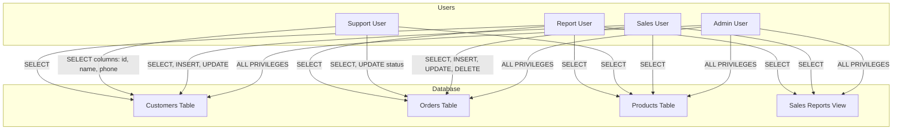

# SQL GRANT Command

## Introduction

Database security is a critical aspect of any application that stores sensitive data. The SQL `GRANT` command is one of the core data control language (DCL) commands that helps database administrators manage access permissions to database objects. This command allows you to specify which users or roles can perform which operations on specific database objects.

In this tutorial, we'll explore how the `GRANT` command works, its syntax, and how to use it effectively to implement the principle of least privilege in your database design.

## Understanding Database Privileges

Before diving into the `GRANT` command, it's important to understand what database privileges are:

Privileges (also called permissions) determine what actions a user can perform on database objects. Common privileges include:

- `SELECT`: Ability to read data
- `INSERT`: Ability to add new data
- `UPDATE`: Ability to modify existing data
- `DELETE`: Ability to remove data
- `CREATE`: Ability to create new objects
- `ALTER`: Ability to modify object structure
- `DROP`: Ability to delete objects
- `EXECUTE`: Ability to run stored procedures or functions
- `ALL PRIVILEGES`: All of the above permissions

## Basic Syntax

The basic syntax of the SQL `GRANT` command is:

```sql
GRANT privilege_name(s)
ON object_name
TO user_or_role_name
[WITH GRANT OPTION];
```

Let's break down each component:

- `privilege_name(s)`: The specific privilege(s) you want to grant (SELECT, INSERT, UPDATE, etc.)
- `object_name`: The database object (table, view, procedure, etc.) to which you're granting access
- `user_or_role_name`: The recipient of the privilege(s)
- `WITH GRANT OPTION`: Optional clause that allows the recipient to grant the same privileges to others

## Granting Table-Level Privileges

### Example 1: Basic Table Access

Let's say we have a `customers` table and want to allow a user named `sales_rep` to view and insert data, but not update or delete:

```sql
GRANT SELECT, INSERT ON customers TO sales_rep;
```

**Input:**
```sql
-- First, let's see what happens if sales_rep tries to select before permission
-- (Run as sales_rep user)
SELECT * FROM customers;
```

**Output:**
```
ERROR: permission denied for table customers
```

**Input:**
```sql
-- Now grant the permissions (Run as admin user)
GRANT SELECT, INSERT ON customers TO sales_rep;

-- Try the select again (Run as sales_rep user)
SELECT * FROM customers;
```

**Output:**
```
id | name         | email                  | phone
---+--------------+-----------------------+------------
1  | John Smith   | john.smith@email.com  | 555-123-4567
2  | Maria Garcia | maria.g@email.com     | 555-987-6543
3  | Wei Zhang    | wei.zhang@email.com   | 555-456-7890
(3 rows)
```

### Example 2: Column-Level Privileges

Some database systems allow you to grant permissions at the column level. This is particularly useful for tables containing sensitive information:

```sql
GRANT SELECT (id, name, phone) ON customers TO support_staff;
```

This grants the `support_staff` user the ability to see only the `id`, `name`, and `phone` columns, but not the `email` column which might contain sensitive information.

## Granting Multiple Privileges

You can grant multiple privileges in a single command:

```sql
GRANT SELECT, INSERT, UPDATE, DELETE ON orders TO order_manager;
```

This gives the `order_manager` user full data manipulation capabilities on the `orders` table.

## Granting Privileges on All Tables

In some cases, you might want to grant privileges on all tables in a schema:

```sql
GRANT SELECT ON ALL TABLES IN SCHEMA public TO reporting_user;
```

This allows the `reporting_user` to run SELECT queries on all tables in the public schema.

## The WITH GRANT OPTION Clause

The `WITH GRANT OPTION` clause allows the recipient of a privilege to grant that same privilege to other users:

```sql
GRANT SELECT ON customer_reports TO team_lead WITH GRANT OPTION;
```

Now, `team_lead` can grant SELECT permission on the `customer_reports` table to other users.

**Input:**
```sql
-- Run as team_lead user
GRANT SELECT ON customer_reports TO junior_analyst;
```

**Output:**
```
GRANT 0
```

## Granting Privileges to Roles

Instead of granting privileges directly to users, it's often better to grant them to roles and then assign users to those roles. This makes privilege management more scalable:

```sql
-- First, create a role
CREATE ROLE sales_staff;

-- Grant privileges to the role
GRANT SELECT, INSERT, UPDATE ON customers TO sales_staff;
GRANT SELECT, INSERT ON sales TO sales_staff;

-- Assign users to the role
GRANT sales_staff TO user1, user2, user3;
```

## Real-World Scenarios

### Scenario 1: Setting Up a Read-Only User

Database administrators often need to create users who can only read data for reporting purposes:

```sql
-- Create a read-only user
CREATE USER report_viewer WITH PASSWORD 'secure_password';

-- Grant SELECT privilege on necessary tables
GRANT SELECT ON customers TO report_viewer;
GRANT SELECT ON orders TO report_viewer;
GRANT SELECT ON products TO report_viewer;
```

### Scenario 2: Application Database User

When setting up a database user for your application, you typically want to limit its permissions to only what's necessary:

```sql
-- Create application user
CREATE USER app_user WITH PASSWORD 'app_password';

-- Grant specific privileges
GRANT SELECT, INSERT, UPDATE, DELETE ON customers TO app_user;
GRANT SELECT, INSERT, UPDATE, DELETE ON orders TO app_user;
GRANT SELECT ON products TO app_user;
GRANT EXECUTE ON FUNCTION calculate_order_total TO app_user;
```

### Scenario 3: Database Schema Visualization

Here's a visualization of how different users might have different privileges on database objects:



## Common Mistakes and Best Practices

### Mistakes to Avoid:

1. **Granting excessive privileges**: Avoid granting more privileges than necessary, especially ALL PRIVILEGES.
2. **Granting privileges to PUBLIC**: Be cautious when granting privileges to PUBLIC as this affects all users.
3. **Neglecting to review privileges**: Regularly audit user privileges to ensure they remain appropriate.

### Best Practices:

1. **Follow the principle of least privilege**: Grant only the minimum permissions needed.
2. **Use roles instead of user-level grants**: This simplifies permission management.
3. **Regularly audit permissions**: Schedule regular reviews of your permission structure.
4. **Document your permission scheme**: Keep track of which roles have which permissions and why.
5. **Revoke permissions when no longer needed**: Use the REVOKE command to remove unnecessary permissions.

## Related Commands

The GRANT command is often used in conjunction with other DCL commands:

- **REVOKE**: Removes previously granted privileges
  ```sql
  REVOKE INSERT ON customers FROM sales_rep;
  ```

- **CREATE ROLE**: Creates a new role
  ```sql
  CREATE ROLE marketing_team;
  ```

- **DROP ROLE**: Removes a role
  ```sql
  DROP ROLE IF EXISTS obsolete_role;
  ```

## Summary

The SQL GRANT command is an essential tool for implementing security in your database. By properly assigning privileges, you can ensure that users have access only to the data they need, following the principle of least privilege.

Key points to remember:
- Use GRANT to assign specific privileges to users or roles
- Grant privileges at the most specific level possible (column-level when available)
- Prefer granting privileges to roles rather than directly to users
- Use WITH GRANT OPTION sparingly
- Regularly review and audit your permission structure

## Exercises

1. Create a new user called `inventory_manager` and grant them SELECT, INSERT, UPDATE privileges on a table called `inventory`.
2. Create a role called `finance_team` and grant it SELECT privileges on tables `orders`, `payments`, and `invoices`.
3. Grant a user the ability to run a stored procedure called `generate_monthly_report` without giving them direct access to the underlying tables.
4. Create a read-only role that can view all tables in your database but cannot modify any data.
5. Implement column-level security on an `employees` table so that only HR users can see salary information.

## Additional Resources

- [PostgreSQL Documentation on GRANT](https://www.postgresql.org/docs/current/sql-grant.html)
- [MySQL Documentation on GRANT](https://dev.mysql.com/doc/refman/8.0/en/grant.html)
- [SQL Server Documentation on GRANT](https://docs.microsoft.com/en-us/sql/t-sql/statements/grant-transact-sql)
- [Oracle Documentation on GRANT](https://docs.oracle.com/en/database/oracle/oracle-database/19/sqlrf/GRANT.html)

Remember that specific syntax might vary slightly between different database management systems. Always refer to the documentation for your specific database system for the most accurate information.