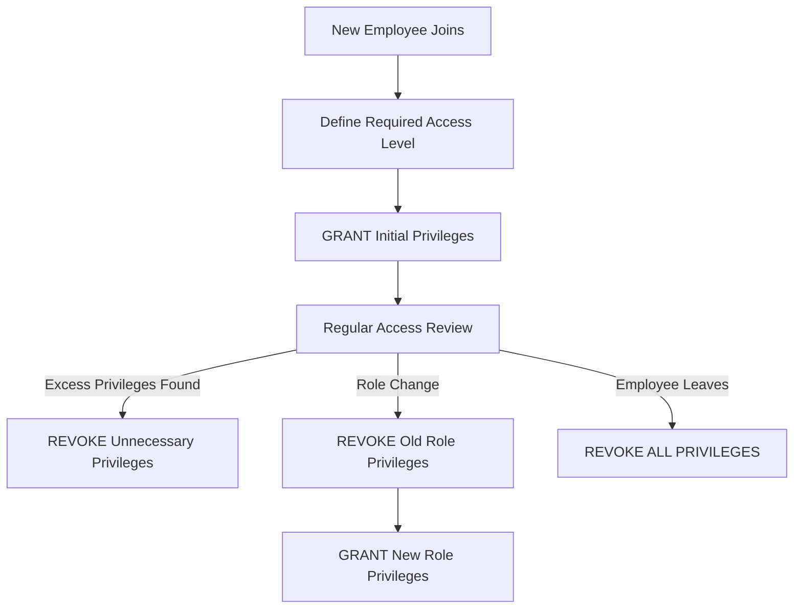

# SQL REVOKE Command

## Introduction

Database security is a critical aspect of managing any database system. Controlling who can access what data and what operations they can perform is essential for maintaining data integrity and confidentiality. In SQL, the Data Control Language (DCL) includes commands that help manage permissions, with **REVOKE** being one of the most important.

The **REVOKE** command allows database administrators to remove previously granted privileges from users or roles. Think of it as taking back access rights that were given earlier using the GRANT command. This helps maintain the principle of least privilege - ensuring users only have access to what they absolutely need.

## Syntax

The basic syntax of the REVOKE command is:

```sql
REVOKE privilege_name(s)
ON object_name
FROM user_name, role_name;
```

Let's break down each component:

- **privilege_name(s)**: The permission(s) you want to remove (SELECT, INSERT, UPDATE, DELETE, ALL, etc.)
- **object_name**: The database object (table, view, procedure, etc.) from which the privilege is being revoked
- **user_name, role_name**: The users or roles from whom privileges are being revoked

## Common Privileges That Can Be Revoked

| Privilege | Description |
|-----------|-------------|
| SELECT | Permission to read data from tables |
| INSERT | Permission to add new records to tables |
| UPDATE | Permission to modify existing records |
| DELETE | Permission to remove records from tables |
| ALL PRIVILEGES | All available privileges at once |
| EXECUTE | Permission to execute stored procedures |
| CREATE | Permission to create new database objects |
| ALTER | Permission to modify database objects |
| DROP | Permission to delete database objects |
| REFERENCES | Permission to create foreign key constraints |

## Basic REVOKE Examples

### Example 1: Revoking SELECT Privilege

Let's say we previously granted SELECT privilege to a user named 'alice' on the 'customers' table, and now we want to revoke that privilege:

```sql
REVOKE SELECT ON customers FROM alice;
```

**Before executing REVOKE:**
Alice can run: `SELECT * FROM customers;` successfully.

**After executing REVOKE:**
If Alice tries to run: `SELECT * FROM customers;`
She'll get an error like: `ERROR: permission denied for table customers`

### Example 2: Revoking Multiple Privileges

You can revoke multiple privileges in a single command:

```sql
REVOKE INSERT, UPDATE, DELETE ON products FROM bob;
```

This revokes bob's ability to insert, update, or delete records in the products table, while potentially leaving other privileges (like SELECT) intact.

### Example 3: Revoking ALL PRIVILEGES

To remove all privileges at once:

```sql
REVOKE ALL PRIVILEGES ON inventory FROM reporting_role;
```

This would remove all permissions that the 'reporting_role' role had on the 'inventory' table.

## CASCADE Option

Some database systems support a CASCADE option, which automatically revokes privileges that were granted by the user you're revoking privileges from:

```sql
REVOKE SELECT ON employees FROM manager CASCADE;
```

This not only revokes the SELECT privilege from 'manager' but also from any users to whom 'manager' might have granted this privilege.

## REVOKE vs. DENY (SQL Server)

In SQL Server, there's an important distinction:

- **REVOKE**: Removes a previously granted permission
- **DENY**: Explicitly prevents a user from having a specific permission, even if it's granted through group membership

For example, if a user belongs to a role that has certain privileges, REVOKE might not be enough to prevent access. In such cases, DENY would be used.

```sql
-- SQL Server syntax
DENY SELECT ON employees TO user1;
```

## Real-World Applications

### Application 1: Employee Role Changes

When an employee changes roles within an organization, their database access needs to be adjusted:

```sql
-- Revoke previous department access
REVOKE SELECT, INSERT, UPDATE ON sales_data FROM employee001;

-- Grant new department access (using GRANT command)
GRANT SELECT, INSERT, UPDATE ON marketing_data TO employee001;
```

### Application 2: Temporary Access Removal

During system maintenance or audits, you might temporarily revoke certain privileges:

```sql
-- Before maintenance
REVOKE INSERT, UPDATE, DELETE ON all_tables FROM all_users;

-- After maintenance is complete, restore access
GRANT INSERT, UPDATE, DELETE ON all_tables TO all_users;
```

### Application 3: Security Incident Response

If you detect suspicious activity, you might need to quickly revoke privileges:

```sql
-- Emergency revoke during security incident
REVOKE ALL PRIVILEGES ON database_name FROM suspicious_user;
```

## Checking Current Privileges

To check what privileges exist in your database (syntax varies by database system):

### PostgreSQL

```sql
SELECT grantee, privilege_type 
FROM information_schema.role_table_grants 
WHERE table_name='customers';
```

### MySQL

```sql
SHOW GRANTS FOR 'username'@'hostname';
```

### SQL Server

```sql
SELECT * FROM sys.database_permissions
WHERE grantee_principal_id = USER_ID('username');
```

## Common Workflow Diagram

Here's a typical privilege management workflow in a database environment:



## Best Practices for Using REVOKE

1. **Regular Audits**: Periodically review and revoke unnecessary privileges.
2. **Principle of Least Privilege**: Only grant (and keep) the minimum privileges needed.
3. **Use Roles**: Revoke from roles rather than individual users when possible.
4. **Document Changes**: Keep a log of all REVOKE operations for audit purposes.
5. **Test After Revoking**: Verify that revoked privileges are actually removed.
6. **Avoid Direct Table Access**: Use stored procedures and views with appropriate permissions instead.

## Differences Between Database Systems

While the basic concept of REVOKE is similar across database systems, the syntax and capabilities may vary:

### MySQL

```sql
REVOKE INSERT ON database_name.* FROM 'user'@'localhost';
```

### PostgreSQL

```sql
REVOKE INSERT ON ALL TABLES IN SCHEMA public FROM user_name;
```

### Oracle

```sql
REVOKE CREATE SESSION FROM user_name;
```

### SQL Server

```sql
REVOKE EXECUTE ON SCHEMA::dbo TO user_name;
```

## Summary

The SQL REVOKE command is a powerful tool for managing database security by removing privileges that were previously granted to users or roles. It works hand-in-hand with the GRANT command to implement the principle of least privilege, ensuring that users only have the access they need to perform their jobs.

Key points to remember:
- REVOKE removes previously granted privileges
- You can revoke specific privileges (SELECT, INSERT, etc.) or ALL PRIVILEGES
- You can revoke privileges from specific database objects
- Different database systems may have variations in syntax
- Regular privilege reviews and revocations are essential for good security

By effectively using the REVOKE command, you can maintain proper access control and protect your database from unauthorized access or accidental data manipulation.

## Exercises

1. Create a user named 'practice_user' and grant them SELECT, INSERT, and UPDATE privileges on a 'practice_table'. Then write the command to revoke only the UPDATE privilege.

2. Write a command to revoke all privileges from a user named 'temp_user' on all tables in a database.

3. In a scenario where user 'manager_1' has granted SELECT privileges to user 'analyst_1', write the command that would revoke the manager's privileges and cascade this revocation to the analyst.

4. Research how to revoke privileges in your specific database system (MySQL, PostgreSQL, Oracle, SQL Server) and note any differences from the standard syntax.

## Additional Resources

- [MySQL Documentation on REVOKE](https://dev.mysql.com/doc/refman/8.0/en/revoke.html)
- [PostgreSQL Documentation on REVOKE](https://www.postgresql.org/docs/current/sql-revoke.html)
- [Oracle Documentation on REVOKE](https://docs.oracle.com/en/database/oracle/oracle-database/19/sqlrf/REVOKE.html)
- [SQL Server Documentation on REVOKE](https://docs.microsoft.com/en-us/sql/t-sql/statements/revoke-transact-sql)
- [OWASP Database Security Cheat Sheet](https://cheatsheetseries.owasp.org/cheatsheets/Database_Security_Cheat_Sheet.html)