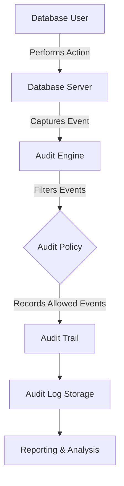

# SQL Auditing

## Introduction

SQL Auditing is a critical security feature that allows database administrators to track and monitor activities within a database system. Think of it as a security camera for your database - it records who did what, when, and how, providing a detailed trail of all database interactions. This capability is essential for securing sensitive data, troubleshooting issues, and maintaining compliance with various regulations.

In this guide, we'll explore how SQL auditing works, why it's important, and how to implement it in your database environment.

## Why Is SQL Auditing Important?

Before diving into the technical details, let's understand why you might need SQL auditing:

1. **Security Monitoring**: Detect suspicious activities and potential security breaches
2. **Regulatory Compliance**: Meet requirements for standards like GDPR, HIPAA, SOX, etc.
3. **Troubleshooting**: Track down problems by reviewing historical actions
4. **Accountability**: Establish who made specific changes to the database
5. **Performance Analysis**: Identify frequently used queries for optimization

## Basic Concepts of SQL Auditing

At its core, SQL auditing involves capturing various types of database events and storing them in an audit trail. These events typically include:

- **DDL (Data Definition Language) events**: CREATE, ALTER, DROP statements
- **DML (Data Manipulation Language) events**: INSERT, UPDATE, DELETE operations
- **Security events**: LOGIN/LOGOUT, GRANT/REVOKE permissions
- **System events**: Server startups, shutdowns, error conditions

Let's visualize the basic workflow of SQL auditing:



## Implementing SQL Auditing

Now let's look at how to implement auditing in some popular database systems. We'll focus on the basics that apply to most SQL databases, then show specific examples.

### General Audit Setup Process

1. Determine what activities need to be audited
2. Configure the audit policy
3. Specify where audit records will be stored
4. Implement a retention policy for audit records
5. Set up regular review procedures

### Example: Setting Up Auditing in SQL Server

Microsoft SQL Server provides robust auditing capabilities. Here's how to create a basic server audit:

```sql
-- Step 1: Create a server audit
USE master;
GO

CREATE SERVER AUDIT MyDatabaseAudit
TO FILE (FILEPATH = 'C:\AuditLogs\');
GO

-- Step 2: Enable the audit
ALTER SERVER AUDIT MyDatabaseAudit
WITH (STATE = ON);
GO

-- Step 3: Create a database audit specification
USE YourDatabase;
GO

CREATE DATABASE AUDIT SPECIFICATION YourDatabaseAuditSpec
FOR SERVER AUDIT MyDatabaseAudit
ADD (INSERT, UPDATE, DELETE, SELECT ON DATABASE::YourDatabase BY public)
WITH (STATE = ON);
GO
```

### Example: Setting Up Auditing in MySQL

MySQL provides auditing through its audit plugin:

```sql
-- Check if the audit plugin is installed
SHOW PLUGINS;

-- Install the audit plugin if needed
INSTALL PLUGIN audit_log SONAME 'audit_log.so';

-- Configure the audit log
SET GLOBAL audit_log_format = 'JSON';
SET GLOBAL audit_log_file = '/var/log/mysql/audit.log';

-- Set which events to audit (in MySQL 8.0+)
SET GLOBAL audit_log_filter_id = 'log_all';
```

### Example: Setting Up Auditing in PostgreSQL

PostgreSQL offers auditing through its logging system:

```sql
-- Enable logging in postgresql.conf
log_statement = 'all';          -- Log all SQL statements
log_min_duration_statement = 0; -- Log all statements regardless of duration

-- For more detailed auditing, you can use pgAudit extension
CREATE EXTENSION pgaudit;

-- Configure pgAudit to log specific operations
ALTER SYSTEM SET pgaudit.log = 'write, ddl';
ALTER SYSTEM SET pgaudit.log_catalog = on;

-- Reload configuration
SELECT pg_reload_conf();
```

## Reviewing Audit Logs

Once you've set up auditing, you'll need to review the logs. The approach varies by database system, but typically involves:

1. Locating the audit log files
2. Using built-in tools to analyze logs
3. Potentially importing logs into specialized audit review tools

### Example: Querying SQL Server Audit Logs

```sql
-- Query the audit log
SELECT 
    event_time,
    action_id,
    server_principal_name, 
    database_name,
    object_name,
    statement
FROM 
    sys.fn_get_audit_file('C:\AuditLogs\*.sqlaudit', DEFAULT, DEFAULT);
```

The output might look like this:

```
event_time                  | action_id | server_principal_name | database_name | object_name    | statement
-----------------------------------------------------------------------------------------------------------------------------------------------------------
2023-02-15 14:23:45.1234567 | INS       | AppUser              | CustomerDB    | Customers      | INSERT INTO Customers (FirstName, LastName) VALUES ('John', 'Doe')
2023-02-15 14:25:12.7654321 | SEL       | ReportUser           | CustomerDB    | Customers      | SELECT * FROM Customers WHERE CustomerID = 123
```

## Best Practices for SQL Auditing

To make the most of your SQL auditing implementation:

1. **Audit selectively**: Don't audit everything or you'll generate too much data
2. **Secure audit logs**: Protect audit logs from tampering
3. **Plan for storage**: Audit logs can grow quickly
4. **Establish a retention policy**: Determine how long to keep audit records
5. **Review regularly**: Set up a schedule for reviewing audit logs
6. **Automate alerts**: Configure notifications for suspicious activities

## Real-World Application: GDPR Compliance

Let's explore a practical example of using SQL auditing for GDPR compliance:

```sql
-- Create an audit specifically for personal data access
CREATE SERVER AUDIT PersonalDataAccessAudit
TO FILE (FILEPATH = 'C:\AuditLogs\GDPR\');
GO

ALTER SERVER AUDIT PersonalDataAccessAudit
WITH (STATE = ON);
GO

-- Create specific audit for personal data tables
USE CustomerDatabase;
GO

CREATE DATABASE AUDIT SPECIFICATION GDPRAuditSpec
FOR SERVER AUDIT PersonalDataAccessAudit
ADD (SELECT, INSERT, UPDATE, DELETE ON OBJECT::dbo.CustomerPersonalData BY public),
ADD (SELECT, INSERT, UPDATE, DELETE ON OBJECT::dbo.EmployeePersonalData BY public)
WITH (STATE = ON);
GO
```

Now if you receive a data subject access request, you can query who accessed a specific customer's data:

```sql
SELECT 
    event_time,
    server_principal_name AS user_name,
    statement AS query
FROM 
    sys.fn_get_audit_file('C:\AuditLogs\GDPR\*.sqlaudit', DEFAULT, DEFAULT)
WHERE 
    statement LIKE '%CustomerID = 12345%'
ORDER BY 
    event_time DESC;
```

## Troubleshooting and Common Issues

When implementing SQL auditing, you might encounter these common challenges:

1. **Performance impact**: Heavy auditing can slow down your database
   - Solution: Audit only necessary events and operations

2. **Storage growth**: Audit logs can fill up disk space quickly
   - Solution: Implement log rotation and archiving strategies

3. **False positives**: Too many irrelevant audit entries
   - Solution: Refine your audit filters and policies

4. **Missing events**: Important activities not being captured
   - Solution: Review and test your audit specification

## Summary

SQL Auditing is an essential tool for database security and compliance. It provides visibility into database activities, helps detect security issues, and supports regulatory requirements. By properly implementing auditing with a clear policy on what to audit and how to manage the logs, you can significantly enhance your database security posture.

Remember these key points:
- Audit selectively to balance security needs with performance
- Secure your audit logs to prevent tampering
- Review logs regularly and set up alerts for suspicious activities
- Consider compliance requirements when designing your audit strategy

## Further Learning Resources

To deepen your understanding of SQL auditing:

1. [Microsoft SQL Server Audit Documentation](https://docs.microsoft.com/en-us/sql/relational-databases/security/auditing/sql-server-audit-database-engine)
2. [MySQL Audit Plugin Documentation](https://dev.mysql.com/doc/refman/8.0/en/audit-log.html)
3. [PostgreSQL pgAudit Extension](https://github.com/pgaudit/pgaudit)

## Exercises

1. Set up a basic audit trail in your preferred database system to track all DELETE operations
2. Write a query to find all users who accessed a specific table in the last 24 hours
3. Create an audit policy that focuses on security-related events like login failures
4. Implement a process to archive audit logs that are older than 90 days
5. Design an audit strategy for a hypothetical application that handles credit card data