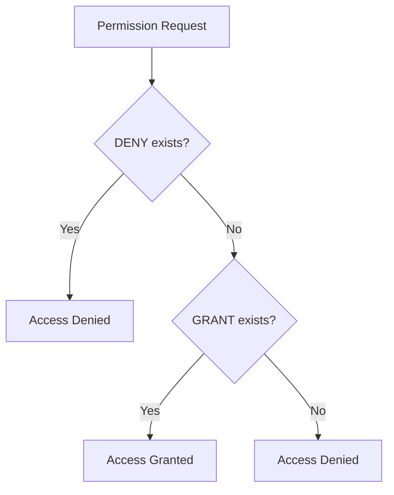

# SQL DENY Command

## Introduction

In database security, controlling who can access and modify your data is crucial. SQL provides several commands to manage database permissions, with the `DENY` command being one of the most important for restricting access. Unlike `GRANT`, which gives permissions, the `DENY` command explicitly prohibits users from performing specific actions on database objects.

The `DENY` command is part of SQL's Data Control Language (DCL), which focuses on controlling access to data within a database. Understanding how to properly implement `DENY` commands is essential for maintaining database security and integrity.

## Basic Syntax

The basic syntax for the SQL `DENY` command is:

```sql
DENY permission_type 
ON object_name 
TO user_or_role;
```

Where:
- `permission_type`: The type of permission being denied (SELECT, INSERT, UPDATE, DELETE, etc.)
- `object_name`: The database object (table, view, procedure, etc.) to which access is being restricted
- `user_or_role`: The database user or role that is being denied the permission

## Common Permission Types

Here are the most common permission types that can be denied:

| Permission | Description |
|------------|-------------|
| SELECT | Ability to read data from tables or views |
| INSERT | Ability to add new records |
| UPDATE | Ability to modify existing records |
| DELETE | Ability to remove records |
| EXECUTE | Ability to run stored procedures or functions |
| ALL | All possible permissions (shorthand) |

## Simple Examples

### Example 1: Denying SELECT Permission

To deny a user named 'intern' from querying the 'employees' table:

```sql
DENY SELECT ON employees TO intern;
```

**Result:** The user 'intern' will receive an error message if they attempt to run any SELECT queries on the 'employees' table.

### Example 2: Denying Multiple Permissions

To deny a user named 'guest' from inserting, updating, or deleting records in the 'customers' table:

```sql
DENY INSERT, UPDATE, DELETE ON customers TO guest;
```

**Result:** The user 'guest' can still view the data but cannot modify it in any way.

## How DENY Works in Permission Hierarchy

SQL Server uses a permission hierarchy system that follows this order of precedence:
1. DENY (strongest)
2. GRANT WITH GRANT OPTION
3. GRANT
4. No explicit permission

This means that a `DENY` will override any previously granted permissions. This is crucial to understand when managing complex permission schemes.



## CASCADE Option

The `CASCADE` option allows you to extend the denial down through the permission chain:

```sql
DENY SELECT ON employees TO manager CASCADE;
```

This not only denies the permission to 'manager' but also to any users who received their permissions through 'manager'.

## Real-World Applications

### Scenario 1: Protecting Sensitive Data

Imagine you have a 'financial_records' table containing sensitive financial information. You want most employees to be able to view basic company data but not financial information:

```sql
-- Grant general access to company database
GRANT SELECT ON company_database TO all_employees;

-- Deny access specifically to financial records
DENY SELECT ON financial_records TO all_employees;

-- Allow only finance team members to access financial records
GRANT SELECT ON financial_records TO finance_team;
```

### Scenario 2: Temporary Access Restriction

During system maintenance or sensitive operations, you might temporarily deny access to certain operations:

```sql
-- Deny all modification operations during maintenance
DENY INSERT, UPDATE, DELETE ON all_tables TO all_users;

-- After maintenance is complete, you can revoke the deny
REVOKE DENY INSERT, UPDATE, DELETE ON all_tables FROM all_users;
```

### Scenario 3: Multi-level Access Control

Create a permissions structure where different department roles have different access levels:

```sql
-- Base permissions for all employees
GRANT SELECT ON customer_info TO all_employees;

-- Sales can update customer info
GRANT UPDATE ON customer_info TO sales_team;

-- Deny specific columns even to sales team
DENY UPDATE (credit_card_number, ssn) ON customer_info TO sales_team;

-- Allow managers to update all fields
GRANT UPDATE ON customer_info TO managers;
```

## Revoking a DENY

If you need to remove a previously applied DENY, you can use the REVOKE command:

```sql
REVOKE DENY SELECT ON employees FROM intern;
```

This doesn't automatically grant the permission - it just removes the explicit denial.

## Common Mistakes and Best Practices

### Mistake 1: Forgetting the Permission Hierarchy

A common mistake is granting permission to a user and then to a role they belong to, then denying it to the role and expecting the user to still have access. Remember: DENY always overrides GRANT.

### Mistake 2: Overusing DENY Instead of Not Granting

Sometimes it's better to be selective with GRANT rather than granting broadly and then using DENY to restrict. This creates a cleaner, more maintainable permission structure.

### Best Practice: Principle of Least Privilege

Only grant the minimum permissions necessary for a user to perform their job, rather than granting broad permissions and then restricting with DENY.

### Best Practice: Use Roles Instead of Individual Users

Apply permissions to roles rather than individual users, then assign users to appropriate roles. This makes permission management much more scalable.

```sql
-- Create a role
CREATE ROLE data_analyst;

-- Grant and deny permissions to the role
GRANT SELECT ON analytical_views TO data_analyst;
DENY SELECT ON customer_personal_data TO data_analyst;

-- Assign users to the role
ALTER ROLE data_analyst ADD MEMBER [user1];
ALTER ROLE data_analyst ADD MEMBER [user2];
```

## Differences Between Database Systems

While the core concept of DENY exists in many database systems, the exact syntax and capabilities vary:

- **SQL Server** has the most robust implementation of DENY
- **MySQL** traditionally uses REVOKE rather than DENY
- **PostgreSQL** uses REVOKE to remove permissions but has a different approach to denial
- **Oracle** uses the REVOKE command with additional options

Always check your specific database system's documentation for exact syntax.

## Summary

The SQL DENY command is a powerful tool for explicitly restricting database permissions. It takes precedence over any granted permissions, making it essential for securing sensitive data and implementing the principle of least privilege. By properly using DENY in combination with GRANT and REVOKE, you can create a secure, granular permission system that protects your data while allowing appropriate access.

Key points to remember:
- DENY explicitly prohibits specified permissions
- DENY overrides any GRANT permissions
- Use DENY for exceptions to broader permission schemes
- The permission hierarchy is vital to understand
- REVOKE DENY removes the explicit denial

## Exercises

1. Create a table called 'employee_data' with columns for employee_id, name, position, and salary. Create two users: 'hr_user' and 'manager_user'. Write the SQL commands to:
   - Allow both users to select from the table
   - Deny hr_user from seeing the salary column
   - Deny manager_user from modifying employee positions

2. You have a database for a hospital with tables for patients, treatments, and billing. Design a permission scheme using GRANT and DENY that ensures:
   - Doctors can see all patient information but cannot see billing
   - Billing staff can see billing information but only patient names (not medical details)
   - Nurses can see and update treatment information but cannot delete records

3. Explain what would happen in this scenario:
   ```sql
   GRANT SELECT ON confidential_table TO user1;
   DENY SELECT ON confidential_table TO role1;
   -- user1 is a member of role1
   ```
   Would user1 be able to select from confidential_table? Why or why not?

## Additional Resources

- [Microsoft SQL Server Documentation on DENY](https://docs.microsoft.com/en-us/sql/t-sql/statements/deny-transact-sql)
- [PostgreSQL Permission System](https://www.postgresql.org/docs/current/ddl-priv.html)
- [MySQL User Account Management](https://dev.mysql.com/doc/refman/8.0/en/user-account-management.html)
- Book: "SQL Server Security Distilled" by Morris Lewis
- Course: "Database Security Fundamentals" on Pluralsight