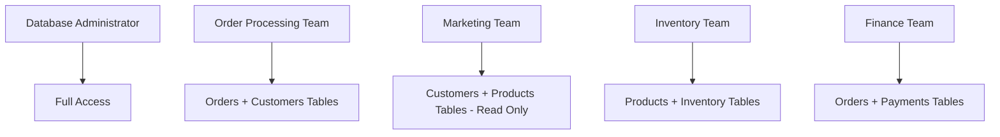

# SQL Roles

## Introduction

In database management, controlling who can access what data and perform which operations is crucial for both security and operational efficiency. SQL Roles provide a powerful mechanism to manage these permissions at scale by grouping privileges together and assigning them to users.

Instead of individually granting permissions to each user (which can become unwieldy in larger organizations), roles allow database administrators to create permission templates that can be consistently applied across groups of users with similar responsibilities.

## Understanding SQL Roles

A role is essentially a named collection of privileges that can be assigned to users. Think of roles as job titles in an organization - all employees with the same job title typically have the same responsibilities and access rights.

### Key Concepts

- **Role**: A named entity that contains a set of privileges
- **Privilege**: A specific permission to perform an action (SELECT, INSERT, UPDATE, etc.)
- **Grant**: The act of assigning privileges or roles to users or other roles
- **Revoke**: The act of removing privileges or roles

## Creating and Managing Roles

Let's explore how to work with roles in SQL:

### Creating a Role

```sql
-- Basic role creation
CREATE ROLE reporting_analyst;

-- Creating a role with password (PostgreSQL syntax)
CREATE ROLE financial_analyst WITH LOGIN PASSWORD 'secure_password';
```

### Granting Privileges to a Role

```sql
-- Grant SELECT privilege on a specific table
GRANT SELECT ON sales_data TO reporting_analyst;

-- Grant multiple privileges on a table
GRANT SELECT, INSERT, UPDATE ON customer_data TO financial_analyst;

-- Grant all privileges on a table
GRANT ALL PRIVILEGES ON financial_transactions TO financial_analyst;
```

### Assigning Roles to Users

```sql
-- Assign a role to a user
GRANT reporting_analyst TO robert;

-- Assign multiple roles to a user
GRANT reporting_analyst, data_viewer TO sarah;
```

### Revoking Privileges or Roles

```sql
-- Revoke a specific privilege
REVOKE INSERT ON customer_data FROM financial_analyst;

-- Revoke a role from a user
REVOKE reporting_analyst FROM robert;
```

### Role Hierarchies

Many database systems support role hierarchies, where one role can contain other roles:

```sql
-- Create a basic role
CREATE ROLE employee;

-- Create a manager role that includes the employee role
CREATE ROLE manager;
GRANT employee TO manager;

-- Now users with the manager role will also have all privileges of the employee role
```

## Role Implementation Across Different Database Systems

While the concept of roles is similar across database systems, specific syntax and capabilities may vary:

### PostgreSQL

PostgreSQL treats roles as the fundamental unit for authentication and authorization:

```sql
-- Create a role that can login (essentially a user)
CREATE ROLE jane WITH LOGIN PASSWORD 'secure123';

-- Create a group role
CREATE ROLE marketing;

-- Add jane to the marketing role
GRANT marketing TO jane;
```

### MySQL

MySQL distinguishes between users and roles more explicitly:

```sql
-- Create a role
CREATE ROLE marketing_team;

-- Grant privileges to the role
GRANT SELECT, INSERT ON marketing_data.* TO marketing_team;

-- Create a user
CREATE USER 'jane'@'localhost' IDENTIFIED BY 'password123';

-- Assign the role to the user
GRANT marketing_team TO 'jane'@'localhost';

-- Activate roles (MySQL requires explicit activation)
SET ROLE marketing_team;
-- Or activate all roles
SET ROLE ALL;
```

### Oracle

Oracle has robust role capabilities, including password-protected roles:

```sql
-- Create a basic role
CREATE ROLE reporting_user;

-- Create a password-protected role (must be enabled with password)
CREATE ROLE sensitive_data IDENTIFIED BY 'secret123';

-- Grant the role to a user
GRANT reporting_user TO jane;
```

### SQL Server

SQL Server implements roles at both server and database levels:

```sql
-- Create a database role
CREATE ROLE MarketingTeam;

-- Add a user to the role
ALTER ROLE MarketingTeam ADD MEMBER Jane;

-- Grant permissions to the role
GRANT SELECT ON SCHEMA::Marketing TO MarketingTeam;
```

## Real-World Application: Setting Up Roles for an E-Commerce Database

Let's walk through a practical example of setting up roles for an e-commerce application:



Here's how we would implement this role structure:

```sql
-- Create the roles
CREATE ROLE db_admin;
CREATE ROLE order_processor;
CREATE ROLE marketing_analyst;
CREATE ROLE inventory_manager;
CREATE ROLE finance_analyst;

-- Assign appropriate privileges to each role
-- Database Administrator
GRANT ALL PRIVILEGES ON DATABASE ecommerce TO db_admin;

-- Order Processing Team
GRANT SELECT, INSERT, UPDATE ON orders TO order_processor;
GRANT SELECT, UPDATE ON customers TO order_processor;

-- Marketing Team (read-only)
GRANT SELECT ON customers TO marketing_analyst;
GRANT SELECT ON products TO marketing_analyst;

-- Inventory Team
GRANT SELECT, INSERT, UPDATE, DELETE ON products TO inventory_manager;
GRANT SELECT, INSERT, UPDATE, DELETE ON inventory TO inventory_manager;

-- Finance Team
GRANT SELECT ON orders TO finance_analyst;
GRANT SELECT, INSERT, UPDATE ON payments TO finance_analyst;

-- Now assign these roles to actual users
GRANT db_admin TO user_alice;
GRANT order_processor TO user_bob, user_charlie;
GRANT marketing_analyst TO user_dana, user_eduardo, user_fiona;
GRANT inventory_manager TO user_gary, user_hannah;
GRANT finance_analyst TO user_ivan, user_julia;
```

## Best Practices for SQL Roles

To effectively use roles in your database management strategy:

1. **Follow the Principle of Least Privilege**: Grant only the permissions necessary for each role to perform its function.

2. **Create Role Hierarchies**: Structure roles hierarchically to reflect your organizational structure and simplify management.

3. **Use Descriptive Role Names**: Choose names that clearly indicate the role's purpose and scope.

4. **Regularly Audit Role Assignments**: Periodically review which users have which roles to ensure proper access control.

5. **Document Role Definitions**: Maintain clear documentation of what each role is for and what privileges it contains.

6. **Prefer Role Assignment Over Direct Grants**: Grant privileges to roles rather than directly to users whenever possible.

7. **Create Application-Specific Roles**: For applications that connect to the database, create specific roles with precisely the required permissions.

## Example: Role Management Workflow

Here's a typical workflow for a database administrator managing roles:

1. **Analyze Access Requirements**:
   Determine what data and operations different job functions need.

2. **Design Role Structure**:
   Create a hierarchical structure of roles based on job functions.

3. **Implement Roles**:
   ```sql
   CREATE ROLE base_employee;
   GRANT CONNECT ON DATABASE company_db TO base_employee;
   
   CREATE ROLE department_viewer;
   GRANT base_employee TO department_viewer;
   GRANT SELECT ON department TO department_viewer;
   
   CREATE ROLE department_manager;
   GRANT department_viewer TO department_manager;
   GRANT INSERT, UPDATE ON department TO department_manager;
   ```

4. **Assign Roles to Users**:
   ```sql
   GRANT department_viewer TO regular_employee1, regular_employee2;
   GRANT department_manager TO manager1, manager2;
   ```

5. **Periodically Review and Adjust**:
   ```sql
   -- When an employee changes roles
   REVOKE department_viewer FROM employee1;
   GRANT department_manager TO employee1;
   
   -- When access requirements change
   GRANT SELECT ON new_table TO department_viewer;
   ```

## Summary

SQL Roles provide a powerful and flexible way to manage database permissions. By grouping privileges into named roles that correspond to job functions, database administrators can:

- Simplify permission management
- Ensure consistent access control
- Scale access management efficiently
- Implement the principle of least privilege
- Adapt quickly to organizational changes

Rather than managing individual permissions for each user, roles allow for a more organized, consistent, and maintainable approach to database security.

## Additional Resources and Exercises

### Resources
- [PostgreSQL Role Documentation](https://www.postgresql.org/docs/current/user-manag.html)
- [MySQL Role-Based Privileges](https://dev.mysql.com/doc/refman/8.0/en/roles.html)
- [Oracle Database Security Guide](https://docs.oracle.com/en/database/oracle/oracle-database/19/dbseg/index.html)
- [SQL Server Role-Based Security](https://docs.microsoft.com/en-us/sql/relational-databases/security/authentication-access/getting-started-with-database-engine-permissions)

### Exercises

1. **Basic Role Management**:
   Create roles for 'ReadOnly', 'DataEntry', and 'Administrator' with appropriate permissions for a blog database with tables for 'posts', 'users', and 'comments'.

2. **Role Hierarchy**:
   Design a role hierarchy for a hospital database with different levels of access for doctors, nurses, administrators, and billing staff.

3. **Audit Exercise**:
   Write SQL queries to list all roles in your database, show what privileges each role has, and display which users are assigned to each role.

4. **Permission Transformation**:
   Take a database with individual user permissions and refactor it to use roles instead. Document the before and after states.

5. **Role Implementation**:
   For a specific database system (e.g., PostgreSQL, MySQL, SQL Server), implement a complete role-based access control system for a school database with students, teachers, courses, and grades.