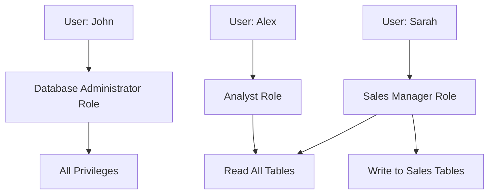

# SQL Users

## Introduction

In database management, controlling access to your data is just as important as organizing and querying it. SQL Users are the foundation of database security, providing a mechanism to authenticate individuals or applications and authorize their access to specific data and operations. This article explores how to create, manage, and secure SQL users as part of your overall database security strategy.

User management is a critical component of SQL Data Control Language (DCL), which focuses on controlling access to data within your database systems. By understanding SQL users, you'll be able to implement proper security measures to protect your valuable data while ensuring appropriate access for legitimate users.

## Understanding SQL Users

### What is a SQL User?

A SQL user is an account that can connect to a database system. Each user has:

- A unique identity (username)
- Authentication credentials (usually a password)
- A set of permissions (privileges) that determine what they can access and modify

Think of SQL users like accounts for a secure building - each person gets their own key (username and password) that opens only the doors (database objects) they're authorized to access.

### Types of Users

Database systems typically have different types of users:

1. **Superusers/Administrators**: Have complete control over the database system
2. **Application Users**: Created for specific applications to connect to the database
3. **Regular Users**: Individual users with varying levels of access
4. **Role-based Users**: Users assigned to specific roles for easier management

## Creating and Managing SQL Users

### Creating a New User

The basic syntax for creating a user varies slightly between different database systems, but generally follows this pattern:

```sql
-- SQL Server syntax
CREATE LOGIN JohnDoe WITH PASSWORD = 'StrongPassword123!';
CREATE USER JohnDoe FOR LOGIN JohnDoe;

-- MySQL syntax
CREATE USER 'johndoe'@'localhost' IDENTIFIED BY 'StrongPassword123!';

-- PostgreSQL syntax
CREATE USER johndoe WITH PASSWORD 'StrongPassword123!';

-- Oracle syntax
CREATE USER johndoe IDENTIFIED BY "StrongPassword123!";
```

### Example: Creating a Web Application User

Let's say you're building a blog platform and need a database user for your web application:

```sql
-- Create a user for the blog application (MySQL syntax)
CREATE USER 'blog_app'@'%' IDENTIFIED BY 'App$3cureP@ss!';

-- Output: Query OK, 0 rows affected (0.05 sec)
```

### Modifying User Properties

You can modify existing users to change their properties:

```sql
-- Change password (MySQL)
ALTER USER 'johndoe'@'localhost' IDENTIFIED BY 'NewPassword456!';

-- Rename a user (PostgreSQL)
ALTER USER johndoe RENAME TO john_smith;

-- Lock a user account (Oracle)
ALTER USER johndoe ACCOUNT LOCK;
```

### Removing Users

When a user no longer needs access, you should remove them:

```sql
-- SQL Server
DROP USER JohnDoe;
DROP LOGIN JohnDoe;

-- MySQL
DROP USER 'johndoe'@'localhost';

-- PostgreSQL
DROP USER johndoe;

-- Oracle
DROP USER johndoe;
```

## User Privileges and Authorization

The power of SQL user management comes from controlling exactly what each user can do.

### Basic Privilege Management

```sql
-- Grant SELECT privilege on a table (MySQL)
GRANT SELECT ON database_name.table_name TO 'johndoe'@'localhost';

-- Grant multiple privileges (PostgreSQL)
GRANT SELECT, INSERT, UPDATE ON table_name TO johndoe;

-- Revoke privileges (Oracle)
REVOKE DELETE ON table_name FROM johndoe;
```

### Example: Setting Up a Read-Only User

Let's create a user for generating reports who can only read data:

```sql
-- Create the user (MySQL syntax)
CREATE USER 'report_viewer'@'localhost' IDENTIFIED BY 'Rep0rt$Only!';

-- Grant read-only access to all tables in a database
GRANT SELECT ON sales_database.* TO 'report_viewer'@'localhost';

-- Output: Query OK, 0 rows affected (0.03 sec)
```

Now, when this user connects to the database, they can query any table in the sales_database but cannot modify data:

```sql
-- This will work
SELECT * FROM customers WHERE purchase_total > 1000;

-- This will fail with an error message about insufficient privileges
INSERT INTO customers (name, email) VALUES ('New Customer', 'new@example.com');

-- Error: ERROR 1142 (42000): INSERT command denied to user 'report_viewer'@'localhost' for table 'customers'
```

### Understanding Privilege Levels

Privileges can be granted at different levels:

1. **Global level**: Applies to all databases in the system
2. **Database level**: Applies to all objects in a specific database
3. **Table level**: Applies to a specific table
4. **Column level**: Applies to specific columns in a table

```sql
-- Global privilege (MySQL)
GRANT CREATE USER ON *.* TO 'admin'@'localhost';

-- Database level privilege (PostgreSQL)
GRANT CONNECT ON DATABASE inventory TO warehouse_manager;

-- Table level privilege (SQL Server)
GRANT SELECT, INSERT ON dbo.orders TO sales_staff;

-- Column level privilege (Oracle)
GRANT UPDATE (employee_salary) ON employees TO hr_manager;
```

## Roles for Simplified User Management

Managing privileges for many users individually can become complex. Roles provide a way to group privileges together and assign them to users.



### Creating and Using Roles

```sql
-- Creating a role (PostgreSQL)
CREATE ROLE sales_staff;

-- Grant privileges to the role
GRANT SELECT, INSERT, UPDATE ON orders TO sales_staff;
GRANT SELECT ON customers TO sales_staff;

-- Assign users to the role
GRANT sales_staff TO sarah, mike, jennifer;
```

### Example: Setting Up Application Roles

For a web application with different user types:

```sql
-- Create roles (SQL Server syntax)
CREATE ROLE app_admin;
CREATE ROLE app_editor;
CREATE ROLE app_reader;

-- Set up privileges for each role
GRANT ALL PRIVILEGES ON app_schema.* TO app_admin;
GRANT SELECT, INSERT, UPDATE ON app_schema.* TO app_editor;
GRANT SELECT ON app_schema.* TO app_reader;

-- Assign application service account to admin role
GRANT app_admin TO app_service;
```

## Best Practices for SQL User Security

### Password Policies

Implement strong password policies for database users:

```sql
-- MySQL password policy (requires validate_password plugin)
SET GLOBAL validate_password.policy = 'STRONG';
SET GLOBAL validate_password.length = 12;

-- SQL Server password policy
ALTER LOGIN JohnDoe WITH PASSWORD = 'C0mpl3xP@ss!' CHECK_POLICY = ON;
```

### Principle of Least Privilege

Only grant users the minimum privileges they need to perform their job:

```sql
-- Instead of this (too permissive)
GRANT ALL PRIVILEGES ON database.* TO 'user'@'localhost';

-- Do this (more restrictive)
GRANT SELECT ON database.customer_view TO 'user'@'localhost';
GRANT EXECUTE ON PROCEDURE database.get_order_summary TO 'user'@'localhost';
```

### Regular Audit of User Access

Periodically review who has access to your database and what privileges they have:

```sql
-- MySQL: View user privileges
SELECT * FROM mysql.user;
SHOW GRANTS FOR 'johndoe'@'localhost';

-- PostgreSQL: View role memberships
SELECT * FROM pg_roles;
SELECT * FROM pg_auth_members;
```

### Implement Connection Restrictions

Limit where users can connect from:

```sql
-- MySQL: Restrict connection to specific IP
CREATE USER 'johndoe'@'192.168.1.100' IDENTIFIED BY 'password';

-- PostgreSQL: Configure pg_hba.conf to restrict host connections
-- host    database    user    address    method
```

## Real-World Application: E-commerce Database User Setup

Let's walk through setting up users for an e-commerce application:

### Scenario

You're designing the database security for an e-commerce platform with:
- Customer data
- Product inventory
- Order processing
- Payment information

### User Structure Implementation

1. **Create the necessary users:**

```sql
-- Database administrator
CREATE USER db_admin IDENTIFIED BY 'Admin$3cur3!';

-- Application service account
CREATE USER ecomm_app IDENTIFIED BY 'App$3rv1c3!';

-- Customer support staff
CREATE USER support_staff IDENTIFIED BY 'Supp0rt$t@ff!';

-- Analytics team
CREATE USER analytics_user IDENTIFIED BY 'An@lyt1cs!';
```

2. **Set up appropriate roles:**

```sql
-- Create roles
CREATE ROLE app_service;
CREATE ROLE customer_support;
CREATE ROLE data_analyst;

-- Assign privileges to roles
GRANT SELECT, INSERT, UPDATE, DELETE ON ALL TABLES IN SCHEMA public TO app_service;
GRANT SELECT, UPDATE ON customers, orders, order_items TO customer_support;
GRANT SELECT ON ALL TABLES IN SCHEMA public TO data_analyst;

-- Additional restrictions
REVOKE SELECT ON payment_details FROM customer_support;
REVOKE SELECT ON customers(password_hash, credit_card_number) FROM data_analyst;
```

3. **Assign roles to users:**

```sql
-- Grant roles to appropriate users
GRANT app_service TO ecomm_app;
GRANT customer_support TO support_staff;
GRANT data_analyst TO analytics_user;
```

4. **Configure application connection:**

```sql
-- In application configuration file (pseudocode)
database_connection = {
  "host": "db.example.com",
  "port": 5432,
  "username": "ecomm_app",
  "password": "App$3rv1c3!",
  "connection_pool_size": 10
}
```

This setup ensures:
- The application has all necessary access
- Support staff can help customers but can't see sensitive payment details
- Analytics team can run reports but can't see personally identifiable information
- Database administration is restricted to the admin user

## Summary

SQL users form the foundation of database security, allowing you to control who can access your data and what they can do with it. By properly implementing user management, you can protect sensitive information while still providing appropriate access for applications and team members.

Key points to remember:
- Create specific users for different purposes (applications, roles, individuals)
- Follow the principle of least privilege when granting permissions
- Use roles to simplify management of multiple users
- Implement strong password policies and connection restrictions
- Regularly audit user access and remove unnecessary privileges

By mastering SQL user management, you'll be able to create secure, well-controlled database environments for your applications.

## Practice Exercises

1. Create a new user called 'junior_dev' with SELECT and INSERT privileges on a table called 'projects'.
2. Create a role for 'reporting' that has read-only access to all tables in a database, and assign a user to it.
3. Audit all users in your database and document their privileges.
4. Implement a procedure for removing access when employees leave the company.

## Additional Resources

- [MySQL User and Privilege System](https://dev.mysql.com/doc/refman/8.0/en/user-account-management.html)
- [PostgreSQL Client Authentication](https://www.postgresql.org/docs/current/client-authentication.html)
- [SQL Server Security](https://docs.microsoft.com/en-us/sql/relational-databases/security/security-center-for-sql-server-database-engine-and-azure-sql-database)
- [Oracle Database Security Guide](https://docs.oracle.com/en/database/oracle/oracle-database/19/dbseg/)
- [OWASP Database Security Cheat Sheet](https://cheatsheetseries.owasp.org/cheatsheets/Database_Security_Cheat_Sheet.html)