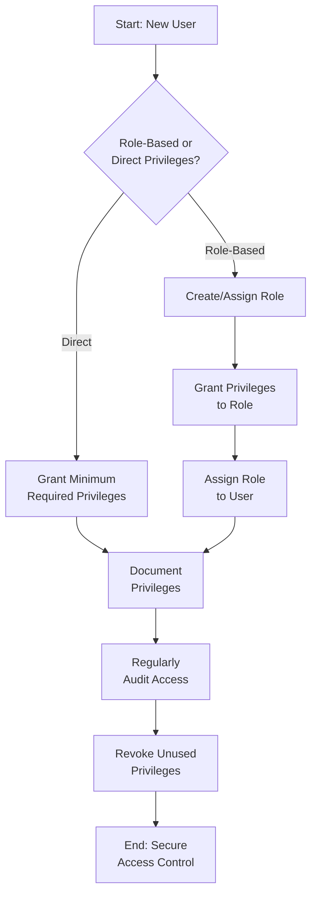

# SQL Privileges

## Introduction

SQL privileges are permissions granted to users that determine what actions they can perform on a database and its objects. Think of privileges as the keys to different doors in your database system - some users may have access to everything, while others might only be allowed to view specific information.

In this guide, we'll explore how SQL privileges work, why they're essential for security, and how to manage them effectively. As databases often contain sensitive information, understanding privileges is crucial for protecting your data while ensuring the right people can access what they need.

## Why Privileges Matter

Imagine a company database containing employee salaries, customer information, and financial data. You wouldn't want:

- Every employee to see salary information
- Interns to modify critical financial records
- Customer service representatives to drop database tables

Privileges help establish a security boundary, ensuring users can only perform actions appropriate for their role.

## Types of SQL Privileges

SQL privileges typically fall into several categories:

### System Privileges

System privileges control what a user can do at the database level, like creating new users or shutting down the database.

Common system privileges include:

- CREATE USER - Allows creation of new database users
- CREATE TABLE - Permits creation of tables in the database
- CREATE VIEW - Allows creation of views
- CREATE PROCEDURE - Permits creation of stored procedures

### Object Privileges

Object privileges control what a user can do with specific database objects (tables, views, procedures, etc.).

Common object privileges include:

- SELECT - Read data from a table or view
- INSERT - Add new records to a table
- UPDATE - Modify existing records
- DELETE - Remove records from a table
- EXECUTE - Run a stored procedure or function
- REFERENCES - Create a foreign key constraint referencing a table

## Managing Privileges with SQL Commands

Let's look at the essential SQL commands for managing privileges:

### Granting Privileges

The `GRANT` statement gives privileges to users:

```sql
-- Syntax
GRANT privilege_name 
ON object_name 
TO user_name;

-- Examples

-- Grant SELECT privilege on the employees table to user john
GRANT SELECT 
ON employees 
TO john;

-- Grant multiple privileges
GRANT SELECT, INSERT, UPDATE 
ON customers 
TO mary;

-- Grant all privileges on products table to user admin
GRANT ALL PRIVILEGES 
ON products 
TO admin;
```

#### WITH GRANT OPTION

You can allow users to pass on privileges to others using the `WITH GRANT OPTION`:

```sql
-- Allow user manager to grant SELECT privilege on employees table to others
GRANT SELECT 
ON employees 
TO manager 
WITH GRANT OPTION;
```

### Revoking Privileges

The `REVOKE` statement removes privileges from users:

```sql
-- Syntax
REVOKE privilege_name 
ON object_name 
FROM user_name;

-- Examples

-- Revoke DELETE privilege on the customers table from user john
REVOKE DELETE 
ON customers 
FROM john;

-- Revoke all privileges on products table from user intern
REVOKE ALL PRIVILEGES 
ON products 
FROM intern;
```

## Real-World Privilege Scenarios

Let's explore some practical examples of how privileges work in real database environments:

### Scenario 1: E-commerce Database

An e-commerce company might set up privileges like this:

```sql
-- Database Administrator (full access)
GRANT ALL PRIVILEGES ON *.* TO dba@localhost;

-- Customer Service Representative
GRANT SELECT ON orders.* TO cs_rep@localhost;
GRANT SELECT, UPDATE ON customers.* TO cs_rep@localhost;

-- Marketing Analyst
GRANT SELECT ON customers.* TO analyst@localhost;
GRANT SELECT ON products.* TO analyst@localhost;
GRANT SELECT ON orders.* TO analyst@localhost;

-- Inventory Manager
GRANT SELECT, INSERT, UPDATE ON products.* TO inventory@localhost;
```

### Scenario 2: Creating Role-Based Access

Many database systems support roles to manage groups of privileges:

```sql
-- Create roles
CREATE ROLE reader;
CREATE ROLE editor;
CREATE ROLE admin;

-- Assign privileges to roles
GRANT SELECT ON *.* TO reader;

GRANT SELECT, INSERT, UPDATE ON *.* TO editor;

GRANT ALL PRIVILEGES ON *.* TO admin;

-- Assign roles to users
GRANT reader TO analyst1, analyst2, viewer;
GRANT editor TO content_manager, support_lead;
GRANT admin TO dba, tech_lead;
```

## Viewing Privileges

You can view the privileges assigned to users using database-specific commands:

### MySQL/MariaDB

```sql
-- Show grants for current user
SHOW GRANTS;

-- Show grants for specific user
SHOW GRANTS FOR 'username'@'hostname';
```

### Oracle

```sql
-- View system privileges for all users
SELECT * FROM DBA_SYS_PRIVS;

-- View object privileges for all users
SELECT * FROM DBA_TAB_PRIVS;
```

### SQL Server

```sql
-- View server permissions
SELECT * FROM sys.server_permissions;

-- View database permissions
SELECT * FROM sys.database_permissions;
```

### PostgreSQL

```sql
-- View privileges on tables
SELECT grantee, table_schema, table_name, privilege_type
FROM information_schema.table_privileges;
```

## Privilege Best Practices



Follow these best practices for effective privilege management:

1. **Principle of Least Privilege**: Grant only the minimum privileges necessary for users to perform their jobs.

2. **Use Roles**: Group privileges into roles for easier management when possible.

3. **Regular Audits**: Periodically review privileges to ensure they're still appropriate.

4. **Revoke Before Deleting**: Revoke privileges before deleting users or objects.

5. **Be Careful with Admin Privileges**: Limit the number of users with administrative privileges.

6. **Document Everything**: Keep records of what privileges are granted and why.

## Common Privilege-Related Issues

### Too Many Privileges

Granting excessive privileges can lead to security vulnerabilities. If a user account is compromised, the attacker gains all those privileges.

### Too Few Privileges

Insufficient privileges can prevent users from doing their jobs effectively, leading to workarounds that might compromise security (like sharing accounts).

### Orphaned Privileges

When you delete a user without revoking their privileges first, some database systems might retain those privileges, potentially causing confusion.

## Database-Specific Considerations

Different database systems handle privileges in slightly different ways:

### MySQL/MariaDB

```sql
-- Grant privileges on specific columns
GRANT SELECT (employee_id, name, department) 
ON employees 
TO hr_assistant;
```

### Oracle

```sql
-- Create a profile to limit resources
CREATE PROFILE app_user LIMIT
  SESSIONS_PER_USER 2
  CPU_PER_SESSION UNLIMITED
  CPU_PER_CALL 3000
  CONNECT_TIME 45;

-- Assign profile to user
ALTER USER app_user PROFILE app_user;
```

### SQL Server

```sql
-- Using DENY (explicitly prevents access)
DENY DELETE ON employees TO user1;
```

### PostgreSQL

```sql
-- Grant privileges with schema specification
GRANT SELECT ON ALL TABLES IN SCHEMA public TO analyst;
```

## Summary

SQL privileges are a fundamental aspect of database security, allowing administrators to control who can access what data and perform which operations. By understanding how to grant and revoke privileges effectively, you can create a secure database environment while ensuring users have the access they need.

Remember these key points:

- Privileges control what actions users can perform on database objects
- The GRANT command gives privileges, while REVOKE removes them
- Following the principle of least privilege enhances security
- Role-based access control simplifies privilege management
- Regular auditing helps maintain appropriate access levels

## Practice Exercises

1. **Basic Privileges**: Create a database user named 'reader' who can only SELECT from all tables in a database.

2. **Multiple Privileges**: Grant a user the ability to SELECT, INSERT, and UPDATE on a table, but not DELETE.

3. **Role Creation**: Create a role with appropriate privileges for a customer service representative and assign it to a user.

4. **Privilege Audit**: Write queries to list all privileges granted to a specific user in your database system.

5. **Privilege Revocation**: Practice revoking specific privileges from a user without removing all access.

## Additional Resources

- [MySQL Privileges Documentation](https://dev.mysql.com/doc/refman/8.0/en/privileges-provided.html)
- [PostgreSQL Privilege Management](https://www.postgresql.org/docs/current/user-manag.html)
- [Oracle Database Security Guide](https://docs.oracle.com/en/database/oracle/oracle-database/19/dbseg/index.html)
- [SQL Server Security Documentation](https://docs.microsoft.com/en-us/sql/relational-databases/security/security-center-for-sql-server-database-engine-and-azure-sql-database)
- [OWASP Database Security Cheat Sheet](https://cheatsheetseries.owasp.org/cheatsheets/Database_Security_Cheat_Sheet.html)