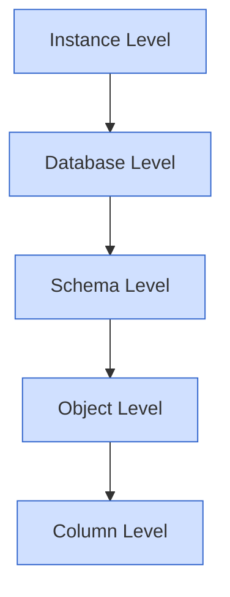
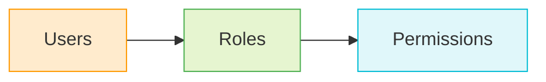

# SQL Permission Hierarchy

## Introduction

When working with databases, controlling who can access what data is crucial for security. SQL databases implement a sophisticated permission system that determines which users can view, modify, or manage database objects. This hierarchy of permissions is fundamental to database security and forms a critical part of SQL's Data Control Language (DCL).

In this guide, we'll explore how SQL permission hierarchies work, the different levels of access control, and how to effectively manage user permissions in your database systems.

## Understanding the SQL Permission Model

SQL databases use a layered approach to security that can be visualized as a hierarchy. At each level, permissions can be granted or revoked to control access to database resources.



Let's examine each level in detail.

## Permission Levels Explained

### 1. Instance Level

The instance level represents the highest level of permissions in a SQL database. Users with instance-level permissions can manage the entire database server.

**Key roles at this level:**
- System administrators
- Security administrators

**Example permissions:**
- Creating new databases
- Managing server configuration
- Creating server logins

**Example SQL (SQL Server):**

```sql
-- Create a server login
CREATE LOGIN JohnDoe WITH PASSWORD = 'StrongP@ssw0rd123';

-- Grant server-level permission
GRANT ALTER ANY DATABASE TO JohnDoe;
```

### 2. Database Level

Database-level permissions control access to specific databases within the instance.

**Example permissions:**
- Connecting to a database
- Creating new schemas
- Backing up the database

**Example SQL:**

```sql
-- Create a database user
CREATE USER JaneDoe FOR LOGIN JaneDoe;

-- Grant database-level permission
GRANT CREATE TABLE TO JaneDoe;
GRANT BACKUP DATABASE TO JaneDoe;
```

### 3. Schema Level

Schemas are collections of database objects and serve as namespaces within a database. Schema-level permissions control access to all objects within a specific schema.

**Example SQL:**

```sql
-- Create a new schema
CREATE SCHEMA sales;

-- Grant permissions on a schema
GRANT SELECT ON SCHEMA::sales TO JaneDoe;
```

This grants JaneDoe SELECT permissions on all current and future tables in the sales schema.

### 4. Object Level

Object-level permissions apply to specific database objects like tables, views, stored procedures, and functions.

**Example SQL:**

```sql
-- Grant SELECT permission on a specific table
GRANT SELECT ON sales.customers TO JaneDoe;

-- Grant EXECUTE permission on a stored procedure
GRANT EXECUTE ON dbo.calculate_revenue TO JaneDoe;
```

### 5. Column Level

The most granular level of permissions applies to specific columns within tables.

**Example SQL:**

```sql
-- Grant SELECT permission on specific columns only
GRANT SELECT ON sales.customers(customer_id, company_name, contact_name) TO JaneDoe;
```

This restricts JaneDoe to only view the specified columns in the customers table.

## Permission Types

SQL databases typically support several types of permissions:

1. **SELECT** - Ability to read data
2. **INSERT** - Ability to add new data
3. **UPDATE** - Ability to modify existing data
4. **DELETE** - Ability to remove data
5. **EXECUTE** - Ability to run stored procedures or functions
6. **ALTER** - Ability to modify the structure of database objects
7. **CONTROL** - Full control over a database object
8. **REFERENCES** - Ability to create foreign key references

## Role-Based Access Control

Most modern SQL database systems implement role-based access control (RBAC) to simplify permission management. Instead of assigning permissions directly to users, you create roles with specific permissions and then assign users to these roles.



**Example SQL:**

```sql
-- Create a role
CREATE ROLE sales_analysts;

-- Assign permissions to the role
GRANT SELECT ON SCHEMA::sales TO sales_analysts;
GRANT EXECUTE ON OBJECT::sales.calculate_revenue TO sales_analysts;

-- Assign a user to the role
ALTER ROLE sales_analysts ADD MEMBER JaneDoe;
```

## Revoking Permissions

Permissions can be revoked using the `REVOKE` statement:

```sql
-- Revoke a permission
REVOKE SELECT ON sales.customers FROM JaneDoe;

-- Revoke all permissions on an object
REVOKE ALL PRIVILEGES ON sales.customers FROM JaneDoe;
```

## Permission Inheritance and CASCADE Option

In some database systems, permissions can be granted with the `WITH GRANT OPTION`, allowing recipients to further grant that permission to others:

```sql
-- Allow JaneDoe to grant SELECT permissions to others
GRANT SELECT ON sales.customers TO JaneDoe WITH GRANT OPTION;
```

When revoking permissions that have been propagated, you can use the `CASCADE` option to revoke all dependent permissions:

```sql
-- Revoke permissions including any that JaneDoe granted to others
REVOKE SELECT ON sales.customers FROM JaneDoe CASCADE;
```

## Practical Example: Setting Up a Permission Hierarchy

Let's walk through a complete example of setting up a permission hierarchy for a small e-commerce database:

```sql
-- 1. Create database
CREATE DATABASE ecommerce;
USE ecommerce;

-- 2. Create schemas
CREATE SCHEMA sales;
CREATE SCHEMA inventory;
CREATE SCHEMA reports;

-- 3. Create tables
CREATE TABLE sales.orders (
    order_id INT PRIMARY KEY,
    customer_id INT,
    order_date DATE,
    total_amount DECIMAL(10,2)
);

CREATE TABLE inventory.products (
    product_id INT PRIMARY KEY,
    product_name VARCHAR(100),
    stock_quantity INT,
    unit_price DECIMAL(10,2)
);

-- 4. Create roles
CREATE ROLE sales_staff;
CREATE ROLE inventory_managers;
CREATE ROLE report_viewers;
CREATE ROLE db_admins;

-- 5. Assign permissions to roles
-- Sales staff can view and modify sales data
GRANT SELECT, INSERT, UPDATE ON SCHEMA::sales TO sales_staff;

-- Inventory managers can fully manage product data
GRANT ALL PRIVILEGES ON SCHEMA::inventory TO inventory_managers;
-- They can also view sales data but not modify it
GRANT SELECT ON SCHEMA::sales TO inventory_managers;

-- Report viewers can only read data
GRANT SELECT ON SCHEMA::sales TO report_viewers;
GRANT SELECT ON SCHEMA::inventory TO report_viewers;
GRANT ALL PRIVILEGES ON SCHEMA::reports TO report_viewers;

-- DB admins have full control
GRANT CONTROL ON DATABASE::ecommerce TO db_admins;

-- 6. Create users and assign to roles
CREATE USER Alice FOR LOGIN Alice;
CREATE USER Bob FOR LOGIN Bob;
CREATE USER Charlie FOR LOGIN Charlie;
CREATE USER Dana FOR LOGIN Dana;

ALTER ROLE sales_staff ADD MEMBER Alice;
ALTER ROLE inventory_managers ADD MEMBER Bob;
ALTER ROLE report_viewers ADD MEMBER Charlie;
ALTER ROLE db_admins ADD MEMBER Dana;
```

## Best Practices for SQL Permissions

1. **Principle of Least Privilege**: Grant only the minimum permissions necessary for users to perform their job functions.

2. **Use Roles**: Assign permissions to roles instead of individual users for easier management.

3. **Regular Audits**: Periodically review and audit permissions to ensure they remain appropriate.

4. **Remove Unused Accounts**: Promptly disable or remove accounts for employees who leave the organization.

5. **Object Ownership**: Be cautious with object ownership, as owners automatically have full control over their objects.

6. **Document Your Permission Structure**: Maintain clear documentation of your permission hierarchy.

7. **Permission Naming Conventions**: Use consistent naming conventions for roles and user accounts.

8. **Avoid Public Permissions**: Be careful with granting permissions to the PUBLIC role, as this gives access to all users.

## DBMS-Specific Permission Features

Different database management systems have varying implementations of permission hierarchies:

### MySQL/MariaDB
MySQL uses a privilege system with global, database, table, and column privileges. It also supports role-based permissions in newer versions.

```sql
-- Example MySQL privilege grant
GRANT SELECT, INSERT ON ecommerce.sales.* TO 'Alice'@'localhost';
```

### PostgreSQL
PostgreSQL has a robust role-based system with role inheritance.

```sql
-- PostgreSQL role inheritance example
CREATE ROLE editors;
CREATE ROLE alice LOGIN PASSWORD 'secure_password';
GRANT editors TO alice;
```

### Oracle
Oracle Database uses a sophisticated system of system privileges, object privileges, and roles.

```sql
-- Oracle example
GRANT CREATE SESSION TO alice;
GRANT SELECT ON sales.orders TO alice;
```

### SQL Server
SQL Server has a comprehensive permission system as demonstrated in previous examples, with server-level and database-level permissions.

## Common Permission-Related Problems and Solutions

### Problem 1: Too Many Individual Permissions

**Symptom**: Permission management becomes unwieldy with many individual user grants.

**Solution**: Implement role-based access control and group users with similar responsibilities.

### Problem 2: Identifying Missing Permissions

**Symptom**: Users report "access denied" errors for operations they should be able to perform.

**Solution**: Use permission checking queries to troubleshoot:

```sql
-- SQL Server example to check user permissions
SELECT * FROM sys.fn_my_permissions('sales.orders', 'OBJECT');
```

### Problem 3: Permission Creep

**Symptom**: Users accumulate unnecessary permissions over time.

**Solution**: Conduct regular permission audits and revoke excessive privileges.

## Summary

The SQL permission hierarchy provides a powerful framework for controlling access to database resources. By understanding the different levels of permissions—from instance to column level—and implementing best practices like role-based access control, you can create a secure database environment that protects your data while allowing appropriate access.

Remember that effective permission management is an ongoing process that requires regular reviews and updates as your organization's needs change.

## Additional Resources

- [Microsoft SQL Server Permission Documentation](https://docs.microsoft.com/en-us/sql/relational-databases/security/permissions-hierarchy-database-engine)
- [PostgreSQL Access Control Documentation](https://www.postgresql.org/docs/current/user-manag.html)
- [MySQL User Account Management](https://dev.mysql.com/doc/refman/8.0/en/user-account-management.html)
- [Oracle Database Security Guide](https://docs.oracle.com/en/database/oracle/oracle-database/19/dbseg/index.html)

## Exercises

1. Create a permission structure for a database with Customer, Order, and Product tables that allows sales staff to view all customer data but only update contact information.

2. Design a role-based system for a university database that has Student, Course, and Grade tables, ensuring that professors can only grade students in their own courses.

3. Audit an existing permission structure and identify potential security issues using system views like `sys.database_permissions` (SQL Server) or `information_schema.table_privileges` (PostgreSQL).

4. Implement column-level security on a Personnel table to restrict access to salary information to only HR staff.

5. Create a script to generate a complete report of all permissions in your database, grouped by user and object.