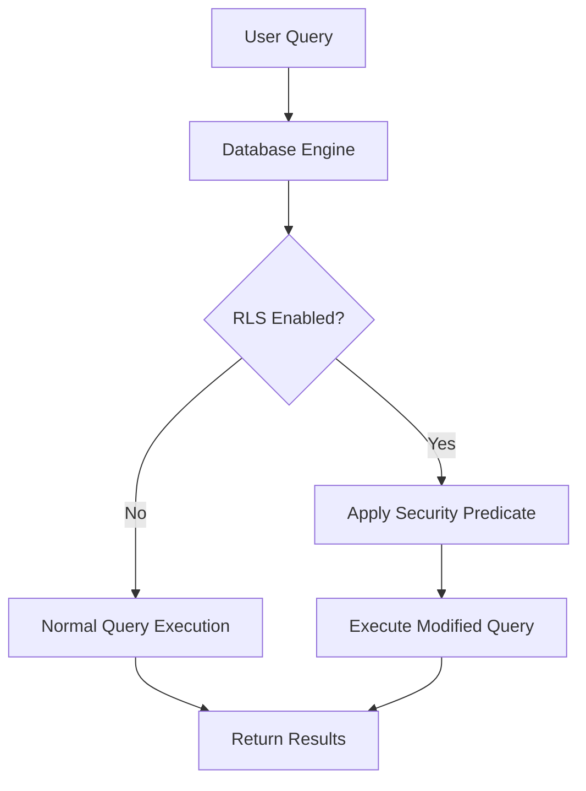

# SQL Row Level Security

## Introduction

Row Level Security (RLS) is a powerful security feature in modern database systems that allows database administrators to control which users can access specific rows of data in a table. Rather than relying solely on table-level or column-level permissions, RLS enables fine-grained access control at the individual row level.

Imagine you have a multi-tenant application where different customers' data is stored in the same table. With RLS, you can ensure that each customer only sees their own data, even though technically all data resides in the same database table. This is achieved by automatically applying security predicates to queries, effectively filtering out rows that users shouldn't have access to.

## Why Use Row Level Security?

Row Level Security offers several advantages:

- **Enhanced data protection**: Restrict access to sensitive data based on user attributes
- **Simplified application code**: Security logic can be centralized in the database rather than scattered throughout application code
- **Reduced risk of data leaks**: Even if application code has vulnerabilities, database-level security remains intact
- **Regulatory compliance**: Helps meet requirements for data protection regulations like GDPR or HIPAA

## How Row Level Security Works

At its core, RLS works by automatically applying a filter predicate to queries that access a table with RLS enabled. This happens transparently, meaning the user or application doesn't need to modify their queries to incorporate security filters - the database applies them automatically.

Here's a visual representation of how RLS works:



## Implementing Row Level Security

Let's explore how to implement RLS in different database systems. We'll cover the most common implementations in PostgreSQL and SQL Server.

### RLS in PostgreSQL

PostgreSQL implements Row Level Security through security policies that are applied to tables. Here's how to set it up:

#### Step 1: Create a table with sample data

First, let's create a customer data table for an example multi-tenant application:

```sql
CREATE TABLE customer_data (
    id SERIAL PRIMARY KEY,
    customer_id INTEGER NOT NULL,
    customer_name TEXT NOT NULL,
    data TEXT NOT NULL
);

-- Insert sample data
INSERT INTO customer_data (customer_id, customer_name, data) VALUES
(1, 'Acme Corp', 'Acme confidential data'),
(1, 'Acme Corp', 'More Acme data'),
(2, 'Globex', 'Globex confidential data'),
(2, 'Globex', 'More Globex data'),
(3, 'Initech', 'Initech confidential data');
```

#### Step 2: Enable RLS on the table

Next, enable Row Level Security on the table:

```sql
ALTER TABLE customer_data ENABLE ROW LEVEL SECURITY;
```

#### Step 3: Create roles for different users

Create database roles that represent different tenants:

```sql
CREATE ROLE acme_user;
CREATE ROLE globex_user;
CREATE ROLE admin_user BYPASSRLS;  -- BYPASSRLS allows this role to bypass RLS policies
```

#### Step 4: Create a security policy

Define a policy that determines which rows each user can see:

```sql
CREATE POLICY customer_data_policy ON customer_data
    USING (customer_id = current_setting('app.current_customer_id')::INTEGER);
```

This policy uses a custom setting `app.current_customer_id` that should be set when a user connects to the database.

#### Step 5: Set the context for each user session

When a user connects, set the appropriate context:

```sql
-- For Acme users
SET app.current_customer_id = 1;

-- For Globex users
SET app.current_customer_id = 2;
```

#### Step 6: Test the policy

Now when users query the table, they will only see rows that match their customer_id:

```sql
-- As Acme user
SET app.current_customer_id = 1;
SELECT * FROM customer_data;
```

Output:
```
 id | customer_id | customer_name |        data
----+-------------+---------------+---------------------
  1 |           1 | Acme Corp     | Acme confidential data
  2 |           1 | Acme Corp     | More Acme data
```

```sql
-- As Globex user
SET app.current_customer_id = 2;
SELECT * FROM customer_data;
```

Output:
```
 id | customer_id | customer_name |        data
----+-------------+---------------+----------------------
  3 |           2 | Globex        | Globex confidential data
  4 |           2 | Globex        | More Globex data
```

### RLS in SQL Server

Microsoft SQL Server has supported Row Level Security since SQL Server 2016. Here's how to implement it:

#### Step 1: Create a table with sample data

```sql
CREATE TABLE Sales.Orders (
    OrderID int PRIMARY KEY,
    SalesRep varchar(50) NOT NULL,
    CustomerID int NOT NULL,
    OrderDate date NOT NULL,
    OrderTotal money NOT NULL
);

-- Insert sample data
INSERT INTO Sales.Orders VALUES
(1, 'alice', 100, '2023-01-15', 1500),
(2, 'alice', 101, '2023-01-20', 2000),
(3, 'bob', 102, '2023-01-25', 1200),
(4, 'bob', 103, '2023-02-01', 950),
(5, 'carol', 104, '2023-02-05', 2500);
```

#### Step 2: Create a schema for security functions

```sql
CREATE SCHEMA Security;
GO
```

#### Step 3: Create a security predicate function

This function defines the logic for which rows a user can access:

```sql
CREATE FUNCTION Security.fn_securitypredicate(@SalesRep AS varchar(50))
    RETURNS TABLE
WITH SCHEMABINDING
AS
    RETURN SELECT 1 AS fn_securitypredicate_result
    WHERE @SalesRep = USER_NAME() OR USER_NAME() = 'dbo';
GO
```

#### Step 4: Create a security policy

```sql
CREATE SECURITY POLICY Security.SalesFilter
ADD FILTER PREDICATE Security.fn_securitypredicate(SalesRep)
ON Sales.Orders
WITH (STATE = ON);
GO
```

#### Step 5: Create user accounts and grant permissions

```sql
-- Create users and grant permissions
CREATE USER alice WITHOUT LOGIN;
CREATE USER bob WITHOUT LOGIN;
CREATE USER carol WITHOUT LOGIN;

GRANT SELECT ON Sales.Orders TO alice, bob, carol;
GO
```

#### Step 6: Test the policy

```sql
-- Test as 'alice'
EXECUTE AS USER = 'alice';
SELECT * FROM Sales.Orders;
REVERT;
```

Output:
```
OrderID  SalesRep  CustomerID  OrderDate   OrderTotal
-------  --------  ----------  ----------  ----------
1        alice     100         2023-01-15  1500.00
2        alice     101         2023-01-20  2000.00
```

```sql
-- Test as 'bob'
EXECUTE AS USER = 'bob';
SELECT * FROM Sales.Orders;
REVERT;
```

Output:
```
OrderID  SalesRep  CustomerID  OrderDate   OrderTotal
-------  --------  ----------  ----------  ----------
3        bob       102         2023-01-25  1200.00
4        bob       103         2023-02-01  950.00
```

## Advanced RLS Techniques

### Dynamic Security Policies

You can create more dynamic security policies that consider additional factors beyond the current user:

```sql
-- PostgreSQL example for a policy based on both user and data attributes
CREATE POLICY complex_policy ON employee_data
    USING (
        (department = current_user) OR
        (is_public = TRUE) OR
        (created_by = current_user)
    );
```

### Using RLS with Application Roles

For web applications with many users, it's common to use a single database role for the application and set context variables to identify specific users:

```sql
-- PostgreSQL example
-- In your application code, when a user logs in:
SET app.current_user_id = 42;

-- Then create an RLS policy like:
CREATE POLICY app_user_policy ON user_data
    USING (user_id = current_setting('app.current_user_id')::INTEGER);
```

### Handling Different Operations

You can define different row-level security policies for different operations (SELECT, INSERT, UPDATE, DELETE):

```sql
-- PostgreSQL example
-- Policy for read operations
CREATE POLICY read_policy ON documents
    FOR SELECT
    USING (owner_id = current_user OR is_public);

-- Policy for write operations
CREATE POLICY write_policy ON documents
    FOR UPDATE
    USING (owner_id = current_user);
```

## Real-world Applications

### Multi-tenant SaaS Application

In a SaaS application where multiple customers' data is stored in the same database:

```sql
-- PostgreSQL example
CREATE TABLE customer_records (
    id SERIAL PRIMARY KEY,
    tenant_id INTEGER NOT NULL,
    customer_name TEXT NOT NULL,
    contact_info TEXT,
    subscription_level TEXT
);

ALTER TABLE customer_records ENABLE ROW LEVEL SECURITY;

CREATE POLICY tenant_isolation ON customer_records
    USING (tenant_id = current_setting('app.tenant_id')::INTEGER);
```

When a tenant logs in, the application sets `app.tenant_id` to their unique identifier, ensuring they only see their own data.

### Healthcare Data Management

For a healthcare application that needs to respect doctor-patient relationships:

```sql
-- SQL Server example
CREATE FUNCTION Security.fn_PatientDataAccess(@PatientID int)
    RETURNS TABLE
WITH SCHEMABINDING
AS
    RETURN SELECT 1 AS fn_PatientDataAccess_result
    FROM dbo.DoctorPatientRelationship
    WHERE PatientID = @PatientID 
      AND DoctorID = (SELECT DoctorID FROM dbo.Users WHERE Username = USER_NAME());

CREATE SECURITY POLICY Security.PatientDataFilter
ADD FILTER PREDICATE Security.fn_PatientDataAccess(PatientID)
ON dbo.PatientRecords;
```

## Performance Considerations

Row Level Security adds overhead to queries due to the additional filtering. Here are some tips to optimize performance:

1. **Keep predicates simple**: Complex security predicates can slow down queries significantly
2. **Index security columns**: Make sure columns used in security predicates are properly indexed
3. **Monitor query plans**: Check execution plans to understand how RLS affects performance
4. **Consider materialized views**: For complex reporting scenarios, materialized views with pre-filtered data can help

## Best Practices

- **Layer security**: Don't rely solely on RLS; use it as one layer in a comprehensive security strategy
- **Test thoroughly**: Verify that policies work as expected for different users and scenarios
- **Document policies**: Keep clear documentation of all security policies and their purposes
- **Use BYPASSRLS sparingly**: Only grant BYPASSRLS to roles that absolutely need it
- **Audit access**: Implement database auditing alongside RLS to track who accesses what data

## Common Pitfalls

- **Overly complex policies**: Can lead to performance issues and maintenance challenges
- **Inconsistent policies**: Contradictory policies across tables can create security gaps
- **Forgetting about joins**: Remember that RLS applies to base tables, so be careful with joins
- **Connection pooling issues**: With connection pooling, be sure to reset context variables between users

## Summary

Row Level Security provides a powerful, database-level mechanism for controlling access to specific rows in database tables based on user identity or other attributes. By implementing RLS, you can:

1. Enforce fine-grained access control at the database level
2. Simplify application code by centralizing security logic
3. Improve compliance with data protection regulations
4. Support multi-tenant architectures efficiently

The implementation details vary between database systems, but the core concept remains the same: automatically filtering queries based on security predicates that determine which rows a user should see.

## Exercises

1. Create a simple table with RLS that allows users to see only data they created
2. Modify an existing RLS policy to handle different permissions for read and write operations
3. Implement a multi-tenant scenario where "manager" users can see all data for their tenant, but regular users can only see their own data
4. Design an RLS solution for a table that contains data for multiple departments in a company

## Additional Resources

- [PostgreSQL Documentation on Row Security Policies](https://www.postgresql.org/docs/current/ddl-rowsecurity.html)
- [SQL Server Row-Level Security](https://docs.microsoft.com/en-us/sql/relational-databases/security/row-level-security)
- [Oracle Virtual Private Database](https://docs.oracle.com/en/database/oracle/oracle-database/19/dbseg/using-oracle-vpd-to-control-data-access.html)
- [MariaDB Row-Level Security](https://mariadb.com/kb/en/row-level-security-overview/)