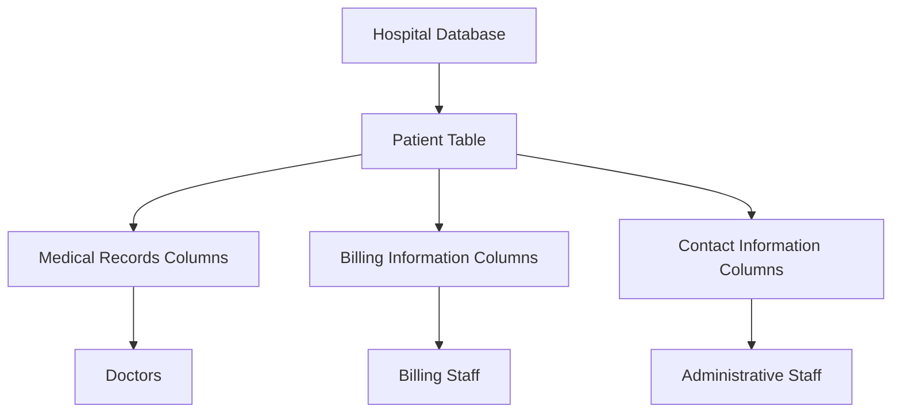

# SQL Column Level Security

## Introduction

Database security is a critical aspect of application development. While row-level security controls which rows a user can access, **column-level security** focuses on restricting access to specific columns within database tables. This more granular approach to data protection is essential when dealing with sensitive information like credit card numbers, social security numbers, or personal health information.

In this guide, we'll explore how column-level security works in SQL, why it's important, and how to implement it in your database systems. This security feature helps organizations comply with data privacy regulations while still allowing users to access the data they need.

## Why Column-Level Security Matters

Consider a hospital database containing patient information. While doctors need access to medical records, billing staff only need access to financial information, and administrative staff may only need basic contact details:



Without column-level security, you'd need to create separate tables for each user role or implement complex application-level filtering. Column-level security solves this problem by restricting which columns different users can view or modify directly at the database level.

## Basic Concepts

Column-level security can be implemented through several mechanisms:

1. **Views**: Creating filtered views that expose only certain columns
2. **Column Permissions**: Explicitly granting/revoking access to specific columns
3. **Dynamic Data Masking**: Showing redacted or masked data instead of actual values
4. **Row-Level Security with Column Restrictions**: Combining both security approaches

Let's explore each of these approaches with examples.

## Implementing Column-Level Security

### Method 1: Using Views

One of the simplest ways to implement column-level security is by creating views that contain only the columns a particular user or role should access.

#### Example: Creating Role-Based Views

Imagine we have a comprehensive `employees` table:

```sql
CREATE TABLE employees (
    employee_id INT PRIMARY KEY,
    first_name VARCHAR(50),
    last_name VARCHAR(50),
    email VARCHAR(100),
    phone VARCHAR(20),
    salary DECIMAL(10,2),
    ssn VARCHAR(11),
    hire_date DATE,
    department_id INT
);
```

We can create different views for different roles:

```sql
-- View for HR staff (can see all columns)
CREATE VIEW hr_employees AS
SELECT * FROM employees;

-- View for managers (no access to SSN)
CREATE VIEW manager_employees AS
SELECT employee_id, first_name, last_name, email, phone, 
       salary, hire_date, department_id
FROM employees;

-- View for general staff (limited information)
CREATE VIEW general_employees AS
SELECT employee_id, first_name, last_name, email, 
       department_id
FROM employees;
```

Then grant permissions on these views:

```sql
-- Grant permissions to roles
GRANT SELECT ON hr_employees TO hr_role;
GRANT SELECT ON manager_employees TO manager_role;
GRANT SELECT ON general_employees TO employee_role;

-- Revoke direct access to the base table
REVOKE SELECT ON employees FROM employee_role, manager_role;
```

Now users with different roles will see different columns from the same table.

### Method 2: Column-Level Permissions

Many modern database systems support granting permissions at the column level directly.

#### Example: Granting Column-Specific Permissions

```sql
-- Grant access to all columns except salary and ssn to analysts
GRANT SELECT (employee_id, first_name, last_name, email, phone, hire_date, department_id) 
ON employees TO analyst_role;

-- Grant update access only to specific columns
GRANT UPDATE (email, phone) ON employees TO employee_role;
```

This approach is more direct but requires careful management as databases grow.

### Method 3: Dynamic Data Masking

Dynamic data masking allows you to show masked or redacted versions of sensitive data to unauthorized users while maintaining the original data in the database.

#### Example: Implementing Data Masking (in SQL Server)

```sql
-- Create a table with masked columns
CREATE TABLE customers (
    customer_id INT PRIMARY KEY,
    first_name VARCHAR(50),
    last_name VARCHAR(50),
    email VARCHAR(100) MASKED WITH (FUNCTION = 'email()'),
    credit_card VARCHAR(19) MASKED WITH (FUNCTION = 'partial(0,"XXXX-XXXX-XXXX-",4)'),
    phone_number VARCHAR(20) MASKED WITH (FUNCTION = 'default()'),
    address VARCHAR(100)
);

-- Grant unmask permission to authorized users
GRANT UNMASK TO financial_analyst;
```

When a regular user queries the table, they'll see masked data:

**Input:**
```sql
SELECT * FROM customers;
```

**Output for regular user:**
```
customer_id | first_name | last_name |         email          |   credit_card    | phone_number |    address
------------|------------|-----------|------------------------|------------------|--------------|---------------
    1       |   John     |   Doe     | xxxx@xxxx.com          | XXXX-XXXX-XXXX-1234 | XXXXXXXXXXXX | 123 Main St
    2       |   Jane     |   Smith   | xxxx@xxxx.com          | XXXX-XXXX-XXXX-5678 | XXXXXXXXXXXX | 456 Oak Ave
```

**Output for financial analyst with UNMASK permission:**
```
customer_id | first_name | last_name |         email          |   credit_card    | phone_number |    address
------------|------------|-----------|------------------------|------------------|--------------|---------------
    1       |   John     |   Doe     | john.doe@example.com   | 4111-1111-1111-1234 | 555-123-4567 | 123 Main St
    2       |   Jane     |   Smith   | jane.smith@example.com | 4222-2222-2222-5678 | 555-987-6543 | 456 Oak Ave
```

### Method 4: Combining Row and Column Security

For advanced scenarios, you can combine row-level security with column-level security.

#### Example: Row and Column Security Together

```sql
-- Create a security policy function
CREATE FUNCTION fn_securitypredicate(@DepartmentId INT)
RETURNS TABLE
WITH SCHEMABINDING
AS
RETURN SELECT 1 AS result
WHERE @DepartmentId = DATABASE_PRINCIPAL_ID();

-- Apply row-level security
CREATE SECURITY POLICY EmployeeFilter
ADD FILTER PREDICATE dbo.fn_securitypredicate(department_id)
ON dbo.employees;

-- Apply column security through permissions
GRANT SELECT (employee_id, first_name, last_name, department_id) 
ON employees TO department_users;
```

This combination ensures users only see rows relevant to their department and only columns they are authorized to view.

## Real-World Applications

### Example 1: GDPR Compliance

The European Union's General Data Protection Regulation (GDPR) requires organizations to protect personal data. Column-level security can help achieve compliance:

```sql
-- Create a table with personal data
CREATE TABLE user_profiles (
    user_id INT PRIMARY KEY,
    username VARCHAR(50),
    email VARCHAR(100),
    date_of_birth DATE,
    address VARCHAR(200),
    credit_score INT,
    browsing_history TEXT
);

-- Create a view for marketing that masks sensitive data
CREATE VIEW marketing_user_data AS
SELECT user_id, username, 
       CONCAT(SUBSTRING(email, 1, 2), '***@', SUBSTRING_INDEX(email, '@', -1)) AS email,
       EXTRACT(YEAR FROM date_of_birth) AS birth_year,
       NULL AS address,
       NULL AS credit_score,
       browsing_history
FROM user_profiles;

-- Grant marketing team access only to the view
GRANT SELECT ON marketing_user_data TO marketing_role;
REVOKE ALL PRIVILEGES ON user_profiles FROM marketing_role;
```

### Example 2: Healthcare Data Protection

Healthcare providers must comply with regulations like HIPAA (Health Insurance Portability and Accountability Act):

```sql
-- Patient records table
CREATE TABLE patient_records (
    patient_id INT PRIMARY KEY,
    first_name VARCHAR(50),
    last_name VARCHAR(50),
    ssn VARCHAR(11),
    diagnosis VARCHAR(200),
    treatment VARCHAR(200),
    billing_information TEXT,
    insurance_details TEXT
);

-- View for doctors
CREATE VIEW doctor_patient_view AS
SELECT patient_id, first_name, last_name, diagnosis, treatment
FROM patient_records;

-- View for billing department
CREATE VIEW billing_patient_view AS
SELECT patient_id, first_name, last_name, billing_information, insurance_details
FROM patient_records;

-- Assign permissions
GRANT SELECT ON doctor_patient_view TO doctor_role;
GRANT SELECT ON billing_patient_view TO billing_role;
```

## Best Practices for Column-Level Security

1. **Principle of Least Privilege**: Grant users access only to the columns they absolutely need.
2. **Regular Auditing**: Periodically review who has access to which columns.
3. **Consistent Implementation**: Use the same security approach across similar tables.
4. **Documentation**: Keep clear records of your security policies and the reasoning behind them.
5. **Testing**: Regularly test that your security measures are working as expected.
6. **Layer Security**: Don't rely solely on column-level security; combine it with other security measures.

## Limitations and Considerations

While column-level security is powerful, it has some limitations:

1. **Performance Impact**: Complex security policies can affect query performance.
2. **Maintenance Overhead**: As your database grows, managing fine-grained permissions becomes more complex.
3. **Inference Attacks**: In some cases, users might infer sensitive data from non-sensitive columns.
4. **Database Support**: Not all database systems support all methods of column-level security.

## Summary

Column-level security provides a granular approach to protecting sensitive data in your database. By controlling which users can access specific columns, you can ensure that sensitive information is only visible to authorized personnel. Whether through views, explicit permissions, data masking, or a combination of techniques, implementing column-level security is a crucial step in building secure database applications.

The right approach depends on your specific requirements, the capabilities of your database system, and the sensitivity of your data. By following best practices and understanding the available options, you can implement effective column-level security that balances protection with usability.

## Additional Resources

- Database-specific documentation:
  - [MySQL Column Privileges](https://dev.mysql.com/doc/refman/8.0/en/privileges-provided.html#priv_select-column)
  - [PostgreSQL Column Privileges](https://www.postgresql.org/docs/current/ddl-priv.html)
  - [SQL Server Dynamic Data Masking](https://docs.microsoft.com/en-us/sql/relational-databases/security/dynamic-data-masking)
  - [Oracle Virtual Private Database](https://docs.oracle.com/en/database/oracle/oracle-database/19/dbseg/using-oracle-vpd-to-control-data-access.html)

## Exercises

1. **Basic Column Permissions**: Create a `customers` table with sensitive columns and practice granting different users access to different columns.

2. **View-Based Security**: Implement a security scheme using views for a `financial_transactions` table that has columns for different departments.

3. **Data Masking**: Set up dynamic data masking for a `employees` table with salary and personal contact information.

4. **Security Audit**: Write a query that shows which users have access to which columns in your database.

5. **Real-World Scenario**: Design a column-level security solution for a multi-tenant application where each tenant should see only their own data and administrators need different levels of access to system data.