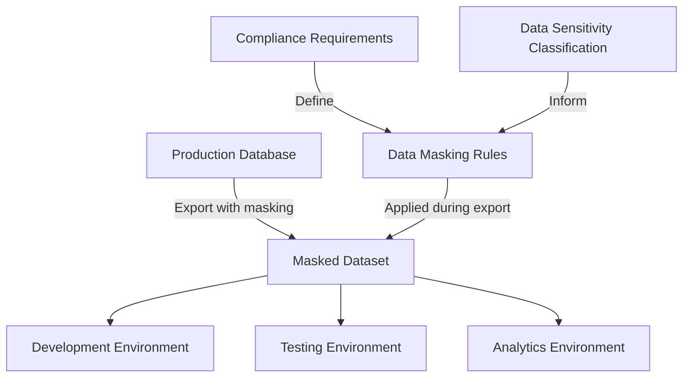

# SQL Data Masking

## Introduction

Data masking is a critical security technique used to protect sensitive information in databases while maintaining its usability for development, testing, and analytics. In today's data-driven world, organizations handle vast amounts of sensitive information like personal identifiers, credit card numbers, and health records. SQL data masking allows you to create realistic but inauthentic versions of your data that preserve its format and characteristics without exposing the actual sensitive values.

Think of data masking as putting a digital disguise on your sensitive information—it still looks and behaves like real data, but the actual sensitive values are hidden or replaced.

## Why Data Masking Matters

Before diving into how to implement data masking, let's understand why it's essential:

- **Regulatory Compliance**: Regulations like GDPR, HIPAA, and CCPA require protection of sensitive data
- **Development Safety**: Allows developers to work with realistic data without exposure to sensitive information
- **Testing Integrity**: Ensures testing environments use data that resembles production without security risks
- **Breach Mitigation**: Reduces the impact of potential data breaches by limiting sensitive data exposure

## Common Data Masking Techniques

Let's explore the most common techniques used in SQL data masking:

### 1. Substitution

Substitution replaces sensitive data with realistic but fictional values while maintaining the same format.

```sql
-- Original query exposing sensitive data
SELECT customer_name, credit_card_number FROM customers;

-- Masked query using substitution
SELECT 
    customer_name,
    CONCAT(
        SUBSTRING(credit_card_number, 1, 4),
        '-XXXX-XXXX-',
        SUBSTRING(credit_card_number, 13, 4)
    ) AS masked_credit_card
FROM customers;
```

**Result:**
```
customer_name    | masked_credit_card
-----------------+-------------------
John Smith       | 4532-XXXX-XXXX-9876
Maria Garcia     | 5678-XXXX-XXXX-1234
```

### 2. Shuffling

Shuffling rearranges the actual values within a column so that the data still looks realistic but doesn't correspond to the right records.

```sql
-- Creating a shuffled salary view
CREATE VIEW shuffled_employee_salaries AS
SELECT 
    e1.employee_id,
    e1.employee_name,
    e2.salary AS shuffled_salary
FROM 
    employees e1
JOIN 
    employees e2 ON e1.employee_id <> e2.employee_id
ORDER BY 
    NEWID(); -- Using NEWID() in SQL Server for randomization
```

### 3. Nulling Out

Simply replacing sensitive values with NULL when they're not needed.

```sql
-- Nulling out sensitive data for non-privileged users
CREATE VIEW safe_customer_view AS
SELECT
    customer_id,
    customer_name,
    CASE WHEN IS_MEMBER('DataAdmin') THEN date_of_birth ELSE NULL END AS date_of_birth,
    CASE WHEN IS_MEMBER('DataAdmin') THEN ssn ELSE NULL END AS ssn,
    email,
    phone
FROM
    customers;
```

### 4. Masking or Redaction

Partially hiding data with special characters while keeping some portions visible.

```sql
-- Masking email addresses to show only domain
SELECT
    user_id,
    CONCAT('****@', SUBSTRING(email, CHARINDEX('@', email) + 1, LEN(email))) AS masked_email
FROM
    users;

-- Masking phone numbers to show only last 4 digits
SELECT
    customer_id,
    CONCAT('(XXX) XXX-', RIGHT(phone_number, 4)) AS masked_phone
FROM
    customers;
```

**Result:**
```
user_id | masked_email
--------+---------------
1001    | ****@example.com
1002    | ****@gmail.com

customer_id | masked_phone
------------+--------------
5001        | (XXX) XXX-5678
5002        | (XXX) XXX-9012
```

### 5. Randomization

Replacing sensitive data with random values that still maintain the same format and data distribution.

```sql
-- Randomizing salaries within a realistic range
SELECT
    employee_id,
    employee_name,
    department,
    FLOOR(RAND() * (120000 - 50000) + 50000) AS randomized_salary
FROM
    employees;
```

## Implementing Data Masking in Different Database Systems

Different database systems provide built-in functions and tools for data masking. Let's look at a few examples:

### SQL Server Dynamic Data Masking

SQL Server offers built-in dynamic data masking that masks data at query time without altering the actual stored values.

```sql
-- Creating a table with masked columns in SQL Server
CREATE TABLE customers (
    customer_id INT PRIMARY KEY,
    first_name VARCHAR(50),
    last_name VARCHAR(50),
    email VARCHAR(100) MASKED WITH (FUNCTION = 'email()'),
    credit_card VARCHAR(19) MASKED WITH (FUNCTION = 'partial(0, "XXXX-XXXX-XXXX-", 4)'),
    ssn VARCHAR(11) MASKED WITH (FUNCTION = 'default()')
);

-- Granting permission to see unmasked data
GRANT UNMASK TO DatabaseAdmin;
```

### Oracle Data Redaction

Oracle Database provides data redaction policies to mask sensitive data.

```sql
-- Setting up a redaction policy in Oracle
BEGIN
  DBMS_REDACT.ADD_POLICY(
    object_schema => 'HR',
    object_name => 'EMPLOYEES',
    column_name => 'SALARY',
    policy_name => 'REDACT_SALARY',
    function_type => DBMS_REDACT.PARTIAL,
    function_parameters => '9,1,0',
    expression => 'SYS_CONTEXT(''USERENV'', ''SESSION_USER'') != ''HR_ADMIN'''
  );
END;
/
```

### PostgreSQL Data Masking with Views and Functions

PostgreSQL doesn't have built-in masking, but you can implement it using views and functions.

```sql
-- Creating a masking function in PostgreSQL
CREATE OR REPLACE FUNCTION mask_credit_card(cc TEXT)
RETURNS TEXT AS $$
BEGIN
  RETURN SUBSTRING(cc, 1, 4) || '-XXXX-XXXX-' || SUBSTRING(cc, 13, 4);
END;
$$ LANGUAGE plpgsql;

-- Creating a view with masked data
CREATE VIEW masked_customers AS
SELECT
  customer_id,
  customer_name,
  mask_credit_card(credit_card_number) AS credit_card,
  SUBSTRING(email, 1, 1) || '***' || SUBSTRING(email, POSITION('@' IN email)) AS email
FROM
  customers;
```

## Real-World Implementation Example

Let's walk through a complete example of implementing data masking for a healthcare database:

```sql
-- Original patient table with sensitive data
CREATE TABLE patients (
    patient_id INT PRIMARY KEY,
    first_name VARCHAR(50),
    last_name VARCHAR(50),
    dob DATE,
    ssn VARCHAR(11),
    address VARCHAR(200),
    phone VARCHAR(15),
    email VARCHAR(100),
    diagnosis VARCHAR(200),
    medication VARCHAR(200)
);

-- Creating a comprehensive masked view for development and testing
CREATE VIEW masked_patients AS
SELECT
    patient_id,
    -- Preserving first initial only
    UPPER(LEFT(first_name, 1)) + REPLICATE('x', LEN(first_name) - 1) AS first_name,
    -- Preserving last initial only
    UPPER(LEFT(last_name, 1)) + REPLICATE('x', LEN(last_name) - 1) AS last_name,
    -- Age instead of exact DOB
    DATEDIFF(YEAR, dob, GETDATE()) AS age,
    -- Masked SSN
    'XXX-XX-' + RIGHT(ssn, 4) AS ssn,
    -- Generic address
    'XXX Some Street, City, State ZIP' AS address,
    -- Masked phone
    '(XXX) XXX-' + RIGHT(phone, 4) AS phone,
    -- Masked email
    LEFT(email, 1) + 'xxx@' + SUBSTRING(email, CHARINDEX('@', email) + 1, LEN(email)) AS email,
    -- Keep diagnosis and medication for testing integrity
    diagnosis,
    medication
FROM
    patients;

-- Creating role-based access
CREATE ROLE Developers;
CREATE ROLE Analysts;
CREATE ROLE Administrators;

-- Grant permissions
GRANT SELECT ON masked_patients TO Developers;
GRANT SELECT ON masked_patients TO Analysts;
GRANT SELECT ON patients TO Administrators;
```

With this implementation:
- Developers see only masked data
- Analysts see only masked data
- Administrators have access to the original data

## Data Masking Workflow

Let's visualize how data masking fits into a typical development and testing workflow:



## Best Practices for SQL Data Masking

1. **Identify Sensitive Data**: Perform a thorough inventory to identify all sensitive data elements that require masking.

2. **Consistent Masking**: Apply consistent masking techniques across all environments for the same data types.

3. **Preserve Data Properties**: Ensure masked data maintains the same format, length, and distribution as the original data.

4. **Irreversibility**: Make sure masked data cannot be reverse-engineered to reveal the original values.

5. **Role-Based Access**: Implement different levels of masking based on user roles and permissions.

6. **Test Mask Effectiveness**: Regularly validate that your masking techniques effectively protect sensitive data.

7. **Document Masking Policies**: Maintain comprehensive documentation of all masking rules and policies.

8. **Automate the Process**: Use tools and scripts to automate masking when refreshing non-production environments.

## Challenges and Considerations

While implementing data masking, be aware of these common challenges:

- **Referential Integrity**: Masked data must maintain referential integrity across tables
- **Performance Impact**: Some masking techniques may impact query performance
- **Masking Consistency**: Ensuring the same value is consistently masked the same way across tables
- **Data Usability**: Balancing security with maintaining the usefulness of data for development and testing

## Summary

SQL data masking is an essential technique for protecting sensitive information while still allowing for realistic development, testing, and analytics. By implementing appropriate masking techniques—such as substitution, shuffling, redaction, or randomization—you can significantly reduce the risk of exposing sensitive data while maintaining its usability.

As regulations around data privacy continue to evolve, masking will become even more important for organizations handling sensitive information. By following the best practices outlined in this guide, you'll be well-equipped to implement effective data masking strategies that balance security requirements with practical needs.

## Exercises

1. Create a masking function that replaces all but the first and last characters of a name with asterisks.

2. Design a masking strategy for a table containing customer information including names, addresses, and credit card details.

3. Implement a view that masks sensitive employee data but preserves salary ranges for HR analytics.

4. Create a role-based masking solution where different user groups see different levels of masked data.

5. Research and compare the data masking capabilities of three different database systems.

## Additional Resources

- [SQL Server Dynamic Data Masking Documentation](https://docs.microsoft.com/en-us/sql/relational-databases/security/dynamic-data-masking)
- [Oracle Data Redaction Guide](https://docs.oracle.com/en/database/oracle/oracle-database/19/asoag/introduction-to-oracle-data-redaction.html)
- [PostgreSQL Row Security Policies](https://www.postgresql.org/docs/current/ddl-rowsecurity.html)
- [GDPR Data Masking Requirements](https://gdpr.eu/data-masking-anonymization/)
- [OWASP Security Testing Guide](https://owasp.org/www-project-web-security-testing-guide/)