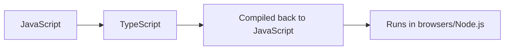

# TypeScript Introduction

## What is TypeScript?

<div style={{
    "width": "20%",
    "margin": "0 auto",
    "text-align": "center"
}}>
    
</div>

TypeScript is a free and open-source programming language developed and maintained by Microsoft. It is a superset of JavaScript, which means that any valid JavaScript code is also valid TypeScript code. However, TypeScript extends JavaScript by adding static typing and other features that make it easier to write robust, maintainable code for large-scale applications.



## Why Use TypeScript?

JavaScript was originally designed for small scripts in web pages, but it has evolved into a language used for building complex web and server applications. As applications grow in size and complexity, the dynamic typing of JavaScript can lead to bugs that are difficult to find and fix.

TypeScript addresses these issues by adding:

1. **Static typing**: Catch errors at compile time rather than runtime
2. **Better tooling**: Enhanced code completion, navigation, and refactoring
3. **Modern language features**: Use the latest JavaScript features with backward compatibility
4. **Improved readability**: Type annotations make code intentions clearer
5. **Better collaboration**: Types serve as documentation and contracts between team members

## Setting Up TypeScript

Let's start by setting up a simple TypeScript environment:

### Installation

To use TypeScript, you need to install it first. You can install it globally using npm (Node Package Manager):

```bash
npm install -g typescript
```

Or locally in your project:

```bash
npm install --save-dev typescript
```

### Creating Your First TypeScript File

Let's create a simple TypeScript file (`hello.ts`):

```typescript
function greet(name: string): string {
    return `Hello, ${name}!`;
}

const message = greet("TypeScript");
console.log(message);
```

Here, we've declared a function `greet` that takes a parameter `name` of type `string` and returns a `string`. We've also annotated the function's return type as `string`.

### Compiling TypeScript to JavaScript

TypeScript code cannot run directly in browsers or Node.js. It needs to be compiled (or "transpiled") to JavaScript first. Use the TypeScript compiler (`tsc`) to compile the file:

```bash
tsc hello.ts
```

This will generate a JavaScript file called `hello.js`:

```javascript
function greet(name) {
    return "Hello, " + name + "!";
}
var message = greet("TypeScript");
console.log(message);
```

Now you can run this JavaScript file:

```bash
node hello.js
```

Output:
```
Hello, TypeScript!
```

## TypeScript Configuration

For real projects, you'll want to configure TypeScript using a `tsconfig.json` file. Create one using:

```bash
tsc --init
```

This generates a configuration file with default settings and helpful comments. Here's a simplified version:

```json
{
  "compilerOptions": {
    "target": "es2016",
    "module": "commonjs",
    "strict": true,
    "esModuleInterop": true,
    "skipLibCheck": true,
    "forceConsistentCasingInFileNames": true,
    "outDir": "./dist"
  },
  "include": ["src/**/*"],
  "exclude": ["node_modules", "**/*.spec.ts"]
}
```

With this configuration, you can:
- Place your TypeScript files in a `src` directory
- Compile all files with a simple command: `tsc`
- Find the compiled JavaScript in the `dist` directory

## TypeScript Core Concepts

### Type Annotations

TypeScript allows you to specify types for variables, function parameters, and return values:

```typescript
// Variable type annotation
let age: number = 30;
let name: string = "John";
let isActive: boolean = true;

// Array type annotation
let numbers: number[] = [1, 2, 3, 4, 5];
let names: Array<string> = ["Alice", "Bob", "Charlie"];

// Function parameter and return type annotations
function add(a: number, b: number): number {
    return a + b;
}
```

### Type Inference

TypeScript is smart enough to infer types in many cases, so you don't always need to specify them:

```typescript
// TypeScript infers these types automatically
let age = 30;                 // number
let name = "John";            // string
let numbers = [1, 2, 3, 4, 5]; // number[]

// TypeScript infers the return type as number
function add(a: number, b: number) {
    return a + b;
}
```

### Basic Types

TypeScript includes the following basic types:

```typescript
// Primitive types
let isDone: boolean = false;
let decimal: number = 6;
let color: string = "blue";

// Special types
let notSure: any = 4;  // Can be anything
let unknown: unknown = 4;  // Similar to any but safer
let nothing: null = null;
let undefined: undefined = undefined;
let never: never;  // Never occurs

// Object type
let person: object = { name: "John", age: 30 };

// Void type (usually for functions that don't return a value)
function logMessage(message: string): void {
    console.log(message);
}
```

## Real-World Example: Simple Todo Application

Let's build a simple Todo application to demonstrate TypeScript in a realistic context:

```typescript
// Define a Todo interface
interface Todo {
    id: number;
    text: string;
    completed: boolean;
}

// Define a TodoList class
class TodoList {
    private todos: Todo[] = [];
    
    // Add a new todo
    addTodo(text: string): Todo {
        const todo: Todo = {
            id: Date.now(),
            text,
            completed: false
        };
        
        this.todos.push(todo);
        return todo;
    }
    
    // Toggle a todo's completed status
    toggleTodo(id: number): Todo | undefined {
        const todo = this.todos.find(todo => todo.id === id);
        
        if (todo) {
            todo.completed = !todo.completed;
            return todo;
        }
        
        return undefined;
    }
    
    // Remove a todo
    removeTodo(id: number): boolean {
        const initialLength = this.todos.length;
        this.todos = this.todos.filter(todo => todo.id !== id);
        
        return this.todos.length !== initialLength;
    }
    
    // Get all todos
    getTodos(): Todo[] {
        return [...this.todos];
    }
}

// Usage example
const todoList = new TodoList();

const todo1 = todoList.addTodo("Learn TypeScript");
const todo2 = todoList.addTodo("Build a project");

console.log("Initial todos:", todoList.getTodos());

todoList.toggleTodo(todo1.id);
console.log("After completing a todo:", todoList.getTodos());

todoList.removeTodo(todo2.id);
console.log("After removing a todo:", todoList.getTodos());
```

Output:
```
Initial todos: [
  { id: 1628762438123, text: 'Learn TypeScript', completed: false },
  { id: 1628762438124, text: 'Build a project', completed: false }
]
After completing a todo: [
  { id: 1628762438123, text: 'Learn TypeScript', completed: true },
  { id: 1628762438124, text: 'Build a project', completed: false }
]
After removing a todo: [
  { id: 1628762438123, text: 'Learn TypeScript', completed: true }
]
```

This example demonstrates several TypeScript features:
- Interfaces for defining object shapes (`Todo`)
- Classes with private fields and methods
- Type annotations for parameters and return values
- Union types (`Todo | undefined`)

## TypeScript with React (Optional)

TypeScript works particularly well with React. Here's a quick example of a React component using TypeScript:

```tsx
import React, { useState } from 'react';

// Define props interface
interface CounterProps {
  initialCount?: number;
  label: string;
}

// React functional component with TypeScript
const Counter: React.FC<CounterProps> = ({ initialCount = 0, label }) => {
  const [count, setCount] = useState<number>(initialCount);
  
  const increment = (): void => {
    setCount(prevCount => prevCount + 1);
  };
  
  const decrement = (): void => {
    setCount(prevCount => prevCount - 1);
  };
  
  return (
    <div>
      <h2>{label}</h2>
      <p>Count: {count}</p>
      <button onClick={increment}>Increment</button>
      <button onClick={decrement}>Decrement</button>
    </div>
  );
};

export default Counter;
```

## Summary

In this introduction to TypeScript, we've explored:

- What TypeScript is and why it's valuable for developers
- How to set up and configure TypeScript
- Core TypeScript concepts like type annotations, inference, and basic types
- A practical example with a Todo application
- A brief look at using TypeScript with React

TypeScript provides a robust type system that helps catch errors early in the development process. By adopting TypeScript, you can write more maintainable and reliable code, especially as your projects grow in size and complexity.

## Next Steps

To continue learning TypeScript:

1. Try converting a small JavaScript project to TypeScript
2. Explore more advanced TypeScript features like:
   - Interfaces and Type Aliases
   - Generics
   - Union and Intersection Types
   - Utility Types

## Exercises

1. Create a simple calculator class with methods for addition, subtraction, multiplication, and division, all properly typed.
2. Create a `User` interface and write functions to validate, create, and update users.
3. Convert a small JavaScript function or project that you've built to TypeScript.
4. Create a generic function that can work with arrays of different types.

## Additional Resources

- [TypeScript Official Documentation](https://www.typescriptlang.org/docs/)
- [TypeScript Playground](https://www.typescriptlang.org/play) - Try TypeScript in your browser
- [TypeScript Deep Dive](https://basarat.gitbook.io/typescript/) - A free online book

Happy coding with TypeScript!