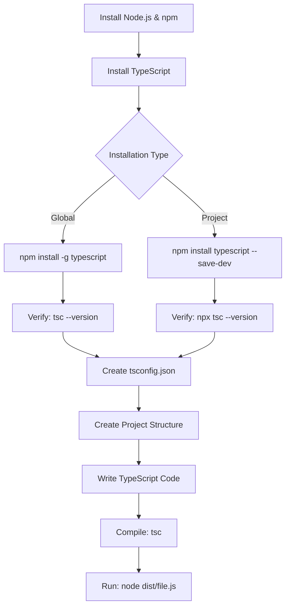

# TypeScript Installation

## Introduction

TypeScript is a powerful superset of JavaScript that adds static type checking and other features to help you write more robust and maintainable code. Before you can start using TypeScript, you need to set up your development environment. This guide will walk you through the process of installing TypeScript and configuring your first TypeScript project.

## Prerequisites

Before installing TypeScript, make sure you have the following prerequisites:

1. **Node.js and npm**: TypeScript is typically installed via npm (Node Package Manager), which comes bundled with Node.js.
2. **Code Editor**: A code editor like Visual Studio Code, which has excellent built-in TypeScript support.

## Installing Node.js and npm

If you don't have Node.js installed yet, follow these steps:

1. Visit the [official Node.js website](https://nodejs.org/)
2. Download and install the LTS (Long Term Support) version
3. Verify the installation by opening a terminal or command prompt and running:

```bash
node --version
npm --version
```

You should see version numbers displayed, confirming that both Node.js and npm are properly installed.

## Installing TypeScript

Once you have Node.js and npm installed, you can install TypeScript in one of two ways:

### Global Installation

Installing TypeScript globally allows you to use the TypeScript compiler (`tsc`) from any directory on your system:

```bash
npm install -g typescript
```

To verify the installation, run:

```bash
tsc --version
```

You should see the TypeScript version number, indicating that the installation was successful.

### Project-specific Installation

It's often better practice to install TypeScript locally in your project to ensure version consistency across your team:

```bash
# First, create a directory for your project
mkdir my-typescript-project
cd my-typescript-project

# Initialize a new npm project
npm init -y

# Install TypeScript as a development dependency
npm install typescript --save-dev
```

With a project-specific installation, you can run the TypeScript compiler using npx:

```bash
npx tsc --version
```

## Setting Up Your First TypeScript Project

Let's create a simple TypeScript project to verify everything is working correctly:

### 1. Create a tsconfig.json file

The `tsconfig.json` file specifies the root files and compiler options required to compile your TypeScript project. Create this file in your project root:

```bash
npx tsc --init
```

This generates a `tsconfig.json` with default settings and helpful comments. For beginners, the default settings work well, but you might want to make a few adjustments:

```json
{
  "compilerOptions": {
    "target": "es2016",
    "module": "commonjs",
    "outDir": "./dist",
    "rootDir": "./src",
    "strict": true,
    "esModuleInterop": true,
    "skipLibCheck": true,
    "forceConsistentCasingInFileNames": true
  }
}
```

This configuration tells TypeScript to:
- Compile to ES2016 JavaScript
- Use CommonJS modules
- Output compiled files to a `dist` directory
- Look for source files in the `src` directory
- Enable strict type checking

### 2. Create your project structure

Create the recommended directory structure:

```bash
mkdir src
```

### 3. Write your first TypeScript file

Create a file called `src/index.ts`:

```typescript
// src/index.ts
function greet(name: string): string {
  return `Hello, ${name}!`;
}

console.log(greet("TypeScript"));
```

### 4. Compile your TypeScript code

Run the TypeScript compiler:

```bash
npx tsc
```

This will compile your TypeScript code to JavaScript in the `dist` directory.

### 5. Run your compiled JavaScript

```bash
node dist/index.js
```

You should see the output: `Hello, TypeScript!`

## Setting Up a TypeScript Development Environment

For a smoother development experience, you might want to set up automatic compilation and reloading:

### Using ts-node for Direct Execution

`ts-node` allows you to run TypeScript files directly without a separate compilation step:

```bash
npm install --save-dev ts-node
```

You can now run your TypeScript files directly:

```bash
npx ts-node src/index.ts
```

### Setting Up nodemon for Automatic Recompilation

For development, it's helpful to have your code automatically recompile whenever you make changes:

```bash
npm install --save-dev nodemon
```

Add the following to your `package.json` file:

```json
"scripts": {
  "start": "node dist/index.js",
  "dev": "nodemon --watch 'src/**/*.ts' --exec 'ts-node' src/index.js",
  "build": "tsc"
}
```

Now you can run:

```bash
npm run dev
```

This will watch your source files and recompile them whenever they change.

## Integrating TypeScript with Your Code Editor

### Visual Studio Code

Visual Studio Code has excellent built-in TypeScript support:

1. Install the VS Code editor from [code.visualstudio.com](https://code.visualstudio.com/)
2. Open your project folder in VS Code
3. VS Code will automatically detect your `tsconfig.json` and provide:
   - Intellisense
   - Type checking
   - Refactoring tools
   - Error highlighting

### Other Editors

For other popular editors:

- **WebStorm/IntelliJ IDEA**: Has built-in TypeScript support
- **Sublime Text**: Install the TypeScript plugin
- **Atom**: Install the atom-typescript package

## Debugging TypeScript

To debug TypeScript code in VS Code:

1. Add the following configuration to `.vscode/launch.json`:

```json
{
  "version": "0.2.0",
  "configurations": [
    {
      "type": "node",
      "request": "launch",
      "name": "Debug TypeScript",
      "program": "${workspaceFolder}/src/index.ts",
      "preLaunchTask": "tsc: build - tsconfig.json",
      "outFiles": ["${workspaceFolder}/dist/**/*.js"]
    }
  ]
}
```

2. Set breakpoints in your code by clicking in the margin
3. Start debugging with F5 or the debug panel

## Real-world Project Example

Let's create a simple TypeScript application that fetches user data from an API:

1. First, install axios for making HTTP requests:

```bash
npm install axios
npm install @types/node --save-dev
```

2. Create a new file `src/users.ts`:

```typescript
import axios from 'axios';

interface User {
  id: number;
  name: string;
  email: string;
  website: string;
}

async function fetchUsers(): Promise<User[]> {
  try {
    const response = await axios.get('https://jsonplaceholder.typicode.com/users');
    return response.data as User[];
  } catch (error) {
    console.error('Error fetching users:', error);
    return [];
  }
}

async function displayUserInfo(): Promise<void> {
  const users = await fetchUsers();
  
  users.forEach(user => {
    console.log(`
      User ID: ${user.id}
      Name: ${user.name}
      Email: ${user.email}
      Website: ${user.website}
      ---------------------
    `);
  });
}

// Execute the function
displayUserInfo().catch(error => console.error(error));
```

3. Compile and run:

```bash
npx tsc
node dist/users.js
```

This example demonstrates:
- TypeScript interfaces for type safety
- Async/await with proper typing
- Error handling
- API interaction

## TypeScript Installation Process Overview



## Troubleshooting Common Installation Issues

### Command 'tsc' not found

If you get this error after installing TypeScript globally:

1. Check that npm's global bin directory is in your PATH
2. Try using `npx tsc` instead
3. Reinstall with `npm install -g typescript`

### Multiple TypeScript Versions

If you have both global and local TypeScript installations:

1. Use `npx tsc` to use the local version
2. Check versions with `tsc --version` and `npx tsc --version`

### Compilation Errors

If your TypeScript code doesn't compile:

1. Check the error messages carefully
2. Make sure your `tsconfig.json` settings are correct
3. Verify that your TypeScript version is compatible with your code

## Summary

In this guide, we've covered:

1. Installing Node.js and npm
2. Installing TypeScript globally or locally
3. Setting up a TypeScript project with tsconfig.json
4. Creating, compiling, and running TypeScript code
5. Setting up a development environment with ts-node and nodemon
6. Configuring VS Code for TypeScript development
7. Debugging TypeScript applications
8. Creating a real-world TypeScript example

TypeScript installation is just the first step in your TypeScript journey. With your environment properly set up, you're now ready to dive into learning the language itself.

## Additional Resources

- [TypeScript Official Documentation](https://www.typescriptlang.org/docs/)
- [TypeScript Playground](https://www.typescriptlang.org/play) - Try TypeScript in your browser
- [TypeScript Deep Dive](https://github.com/basarat/typescript-book) - A free online book

## Exercises

1. Create a new TypeScript project from scratch without copying code from this guide.
2. Modify the tsconfig.json to output ES2020 JavaScript instead of ES2016.
3. Create a TypeScript file that uses at least three different types and compile it.
4. Set up a project using both ts-node for development and regular tsc for production.
5. Write a small program that reads a JSON file using TypeScript's type system to validate the structure.