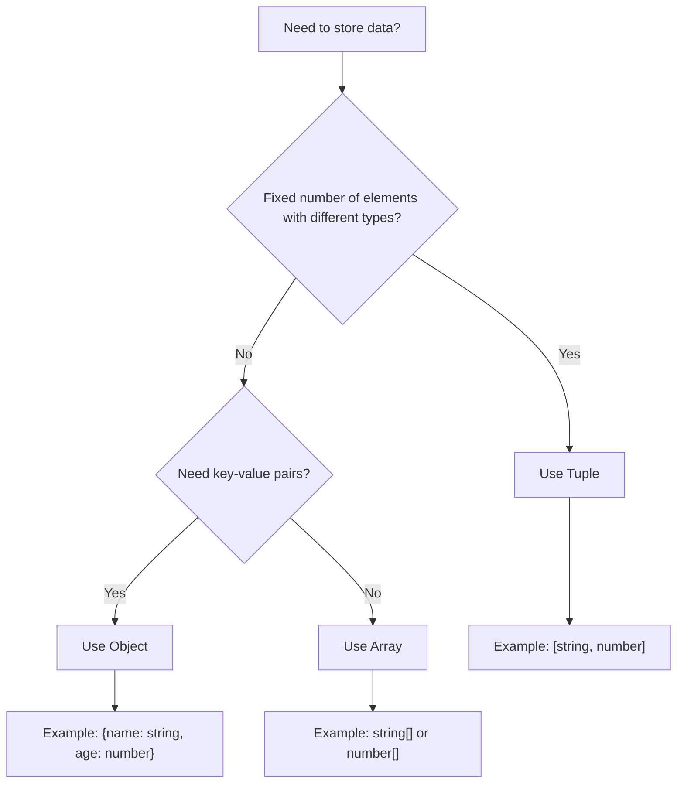

# TypeScript Tuples

## Introduction

In TypeScript, a tuple is a special type of array where the number of elements is fixed and the type of each element is known. Unlike regular arrays where all elements must be of the same type, tuples allow you to create arrays with elements of different types in a specific order.

Tuples are particularly useful when you want to represent a fixed collection of values where each position has a specific meaning. For instance, you might use a tuple to represent a pair of coordinates (x, y) or a person's details (name, age, isEmployed).

## Basic Tuple Types

### Declaring a Tuple

To declare a tuple in TypeScript, you specify the type of each element inside square brackets:

```typescript
// Declaring a tuple type
let coordinates: [number, number];
let nameAndAge: [string, number];
let rgbColor: [number, number, number];
```

### Initializing a Tuple

You can initialize a tuple by assigning values that match the types in the correct order:

```typescript
// Initialize a coordinate tuple
let coordinates: [number, number] = [10, 20];

// Initialize a person tuple with name and age
let person: [string, number] = ["John", 30];

// Initialize an RGB color tuple
let color: [number, number, number] = [255, 0, 0]; // Red
```

### Accessing Tuple Elements

You can access tuple elements using array indexing:

```typescript
let person: [string, number] = ["John", 30];

console.log(person[0]); // Output: "John"
console.log(person[1]); // Output: 30
```

## Type Safety with Tuples

TypeScript enforces type safety for tuples. This means:

1. You must provide values in the correct order
2. You can only assign values of the correct type to each position
3. You can only include the specified number of elements

Here's what happens when you break these rules:

```typescript
let person: [string, number] = ["John", 30];

// Error: Type 'number' is not assignable to type 'string'
person[0] = 42; 

// Error: Type 'string' is not assignable to type 'number'
person[1] = "thirty"; 

// Error: Tuple type '[string, number]' of length '2' has no element at index '2'
console.log(person[2]); 
```

## Optional Elements in Tuples

TypeScript 4.0 introduced optional elements in tuple types. You can mark an element as optional using the `?` operator:

```typescript
// A tuple with an optional third element
let nameAgeActive: [string, number, boolean?] = ["John", 30];

// This is also valid
nameAgeActive = ["Jane", 25, true];

// Check the length
console.log(nameAgeActive.length); // Can be 2 or 3
```

## Tuple with Rest Elements

You can use the rest operator (`...`) to allow a variable number of elements of a specific type at the end of a tuple:

```typescript
// A tuple with a string, a number, and any number of booleans
let tuple: [string, number, ...boolean[]];

tuple = ["hello", 42, true];
tuple = ["world", 50, true, false, true];
```

## Readonly Tuples

To prevent tuples from being modified after creation, you can use the `readonly` modifier:

```typescript
// Declare a readonly tuple
let point: readonly [number, number] = [10, 20];

// This will cause an error
// point[0] = 30; // Error: Cannot assign to '0' because it is a read-only property
```

## Destructuring Tuples

You can use array destructuring to extract values from tuples:

```typescript
let person: [string, number, boolean] = ["John", 30, true];

// Destructure the tuple
let [name, age, isEmployed] = person;

console.log(name);       // Output: "John"
console.log(age);        // Output: 30
console.log(isEmployed); // Output: true
```

## Named Tuples (Labels)

TypeScript allows you to give names to tuple elements for better code readability:

```typescript
// A tuple with named elements
let person: [name: string, age: number, isEmployed: boolean] = ["John", 30, true];

// The names are just for documentation
console.log(person[0]); // Still accessed by index
```

## Real-World Applications

### Example 1: Representing Coordinates

Tuples are great for representing coordinates in a 2D or 3D space:

```typescript
// 2D coordinates
function calculateDistance(point1: [number, number], point2: [number, number]): number {
  const dx = point2[0] - point1[0];
  const dy = point2[1] - point1[1];
  return Math.sqrt(dx * dx + dy * dy);
}

const home: [number, number] = [0, 0];
const office: [number, number] = [3, 4];

console.log(calculateDistance(home, office)); // Output: 5
```

### Example 2: Returning Multiple Values from a Function

Tuples provide a clean way to return multiple values from a function:

```typescript
// Function that returns both the minimum and maximum values of an array
function getMinMax(numbers: number[]): [number, number] {
  let min = Math.min(...numbers);
  let max = Math.max(...numbers);
  return [min, max];
}

const [min, max] = getMinMax([5, 12, 2, 9, 3]);
console.log(`Min: ${min}, Max: ${max}`); // Output: Min: 2, Max: 12
```

### Example 3: Parsing CSV Data

Tuples can help when working with structured data like CSV entries:

```typescript
type CSVRow = [string, number, boolean]; // name, age, isSubscribed

function parseCSVLine(line: string): CSVRow {
  const [name, ageStr, subscribedStr] = line.split(',');
  const age = parseInt(ageStr.trim());
  const isSubscribed = subscribedStr.trim().toLowerCase() === 'true';
  
  return [name.trim(), age, isSubscribed];
}

// Example usage
const csvLine = "Alice Smith, 28, true";
const [name, age, isSubscribed] = parseCSVLine(csvLine);

console.log(`${name} is ${age} years old and ${isSubscribed ? 'is' : 'is not'} subscribed.`);
// Output: Alice Smith is 28 years old and is subscribed.
```

### Example 4: State Management in React

Tuples can be useful in React when using the `useState` hook with multiple related values:

```typescript
// In a React component with TypeScript
type FormState = [string, string, boolean]; // username, email, isValid

function useFormState(initialState: FormState) {
  const [formState, setFormState] = React.useState<FormState>(initialState);
  
  const updateUsername = (username: string) => {
    const [_, email, isValid] = formState;
    setFormState([username, email, isValid]);
  };
  
  const updateEmail = (email: string) => {
    const [username, _, isValid] = formState;
    setFormState([username, email, isValid]);
  };
  
  const validateForm = () => {
    const [username, email, _] = formState;
    const isValid = username.length > 0 && email.includes('@');
    setFormState([username, email, isValid]);
  };
  
  return { formState, updateUsername, updateEmail, validateForm };
}

// Usage in component
// const { formState, updateUsername, updateEmail, validateForm } = useFormState(["", "", false]);
```

## Comparing Tuples vs Arrays vs Objects

Let's understand when to use each data structure:



### When to Use Tuples

- When you have a fixed collection of values where each position has a specific meaning
- When different elements can have different types
- When you want to return multiple values from a function
- When the order of elements matters

### When to Use Arrays

- When you have a collection of values of the same type
- When the number of elements might change
- When you need array methods (map, filter, etc.)

### When to Use Objects

- When you need named properties
- When you have a complex structure with nested data
- When you need to look up values by key rather than position

## Summary

Tuples in TypeScript provide a powerful way to work with fixed-length arrays where each element has a specific type. They offer strong type checking while allowing you to mix different types in a single collection.

Key points to remember about tuples:

- Tuples have a fixed number of elements with pre-defined types
- The order of types in a tuple definition matters
- Tuples provide compile-time type checking
- Tuples can have optional elements with the `?` operator
- You can use the spread operator (`...`) for variable-length tuples
- Tuples can be made readonly for immutability
- Named tuple elements enhance code readability but don't affect how you access the data

## Exercises

1. Create a tuple type for representing RGB colors with an optional alpha channel
2. Write a function that swaps the values of a tuple with two elements
3. Create a function that converts a tuple of `[string, string, number]` to an object with appropriate properties
4. Implement a function that takes an array of numbers and returns a tuple containing the sum, average, minimum, and maximum values
5. Create a readonly tuple type for representing a point in 3D space and write a function to calculate the distance between two points

## Additional Resources

- [TypeScript Handbook: Tuples](https://www.typescriptlang.org/docs/handbook/2/objects.html#tuple-types)
- [TypeScript Release: Labeled Tuple Elements](https://devblogs.microsoft.com/typescript/announcing-typescript-4-0/#labeled-tuple-elements)
- [TypeScript Release: Variadic Tuple Types](https://devblogs.microsoft.com/typescript/announcing-typescript-4-0/#variadic-tuple-types)