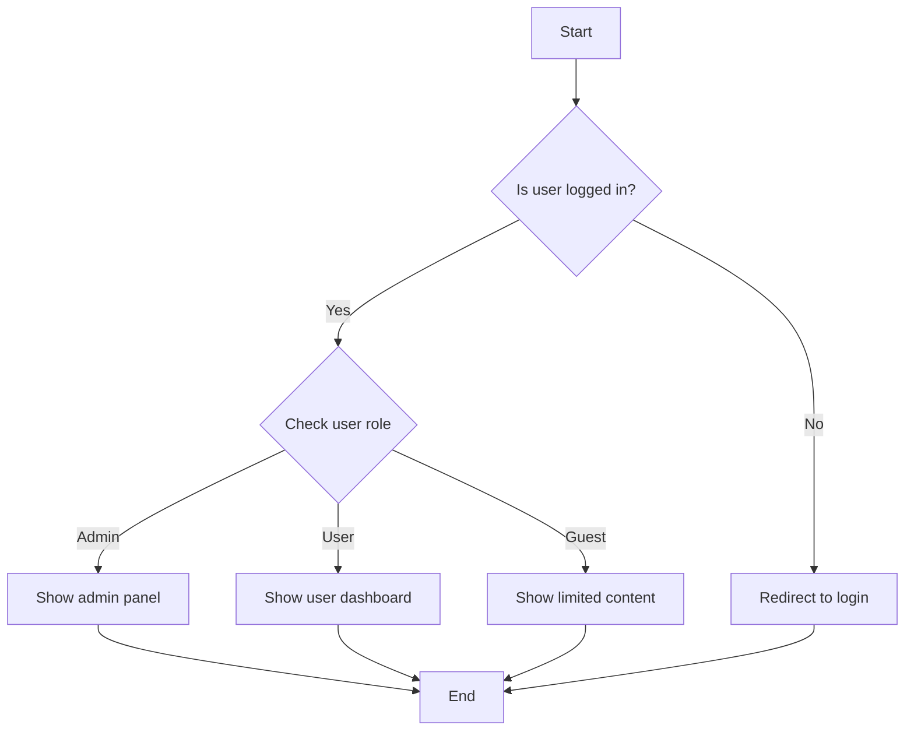

# TypeScript Control Flow

Control flow is the order in which individual statements, instructions, or function calls are executed in a program. TypeScript, being a superset of JavaScript, inherits all of JavaScript's control flow structures while adding type safety. Understanding control flow is essential for writing efficient and logical programs.

## Introduction to Control Flow

Control flow determines how a program runs based on certain conditions, allowing you to create dynamic and responsive applications. TypeScript enhances JavaScript's control flow with type checking, helping catch errors before runtime.

In this guide, we'll explore:

- Conditional statements (if/else, switch)
- Loops (for, while, do-while)
- Control flow with type guards
- Error handling
- Advanced pattern matching techniques

## Conditional Statements

### If-Else Statements

The most basic form of control flow is the `if` statement, which executes a block of code if a specified condition is true.

```typescript
function checkAge(age: number): string {
  if (age >= 18) {
    return "You are an adult";
  } else {
    return "You are a minor";
  }
}

// Example usage
const result1 = checkAge(20); // "You are an adult"
const result2 = checkAge(16); // "You are a minor"
```

You can chain multiple conditions using `else if`:

```typescript
function getLetterGrade(score: number): string {
  if (score >= 90) {
    return "A";
  } else if (score >= 80) {
    return "B";
  } else if (score >= 70) {
    return "C";
  } else if (score >= 60) {
    return "D";
  } else {
    return "F";
  }
}

// Example usage
console.log(getLetterGrade(95)); // "A"
console.log(getLetterGrade(82)); // "B"
console.log(getLetterGrade(45)); // "F"
```

### Ternary Operator

For simple if-else conditions, you can use the ternary operator for more concise code:

```typescript
function isEven(num: number): string {
  return num % 2 === 0 ? "Even" : "Odd";
}

console.log(isEven(4)); // "Even"
console.log(isEven(7)); // "Odd"
```

### Switch Statements

For multiple conditions checking the same variable, the `switch` statement provides a cleaner syntax:

```typescript
function getDayName(dayNumber: number): string {
  switch (dayNumber) {
    case 0:
      return "Sunday";
    case 1:
      return "Monday";
    case 2:
      return "Tuesday";
    case 3:
      return "Wednesday";
    case 4:
      return "Thursday";
    case 5:
      return "Friday";
    case 6:
      return "Saturday";
    default:
      return "Invalid day number";
  }
}

console.log(getDayName(1)); // "Monday"
console.log(getDayName(9)); // "Invalid day number"
```

## Loops

### For Loops

The traditional `for` loop is used when you need to iterate a specific number of times:

```typescript
function sumNumbers(n: number): number {
  let sum = 0;
  for (let i = 1; i <= n; i++) {
    sum += i;
  }
  return sum;
}

console.log(sumNumbers(5)); // 15 (1+2+3+4+5)
```

### For...of Loops

For iterating over arrays or other iterable objects:

```typescript
function listFruits(fruits: string[]): void {
  for (const fruit of fruits) {
    console.log(`I like ${fruit}`);
  }
}

listFruits(["apple", "banana", "orange"]);
// Output:
// I like apple
// I like banana
// I like orange
```

### For...in Loops

For iterating over object properties:

```typescript
function displayPersonInfo(person: {[key: string]: any}): void {
  for (const key in person) {
    console.log(`${key}: ${person[key]}`);
  }
}

const john = {
  name: "John",
  age: 30,
  occupation: "Developer"
};

displayPersonInfo(john);
// Output:
// name: John
// age: 30
// occupation: Developer
```

### While Loops

Execute code as long as a condition is true:

```typescript
function countDown(start: number): number[] {
  const result: number[] = [];
  let current = start;
  
  while (current > 0) {
    result.push(current);
    current--;
  }
  
  return result;
}

console.log(countDown(5)); // [5, 4, 3, 2, 1]
```

### Do-While Loops

Similar to while loops but guarantees at least one execution:

```typescript
function promptUntilValid(): void {
  let input: string;
  
  do {
    input = prompt("Please enter a number greater than 10") || "";
  } while (parseInt(input) <= 10);
  
  console.log("Valid input received:", input);
}

// This will keep prompting until the user enters a number > 10
```

## Type Guards and Control Flow

TypeScript's type system works seamlessly with control flow to provide stronger type safety.

### Type Guards

Type guards help narrow down types within conditional blocks:

```typescript
function processValue(value: string | number): string {
  if (typeof value === "string") {
    // TypeScript knows value is a string here
    return value.toUpperCase();
  } else {
    // TypeScript knows value is a number here
    return value.toFixed(2);
  }
}

console.log(processValue("hello")); // "HELLO"
console.log(processValue(42.123)); // "42.12"
```

### The `in` Operator

The `in` operator checks if a property exists on an object:

```typescript
type Fish = { swim: () => void };
type Bird = { fly: () => void };

function move(animal: Fish | Bird): void {
  if ("swim" in animal) {
    // TypeScript knows animal is Fish
    animal.swim();
  } else {
    // TypeScript knows animal is Bird
    animal.fly();
  }
}

const fish: Fish = { swim: () => console.log("Swimming...") };
const bird: Bird = { fly: () => console.log("Flying...") };

move(fish); // "Swimming..."
move(bird); // "Flying..."
```

### instanceof Checks

For class instances:

```typescript
class Car {
  drive() { console.log("Driving a car"); }
}

class Motorcycle {
  ride() { console.log("Riding a motorcycle"); }
}

function useVehicle(vehicle: Car | Motorcycle): void {
  if (vehicle instanceof Car) {
    vehicle.drive();
  } else {
    vehicle.ride();
  }
}

useVehicle(new Car()); // "Driving a car"
useVehicle(new Motorcycle()); // "Riding a motorcycle"
```

## Error Handling

### Try-Catch Blocks

Use `try-catch` to handle potential errors:

```typescript
function divide(a: number, b: number): number {
  try {
    if (b === 0) {
      throw new Error("Cannot divide by zero");
    }
    return a / b;
  } catch (error) {
    console.error("An error occurred:", error.message);
    return Infinity; // Return a fallback value
  } finally {
    console.log("Division operation attempted");
  }
}

console.log(divide(10, 2)); // 5
console.log(divide(10, 0)); // Infinity (with error message in console)
```

## Real-World Examples

### User Authentication Flow

```typescript
interface User {
  id: number;
  username: string;
  role: "admin" | "user" | "guest";
}

function handleUserAccess(user: User | null, requestedResource: string): string {
  // First check if user exists (authentication)
  if (!user) {
    return "Please log in to access this resource";
  }

  // Then check authorization based on role
  switch (user.role) {
    case "admin":
      return `Access granted to ${requestedResource}`;
    
    case "user":
      if (requestedResource.startsWith("public") || requestedResource.startsWith("user")) {
        return `Access granted to ${requestedResource}`;
      }
      return "Access denied: insufficient permissions";
    
    case "guest":
      if (requestedResource.startsWith("public")) {
        return `Access granted to ${requestedResource}`;
      }
      return "Access denied: guests can only access public resources";
      
    default:
      return "Unknown role";
  }
}

// Example usage
const adminUser: User = { id: 1, username: "admin1", role: "admin" };
const regularUser: User = { id: 2, username: "user1", role: "user" };
const guestUser: User = { id: 3, username: "guest1", role: "guest" };
const noUser = null;

console.log(handleUserAccess(adminUser, "admin/dashboard")); // Access granted
console.log(handleUserAccess(regularUser, "user/profile")); // Access granted
console.log(handleUserAccess(regularUser, "admin/settings")); // Access denied
console.log(handleUserAccess(guestUser, "public/docs")); // Access granted
console.log(handleUserAccess(noUser, "user/profile")); // Please log in
```

### Form Validation

```typescript
interface FormData {
  username?: string;
  email?: string;
  password?: string;
  age?: number;
}

function validateForm(form: FormData): string[] {
  const errors: string[] = [];

  // Check required fields
  if (!form.username) {
    errors.push("Username is required");
  } else if (form.username.length < 3) {
    errors.push("Username must be at least 3 characters");
  }

  if (!form.email) {
    errors.push("Email is required");
  } else if (!form.email.includes('@')) {
    errors.push("Email must be valid");
  }

  if (!form.password) {
    errors.push("Password is required");
  } else {
    // Complex password validation
    const hasUpperCase = /[A-Z]/.test(form.password);
    const hasNumber = /[0-9]/.test(form.password);
    const isLongEnough = form.password.length >= 8;
    
    if (!hasUpperCase || !hasNumber || !isLongEnough) {
      errors.push("Password must have at least 8 characters, include a number and uppercase letter");
    }
  }

  if (form.age !== undefined) {
    if (form.age < 18) {
      errors.push("Must be at least 18 years old");
    } else if (form.age > 120) {
      errors.push("Please enter a valid age");
    }
  }

  return errors;
}

// Example usage
const validForm: FormData = {
  username: "johndoe",
  email: "john@example.com",
  password: "Password123",
  age: 30
};

const invalidForm: FormData = {
  username: "jo",
  email: "not-an-email",
  password: "password",
  age: 15
};

console.log(validateForm(validForm)); // []
console.log(validateForm(invalidForm));
// [
//   "Username must be at least 3 characters",
//   "Email must be valid",
//   "Password must have at least 8 characters, include a number and uppercase letter",
//   "Must be at least 18 years old"
// ]
```

## Control Flow Visualization

Here's a simple visualization of a control flow decision tree:



## Summary

TypeScript's control flow mechanisms are powerful tools for directing program execution. In this guide, we've explored:

- Conditional statements (`if/else`, `switch`) for decision-making
- Various loop types for repeated operations
- Type guards for type-safe code branches
- Error handling for robust applications
- Real-world examples showing practical applications

Understanding control flow is fundamental to writing efficient, logical, and maintainable TypeScript code. With TypeScript's added type checking, your control flow will not only be more predictable but also safer.

## Additional Resources and Exercises

### Exercises

1. **FizzBuzz Implementation**: Write a TypeScript function that prints numbers from 1 to n. For multiples of 3, print "Fizz" instead of the number. For multiples of 5, print "Buzz". For numbers which are multiples of both 3 and 5, print "FizzBuzz".

2. **Shopping Cart Discount Calculator**: Create a function that calculates discounts for a shopping cart based on multiple conditions (total amount, user type, coupon codes, etc.).

3. **Type-Narrowing Practice**: Create a function that accepts different types of inputs and performs different operations based on the input type, using type guards.

### Advanced Topics to Explore

- Discriminated unions for more complex type safety
- Control flow analysis in TypeScript
- Exhaustiveness checking with the `never` type

### Resources

- [TypeScript Handbook: Narrowing](https://www.typescriptlang.org/docs/handbook/2/narrowing.html)
- [TypeScript Handbook: Everyday Types](https://www.typescriptlang.org/docs/handbook/2/everyday-types.html)
- [JavaScript MDN: Control flow and error handling](https://developer.mozilla.org/en-US/docs/Web/JavaScript/Guide/Control_flow_and_error_handling)

Happy coding with TypeScript!