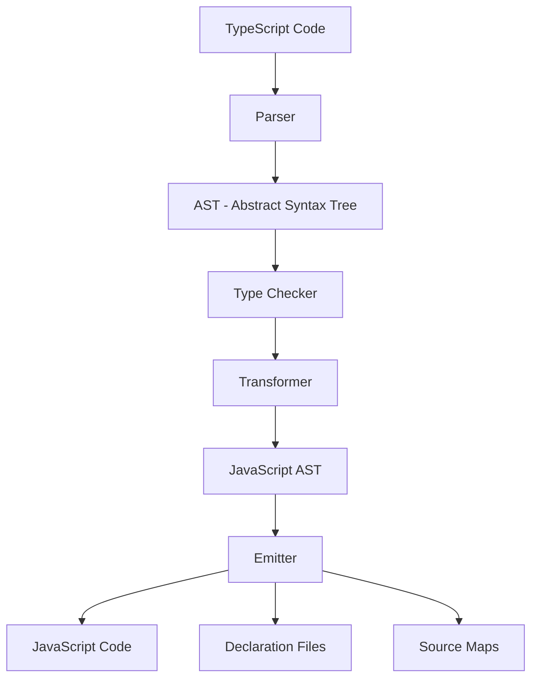

# TypeScript Compiler

## Introduction

The TypeScript compiler (often referred to as `tsc`) is the core tool that transforms your TypeScript code into JavaScript that can run in browsers and Node.js environments. Understanding how the compiler works and how to configure it is essential for effective TypeScript development.

In this guide, you'll learn:
- What the TypeScript compiler does
- How to use the compiler with the command line
- How to configure the compiler with `tsconfig.json`
- Common compiler options and their use cases
- Optimization techniques for your build process

## What is the TypeScript Compiler?

TypeScript is a superset of JavaScript that adds static typing. However, browsers and Node.js can't execute TypeScript code directly—this is where the TypeScript compiler comes in.

The compiler:
1. Checks your code for type errors
2. Transpiles TypeScript code to JavaScript
3. Applies transformations based on your target environment
4. Generates source maps (optionally)
5. Can bundle modules together (in certain configurations)

## Installing the TypeScript Compiler

Before you can use the compiler, you need to install TypeScript:

```bash
# Install TypeScript globally
npm install -g typescript

# Or as a dev dependency in your project
npm install --save-dev typescript
```

After installation, you can verify it's working by checking the version:

```bash
tsc --version
```

## Basic Usage

Let's start with a simple TypeScript file named `hello.ts`:

```typescript
// hello.ts
function greet(name: string): string {
  return `Hello, ${name}!`;
}

const user = "TypeScript Developer";
console.log(greet(user));
```

To compile this file, run:

```bash
tsc hello.ts
```

This will create a `hello.js` file:

```javascript
// hello.js (output)
function greet(name) {
    return "Hello, " + name + "!";
}
var user = "TypeScript Developer";
console.log(greet(user));
```

As you can see, the TypeScript compiler:
- Removed the type annotations (`name: string` and `: string`)
- Converted template literals to string concatenation (depending on your target)
- Changed `const` to `var` (if targeting older JavaScript versions)

## The TypeScript Configuration File (tsconfig.json)

For real projects, you'll want to configure the compiler using a `tsconfig.json` file. This allows you to specify compiler options for your project.

Create a `tsconfig.json` file in your project root:

```json
{
  "compilerOptions": {
    "target": "es2020",
    "module": "commonjs",
    "outDir": "./dist",
    "rootDir": "./src",
    "strict": true,
    "esModuleInterop": true,
    "skipLibCheck": true,
    "forceConsistentCasingInFileNames": true
  },
  "include": ["src/**/*"],
  "exclude": ["node_modules", "**/*.test.ts"]
}
```

With this configuration, you can compile all files in your project by running:

```bash
tsc
```

## Key Compiler Options Explained

Let's examine some of the most important compiler options:

### Target

The `target` option specifies which ECMAScript version your code should be transpiled to:

```json
"target": "es2020"
```

Common values include:
- `es5` - Compatible with older browsers
- `es6`/`es2015` - Modern features with broad support
- `es2020` - Recent features
- `esnext` - Latest features

### Module

The `module` option determines what kind of module code the compiler will generate:

```json
"module": "commonjs"
```

Common values:
- `commonjs` - For Node.js environments
- `es2015`, `esnext` - For modern browsers and bundlers
- `amd` - For older module loaders like RequireJS
- `umd` - Universal Module Definition

### Strict Type Checking

The `strict` option enables a set of strict type-checking options:

```json
"strict": true
```

This is a shorthand that enables multiple flags:
- `noImplicitAny`
- `strictNullChecks`
- `strictFunctionTypes`
- `strictBindCallApply`
- `strictPropertyInitialization`
- `noImplicitThis`
- `alwaysStrict`

### Output Directories

Control where your compiled JavaScript files go:

```json
"outDir": "./dist",
"rootDir": "./src"
```

This setup compiles files from the `src` directory and puts them in the `dist` directory, preserving the file structure.

## Watch Mode

During development, you can use "watch mode" to automatically recompile when files change:

```bash
tsc --watch
```

Or in your `tsconfig.json`:

```json
{
  "compilerOptions": {
    // other options...
    "watch": true
  }
}
```

## Real-World Example: Project Structure

Let's look at how to set up a simple Node.js project using TypeScript:

```
my-ts-project/
├── src/
│   ├── index.ts
│   ├── models/
│   │   └── User.ts
│   └── utils/
│       └── validation.ts
├── dist/
├── package.json
├── tsconfig.json
└── node_modules/
```

Our `tsconfig.json`:

```json
{
  "compilerOptions": {
    "target": "es2018",
    "module": "commonjs",
    "outDir": "./dist",
    "rootDir": "./src",
    "strict": true,
    "esModuleInterop": true,
    "skipLibCheck": true,
    "declaration": true,
    "sourceMap": true
  },
  "include": ["src/**/*"]
}
```

Our source files:

```typescript
// src/models/User.ts
export interface User {
  id: number;
  name: string;
  email: string;
  isActive: boolean;
}
```

```typescript
// src/utils/validation.ts
export function isValidEmail(email: string): boolean {
  const emailRegex = /^[^\s@]+@[^\s@]+\.[^\s@]+$/;
  return emailRegex.test(email);
}
```

```typescript
// src/index.ts
import { User } from './models/User';
import { isValidEmail } from './utils/validation';

function registerUser(userData: Omit<User, 'id' | 'isActive'>): User | null {
  if (!isValidEmail(userData.email)) {
    console.error('Invalid email address');
    return null;
  }
  
  // In real app, would generate ID and save to database
  const newUser: User = {
    id: Date.now(),
    name: userData.name,
    email: userData.email,
    isActive: true
  };
  
  console.log('User registered:', newUser);
  return newUser;
}

// Usage
registerUser({
  name: 'John Doe',
  email: 'john.doe@example.com'
});
```

To compile this project:

```bash
tsc
```

After compilation, you'll have a `dist` folder with the JavaScript equivalent of your TypeScript files, preserving the directory structure.

## Compiler API

For advanced use cases, TypeScript provides a programmatic API that lets you integrate the compiler into your own tools:

```typescript
import * as ts from 'typescript';

// Read and parse config
const configPath = ts.findConfigFile(process.cwd(), ts.sys.fileExists, 'tsconfig.json');
const configFile = ts.readConfigFile(configPath, ts.sys.readFile);
const parsedConfig = ts.parseJsonConfigFileContent(configFile.config, ts.sys, process.cwd());

// Create program
const program = ts.createProgram(parsedConfig.fileNames, parsedConfig.options);

// Get diagnostics
const diagnostics = ts.getPreEmitDiagnostics(program);

// Print errors
diagnostics.forEach(diagnostic => {
  if (diagnostic.file) {
    const { line, character } = ts.getLineAndCharacterOfPosition(diagnostic.file, diagnostic.start);
    const message = ts.flattenDiagnosticMessageText(diagnostic.messageText, '\n');
    console.log(`${diagnostic.file.fileName} (${line + 1},${character + 1}): ${message}`);
  } else {
    console.log(ts.flattenDiagnosticMessageText(diagnostic.messageText, '\n'));
  }
});

// Emit output
program.emit();
```

## TypeScript Compilation Process Visualized

Here's a visual representation of the TypeScript compilation process:



## Optimizing Compilation

Here are some tips to optimize your TypeScript compilation process:

### 1. Incremental Builds

Enable incremental compilation to speed up subsequent builds:

```json
{
  "compilerOptions": {
    "incremental": true,
    "tsBuildInfoFile": "./buildcache/tsbuildinfo"
  }
}
```

### 2. Project References

For larger projects, you can use project references to break up your codebase:

```json
{
  "references": [
    { "path": "./tsconfig.shared.json" },
    { "path": "./tsconfig.server.json" }
  ]
}
```

### 3. Skip Type Checking for Libraries

Use `skipLibCheck` to avoid type checking node_modules:

```json
{
  "compilerOptions": {
    "skipLibCheck": true
  }
}
```

## Summary

The TypeScript compiler is a powerful tool that:
- Converts TypeScript code to JavaScript
- Performs static type checking
- Enables modern JavaScript features in older environments
- Can be configured extensively for different project needs

Understanding the compiler and its options allows you to:
- Control exactly how your code is transformed
- Target specific JavaScript environments
- Set up different build configurations for development and production
- Create a better developer experience with useful errors and warnings

By mastering the TypeScript compiler, you've taken a significant step toward becoming a proficient TypeScript developer.

## Additional Resources

Here are some resources to deepen your understanding:

- The [official TypeScript Compiler Options documentation](https://www.typescriptlang.org/tsconfig)
- The [TypeScript handbook](https://www.typescriptlang.org/docs/handbook/intro.html)
- [Advanced Types in TypeScript](https://www.typescriptlang.org/docs/handbook/advanced-types.html)

## Exercises

1. Create a `tsconfig.json` file that targets ES5 for older browser compatibility while using modern TypeScript features.
2. Set up a project with separate tsconfig files for frontend and backend code.
3. Configure the TypeScript compiler to generate declaration files for your library.
4. Use the `--noEmitOnError` flag to prevent compilation when there are type errors.
5. Experiment with the `--project` flag to compile a specific project.