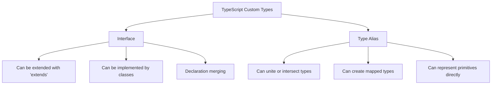

# TypeScript Interfaces

TypeScript interfaces are a powerful way to define contracts within your code and to provide explicit naming of types. They help enforce structure in your codebase and make your code more maintainable and scalable.

## What Are Interfaces?

In TypeScript, an interface is a way to define the shape of an object. It acts as a contract that ensures specific properties and methods exist on an object, with the correct types and signatures. Unlike traditional object-oriented languages, TypeScript interfaces are purely for type checking during development and don't exist at runtime after compilation to JavaScript.

Let's start with a basic interface:

```typescript
interface Person {
  firstName: string;
  lastName: string;
  age: number;
}
```

This interface states that any object of type `Person` must have three properties: `firstName` and `lastName` (both strings), and `age` (a number).

## Using Interfaces

Once you've defined an interface, you can use it to type check your objects:

```typescript
// Creating an object that adheres to the Person interface
const john: Person = {
  firstName: "John",
  lastName: "Doe",
  age: 30
};

// This will cause a compile-time error because 'age' is missing
const invalidPerson: Person = {
  firstName: "Jane",
  lastName: "Doe"
  // Error: Property 'age' is missing in type '{ firstName: string; lastName: string; }' but required in type 'Person'.
};

// This will also cause an error because 'age' is of the wrong type
const anotherInvalidPerson: Person = {
  firstName: "Bob",
  lastName: "Smith",
  age: "thirty" // Error: Type 'string' is not assignable to type 'number'.
};
```

## Optional Properties

Sometimes you might want certain properties to be optional. You can use the `?` syntax to achieve this:

```typescript
interface Contact {
  name: string;
  email: string;
  phone?: string; // Optional property
  address?: string; // Optional property
}

// Both of these are valid Contact objects
const contact1: Contact = {
  name: "Alice",
  email: "alice@example.com"
};

const contact2: Contact = {
  name: "Bob",
  email: "bob@example.com",
  phone: "123-456-7890",
  address: "123 Main St"
};
```

## Readonly Properties

If you want to make sure properties can't be modified after object creation, you can use the `readonly` modifier:

```typescript
interface Config {
  readonly apiKey: string;
  readonly apiEndpoint: string;
  debugMode: boolean; // This can be changed
}

const appConfig: Config = {
  apiKey: "abc123",
  apiEndpoint: "https://api.example.com",
  debugMode: false
};

// This is allowed
appConfig.debugMode = true;

// This will cause an error
// appConfig.apiKey = "xyz789"; 
// Error: Cannot assign to 'apiKey' because it is a read-only property.
```

## Function Types in Interfaces

Interfaces can also describe the shape of functions:

```typescript
interface MathFunction {
  (x: number, y: number): number;
}

// Function implementing the interface
const add: MathFunction = function(x: number, y: number): number {
  return x + y;
};

const subtract: MathFunction = (x, y) => x - y; // Type inference works here

console.log(add(5, 3)); // Output: 8
console.log(subtract(10, 4)); // Output: 6
```

## Method Signatures in Interfaces

You can define methods in interfaces as well:

```typescript
interface Vehicle {
  make: string;
  model: string;
  year: number;
  start(): void;
  stop(): void;
  accelerate(speed: number): void;
}

class Car implements Vehicle {
  make: string;
  model: string;
  year: number;
  private isRunning: boolean = false;
  
  constructor(make: string, model: string, year: number) {
    this.make = make;
    this.model = model;
    this.year = year;
  }
  
  start(): void {
    this.isRunning = true;
    console.log("Car started");
  }
  
  stop(): void {
    this.isRunning = false;
    console.log("Car stopped");
  }
  
  accelerate(speed: number): void {
    if (this.isRunning) {
      console.log(`Accelerating to ${speed} mph`);
    } else {
      console.log("Cannot accelerate. Car is not running.");
    }
  }
}

const myCar = new Car("Toyota", "Corolla", 2020);
myCar.start(); // Output: Car started
myCar.accelerate(60); // Output: Accelerating to 60 mph
myCar.stop(); // Output: Car stopped
```

## Extending Interfaces

Interfaces can extend other interfaces, allowing you to build more complex types from simpler ones:

```typescript
interface BasicPerson {
  name: string;
  age: number;
}

interface Employee extends BasicPerson {
  employeeId: string;
  department: string;
  salary: number;
}

// An Employee object must have all required fields from both interfaces
const employee: Employee = {
  name: "Sarah Johnson",
  age: 35,
  employeeId: "EMP001",
  department: "Engineering",
  salary: 90000
};
```

You can even extend multiple interfaces:

```typescript
interface HasAddress {
  address: string;
}

interface HasContact {
  email: string;
  phone: string;
}

interface Customer extends BasicPerson, HasAddress, HasContact {
  customerId: string;
  loyaltyPoints: number;
}

// A Customer must have all properties from all interfaces
const customer: Customer = {
  name: "Michael Brown",
  age: 42,
  address: "456 Oak Avenue",
  email: "michael@example.com",
  phone: "555-123-4567",
  customerId: "CUST789",
  loyaltyPoints: 250
};
```

## Interface vs Type Alias

TypeScript offers both interfaces and type aliases for defining custom types. While they have many similarities, there are some key differences:



Here's a brief comparison:

```typescript
// Interface
interface UserInterface {
  id: number;
  name: string;
}

// Equivalent Type Alias
type UserType = {
  id: number;
  name: string;
};
```

The main practical differences:

1. **Declaration merging**: Interfaces with the same name are automatically merged.

```typescript
interface Box {
  height: number;
  width: number;
}

interface Box {
  length: number;
}

// Box now has all three properties
const box: Box = {
  height: 5,
  width: 10,
  length: 20
};
```

2. **Type aliases can represent more complex types** like unions, primitives, and tuples directly:

```typescript
// Union type
type Status = "pending" | "approved" | "rejected";

// Primitive
type ID = string;

// Tuple
type Coordinates = [number, number];
```

For most object type definitions, interfaces are recommended because they're more extensible and clearer in error messages.

## Real-World Example: Building a REST API Client

Here's how interfaces can be used in a practical scenario - building a strongly typed API client:

```typescript
// API Response Interfaces
interface ApiResponse<T> {
  success: boolean;
  data: T;
  error?: string;
}

interface User {
  id: number;
  username: string;
  email: string;
  role: "admin" | "user";
  createdAt: string;
}

interface Post {
  id: number;
  title: string;
  content: string;
  authorId: number;
  createdAt: string;
  updatedAt: string;
}

// API Client Interface
interface ApiClient {
  getUser(id: number): Promise<ApiResponse<User>>;
  getUserPosts(userId: number): Promise<ApiResponse<Post[]>>;
  createPost(post: Omit<Post, "id" | "createdAt" | "updatedAt">): Promise<ApiResponse<Post>>;
  updatePost(id: number, post: Partial<Omit<Post, "id" | "createdAt" | "updatedAt">>): Promise<ApiResponse<Post>>;
  deletePost(id: number): Promise<ApiResponse<{deleted: boolean}>>;
}

// Implementation of the API Client
class ApiClientImpl implements ApiClient {
  private baseUrl: string;
  
  constructor(baseUrl: string) {
    this.baseUrl = baseUrl;
  }
  
  async getUser(id: number): Promise<ApiResponse<User>> {
    // Imagine this is making a real fetch call
    console.log(`GET ${this.baseUrl}/users/${id}`);
    
    // Placeholder for demo purposes
    return {
      success: true,
      data: {
        id,
        username: "johndoe",
        email: "john@example.com",
        role: "user",
        createdAt: new Date().toISOString()
      }
    };
  }
  
  async getUserPosts(userId: number): Promise<ApiResponse<Post[]>> {
    console.log(`GET ${this.baseUrl}/users/${userId}/posts`);
    
    return {
      success: true,
      data: [
        {
          id: 1,
          title: "First Post",
          content: "This is the first post content",
          authorId: userId,
          createdAt: new Date().toISOString(),
          updatedAt: new Date().toISOString()
        }
      ]
    };
  }
  
  async createPost(post: Omit<Post, "id" | "createdAt" | "updatedAt">): Promise<ApiResponse<Post>> {
    console.log(`POST ${this.baseUrl}/posts`, post);
    
    return {
      success: true,
      data: {
        id: Math.floor(Math.random() * 1000),
        ...post,
        createdAt: new Date().toISOString(),
        updatedAt: new Date().toISOString()
      }
    };
  }
  
  async updatePost(id: number, post: Partial<Omit<Post, "id" | "createdAt" | "updatedAt">>): Promise<ApiResponse<Post>> {
    console.log(`PUT ${this.baseUrl}/posts/${id}`, post);
    
    return {
      success: true,
      data: {
        id,
        title: post.title || "Updated Post",
        content: post.content || "Updated content",
        authorId: post.authorId || 1,
        createdAt: new Date().toISOString(),
        updatedAt: new Date().toISOString()
      }
    };
  }
  
  async deletePost(id: number): Promise<ApiResponse<{deleted: boolean}>> {
    console.log(`DELETE ${this.baseUrl}/posts/${id}`);
    
    return {
      success: true,
      data: { deleted: true }
    };
  }
}

// Using the API client
async function main() {
  const api = new ApiClientImpl("https://api.example.com");
  
  // Type safety ensures we use the correct parameters and get typed responses
  const userResponse = await api.getUser(1);
  if (userResponse.success) {
    console.log(`Hello, ${userResponse.data.username}!`);
    
    const postsResponse = await api.getUserPosts(userResponse.data.id);
    if (postsResponse.success) {
      console.log(`Found ${postsResponse.data.length} posts`);
    }
    
    const newPost = await api.createPost({
      title: "Using TypeScript Interfaces",
      content: "Interfaces make our API calls type-safe!",
      authorId: userResponse.data.id
    });
    
    if (newPost.success) {
      console.log(`Created post with ID: ${newPost.data.id}`);
    }
  }
}

main().catch(error => console.error("Error:", error));
```

## Summary

Interfaces are one of TypeScript's most powerful features, providing a way to define contracts within your code. They help catch errors during development instead of at runtime, making your code more robust.

Key things to remember about interfaces:

1. They define the shape of objects without implementation details
2. They enforce object structure at compile time
3. They can represent function types, object shapes, and class contracts
4. They can be extended to build more complex types from simpler ones
5. They support optional properties, readonly properties, and method signatures
6. They don't exist at runtime in your JavaScript code

By using interfaces effectively, you can make your TypeScript code more maintainable, self-documenting, and less prone to bugs.

## Exercises

To practice working with interfaces:

1. Create an interface for a `Product` with properties for name, price, description, and inventory count.
2. Create a `ShoppingCart` interface with methods for adding products, removing products, and calculating the total price.
3. Implement a class that uses your `ShoppingCart` interface.
4. Create a hierarchical set of interfaces: start with `Animal`, extend it to create `Mammal` and `Bird`, and further extend those.
5. Design interfaces for a simple blog application with users, posts, and comments.

## Additional Resources

- [TypeScript Handbook: Interfaces](https://www.typescriptlang.org/docs/handbook/interfaces.html)
- [Interface vs Type Alias](https://www.typescriptlang.org/docs/handbook/2/everyday-types.html#differences-between-type-aliases-and-interfaces)
- [Interfaces with Classes](https://www.typescriptlang.org/docs/handbook/interfaces.html#class-types)

Happy coding!