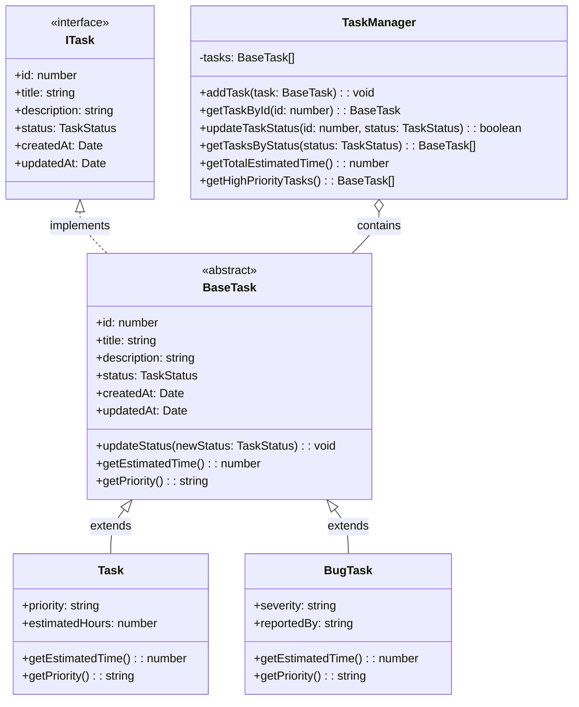

# TypeScript Classes

## Introduction

Classes in TypeScript provide a powerful way to define blueprints for creating objects with specific properties and behaviors. They are a fundamental part of Object-Oriented Programming (OOP) and TypeScript enhances JavaScript's class syntax with static type checking and additional features.

In this tutorial, we'll explore how TypeScript classes work, their syntax, and how they can be used to write clean, maintainable code with strong typing.

## Class Basics

### Defining a Class

A TypeScript class contains properties (data) and methods (functions) that define the behavior of objects created from that class.

```typescript
class Person {
  // Properties
  name: string;
  age: number;

  // Constructor
  constructor(name: string, age: number) {
    this.name = name;
    this.age = age;
  }

  // Method
  greet() {
    return `Hello, my name is ${this.name} and I am ${this.age} years old`;
  }
}

// Creating an instance of the class
const alice = new Person("Alice", 28);
console.log(alice.greet());
```

Output:
```
Hello, my name is Alice and I am 28 years old
```

### Constructor Shorthand

TypeScript provides a shorthand for defining class properties through constructor parameters:

```typescript
class Person {
  // Parameter properties
  constructor(
    public name: string,
    public age: number
  ) {}

  greet() {
    return `Hello, my name is ${this.name} and I am ${this.age} years old`;
  }
}

const bob = new Person("Bob", 32);
console.log(bob.name); // Bob
```

## Access Modifiers

TypeScript provides three access modifiers to control the visibility and accessibility of class members:

- `public`: Members are accessible from anywhere (default)
- `private`: Members are only accessible within the class
- `protected`: Members are accessible within the class and its subclasses

```typescript
class Employee {
  public name: string;
  private salary: number;
  protected department: string;

  constructor(name: string, salary: number, department: string) {
    this.name = name;
    this.salary = salary;
    this.department = department;
  }

  public getSalaryDetails() {
    return `${this.name} earns ${this.salary} in the ${this.department} department`;
  }

  private calculateBonus() {
    return this.salary * 0.1;
  }

  public getYearlyCompensation() {
    return this.salary * 12 + this.calculateBonus();
  }
}

const employee = new Employee("John", 5000, "Engineering");
console.log(employee.name); // John
console.log(employee.getSalaryDetails()); // John earns 5000 in the Engineering department
// console.log(employee.salary); // Error: Property 'salary' is private
// console.log(employee.calculateBonus()); // Error: Property 'calculateBonus' is private
// console.log(employee.department); // Error: Property 'department' is protected
```

## Readonly Properties

You can make properties immutable after initialization using the `readonly` modifier:

```typescript
class Config {
  readonly apiKey: string;
  readonly maxRetries: number;

  constructor(apiKey: string, maxRetries: number) {
    this.apiKey = apiKey;
    this.maxRetries = maxRetries;
  }

  // This would cause an error:
  // changeApiKey(key: string) {
  //   this.apiKey = key; // Cannot assign to 'apiKey' because it is a read-only property
  // }
}

const appConfig = new Config("abc123", 3);
console.log(appConfig.apiKey); // abc123
// appConfig.apiKey = "xyz789"; // Error: Cannot assign to 'apiKey' because it is a read-only property
```

## Inheritance

TypeScript supports inheritance, allowing you to create a hierarchy of classes where child classes inherit properties and methods from parent classes.

```typescript
class Animal {
  name: string;

  constructor(name: string) {
    this.name = name;
  }

  move(distance: number = 0) {
    return `${this.name} moved ${distance} meters`;
  }
}

class Dog extends Animal {
  breed: string;

  constructor(name: string, breed: string) {
    super(name); // Call the parent constructor
    this.breed = breed;
  }

  move(distance: number = 5) {
    return `${super.move(distance)} by running`;
  }

  bark() {
    return "Woof! Woof!";
  }
}

const dog = new Dog("Rex", "German Shepherd");
console.log(dog.name); // Rex
console.log(dog.breed); // German Shepherd
console.log(dog.move()); // Rex moved 5 meters by running
console.log(dog.bark()); // Woof! Woof!
```

## Abstract Classes

Abstract classes serve as base classes that cannot be instantiated directly. They can contain implementation details and also define abstract methods that must be implemented by derived classes.

```typescript
abstract class Shape {
  color: string;

  constructor(color: string) {
    this.color = color;
  }

  abstract calculateArea(): number;

  displayColor() {
    return `This shape is ${this.color}`;
  }
}

class Circle extends Shape {
  radius: number;

  constructor(color: string, radius: number) {
    super(color);
    this.radius = radius;
  }

  calculateArea(): number {
    return Math.PI * this.radius * this.radius;
  }

  displayDetails() {
    return `${this.displayColor()} circle with radius ${this.radius}`;
  }
}

// const shape = new Shape("red"); // Error: Cannot create an instance of an abstract class
const circle = new Circle("blue", 5);
console.log(circle.calculateArea()); // 78.53981633974483
console.log(circle.displayDetails()); // This shape is blue circle with radius 5
```

## Static Members

Static properties and methods belong to the class itself, not to instances of the class:

```typescript
class MathUtils {
  static PI = 3.14159;
  
  static add(x: number, y: number): number {
    return x + y;
  }
  
  static calculateCircumference(radius: number): number {
    return 2 * MathUtils.PI * radius;
  }
}

console.log(MathUtils.PI); // 3.14159
console.log(MathUtils.add(5, 3)); // 8
console.log(MathUtils.calculateCircumference(5)); // 31.4159

// No need to create an instance:
// const utils = new MathUtils(); // Not necessary
```

## Implementing Interfaces

Classes can implement interfaces to ensure they have the required structure:

```typescript
interface Printable {
  print(): string;
}

interface Identifiable {
  id: number;
  getIdentifier(): string;
}

class Document implements Printable, Identifiable {
  id: number;
  title: string;
  content: string;

  constructor(id: number, title: string, content: string) {
    this.id = id;
    this.title = title;
    this.content = content;
  }

  print(): string {
    return `${this.title}\n${this.content}`;
  }

  getIdentifier(): string {
    return `DOC-${this.id}`;
  }
}

const doc = new Document(1, "TypeScript Guide", "TypeScript is a superset of JavaScript...");
console.log(doc.print());
console.log(doc.getIdentifier()); // DOC-1
```

## Getters and Setters

TypeScript supports accessor methods for properties:

```typescript
class BankAccount {
  private _balance: number = 0;

  // Getter
  get balance(): number {
    console.log("Balance accessed");
    return this._balance;
  }

  // Setter
  set balance(newAmount: number) {
    if (newAmount < 0) {
      throw new Error("Balance cannot be negative");
    }
    console.log(`Setting balance to ${newAmount}`);
    this._balance = newAmount;
  }

  deposit(amount: number) {
    if (amount <= 0) {
      throw new Error("Deposit amount must be positive");
    }
    this.balance += amount;
  }

  withdraw(amount: number) {
    if (amount <= 0) {
      throw new Error("Withdrawal amount must be positive");
    }
    if (amount > this._balance) {
      throw new Error("Insufficient funds");
    }
    this.balance -= amount;
  }
}

const account = new BankAccount();
account.deposit(1000); // Setting balance to 1000
console.log(account.balance); // Balance accessed, 1000

// account.balance = -500; // Error: Balance cannot be negative
account.withdraw(300); // Setting balance to 700
console.log(account.balance); // Balance accessed, 700
```

## Class Expressions

Like JavaScript, TypeScript supports class expressions, which can be used to create anonymous classes or assign classes to variables:

```typescript
// Anonymous class expression
const Person = class {
  name: string;

  constructor(name: string) {
    this.name = name;
  }

  greet() {
    return `Hello, I'm ${this.name}`;
  }
};

const person = new Person("Emma");
console.log(person.greet()); // Hello, I'm Emma

// Named class expression
const Employee = class EmployeeClass {
  constructor(public name: string, public role: string) {}

  describe() {
    return `${this.name} works as a ${this.role}`;
  }
};

const employee = new Employee("John", "Developer");
console.log(employee.describe()); // John works as a Developer
```

## Real-World Example: Task Management System

Let's create a simple task management system to demonstrate how classes can be used in a real application:

```typescript
// Define task status enum
enum TaskStatus {
  Todo = "TODO",
  InProgress = "IN_PROGRESS",
  Done = "DONE"
}

// Define task interface
interface ITask {
  id: number;
  title: string;
  description: string;
  status: TaskStatus;
  createdAt: Date;
  updatedAt: Date;
}

// Base Task class
abstract class BaseTask implements ITask {
  id: number;
  title: string;
  description: string;
  status: TaskStatus;
  createdAt: Date;
  updatedAt: Date;

  constructor(id: number, title: string, description: string) {
    this.id = id;
    this.title = title;
    this.description = description;
    this.status = TaskStatus.Todo;
    this.createdAt = new Date();
    this.updatedAt = new Date();
  }

  updateStatus(newStatus: TaskStatus): void {
    this.status = newStatus;
    this.updatedAt = new Date();
  }

  abstract getEstimatedTime(): number;
  abstract getPriority(): string;
}

// Regular task class
class Task extends BaseTask {
  priority: "low" | "medium" | "high";
  estimatedHours: number;

  constructor(
    id: number, 
    title: string, 
    description: string, 
    priority: "low" | "medium" | "high",
    estimatedHours: number
  ) {
    super(id, title, description);
    this.priority = priority;
    this.estimatedHours = estimatedHours;
  }

  getEstimatedTime(): number {
    return this.estimatedHours;
  }

  getPriority(): string {
    return this.priority;
  }
}

// Bug task class
class BugTask extends BaseTask {
  severity: "critical" | "major" | "minor";
  reportedBy: string;

  constructor(
    id: number,
    title: string,
    description: string,
    severity: "critical" | "major" | "minor",
    reportedBy: string
  ) {
    super(id, title, description);
    this.severity = severity;
    this.reportedBy = reportedBy;
  }

  getEstimatedTime(): number {
    // Critical bugs take longer to fix
    if (this.severity === "critical") return 8;
    if (this.severity === "major") return 4;
    return 2;
  }

  getPriority(): string {
    // Map severity to priority
    if (this.severity === "critical") return "high";
    if (this.severity === "major") return "medium";
    return "low";
  }
}

// Task Manager class
class TaskManager {
  private tasks: BaseTask[] = [];

  addTask(task: BaseTask): void {
    this.tasks.push(task);
  }

  getTaskById(id: number): BaseTask | undefined {
    return this.tasks.find(task => task.id === id);
  }

  updateTaskStatus(id: number, status: TaskStatus): boolean {
    const task = this.getTaskById(id);
    if (task) {
      task.updateStatus(status);
      return true;
    }
    return false;
  }

  getTasksByStatus(status: TaskStatus): BaseTask[] {
    return this.tasks.filter(task => task.status === status);
  }

  getTotalEstimatedTime(): number {
    return this.tasks.reduce((total, task) => total + task.getEstimatedTime(), 0);
  }

  getHighPriorityTasks(): BaseTask[] {
    return this.tasks.filter(task => task.getPriority() === "high");
  }
}

// Usage example
const taskManager = new TaskManager();

// Create regular tasks
const task1 = new Task(1, "Implement login page", "Create React component for login", "medium", 4);
const task2 = new Task(2, "Design database schema", "Define tables and relationships", "high", 6);

// Create bug tasks
const bug1 = new BugTask(3, "Fix authentication bug", "Users can't log in with Google", "critical", "Anna");
const bug2 = new BugTask(4, "Fix layout issue", "Navbar breaks on small screens", "minor", "John");

// Add tasks to manager
taskManager.addTask(task1);
taskManager.addTask(task2);
taskManager.addTask(bug1);
taskManager.addTask(bug2);

// Update statuses
taskManager.updateTaskStatus(1, TaskStatus.InProgress);
taskManager.updateTaskStatus(3, TaskStatus.InProgress);

// Get tasks in progress
const tasksInProgress = taskManager.getTasksByStatus(TaskStatus.InProgress);
console.log(`Tasks in progress: ${tasksInProgress.length}`); // Tasks in progress: 2

// Get high priority tasks
const highPriorityTasks = taskManager.getHighPriorityTasks();
console.log(`High priority tasks: ${highPriorityTasks.length}`); // High priority tasks: 2

// Get total estimated time
const totalTime = taskManager.getTotalEstimatedTime();
console.log(`Total estimated time: ${totalTime} hours`); // Total estimated time: 20 hours
```

## Class Diagram

Here's a simplified class diagram showing the relationships between the classes in our task management example:



## Summary

In this tutorial, we've covered:

- Basic class syntax and instantiation
- Access modifiers (`public`, `private`, `protected`)
- Class inheritance with the `extends` keyword
- Abstract classes and methods
- Static properties and methods
- Implementing interfaces
- Getters and setters
- Class expressions
- A real-world application using classes

TypeScript classes provide a powerful way to structure your code using object-oriented principles while maintaining strong type checking. They enhance JavaScript classes with features like access modifiers and parameter properties, making it easier to write robust and maintainable code.

## Exercises

1. **Basic Class**: Create a `Rectangle` class with `width` and `height` properties, and methods to calculate area and perimeter.

2. **Inheritance**: Create a `Shape` base class with a method to calculate area. Then create `Circle` and `Square` classes that inherit from `Shape`.

3. **Access Modifiers**: Create a `User` class with private properties for password and email, and provide public methods to authenticate and change password.

4. **Static Members**: Create a `Calculator` class with static methods for basic arithmetic operations.

5. **Advanced**: Create a library management system with classes for `Book`, `Library`, `Member`, and `Loan`. Implement methods for checking out books, returning books, and calculating late fees.

## Additional Resources

- [TypeScript Official Documentation on Classes](https://www.typescriptlang.org/docs/handbook/2/classes.html)
- [Object-Oriented Programming in TypeScript](https://www.typescriptlang.org/docs/handbook/2/classes.html)
- [TypeScript Access Modifiers](https://www.typescriptlang.org/docs/handbook/2/classes.html#member-visibility)
- [TypeScript Inheritance](https://www.typescriptlang.org/docs/handbook/2/classes.html#inheritance)

Happy coding with TypeScript classes!