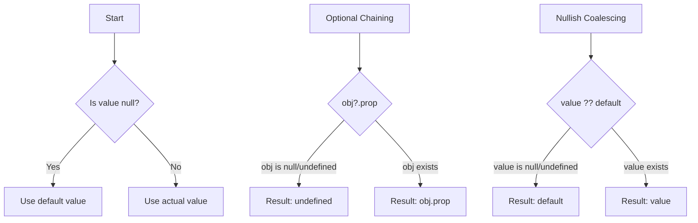

# TypeScript Null Handling

Understanding how to handle null and undefined values is crucial for writing robust TypeScript code. In this guide, we'll explore TypeScript's features for handling null and undefined values safely and effectively.

## Introduction to Null Handling in TypeScript

JavaScript has two primitive values for representing "nothing": `null` and `undefined`. These values often cause runtime errors when not handled properly:

```typescript
// JavaScript error: Cannot read property 'toLowerCase' of null
const name = null;
name.toLowerCase(); // 💥 Runtime error!
```

TypeScript helps prevent these issues through its type system, making your code more robust and maintainable. Let's dive into TypeScript's null handling features.

## Understanding `null` vs `undefined`

Before we go further, let's clarify these two concepts:

- `undefined`: Represents a variable that has been declared but not assigned a value
- `null`: Represents an intentional absence of any value

```typescript
// undefined examples
let user; // undefined (implicitly)
let data: string; // undefined until assigned

// null examples
let selectedItem: string | null = null; // explicitly null
```

## The `strictNullChecks` Compiler Option

The most important TypeScript feature for null handling is the `strictNullChecks` compiler option. When enabled, TypeScript distinguishes between nullable and non-nullable types.

### Without strictNullChecks

```typescript
// strictNullChecks: false
let name: string = "Alice";
name = null; // 🟢 OK without strictNullChecks
name = undefined; // 🟢 OK without strictNullChecks
```

### With strictNullChecks

```typescript
// strictNullChecks: true
let name: string = "Alice";
name = null; // 🔴 Error: Type 'null' is not assignable to type 'string'
name = undefined; // 🔴 Error: Type 'undefined' is not assignable to type 'string'
```

To allow null or undefined with strictNullChecks, you need to explicitly use union types:

```typescript
let name: string | null = "Alice";
name = null; // 🟢 OK

let age: number | undefined;
age = 30;
age = undefined; // 🟢 OK
```

### Enabling strictNullChecks

You can enable this feature in your `tsconfig.json`:

```json
{
  "compilerOptions": {
    "strictNullChecks": true
    // ...other options
  }
}
```

Or, enable all strict type checking options:

```json
{
  "compilerOptions": {
    "strict": true
    // ...other options
  }
}
```

## Type Guards for Null Checking

TypeScript uses type guards to narrow down types within conditional blocks. This is particularly helpful for null handling:

### Truthiness Checks

```typescript
function greet(name: string | null | undefined): string {
  if (name) {
    // Here, TypeScript knows 'name' is string
    return `Hello, ${name.toUpperCase()}!`;
  }
  return "Hello, guest!";
}

console.log(greet("Alice")); // Output: Hello, ALICE!
console.log(greet(null));    // Output: Hello, guest!
console.log(greet(undefined)); // Output: Hello, guest!
```

### Explicit Comparison

```typescript
function processValue(value: string | null): string {
  if (value !== null) {
    // Here, TypeScript knows 'value' is string
    return value.toLowerCase();
  }
  return "no value";
}

console.log(processValue("HELLO")); // Output: hello
console.log(processValue(null));    // Output: no value
```

### The `typeof` Operator

```typescript
function printLength(text: string | null | undefined): void {
  if (typeof text === "string") {
    console.log(`Length: ${text.length}`);
  } else {
    console.log("No valid text provided");
  }
}

printLength("Hello"); // Output: Length: 5
printLength(null);    // Output: No valid text provided
```

## Advanced Null Handling Features

TypeScript provides several advanced features to make null handling more convenient and concise.

### Non-null Assertion Operator (`!`)

The non-null assertion operator tells TypeScript that a value cannot be null or undefined, even if its type suggests it might be:

```typescript
function getLength(text: string | null): number {
  // The '!' tells TypeScript that text won't be null here
  return text!.length;
}
```

⚠️ **Warning**: Use this operator with caution! If the value is actually null, a runtime error will occur.

### Optional Chaining Operator (`?.`)

The optional chaining operator provides a concise way to access properties on potentially null/undefined objects:

```typescript
type User = {
  name: string;
  address?: {
    street: string;
    city: string;
  };
};

function getCity(user: User | null | undefined): string | undefined {
  // Without optional chaining
  if (user && user.address) {
    return user.address.city;
  }
  return undefined;

  // With optional chaining (much cleaner!)
  return user?.address?.city;
}

const user1: User = { 
  name: "Alice", 
  address: { street: "123 Main St", city: "Wonderland" } 
};
const user2: User = { name: "Bob" }; // No address

console.log(getCity(user1)); // Output: Wonderland
console.log(getCity(user2)); // Output: undefined
console.log(getCity(null));  // Output: undefined
```

Optional chaining also works with method calls:

```typescript
interface API {
  fetchData?: () => string;
}

const api: API = {};
const result = api.fetchData?.(); // undefined instead of error
```

### Nullish Coalescing Operator (`??`)

The nullish coalescing operator provides a fallback value when dealing with `null` or `undefined`:

```typescript
function getUserDisplayName(user: { name: string; nickname?: string | null }): string {
  // Without nullish coalescing
  if (user.nickname !== null && user.nickname !== undefined) {
    return user.nickname;
  }
  return user.name;

  // With nullish coalescing (much cleaner!)
  return user.nickname ?? user.name;
}

const user1 = { name: "John Smith", nickname: "Johnny" };
const user2 = { name: "Jane Doe", nickname: null };
const user3 = { name: "Bob Johnson" };

console.log(getUserDisplayName(user1)); // Output: Johnny
console.log(getUserDisplayName(user2)); // Output: Jane Doe
console.log(getUserDisplayName(user3)); // Output: Bob Johnson
```

The key difference between `??` and `||` is that `??` only falls back on `null` or `undefined`, while `||` falls back on any falsy value:

```typescript
// With || operator
const count = 0;
const result1 = count || 10; // result1 = 10 (0 is falsy)

// With ?? operator
const result2 = count ?? 10; // result2 = 0 (0 is not null or undefined)
```

## Real-world Example: User Profile Manager

Let's integrate these concepts in a practical application - a user profile manager:

```typescript
interface UserProfile {
  id: number;
  username: string;
  email: string | null;
  preferences?: {
    theme: "light" | "dark";
    notifications: boolean;
    language?: string;
  };
}

class ProfileManager {
  private currentUser: UserProfile | null = null;
  
  loadProfile(userId: number): void {
    // Simulate API call
    if (userId === 1) {
      this.currentUser = {
        id: 1,
        username: "developer123",
        email: "dev@example.com",
        preferences: {
          theme: "dark",
          notifications: true
        }
      };
    } else {
      this.currentUser = null;
    }
  }
  
  getUsername(): string {
    // Using non-null assertion (we should validate first)
    if (!this.currentUser) {
      return "Guest";
    }
    return this.currentUser.username;
  }
  
  getEmail(): string {
    // Using nullish coalescing
    return this.currentUser?.email ?? "No email provided";
  }
  
  getTheme(): string {
    // Using optional chaining and nullish coalescing
    return this.currentUser?.preferences?.theme ?? "light";
  }
  
  getLanguage(): string {
    // Using optional chaining and nullish coalescing
    return this.currentUser?.preferences?.language ?? "en-US";
  }
  
  // Type guard example
  hasNotificationsEnabled(): boolean {
    if (this.currentUser && this.currentUser.preferences) {
      return this.currentUser.preferences.notifications;
    }
    return false;
  }
}

// Usage example
const profileManager = new ProfileManager();

// Test with valid user
profileManager.loadProfile(1);
console.log(`Username: ${profileManager.getUsername()}`); // Username: developer123
console.log(`Email: ${profileManager.getEmail()}`);       // Email: dev@example.com
console.log(`Theme: ${profileManager.getTheme()}`);       // Theme: dark
console.log(`Language: ${profileManager.getLanguage()}`); // Language: en-US
console.log(`Notifications: ${profileManager.hasNotificationsEnabled()}`); // Notifications: true

// Test with no user
profileManager.loadProfile(999); // Non-existent user
console.log(`Username: ${profileManager.getUsername()}`); // Username: Guest
console.log(`Email: ${profileManager.getEmail()}`);       // Email: No email provided
console.log(`Theme: ${profileManager.getTheme()}`);       // Theme: light
console.log(`Language: ${profileManager.getLanguage()}`); // Language: en-US
console.log(`Notifications: ${profileManager.hasNotificationsEnabled()}`); // Notifications: false
```

## Best Practices for Null Handling

1. **Always enable `strictNullChecks`**  
   This finds many common errors and makes your code safer.

2. **Be explicit about nullable types**  
   Use union types with `null` or `undefined` to make your intentions clear:
   ```typescript
   // Explicit is better than implicit
   function findUser(id: string): User | null {
     // ...
   }
   ```

3. **Prefer early returns**  
   Handle null cases early in your functions:
   ```typescript
   function processUser(user: User | null): string {
     if (!user) {
       return "No user provided";
     }
     
     // Now you can work with user safely
     return user.name;
   }
   ```

4. **Use optional chaining (`?.`) for deep property access**  
   It's more readable and less error-prone than nested if statements.

5. **Prefer nullish coalescing (`??`) over logical OR (`||`) for defaults**  
   The nullish coalescing operator only replaces `null` and `undefined`, not all falsy values.

6. **Use the non-null assertion operator (`!`) sparingly**  
   Only use it when you're absolutely certain a value cannot be null, preferably after a type guard.

## Flow Control Visualization

Here's a visualization of different null handling approaches:



## Summary

TypeScript provides powerful tools for handling null and undefined values:

- **`strictNullChecks`**: Forces you to handle potential null/undefined values
- **Type guards**: Let you narrow down types within conditional blocks
- **Optional chaining (`?.`)**: Safely access properties on potentially null objects
- **Nullish coalescing (`??`)**: Provide default values for null/undefined
- **Non-null assertion (`!`)**: Override TypeScript's null checks when you're certain

By leveraging these features, you can write code that's both safer and more expressive, avoiding the dreaded "cannot read property of null" runtime errors.

## Exercises

1. Create a function that safely extracts a nested property from an object, with proper typing.
2. Implement a "safe get" utility function using TypeScript generics that handles null values.
3. Refactor the following code to use modern TypeScript null handling features:

```typescript
function getUserCity(user) {
  if (user) {
    if (user.address) {
      return user.address.city;
    }
  }
  return "Unknown";
}
```

## Additional Resources

- [TypeScript Handbook: Strictness](https://www.typescriptlang.org/docs/handbook/2/strictness.html)
- [Optional Chaining MDN](https://developer.mozilla.org/en-US/docs/Web/JavaScript/Reference/Operators/Optional_chaining)
- [Nullish Coalescing MDN](https://developer.mozilla.org/en-US/docs/Web/JavaScript/Reference/Operators/Nullish_coalescing_operator)

Happy coding with null-safe TypeScript!