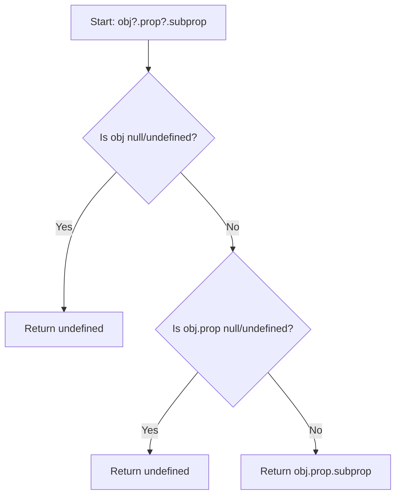

# TypeScript Optional Chaining

## Introduction

When working with complex data structures in TypeScript, you'll often need to access deeply nested properties. Traditionally, this required verbose null checks to avoid runtime errors. The optional chaining operator (`?.`) introduced in TypeScript 3.7 provides an elegant solution to this common problem.

Optional chaining allows you to safely access nested properties and methods without having to manually check if each reference in the chain is valid. When a reference is `null` or `undefined`, the expression short-circuits and returns `undefined` instead of throwing an error.

## Understanding Optional Chaining

### The Problem Optional Chaining Solves

Let's look at what happens when we try to access deeply nested properties without optional chaining:

```typescript
type User = {
  name: string;
  address?: {
    street?: string;
    city?: string;
  };
  getFullAddress?: () => string;
};

const user: User = {
  name: "John Doe",
  // address is undefined here
};

// Without optional chaining
let city;
if (user.address && user.address.city) {
  city = user.address.city;
} else {
  city = undefined;
}

console.log(city); // Output: undefined
```

As you can see, we need to check each level of nesting to avoid a potential runtime error. This can become verbose and error-prone.

### Optional Chaining Syntax

The optional chaining operator uses the `?.` syntax and can be applied in three different contexts:

1. **Property access**: `obj?.prop`
2. **Element access**: `obj?.[expr]`
3. **Function call**: `func?.(args)`

## Using Optional Chaining in Practice

### Property Access

```typescript
type User = {
  name: string;
  address?: {
    street?: string;
    city?: string;
    zipCode?: number;
  };
};

const userWithAddress: User = {
  name: "John Doe",
  address: {
    street: "123 Main St",
    city: "Springfield"
  }
};

const userWithoutAddress: User = {
  name: "Jane Smith"
};

// With optional chaining
console.log(userWithAddress?.address?.city); // Output: "Springfield"
console.log(userWithoutAddress?.address?.city); // Output: undefined
console.log(userWithAddress?.address?.zipCode); // Output: undefined
```

### Element Access (Arrays and Map-like Objects)

```typescript
type UserList = {
  users?: Array<{
    id: number;
    name: string;
  }>;
};

const data: UserList = {
  users: [
    { id: 1, name: "Alice" },
    { id: 2, name: "Bob" }
  ]
};

const emptyData: UserList = {};

// Accessing array elements safely
console.log(data.users?.[0]?.name); // Output: "Alice"
console.log(emptyData.users?.[0]?.name); // Output: undefined

// With dynamic property access
const key = "users";
console.log(data[key as keyof UserList]?.[0]); // Output: { id: 1, name: "Alice" }
```

### Function Call

```typescript
type User = {
  name: string;
  getAddress?: () => string;
};

const userWithMethod: User = {
  name: "John Doe",
  getAddress: () => "123 Main St, Springfield"
};

const userWithoutMethod: User = {
  name: "Jane Smith"
};

// Safe function calls
console.log(userWithMethod.getAddress?.()); // Output: "123 Main St, Springfield"
console.log(userWithoutMethod.getAddress?.()); // Output: undefined
```

## Combining Optional Chaining with Other TypeScript Features

### With Nullish Coalescing

The optional chaining operator pairs perfectly with the nullish coalescing operator (`??`) to provide default values:

```typescript
type Settings = {
  theme?: {
    darkMode?: boolean;
    fontSize?: number;
  };
};

const settings: Settings = {
  theme: {
    darkMode: true
  }
};

// Combining optional chaining with nullish coalescing
const fontSize = settings.theme?.fontSize ?? 16;
console.log(fontSize); // Output: 16

const darkMode = settings.theme?.darkMode ?? false;
console.log(darkMode); // Output: true
```

### With Type Guards

```typescript
interface User {
  name: string;
  permissions?: {
    canEdit?: boolean;
    canDelete?: boolean;
  };
}

function canUserEdit(user: User): boolean {
  // Using optional chaining with type guard
  if (user.permissions?.canEdit) {
    return true;
  }
  return false;
}

const adminUser: User = {
  name: "Admin",
  permissions: {
    canEdit: true,
    canDelete: true
  }
};

const regularUser: User = {
  name: "Regular User"
};

console.log(canUserEdit(adminUser)); // Output: true
console.log(canUserEdit(regularUser)); // Output: false
```

## Real-World Applications

### API Response Handling

When handling API responses, optional chaining makes parsing complex JSON structures much safer:

```typescript
type ApiResponse = {
  data?: {
    results?: Array<{
      id: number;
      details?: {
        title?: string;
        description?: string;
      };
    }>;
    pagination?: {
      totalPages?: number;
    };
  };
  error?: string;
};

// Simulating an API response
const response: ApiResponse = {
  data: {
    results: [
      {
        id: 1,
        details: {
          title: "First Item"
        }
      },
      {
        id: 2
      }
    ],
    pagination: {
      totalPages: 5
    }
  }
};

// Safely accessing nested properties
const firstItemTitle = response.data?.results?.[0]?.details?.title;
console.log(`Title: ${firstItemTitle}`); // Output: "Title: First Item"

const secondItemDescription = response.data?.results?.[1]?.details?.description ?? "No description provided";
console.log(`Description: ${secondItemDescription}`); // Output: "Description: No description provided"

// Error handling is simplified
const errorMessage = response.error ?? "No error";
console.log(`Error: ${errorMessage}`); // Output: "Error: No error"
```

### Working with DOM Elements

Optional chaining is especially useful when working with DOM elements that might not exist:

```typescript
// Safely accessing DOM elements and properties
const headerElement = document.querySelector('.header')?.querySelector('.title')?.textContent;

// Safely adding event listeners
document.getElementById('submit-button')?.addEventListener('click', () => {
  console.log('Button clicked!');
});

// Safely accessing form input values
const emailValue = (document.getElementById('email-input') as HTMLInputElement)?.value;
```

### Redux State Management

When working with state management libraries like Redux, optional chaining helps with handling complex state:

```typescript
type ApplicationState = {
  user?: {
    profile?: {
      name?: string;
      email?: string;
    };
    settings?: {
      notifications?: boolean;
    };
  };
  ui?: {
    theme?: 'light' | 'dark';
  };
};

// Simulating a Redux state
const state: ApplicationState = {
  user: {
    profile: {
      name: "John Doe",
    }
  },
  ui: {
    theme: "light"
  }
};

// Accessing state safely
function selectUsername(state: ApplicationState): string {
  return state.user?.profile?.name ?? "Guest User";
}

function areNotificationsEnabled(state: ApplicationState): boolean {
  return state.user?.settings?.notifications ?? false;
}

console.log(selectUsername(state)); // Output: "John Doe"
console.log(areNotificationsEnabled(state)); // Output: false
```

## Best Practices and Gotchas

### When to Use Optional Chaining

Use optional chaining when:

- Working with objects that might be `null` or `undefined`
- Accessing properties deep in an object structure
- Calling methods that might not exist
- Handling API responses with uncertain structure

### When Not to Use Optional Chaining

Avoid optional chaining when:

- You expect a value to always be present (use proper error handling instead)
- You need to distinguish between `undefined` and other falsy values

### Potential Issues

```typescript
// Be careful with assignment operations
let x = 0;
const obj = null;

// This doesn't assign a default value to x!
obj?.prop = x; // The assignment is not performed if obj is null/undefined

// Correct way to conditionally assign a value
if (obj) {
  obj.prop = x;
}

// Be aware that optional chaining always returns undefined (not null)
// when the chain is broken
const value = null;
console.log(value?.prop); // Output: undefined (not null)
```

## Performance Considerations

The optional chaining operator adds minimal overhead compared to manual checks and can make your code more efficient by reducing the amount of boilerplate code.

```typescript
// This code:
const cityName = user?.address?.city;

// Is more efficient than:
let cityName;
if (user && user.address) {
  cityName = user.address.city;
} else {
  cityName = undefined;
}
```

## Visual Flow of Optional Chaining



## Summary

TypeScript's optional chaining operator provides an elegant way to handle potentially undefined or null values when accessing nested properties, array elements, or calling methods. It significantly reduces boilerplate code and makes your TypeScript code more robust and readable.

Key benefits include:
- Safer property access without verbose null checks
- Clean and concise syntax
- Reduced potential for runtime errors
- Great synergy with the nullish coalescing operator
- Improved readability and maintainability

## Exercises

1. Refactor the following code to use optional chaining:
   ```typescript
   function getUserCity(user) {
     if (user && user.address && user.address.city) {
       return user.address.city;
     }
     return 'Unknown';
   }
   ```

2. Create a function that safely accesses a deeply nested property in an API response object with at least three levels of nesting.

3. Implement a function that safely calls methods on an object that might not exist, using optional chaining.

## Additional Resources

- [TypeScript Documentation on Optional Chaining](https://www.typescriptlang.org/docs/handbook/release-notes/typescript-3-7.html#optional-chaining)
- [TypeScript Deep Dive: Optional Chaining](https://basarat.gitbook.io/typescript/type-system/nullable#optional-chaining)
- [MDN Web Docs: Optional Chaining](https://developer.mozilla.org/en-US/docs/Web/JavaScript/Reference/Operators/Optional_chaining)