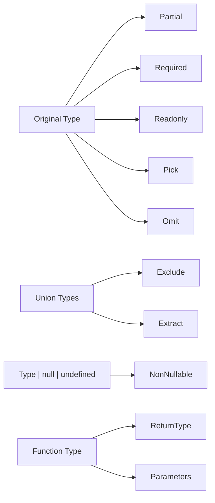

# TypeScript Utility Types

TypeScript's type system is incredibly powerful and flexible. One of the most practical features it offers is a collection of utility types - built-in type transformations that help you manipulate existing types to create new ones.

## Introduction to Utility Types

Utility types are pre-defined generic types that perform type transformations. Instead of writing complex type manipulations from scratch, TypeScript provides these ready-to-use utilities that can save you time and make your code more maintainable.

Think of utility types as functions for types - they take an input type and produce a transformed output type according to specific rules.

## Core Utility Types

Let's explore the most commonly used utility types in TypeScript:

### `Partial<T>`

The `Partial<T>` utility makes all properties of a type optional.

```typescript
interface User {
  id: number;
  name: string;
  email: string;
  isActive: boolean;
}

// Before: All properties are required
const createUser = (user: User): User => {
  return user;
};

// After: All properties are optional
const updateUser = (userId: number, userUpdates: Partial<User>): User => {
  // Fetch the existing user and merge with updates
  const existingUser: User = {
    id: userId,
    name: "John Doe",
    email: "john@example.com",
    isActive: true
  };
  
  return { ...existingUser, ...userUpdates };
};

// Usage
updateUser(1, { name: "Jane Doe" }); // Only updating name
```

### `Required<T>`

The opposite of `Partial<T>`, `Required<T>` makes all properties required, even those that were originally optional.

```typescript
interface BlogPost {
  title: string;
  content: string;
  tags?: string[];
  publishDate?: Date;
}

// All fields are now required, including tags and publishDate
type PublishedPost = Required<BlogPost>;

// This will cause a type error because tags and publishDate are missing
const post: PublishedPost = {
  title: "TypeScript Utility Types",
  content: "TypeScript provides several utility types..."
  // Error: Property 'tags' is missing
  // Error: Property 'publishDate' is missing
};
```

### `Readonly<T>`

The `Readonly<T>` utility makes all properties read-only, preventing modifications after creation.

```typescript
interface Config {
  apiUrl: string;
  timeout: number;
  retries: number;
}

const appConfig: Readonly<Config> = {
  apiUrl: "https://api.example.com",
  timeout: 10000,
  retries: 3
};

// This will cause a type error
appConfig.timeout = 5000; // Error: Cannot assign to 'timeout' because it is a read-only property
```

### `Record<K, T>`

`Record<K, T>` creates an object type with keys of type `K` and values of type `T`.

```typescript
type UserRole = "admin" | "user" | "guest";

// Create an object type with UserRole keys and boolean values
type UserPermissions = Record<UserRole, boolean>;

const permissions: UserPermissions = {
  admin: true,
  user: true,
  guest: false
};

// Create a dictionary of user information
type UserId = string;
type UserInfo = { name: string; loginCount: number };

const userRegistry: Record<UserId, UserInfo> = {
  "user123": { name: "Alice", loginCount: 5 },
  "user456": { name: "Bob", loginCount: 12 }
};
```

### `Pick<T, K>`

`Pick<T, K>` creates a type by picking a set of properties `K` from type `T`.

```typescript
interface Article {
  id: number;
  title: string;
  content: string;
  author: string;
  comments: string[];
  publishedDate: Date;
  tags: string[];
}

// Create a preview type with only selected fields
type ArticlePreview = Pick<Article, 'id' | 'title' | 'author'>;

const previews: ArticlePreview[] = [
  { id: 1, title: "TypeScript Basics", author: "Alice Smith" },
  { id: 2, title: "Advanced Types", author: "Bob Johnson" }
];
```

### `Omit<T, K>`

The opposite of `Pick<T, K>`, `Omit<T, K>` creates a type by excluding a set of properties `K` from type `T`.

```typescript
interface Product {
  id: string;
  name: string;
  price: number;
  category: string;
  stock: number;
  description: string;
}

// Creating a product form type that doesn't include id (generated by the system)
type ProductForm = Omit<Product, 'id'>;

const createProductForm = (form: ProductForm): Product => {
  return {
    ...form,
    id: generateId() // Function that generates a unique ID
  };
};

function generateId(): string {
  return Math.random().toString(36).substr(2, 9);
}
```

## Advanced Utility Types

Let's explore some more advanced utility types:

### `Exclude<T, U>`

`Exclude<T, U>` creates a type by excluding all members of `U` from `T`.

```typescript
type AllEventTypes = 'click' | 'scroll' | 'mousemove' | 'keydown' | 'resize';
type IgnoredEvents = 'scroll' | 'resize';

// Results in 'click' | 'mousemove' | 'keydown'
type HandledEvents = Exclude<AllEventTypes, IgnoredEvents>;

const handleEvent = (event: HandledEvents) => {
  console.log(`Handling ${event} event`);
};

handleEvent('click'); // Valid
handleEvent('keydown'); // Valid
// handleEvent('resize'); // Error: Argument of type 'resize' is not assignable to parameter of type 'HandledEvents'
```

### `Extract<T, U>`

`Extract<T, U>` extracts from `T` all members that are assignable to `U`.

```typescript
type ResponseStatus = 'success' | 'error' | 'loading' | 'idle';
type FinishedStatus = 'success' | 'error';

// Results in 'success' | 'error'
type CompletedResponses = Extract<ResponseStatus, FinishedStatus>;

const showNotification = (status: CompletedResponses) => {
  if (status === 'success') {
    console.log('Operation successful!');
  } else {
    console.log('Operation failed!');
  }
};

showNotification('success'); // Valid
// showNotification('loading'); // Error: 'loading' is not assignable to parameter of type 'CompletedResponses'
```

### `NonNullable<T>`

`NonNullable<T>` creates a type by excluding `null` and `undefined` from `T`.

```typescript
type OptionalValue = string | null | undefined;

// Results in just 'string'
type RequiredValue = NonNullable<OptionalValue>;

function processValue(value: RequiredValue) {
  // We can safely use string methods here
  return value.toUpperCase();
}

processValue("hello"); // Valid
// processValue(null); // Error: Argument of type 'null' is not assignable to parameter of type 'string'
```

### `ReturnType<T>`

`ReturnType<T>` extracts the return type of a function type.

```typescript
function fetchUserData(id: number) {
  return {
    id,
    name: 'John',
    email: 'john@example.com'
  };
}

// Extracts the return type of fetchUserData
type UserData = ReturnType<typeof fetchUserData>;

// Now we can use this type elsewhere
const processUserData = (data: UserData) => {
  console.log(`Processing data for ${data.name}`);
};

const userData = fetchUserData(123);
processUserData(userData);
```

### `Parameters<T>`

`Parameters<T>` extracts the parameter types of a function type as an array.

```typescript
function createPost(title: string, content: string, tags: string[]) {
  return { title, content, tags, createdAt: new Date() };
}

// Results in [title: string, content: string, tags: string[]]
type PostParams = Parameters<typeof createPost>;

// We can now use this type for arguments
const postArgs: PostParams = ["New Feature", "TypeScript 4.5 released", ["typescript", "release"]];
const post = createPost(...postArgs);
```

## Practical Application Examples

Let's see how utility types can be used in real-world scenarios:

### Form State Management

```typescript
interface UserFormData {
  username: string;
  email: string;
  password: string;
  bio?: string;
  preferences: {
    theme: 'light' | 'dark';
    notifications: boolean;
  };
}

// For validation errors, we want the same shape but with string messages
type ValidationErrors = Partial<Record<keyof UserFormData, string>>;

// For tracking which fields have been touched/modified
type TouchedFields = Partial<Record<keyof UserFormData, boolean>>;

// Form state management
interface FormState {
  data: UserFormData;
  errors: ValidationErrors;
  touched: TouchedFields;
  isSubmitting: boolean;
}

// Initial state setup
const initialFormState: FormState = {
  data: {
    username: '',
    email: '',
    password: '',
    preferences: { theme: 'light', notifications: true }
  },
  errors: {},
  touched: {},
  isSubmitting: false
};
```

### API Response Handling

```typescript
interface APIResponse<T> {
  data: T;
  status: number;
  message: string;
  timestamp: string;
}

interface User {
  id: number;
  name: string;
  email: string;
  role: 'admin' | 'user';
  lastLogin: Date;
  settings: Record<string, unknown>;
}

// Creating a simplified user preview type
type UserPreview = Pick<User, 'id' | 'name' | 'role'>;

// Function to process an API response with a user
function handleUserResponse(response: APIResponse<User>): UserPreview {
  // Extract only what we need
  const { id, name, role } = response.data;
  return { id, name, role };
}

// Function to process a list of users
function handleUsersResponse(response: APIResponse<User[]>): UserPreview[] {
  return response.data.map(user => ({
    id: user.id,
    name: user.name,
    role: user.role
  }));
}
```

### Component Props Management

```typescript
interface ButtonProps {
  text: string;
  onClick: () => void;
  disabled?: boolean;
  type?: 'button' | 'submit' | 'reset';
  className?: string;
  icon?: string;
  size?: 'small' | 'medium' | 'large';
}

// Create a loading button type that requires different props
type LoadingButtonProps = Omit<ButtonProps, 'onClick'> & {
  isLoading: boolean;
  loadingText: string;
  onSubmit: () => Promise<void>;
};

// Component implementation (pseudocode)
function LoadingButton(props: LoadingButtonProps) {
  // Implementation here...
  return <button>{props.isLoading ? props.loadingText : props.text}</button>;
}

// Usage
const saveButton = {
  text: 'Save Changes',
  isLoading: false,
  loadingText: 'Saving...',
  onSubmit: async () => { await saveData(); },
  size: 'medium' as const
};
```

## Flow Control for Type Transformation

Here's a visual representation of how utility types transform types:



## Creating Custom Utility Types

TypeScript's utility types are built using advanced type features that you can also use to create your own utilities:

```typescript
// Custom DeepReadonly utility type
type DeepReadonly<T> = {
  readonly [K in keyof T]: T[K] extends object ? DeepReadonly<T[K]> : T[K];
};

interface NestedConfig {
  api: {
    endpoint: string;
    timeout: number;
  };
  features: {
    darkMode: boolean;
    notifications: {
      email: boolean;
      push: boolean;
    };
  };
}

// Deep readonly version
const config: DeepReadonly<NestedConfig> = {
  api: {
    endpoint: "https://api.example.com",
    timeout: 3000
  },
  features: {
    darkMode: true,
    notifications: {
      email: false,
      push: true
    }
  }
};

// These would all cause type errors:
// config.api = {}; 
// config.api.endpoint = "new-api";
// config.features.notifications.push = false;
```

## Summary

TypeScript's utility types are powerful tools that enable you to manipulate and transform types in a concise and reusable way. They help you:

- Make properties optional (`Partial<T>`) or required (`Required<T>`)
- Create read-only objects (`Readonly<T>`)
- Select specific properties (`Pick<T, K>`) or exclude them (`Omit<T, K>`)
- Filter union types (`Exclude<T, U>`, `Extract<T, U>`)
- Remove null and undefined (`NonNullable<T>`)
- Extract function return types (`ReturnType<T>`) and parameter types (`Parameters<T>`)

By mastering these utility types, you can write more flexible, reusable, and type-safe code with less boilerplate.

## Exercises

1. Create a function that takes a `User` object and returns a sanitized version without sensitive information using `Omit<T, K>`.
2. Build a form state management system that tracks original values, current values, and which fields have been modified using appropriate utility types.
3. Create a custom `DeepPartial<T>` utility type that makes all properties and nested properties optional.
4. Implement a function that merges two objects with different types, preserving type safety using utility types.
5. Create a custom `Mutable<T>` utility type that makes all properties of a readonly object writable again.

## Additional Resources

- [TypeScript Documentation on Utility Types](https://www.typescriptlang.org/docs/handbook/utility-types.html)
- [Type Manipulation in TypeScript](https://www.typescriptlang.org/docs/handbook/2/types-from-types.html)
- [Advanced Types in TypeScript](https://www.typescriptlang.org/docs/handbook/advanced-types.html)
- [TypeScript Playground](https://www.typescriptlang.org/play) - Test utility types interactively

Learning these utility types will significantly improve your TypeScript code and make working with complex type scenarios much more manageable.