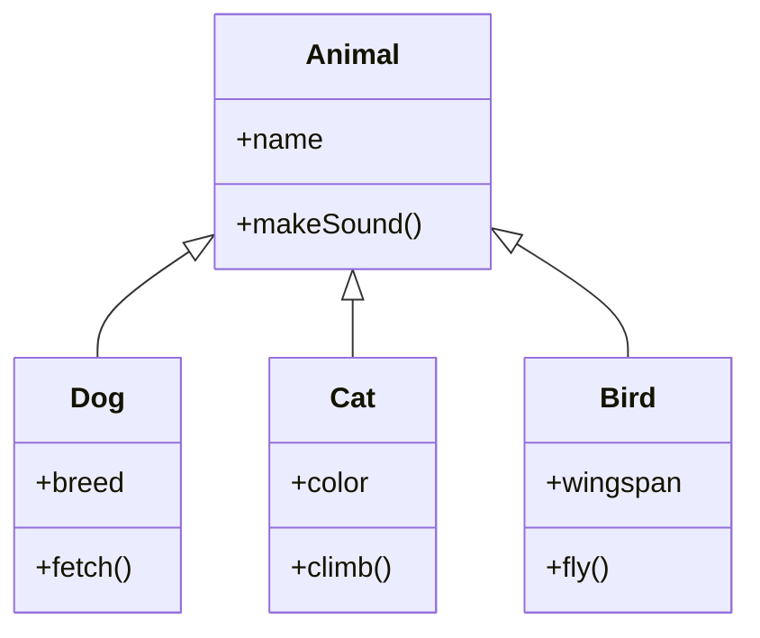

# TypeScript Inheritance

Inheritance is a fundamental concept in object-oriented programming that allows you to define a class that inherits properties and methods from another class. In this tutorial, we'll explore how TypeScript implements inheritance and how you can use it to create more maintainable and reusable code.

## Introduction to Inheritance

Inheritance establishes a parent-child (or base-derived) relationship between classes. The child class (also called the derived class or subclass) inherits properties and methods from the parent class (also called the base class or superclass).

This relationship enables:

- **Code reusability**: Write common functionality once in a parent class
- **Hierarchy**: Create a logical hierarchy of related types
- **Polymorphism**: Allow derived classes to override and extend base functionality

## Basic Inheritance in TypeScript

In TypeScript, we use the `extends` keyword to create an inheritance relationship between classes.

```typescript
class Animal {
    name: string;
    
    constructor(name: string) {
        this.name = name;
    }
    
    makeSound(): void {
        console.log("Some generic sound");
    }
}

class Dog extends Animal {
    breed: string;
    
    constructor(name: string, breed: string) {
        super(name); // Call the parent constructor
        this.breed = breed;
    }
    
    makeSound(): void {
        console.log("Woof! Woof!");
    }
    
    fetch(): void {
        console.log(`${this.name} is fetching...`);
    }
}

// Usage
const myDog = new Dog("Rex", "German Shepherd");
console.log(myDog.name); // Rex
console.log(myDog.breed); // German Shepherd
myDog.makeSound(); // Woof! Woof!
myDog.fetch(); // Rex is fetching...
```

### Key Points:

1. The `Dog` class extends the `Animal` class using the `extends` keyword
2. The `super()` call in the constructor invokes the parent class constructor
3. `Dog` inherits the `name` property from `Animal`
4. `Dog` overrides the `makeSound()` method with its own implementation
5. `Dog` adds its own unique `breed` property and `fetch()` method

## The `super` Keyword

The `super` keyword serves two important purposes in inheritance:

1. Calling the parent class constructor
2. Accessing parent class methods

```typescript
class Animal {
    name: string;
    
    constructor(name: string) {
        this.name = name;
    }
    
    makeSound(): void {
        console.log("Some generic sound");
    }
    
    eat(): void {
        console.log(`${this.name} is eating.`);
    }
}

class Cat extends Animal {
    color: string;
    
    constructor(name: string, color: string) {
        super(name); // Call parent constructor
        this.color = color;
    }
    
    makeSound(): void {
        console.log("Meow!");
    }
    
    eat(): void {
        super.eat(); // Call parent method
        console.log(`${this.name} is purring while eating.`);
    }
}

const myCat = new Cat("Whiskers", "Orange");
myCat.eat();
// Output:
// Whiskers is eating.
// Whiskers is purring while eating.
```

### Important Note:

If your derived class has a constructor, it **must** call `super()` before using `this`. Failing to do so will result in a compile-time error.

## Access Modifiers in Inheritance

TypeScript provides three access modifiers that affect how properties and methods can be accessed in an inheritance hierarchy:

- `public`: Accessible from anywhere (default)
- `protected`: Accessible within the class and its subclasses
- `private`: Accessible only within the declaring class

```typescript
class Base {
    public publicProp = "Public property";
    protected protectedProp = "Protected property";
    private privateProp = "Private property";
    
    public publicMethod(): void {
        console.log("Public method");
    }
    
    protected protectedMethod(): void {
        console.log("Protected method");
    }
    
    private privateMethod(): void {
        console.log("Private method");
    }
}

class Derived extends Base {
    constructor() {
        super();
        
        console.log(this.publicProp); // OK
        console.log(this.protectedProp); // OK
        // console.log(this.privateProp); // Error: Property 'privateProp' is private
        
        this.publicMethod(); // OK
        this.protectedMethod(); // OK
        // this.privateMethod(); // Error: Property 'privateMethod' is private
    }
    
    test(): void {
        this.publicMethod(); // Can call public methods
        this.protectedMethod(); // Can call protected methods
        // this.privateMethod(); // Error: Cannot access private method
    }
}

const derived = new Derived();
derived.publicMethod(); // OK
// derived.protectedMethod(); // Error: Protected method
// derived.privateMethod(); // Error: Private method
```

## Abstract Classes

Abstract classes serve as base classes that cannot be instantiated directly. They are designed to be inherited from and may contain abstract methods that must be implemented by derived classes.

```typescript
abstract class Shape {
    color: string;
    
    constructor(color: string) {
        this.color = color;
    }
    
    // Regular method with implementation
    displayColor(): void {
        console.log(`This shape is ${this.color}`);
    }
    
    // Abstract method - no implementation
    abstract calculateArea(): number;
    
    // Abstract method - no implementation
    abstract display(): void;
}

class Circle extends Shape {
    radius: number;
    
    constructor(color: string, radius: number) {
        super(color);
        this.radius = radius;
    }
    
    // Implementation of abstract method
    calculateArea(): number {
        return Math.PI * this.radius * this.radius;
    }
    
    // Implementation of abstract method
    display(): void {
        console.log(`A ${this.color} circle with radius ${this.radius}`);
    }
}

// const shape = new Shape("red"); // Error: Cannot create an instance of an abstract class
const circle = new Circle("blue", 5);
circle.displayColor(); // This shape is blue
console.log(circle.calculateArea()); // 78.53981633974483
circle.display(); // A blue circle with radius 5
```

Abstract classes are useful for defining a common interface and shared functionality that multiple related classes should implement.

## Method Overriding

Method overriding is when a child class provides a specific implementation of a method that is already defined in its parent class.

```typescript
class Vehicle {
    start(): void {
        console.log("Vehicle started");
    }
    
    stop(): void {
        console.log("Vehicle stopped");
    }
}

class Car extends Vehicle {
    // Override the start method
    start(): void {
        console.log("Car engine started");
    }
    
    // Add new method
    honk(): void {
        console.log("Honk honk!");
    }
}

const vehicle = new Vehicle();
vehicle.start(); // Vehicle started

const car = new Car();
car.start(); // Car engine started
car.stop(); // Vehicle stopped (inherited from Vehicle)
car.honk(); // Honk honk!
```

## Interface Inheritance

TypeScript also supports inheritance between interfaces. An interface can extend one or multiple other interfaces.

```typescript
interface Person {
    name: string;
    age: number;
}

interface Employee extends Person {
    employeeId: number;
    department: string;
}

interface Manager extends Employee {
    managedEmployees: Employee[];
}

// A class implementing Manager must provide all properties from Person, Employee, and Manager
class DepartmentManager implements Manager {
    name: string;
    age: number;
    employeeId: number;
    department: string;
    managedEmployees: Employee[];
    
    constructor(name: string, age: number, id: number, department: string) {
        this.name = name;
        this.age = age;
        this.employeeId = id;
        this.department = department;
        this.managedEmployees = [];
    }
    
    addEmployee(employee: Employee): void {
        this.managedEmployees.push(employee);
    }
}
```

## Multiple Inheritance with Interfaces

While TypeScript classes can only extend one class (single inheritance), interfaces can extend multiple interfaces, which allows for a form of multiple inheritance:

```typescript
interface Mammal {
    warmBlooded: boolean;
    giveBirth(): void;
}

interface Aquatic {
    canSwim: boolean;
    swim(): void;
}

// Interface inheriting from multiple interfaces
interface Dolphin extends Mammal, Aquatic {
    useEcholocation(): void;
}

class CommonDolphin implements Dolphin {
    warmBlooded = true;
    canSwim = true;
    
    giveBirth(): void {
        console.log("Dolphin gives birth to live young");
    }
    
    swim(): void {
        console.log("Dolphin swims through the water");
    }
    
    useEcholocation(): void {
        console.log("Dolphin uses echolocation to find food");
    }
}

const dolphin = new CommonDolphin();
dolphin.swim(); // Dolphin swims through the water
dolphin.useEcholocation(); // Dolphin uses echolocation to find food
```

## Real-World Example: Building a UI Component System

Let's create a simple UI component system using inheritance to demonstrate how it can be useful in real-world applications:

```typescript
// Base component class
abstract class UIComponent {
    protected element: HTMLElement | null = null;
    protected id: string;
    
    constructor(id: string) {
        this.id = id;
    }
    
    abstract render(): void;
    
    attachToDOM(parentId: string): void {
        const parent = document.getElementById(parentId);
        if (parent && this.element) {
            parent.appendChild(this.element);
            console.log(`Component ${this.id} attached to ${parentId}`);
        }
    }
    
    remove(): void {
        if (this.element && this.element.parentNode) {
            this.element.parentNode.removeChild(this.element);
            console.log(`Component ${this.id} removed from DOM`);
        }
    }
}

// Button component
class Button extends UIComponent {
    private label: string;
    private clickHandler: () => void;
    
    constructor(id: string, label: string, clickHandler: () => void) {
        super(id);
        this.label = label;
        this.clickHandler = clickHandler;
    }
    
    render(): void {
        this.element = document.createElement('button');
        this.element.id = this.id;
        this.element.textContent = this.label;
        this.element.addEventListener('click', this.clickHandler);
        console.log(`Button ${this.id} rendered with label "${this.label}"`);
    }
}

// Input field component
class InputField extends UIComponent {
    private placeholder: string;
    private type: string;
    private changeHandler: (value: string) => void;
    
    constructor(id: string, placeholder: string, type: string = "text", changeHandler: (value: string) => void) {
        super(id);
        this.placeholder = placeholder;
        this.type = type;
        this.changeHandler = changeHandler;
    }
    
    render(): void {
        this.element = document.createElement('input');
        this.element.id = this.id;
        (this.element as HTMLInputElement).placeholder = this.placeholder;
        (this.element as HTMLInputElement).type = this.type;
        this.element.addEventListener('input', (e) => {
            this.changeHandler((e.target as HTMLInputElement).value);
        });
        console.log(`Input ${this.id} rendered with placeholder "${this.placeholder}"`);
    }
    
    getValue(): string {
        return this.element ? (this.element as HTMLInputElement).value : "";
    }
    
    setValue(value: string): void {
        if (this.element) {
            (this.element as HTMLInputElement).value = value;
        }
    }
}

// Usage example:
// const loginButton = new Button("login-btn", "Log In", () => {
//     console.log("Login button clicked");
// });
// loginButton.render();
// loginButton.attachToDOM("form-container");
// 
// const usernameInput = new InputField("username", "Enter username", "text", (value) => {
//     console.log(`Username changed to: ${value}`);
// });
// usernameInput.render();
// usernameInput.attachToDOM("form-container");
```

In this example, we created a UI component system where:

1. `UIComponent` is an abstract base class that provides common functionality
2. `Button` and `InputField` are specialized components that inherit from `UIComponent`
3. Each component implements its own `render()` method but shares the attachment logic

## Best Practices for TypeScript Inheritance

1. **Favor composition over inheritance**: Inheritance can lead to tight coupling. When appropriate, consider using composition instead.

2. **Keep inheritance hierarchies shallow**: Deep inheritance hierarchies can be difficult to understand and maintain.

3. **Use abstract classes for shared behavior**: When multiple classes share behavior, consider extracting it into an abstract base class.

4. **Follow the Liskov Substitution Principle**: A derived class should be substitutable for its base class without altering the correctness of the program.

5. **Prefer interfaces for API contracts**: Use interfaces to define contracts that classes must adhere to, and use inheritance for sharing implementation.

6. **Document your inheritance relationships**: Make sure to provide good documentation for your class hierarchies.

## When to Use Inheritance

Inheritance is most appropriate when:

- There is a clear "is-a" relationship between classes (e.g., a Dog is an Animal)
- You want to share code between related classes
- You're implementing polymorphic behavior



## Summary

In this tutorial, we've explored TypeScript inheritance in depth. We've learned:

- How to create parent-child relationships between classes using the `extends` keyword
- How to use the `super` keyword to call parent constructors and methods
- How access modifiers (`public`, `protected`, `private`) affect inheritance
- How to create and use abstract classes for shared behavior
- How interfaces can be extended to create inheritance hierarchies
- Real-world patterns for using inheritance effectively

Inheritance is a powerful tool in TypeScript that allows you to create hierarchical relationships between your classes. When used appropriately, it can significantly improve code reuse and organization. However, remember to use it judiciously and consider alternatives like composition when appropriate.

## Exercises

1. Create a `Shape` hierarchy with an abstract `Shape` class and at least three derived classes (`Circle`, `Rectangle`, `Triangle`). Each shape should have methods to calculate area and perimeter.

2. Implement a `Vehicle` hierarchy with a base `Vehicle` class and several derived classes like `Car`, `Motorcycle`, and `Truck`. Add appropriate properties and methods to each.

3. Design a simple game with an `Entity` base class and derived classes like `Player`, `Enemy`, and `Item`. Include methods for movement and collision detection.

4. Create a hierarchy of `BankAccount` types, such as `CheckingAccount` and `SavingsAccount`. Implement methods for deposits, withdrawals, and calculating interest where appropriate.

5. Implement the UI Component system from the tutorial and add a new component type like `Dropdown` or `Checkbox`.

## Additional Resources

- [TypeScript Handbook: Classes](https://www.typescriptlang.org/docs/handbook/2/classes.html)
- [SOLID Principles in TypeScript](https://blog.logrocket.com/applying-solid-principles-typescript/)
- [Object-Oriented Programming in TypeScript](https://www.typescriptlang.org/docs/handbook/2/objects.html)
- [Design Patterns in TypeScript](https://refactoring.guru/design-patterns/typescript)