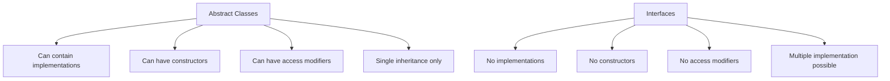

# TypeScript Abstract Classes

## Introduction

In object-oriented programming, **abstract classes** act as blueprints for other classes while not being instantiable themselves. They allow you to define common characteristics and behaviors that derived classes must implement, forming a foundational concept in code reusability and inheritance hierarchies.

TypeScript's abstract classes provide a way to define both the structure and some default functionality that subclasses can build upon. They are particularly useful when you want to ensure certain methods or properties exist in derived classes while potentially providing some base implementation.

## Understanding Abstract Classes

An abstract class is created using the `abstract` keyword in TypeScript. Let's break down the key characteristics:

1. **Cannot be instantiated directly** - You cannot create an object directly from an abstract class
2. **Can contain abstract methods** - Methods that must be implemented by derived classes
3. **Can contain concrete methods** - Methods with implementations that can be inherited
4. **Can contain properties** - Both abstract and concrete

## Creating Abstract Classes

Let's start with a basic example of an abstract class:

```typescript
abstract class Animal {
  // Abstract property (must be implemented by subclasses)
  abstract species: string;
  
  // Concrete property (inherited by subclasses)
  protected isAlive: boolean = true;
  
  // Abstract method (must be implemented by subclasses)
  abstract makeSound(): void;
  
  // Concrete method (inherited by subclasses)
  move(): void {
    console.log("Moving...");
  }
  
  // Concrete method that uses abstract members
  describe(): void {
    console.log(`This animal is a ${this.species}`);
  }
}
```

In this example:
- `Animal` is an abstract class that cannot be instantiated directly
- It contains an abstract property `species` that subclasses must implement
- It has an abstract method `makeSound()` that subclasses must implement
- It provides concrete methods `move()` and `describe()` that subclasses inherit

## Using Abstract Classes

To use an abstract class, you must create a subclass that extends it and implements all abstract members:

```typescript
class Dog extends Animal {
  // Implementing the abstract property
  species: string = "Canis familiaris";
  
  // Constructor can initialize additional properties
  constructor(public name: string) {
    super();  // Call the parent constructor
  }
  
  // Implementing the abstract method
  makeSound(): void {
    console.log("Woof! Woof!");
  }
  
  // Adding additional methods
  fetch(): void {
    console.log(`${this.name} is fetching the ball!`);
  }
}

// Creating an instance of the concrete subclass
const myDog = new Dog("Buddy");
myDog.makeSound();  // Output: Woof! Woof!
myDog.move();       // Output: Moving...
myDog.describe();   // Output: This animal is a Canis familiaris
myDog.fetch();      // Output: Buddy is fetching the ball!

// This would cause an error:
// const animal = new Animal(); // Error: Cannot create an instance of an abstract class
```

## Abstract Classes vs Interfaces

Both abstract classes and interfaces help define contracts that other classes must follow, but they have important differences:



Here's a quick comparison:

```typescript
// Abstract class
abstract class Shape {
  color: string;
  
  constructor(color: string) {
    this.color = color;
  }
  
  abstract calculateArea(): number;
  
  displayColor(): void {
    console.log(`This shape is ${this.color}`);
  }
}

// Interface
interface Drawable {
  draw(): void;
}

// Class implementing both
class Circle extends Shape implements Drawable {
  constructor(color: string, private radius: number) {
    super(color);
  }
  
  calculateArea(): number {
    return Math.PI * this.radius * this.radius;
  }
  
  draw(): void {
    console.log(`Drawing a ${this.color} circle`);
  }
}

const circle = new Circle("red", 5);
circle.displayColor();    // Output: This shape is red
console.log(circle.calculateArea());  // Output: 78.53981633974483
circle.draw();            // Output: Drawing a red circle
```

## Real-world Examples

### Example 1: Database Connectors

A common use case for abstract classes is creating a database access layer:

```typescript
abstract class DatabaseConnector {
  abstract connect(): void;
  abstract disconnect(): void;
  abstract executeQuery(query: string): any[];
  
  // Shared functionality
  isConnected: boolean = false;
  
  logQuery(query: string): void {
    console.log(`Executing: ${query}`);
  }
  
  // Template method pattern
  performQuery(query: string): any[] {
    if (!this.isConnected) {
      this.connect();
    }
    
    this.logQuery(query);
    const result = this.executeQuery(query);
    
    return result;
  }
}

class MySQLConnector extends DatabaseConnector {
  connect(): void {
    console.log("Connecting to MySQL database...");
    this.isConnected = true;
  }
  
  disconnect(): void {
    console.log("Disconnecting from MySQL database...");
    this.isConnected = false;
  }
  
  executeQuery(query: string): any[] {
    // MySQL-specific implementation
    console.log(`MySQL executing: ${query}`);
    return [{ id: 1, name: "Example" }];
  }
}

class MongoDBConnector extends DatabaseConnector {
  connect(): void {
    console.log("Connecting to MongoDB...");
    this.isConnected = true;
  }
  
  disconnect(): void {
    console.log("Disconnecting from MongoDB...");
    this.isConnected = false;
  }
  
  executeQuery(query: string): any[] {
    // MongoDB-specific implementation
    console.log(`MongoDB finding: ${query}`);
    return [{ _id: "abc123", name: "Example" }];
  }
}

// Using the connectors
const mysql = new MySQLConnector();
const results = mysql.performQuery("SELECT * FROM users");
// Output:
// Connecting to MySQL database...
// Executing: SELECT * FROM users
// MySQL executing: SELECT * FROM users
```

### Example 2: UI Components

Another excellent application of abstract classes is in UI frameworks:

```typescript
abstract class UIComponent {
  protected element: HTMLElement | null = null;
  
  constructor(public id: string) {}
  
  abstract render(): HTMLElement;
  
  // Shared functionality
  mount(parentId: string): void {
    const parent = document.getElementById(parentId);
    if (!parent) {
      throw new Error(`Parent element with id ${parentId} not found`);
    }
    
    this.element = this.render();
    parent.appendChild(this.element);
  }
  
  unmount(): void {
    if (this.element && this.element.parentNode) {
      this.element.parentNode.removeChild(this.element);
    }
  }
  
  updateStyles(styles: Record<string, string>): void {
    if (!this.element) return;
    
    Object.entries(styles).forEach(([property, value]) => {
      (this.element!.style as any)[property] = value;
    });
  }
}

class Button extends UIComponent {
  constructor(
    id: string,
    private text: string,
    private onClick: () => void
  ) {
    super(id);
  }
  
  render(): HTMLElement {
    const button = document.createElement('button');
    button.id = this.id;
    button.textContent = this.text;
    button.addEventListener('click', this.onClick);
    return button;
  }
  
  setText(newText: string): void {
    this.text = newText;
    if (this.element) {
      this.element.textContent = newText;
    }
  }
}

class ImageCard extends UIComponent {
  constructor(
    id: string,
    private imageUrl: string,
    private caption: string
  ) {
    super(id);
  }
  
  render(): HTMLElement {
    const container = document.createElement('div');
    container.id = this.id;
    container.className = 'image-card';
    
    const image = document.createElement('img');
    image.src = this.imageUrl;
    image.alt = this.caption;
    
    const captionElement = document.createElement('p');
    captionElement.textContent = this.caption;
    
    container.appendChild(image);
    container.appendChild(captionElement);
    
    return container;
  }
  
  updateImage(newUrl: string): void {
    this.imageUrl = newUrl;
    if (this.element) {
      const img = this.element.querySelector('img');
      if (img) {
        img.src = newUrl;
      }
    }
  }
}

// Usage example (in a browser environment)
const loginButton = new Button('login-btn', 'Login', () => {
  console.log('Login clicked');
});
// loginButton.mount('app');
```

## Best Practices

When working with abstract classes in TypeScript, consider these best practices:

1. **Use abstract classes when:**
   - You need to share code among several closely related classes
   - You want to enforce that subclasses implement certain methods/properties
   - You want to provide some base implementation

2. **Prefer interfaces when:**
   - You need multiple inheritance
   - You're defining a contract with no implementation details
   - Classes implementing the interface aren't closely related

3. **Follow the "Template Method" pattern** - Define the skeleton of an algorithm in the abstract class, deferring some steps to subclasses

4. **Keep the hierarchy shallow** - Deeply nested inheritance hierarchies can become difficult to maintain

5. **Use meaningful names** - Name abstract classes to clearly indicate their purpose

## Common Pitfalls

When working with abstract classes, watch out for these common issues:

### 1. Forgetting to implement abstract methods

```typescript
abstract class Base {
  abstract doSomething(): void;
}

// This will cause a compile error
class Derived extends Base {
  // Error: Non-abstract class 'Derived' does not implement 
  // inherited abstract member 'doSomething' from class 'Base'
}
```

### 2. Trying to instantiate an abstract class

```typescript
abstract class Vehicle {
  abstract start(): void;
}

// Error: Cannot create an instance of an abstract class
const v = new Vehicle();
```

### 3. Making a concrete method depend on an abstract property that isn't initialized in the constructor

```typescript
abstract class Form {
  abstract formName: string;
  
  // This might cause issues if formName isn't properly set
  submit(): void {
    console.log(`Submitting form: ${this.formName}`);
  }
}
```

## Summary

Abstract classes in TypeScript provide a powerful way to define common functionality while enforcing implementation requirements on subclasses. They sit between interfaces (pure contracts) and concrete classes (fully implemented), offering the best of both worlds when used appropriately.

Key takeaways:
- Abstract classes cannot be instantiated directly
- They can contain abstract methods that must be implemented by subclasses
- They can provide concrete methods and properties that subclasses inherit
- They're ideal for defining template methods and enforcing structure
- Use them when you need to share code between related classes

## Exercises

1. Create an abstract `Shape` class with abstract methods for calculating area and perimeter. Then implement concrete `Circle` and `Rectangle` classes.

2. Design an abstract `PaymentProcessor` class with methods for handling different stages of payment processing. Implement concrete classes for `CreditCardProcessor` and `PayPalProcessor`.

3. Create an abstract `Logger` class with different log level methods. Implement `ConsoleLogger` and `FileLogger` subclasses.

4. Implement the "Template Method" pattern using an abstract class for sorting algorithms, with concrete implementations for different sorting techniques.

## Additional Resources

- [TypeScript Handbook: Classes](https://www.typescriptlang.org/docs/handbook/2/classes.html)
- [Design Patterns: Template Method Pattern](https://refactoring.guru/design-patterns/template-method)
- [SOLID Principles in TypeScript](https://blog.bitsrc.io/solid-principles-in-typescript-153e6923ffdb)