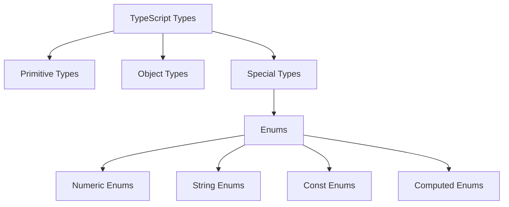

# TypeScript Enums

Enums (short for enumerations) are one of TypeScript's special features that allow developers to define a set of named constants. They make it easier to document intent and create a set of distinct cases. In this guide, we'll explore TypeScript enums in depth, their types, use cases, and best practices.

## What are Enums?

An enum is a special "class" that represents a group of constants (unchangeable variables). Enums come in handy when you want to define a set of related values that can be used interchangeably in your code.

Think of an enum as a way to give more friendly names to sets of numeric or string values.

## Basic Enum Syntax

Here's the basic syntax for creating an enum in TypeScript:

```typescript
enum EnumName {
  Value1,
  Value2,
  Value3
}
```

## Numeric Enums

By default, enums in TypeScript are numeric. The first value is assigned 0, and each subsequent value is incremented by 1.

```typescript
enum Direction {
  Up,      // 0
  Down,    // 1
  Left,    // 2
  Right    // 3
}

// Usage
const myDirection: Direction = Direction.Up;
console.log(myDirection); // Output: 0
console.log(Direction[0]); // Output: "Up"
```

You can also specify custom numeric values:

```typescript
enum StatusCode {
  OK = 200,
  BadRequest = 400,
  Unauthorized = 401,
  NotFound = 404,
  InternalServerError = 500
}

function handleResponse(code: StatusCode) {
  switch(code) {
    case StatusCode.OK:
      console.log("Request successful");
      break;
    case StatusCode.NotFound:
      console.log("Resource not found");
      break;
    default:
      console.log("Unknown status code");
  }
}

handleResponse(StatusCode.OK); // Output: "Request successful"
```

## String Enums

TypeScript also supports string enums, where each member has a string value:

```typescript
enum Direction {
  Up = "UP",
  Down = "DOWN",
  Left = "LEFT",
  Right = "RIGHT"
}

console.log(Direction.Up); // Output: "UP"
```

String enums are more readable in debugging and provide better documentation, but they don't support reverse mapping like numeric enums.

## Heterogeneous Enums

TypeScript allows mixing string and numeric enum values, though this is generally not recommended:

```typescript
enum BooleanLikeHeterogeneousEnum {
  No = 0,
  Yes = "YES",
}
```

## Computed and Constant Members

Enum members can be constant or computed:

```typescript
enum FileAccess {
  // Constant members
  None = 0,
  Read = 1 << 0, // 1
  Write = 1 << 1, // 2
  ReadWrite = Read | Write, // 3
  
  // Computed member
  G = "123".length // 3
}
```

## Enum at Runtime

Enums are real objects that exist at runtime:

```typescript
enum E {
  X, Y, Z
}

function f(obj: { X: number }) {
  return obj.X;
}

console.log(f(E)); // Output: 0
```

## Const Enums

For better performance, TypeScript provides `const enum`, which is completely removed during compilation:

```typescript
const enum Direction {
  Up,
  Down,
  Left,
  Right
}

const value = Direction.Up;
```

Compiles to:

```javascript
const value = 0; /* Direction.Up */
```

This avoids creating an object for the enum at runtime, making your code more efficient.

## Ambient Enums

Ambient enums are used to describe the shape of already existing enum types:

```typescript
declare enum Directions {
  Up,
  Down,
  Left,
  Right
}
```

## Real-World Examples

### Example 1: API Response Handling

```typescript
enum ApiResponseStatus {
  Success = "SUCCESS",
  Error = "ERROR",
  Pending = "PENDING"
}

interface ApiResponse {
  status: ApiResponseStatus;
  data: any;
  message: string;
}

function processResponse(response: ApiResponse) {
  switch(response.status) {
    case ApiResponseStatus.Success:
      return `Successfully processed: ${response.data}`;
    case ApiResponseStatus.Error:
      return `Error: ${response.message}`;
    case ApiResponseStatus.Pending:
      return "Processing, please wait...";
  }
}

const response: ApiResponse = {
  status: ApiResponseStatus.Success,
  data: { username: "johndoe" },
  message: ""
};

console.log(processResponse(response)); // Output: "Successfully processed: [object Object]"
```

### Example 2: Permission System

```typescript
enum UserRole {
  Admin = "ADMIN",
  Editor = "EDITOR",
  Viewer = "VIEWER"
}

enum Permission {
  Read = 1,
  Write = 2,
  Delete = 4,
  Execute = 8
}

const rolePermissions: Record<UserRole, number> = {
  [UserRole.Admin]: Permission.Read | Permission.Write | Permission.Delete | Permission.Execute,
  [UserRole.Editor]: Permission.Read | Permission.Write,
  [UserRole.Viewer]: Permission.Read
};

function checkPermission(role: UserRole, permission: Permission): boolean {
  return (rolePermissions[role] & permission) !== 0;
}

console.log(checkPermission(UserRole.Editor, Permission.Write)); // Output: true
console.log(checkPermission(UserRole.Viewer, Permission.Delete)); // Output: false
```

## When to Use Enums vs. Union Types

TypeScript offers both enums and union types, and it's important to know when to use each:

```typescript
// Using an enum
enum Color {
  Red = "RED",
  Green = "GREEN",
  Blue = "BLUE"
}

// Using a union type
type Color2 = "RED" | "GREEN" | "BLUE";
```

Use enums when:
- You need a collection of related constants
- You want to signal that these values are related to each other
- You need to access enum values by their numeric value

Use union types when:
- You need simple type checking
- You want to avoid generating runtime code for enums
- You prefer a more lightweight approach

## Best Practices

1. **Use PascalCase for enum names and enum members**:
```typescript
enum HttpStatusCode {
  OK = 200,
  NotFound = 404
}
```

2. **Prefer const enums for better performance**:
```typescript
const enum Direction {
  Up,
  Down,
  Left,
  Right
}
```

3. **Use string enums for better readability**:
```typescript
enum LogLevel {
  Error = "ERROR",
  Warning = "WARNING",
  Info = "INFO",
  Debug = "DEBUG"
}
```

4. **Avoid heterogeneous enums (mixing string and numeric values)**.

5. **Document your enums with JSDoc comments**:
```typescript
/**
 * Represents the seasons of the year
 */
enum Season {
  /** Winter season: December-February */
  Winter,
  /** Spring season: March-May */
  Spring,
  /** Summer season: June-August */
  Summer,
  /** Fall season: September-November */
  Fall
}
```

## Enums in the TypeScript Ecosystem

Here's a visual representation of how enums fit within TypeScript's type system:



## Summary

TypeScript enums are a powerful feature that allows you to define sets of named constants. They can be numeric or string-based, and they offer benefits like improved readability, type safety, and intelligent code completion.

Key points to remember:
- Enums create a named set of constants
- Numeric enums start at 0 by default but can be customized
- String enums provide better readability and debugging
- Const enums are removed during compilation for better performance
- Enums are real objects at runtime (except const enums)

## Exercises

1. Create a `DaysOfWeek` enum with values for each day of the week.
2. Implement a `TrafficLight` enum with string values "RED", "YELLOW", and "GREEN", and create a function that simulates a traffic light changing states.
3. Define a `FilePermission` enum using bit flags and write functions to check, add, and remove permissions.
4. Create a const enum for cardinal directions and use it in a navigation function.

## Additional Resources

- [TypeScript Official Documentation on Enums](https://www.typescriptlang.org/docs/handbook/enums.html)
- [TypeScript Deep Dive: Enums](https://basarat.gitbook.io/typescript/type-system/enums)
- [When to Use TypeScript Enums (And When Not To)](https://blog.logrocket.com/typescript-enums-vs-types/)

With a good understanding of TypeScript enums, you'll be able to write more expressive and type-safe code, making your applications more robust and maintainable.