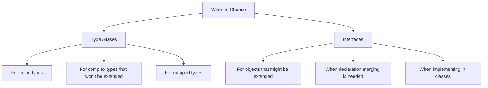

# TypeScript Type Aliases

Type aliases are one of TypeScript's most useful features, allowing you to create custom names for any type. They help you avoid repetition, improve code readability, and make complex type definitions more manageable. Let's explore how type aliases work and why they're an essential tool in your TypeScript toolkit.

## What Are Type Aliases?

A type alias is a way to give a name to a specific type or a combination of types. Think of it as creating a custom label for a type definition that you can reuse throughout your code.

The basic syntax is:

```typescript
type AliasName = TypeDefinition;
```

## Basic Type Aliases

Let's start with some simple examples:

```typescript
// Creating a type alias for a string
type Username = string;

// Using the type alias
const user: Username = "john_doe";
console.log(user); // Output: john_doe
```

In this example, `Username` is just another name for the `string` type. While this might seem trivial, it adds semantic meaning to your code. Anyone reading your code can immediately understand that this string represents a username.

## Creating Aliases for Complex Types

Type aliases become more powerful when working with complex types:

```typescript
// Without type alias
let user: {
  id: number;
  name: string;
  email: string;
  isActive: boolean;
};

// With type alias
type User = {
  id: number;
  name: string;
  email: string;
  isActive: boolean;
};

// Now we can create users more clearly
const newUser: User = {
  id: 1,
  name: "Jane Smith",
  email: "jane@example.com",
  isActive: true
};
```

## Union Types with Type Aliases

Type aliases are particularly useful with union types:

```typescript
type ID = number | string;

function printID(id: ID) {
  console.log(`ID: ${id}`);
}

printID(101); // Output: ID: 101
printID("A-123"); // Output: ID: A-123
```

This creates a type `ID` that can be either a number or a string, making your code more flexible while maintaining type safety.

## Type Aliases for Function Signatures

You can also create aliases for function types:

```typescript
type GreetFunction = (name: string) => string;

const greet: GreetFunction = (name) => {
  return `Hello, ${name}!`;
};

console.log(greet("Alice")); // Output: Hello, Alice!
```

This makes it easier to reuse function signatures across your codebase.

## Extending Type Aliases with Intersection Types

You can combine multiple types using intersection types:

```typescript
type Person = {
  name: string;
  age: number;
};

type Employee = {
  id: number;
  department: string;
};

type EmployeeRecord = Person & Employee;

const employee: EmployeeRecord = {
  name: "Robert Johnson",
  age: 32,
  id: 12345,
  department: "Engineering"
};
```

The `EmployeeRecord` type combines all properties from both `Person` and `Employee`.

## Using Generics with Type Aliases

Type aliases can be made even more flexible with generics:

```typescript
type Container<T> = {
  value: T;
  timestamp: number;
};

const stringContainer: Container<string> = {
  value: "Hello World",
  timestamp: Date.now()
};

const numberContainer: Container<number> = {
  value: 42,
  timestamp: Date.now()
};
```

## Recursive Type Aliases

Type aliases can be recursive, which is useful for tree-like structures:

```typescript
type TreeNode<T> = {
  value: T;
  children?: TreeNode<T>[];
};

const tree: TreeNode<string> = {
  value: "root",
  children: [
    {
      value: "child1",
      children: [{ value: "grandchild" }]
    },
    {
      value: "child2"
    }
  ]
};
```

## Real-World Example: API Response Typing

In real applications, type aliases help manage complex API responses:

```typescript
type ApiResponse<T> = {
  data: T;
  status: number;
  message: string;
  timestamp: number;
};

type UserData = {
  id: number;
  username: string;
  email: string;
};

// Simulating an API response
function fetchUserData(): ApiResponse<UserData> {
  return {
    data: {
      id: 1,
      username: "johndoe",
      email: "john@example.com"
    },
    status: 200,
    message: "Success",
    timestamp: Date.now()
  };
}

const response = fetchUserData();
console.log(`User ${response.data.username} fetched successfully!`);
// Output: User johndoe fetched successfully!
```

## Type Aliases vs. Interfaces

While type aliases and interfaces might seem similar, they have key differences:



Here's a code comparison:

```typescript
// Type Alias
type Animal = {
  name: string;
  sound: string;
};

// Interface
interface Vehicle {
  make: string;
  model: string;
}

// Extending a type with intersection
type Bear = Animal & {
  hibernates: boolean;
};

// Extending an interface
interface Car extends Vehicle {
  wheels: number;
}
```

## Best Practices for Type Aliases

1. **Use PascalCase for type names**:
```typescript
type UserProfile = { /* ... */ };  // Good
type userprofile = { /* ... */ };  // Avoid
```

2. **Be descriptive with type names**:
```typescript
type FetchResponse = { /* ... */ };  // Good
type Res = { /* ... */ };  // Avoid
```

3. **Prefer type aliases for unions and intersections**:
```typescript
type Result = Success | Error;  // Union types work well with type aliases
```

4. **Use interfaces for objects that might be extended later**:
```typescript
interface User {
  id: number;
  name: string;
}
// Later can be extended through declaration merging
```

## Summary

Type aliases in TypeScript provide a powerful way to:
- Create custom names for types to improve code readability
- Define complex types once and reuse them throughout your code
- Work with union types, intersection types, and generics
- Make your code more maintainable and self-documenting

By understanding and leveraging type aliases, you can write TypeScript code that's easier to understand, maintain, and refactor.

## Practice Exercises

1. Create a type alias for a configuration object with properties for theme, language, and notifications (boolean).
2. Create a type alias for a function that takes two numbers and returns their sum.
3. Create a type alias that uses generics to represent a paginated API response.
4. Create a recursive type alias for a file system structure (folders containing files and other folders).

## Additional Resources

- [TypeScript Handbook: Type Aliases](https://www.typescriptlang.org/docs/handbook/2/everyday-types.html#type-aliases)
- [TypeScript Documentation: Advanced Types](https://www.typescriptlang.org/docs/handbook/2/types-from-types.html)
- [TypeScript Deep Dive: Type Aliases](https://basarat.gitbook.io/typescript/type-system/type-aliases)

Now that you understand type aliases, you can leverage them to write more expressive, maintainable TypeScript code!