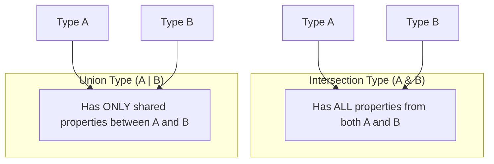

# TypeScript Intersection Types

## Introduction

In TypeScript, intersection types allow you to combine multiple types into one. This is particularly useful when you want to create a new type that has all the features of existing types. The intersection type is represented by the `&` operator, which means "and" - the resulting type will have all properties from all the constituent types.

Think of intersection types as a way to mix and match properties from different types to create a more specialized type that inherits everything from its components.

## Basic Intersection Types

Let's start with a simple example to understand how intersection types work:

```typescript
type Person = {
  name: string;
  age: number;
};

type Employee = {
  employeeId: string;
  department: string;
};

// Intersection type
type EmployedPerson = Person & Employee;

// Using the intersection type
const worker: EmployedPerson = {
  name: "John Doe",
  age: 32,
  employeeId: "E123",
  department: "Engineering"
};
```

In this example, `EmployedPerson` is an intersection type that contains all properties from both `Person` and `Employee`. An object of type `EmployedPerson` must have all properties from both types.

## Intersecting Multiple Types

You can combine more than two types using the `&` operator:

```typescript
type Address = {
  street: string;
  city: string;
  zipCode: string;
};

type ContactInfo = {
  email: string;
  phone: string;
};

// Intersecting multiple types
type EmployeeRecord = Person & Employee & Address & ContactInfo;

const employee: EmployeeRecord = {
  name: "Jane Smith",
  age: 28,
  employeeId: "E456",
  department: "Marketing",
  street: "123 Main St",
  city: "Boston",
  zipCode: "02108",
  email: "jane@example.com",
  phone: "555-1234"
};
```

## Intersection with Interfaces

You can use intersection types with interfaces as well:

```typescript
interface Printable {
  print(): void;
}

interface Loggable {
  log(message: string): void;
}

// Creating an intersection type with interfaces
type PrintableAndLoggable = Printable & Loggable;

// Implementing the intersection type
class Document implements PrintableAndLoggable {
  print() {
    console.log("Printing document...");
  }

  log(message: string) {
    console.log(`Log: ${message}`);
  }
}

const doc = new Document();
doc.print();  // Output: Printing document...
doc.log("Document processed");  // Output: Log: Document processed
```

## Intersection with Function Types

Function types can also be combined using intersection types:

```typescript
type Logger = (message: string) => void;
type Formatter = (input: string) => string;

// Combining function types
type LoggerWithFormatter = Logger & Formatter;

// This won't work directly because the function needs to satisfy both type signatures
// We need a more specific implementation pattern
```

For function types, the intersection is more complex because a function would need to satisfy all the signatures simultaneously, which isn't possible with different parameter types. Instead, we typically use overloaded functions or additional patterns to handle this case.

## Practical Use Cases

### 1. Extending Configuration Objects

Intersection types are perfect for extending configuration objects:

```typescript
// Base configuration
type BaseConfig = {
  host: string;
  port: number;
  secure: boolean;
};

// Database specific configuration
type DatabaseConfig = {
  username: string;
  password: string;
  database: string;
};

// Complete database configuration
type CompleteDatabaseConfig = BaseConfig & DatabaseConfig;

const dbConfig: CompleteDatabaseConfig = {
  host: "localhost",
  port: 5432,
  secure: true,
  username: "admin",
  password: "securepassword",
  database: "userdata"
};
```

### 2. Mixing in Capabilities (Mixins)

Intersection types can be used to implement mixins, which add capabilities to types:

```typescript
// Base class for product items
interface Product {
  id: string;
  name: string;
  price: number;
}

// Timestamped capability
interface TimeStamped {
  createdAt: Date;
  updatedAt: Date;
}

// Versioning capability
interface Versioned {
  version: number;
  updateVersion(): void;
}

// A product with additional capabilities
type TrackedProduct = Product & TimeStamped & Versioned;

// Implementation
const trackedItem: TrackedProduct = {
  id: "prod-123",
  name: "Laptop",
  price: 999.99,
  createdAt: new Date("2023-01-15"),
  updatedAt: new Date("2023-06-10"),
  version: 2,
  updateVersion() {
    this.version++;
    this.updatedAt = new Date();
  }
};

trackedItem.updateVersion();
console.log(`Product ${trackedItem.name} is now version ${trackedItem.version}`);
// Output: Product Laptop is now version 3
```

### 3. State Management in React Applications

Intersection types are useful in React applications for managing component props and state:

```typescript
// Base props for all form components
type FormComponentProps = {
  id: string;
  label: string;
  required: boolean;
};

// Input-specific props
type InputProps = {
  type: 'text' | 'number' | 'email';
  placeholder: string;
  value: string;
  onChange: (value: string) => void;
};

// Validation props
type ValidationProps = {
  minLength?: number;
  maxLength?: number;
  pattern?: RegExp;
  validate: (value: string) => boolean;
  errorMessage?: string;
};

// Complete input field props
type FormInputProps = FormComponentProps & InputProps & ValidationProps;

// Usage example (pseudo-React)
function FormInput(props: FormInputProps) {
  // Component implementation would go here
}

const emailInput: FormInputProps = {
  id: "email-input",
  label: "Email Address",
  required: true,
  type: "email",
  placeholder: "Enter your email",
  value: "",
  onChange: (value) => console.log(`Email changed to: ${value}`),
  pattern: /^[^\s@]+@[^\s@]+\.[^\s@]+$/,
  validate: (value) => /^[^\s@]+@[^\s@]+\.[^\s@]+$/.test(value),
  errorMessage: "Please enter a valid email address"
};
```

## Common Pitfalls and Considerations

### Conflicting Properties

When combining types with the same property names but different types, TypeScript will merge them into a type that has to satisfy both constraints:

```typescript
type A = {
  x: number;
};

type B = {
  x: string;
};

// This creates a type where x must be both number and string
// which is impossible, so x becomes never
type AB = A & B;

// This will cause an error since no value can be assigned to never
// const impossible: AB = {
//   x: "something" // Error: Type 'string' is not assignable to type 'never'
// };
```

### Handling Incompatible Intersections

When you need to work with potentially incompatible types, you might need to use type guards or other techniques:

```typescript
type StringOrNumberId = 
  | { id: string; type: 'string-id' }
  | { id: number; type: 'number-id' };

function processId(idObj: StringOrNumberId) {
  if (idObj.type === 'string-id') {
    // TypeScript knows idObj.id is a string here
    console.log(`String ID: ${idObj.id.toUpperCase()}`);
  } else {
    // TypeScript knows idObj.id is a number here
    console.log(`Number ID: ${idObj.id.toFixed(0)}`);
  }
}
```

## Intersection vs Union Types

It's important to understand the difference between intersection types (`&`) and union types (`|`):



- **Intersection types (`&`)**: An object must have all properties from all constituent types.
- **Union types (`|`)**: An object must be assignable to at least one of the constituent types.

## Summary

TypeScript's intersection types offer a powerful way to compose and combine types, enabling you to:

1. Create complex types by combining simpler ones
2. Implement mixins and add capabilities to existing types
3. Build extensible configurations and settings objects
4. Create reusable and composable type structures

When working with intersection types, remember to be cautious about conflicting property types, which can result in the `never` type. Use interfaces, type aliases, and intersection types together to create a flexible and maintainable type system in your applications.

## Additional Resources

To deepen your understanding of intersection types in TypeScript, consider exploring these topics:

- Advanced type manipulation with conditional types
- Working with mapped types to transform existing types
- Type guards and type narrowing to handle complex intersections
- Design patterns that leverage intersection types

## Exercises

1. Create a `Person` and `Address` type, then combine them using an intersection type to create a `Contact` type.
2. Implement a `Serializable` interface with methods to convert an object to and from JSON. Create a few different types and combine them with the `Serializable` interface.
3. Create a type hierarchy for a UI component library, using intersection types to add theming capabilities, accessibility properties, and animation settings to base components.
4. Design a state management type system for a small application, using intersection types to compose different aspects of the state.