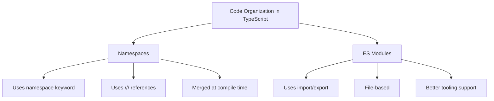

# TypeScript Namespaces

## Introduction

Namespaces in TypeScript provide a way to logically group related code that helps prevent name collisions in your applications. They're especially useful when working on large applications or when integrating multiple libraries. Before ES6 modules became standard, namespaces (previously called "internal modules") were the primary way to organize TypeScript code.

Namespaces allow you to:

- Organize related functionality under a single name
- Avoid naming conflicts in the global scope
- Create logical boundaries within your code
- Control which parts of your code are accessible to external components

While modern TypeScript development increasingly favors ES modules, understanding namespaces remains important, especially when working with legacy code or specific architectural patterns.

## Basic Namespace Syntax

A namespace is defined using the `namespace` keyword followed by the namespace name and a block of code enclosed in curly braces.

```typescript
namespace Validation {
  // Code within the namespace
  export interface StringValidator {
    isValid(s: string): boolean;
  }

  // Only exported members are accessible from outside
  export class EmailValidator implements StringValidator {
    isValid(s: string): boolean {
      const emailRegex = /^[^\s@]+@[^\s@]+\.[^\s@]+$/;
      return emailRegex.test(s);
    }
  }

  // Non-exported members are private to the namespace
  const defaultMessage = "Invalid format";  // Not accessible outside
}

// Using the namespace
const emailValidator = new Validation.EmailValidator();
console.log(emailValidator.isValid("test@example.com")); // true
console.log(emailValidator.isValid("invalid-email"));    // false
```

In this example:
- We create a `Validation` namespace containing an interface and a class
- The `export` keyword makes certain members accessible outside the namespace
- Members without the `export` keyword remain private to the namespace

## Namespace Splitting

One powerful feature of namespaces is that they can be split across multiple files and will be merged at compile time. This is known as **namespace spanning** or **multi-file namespaces**.

**File: validators/string-validator.ts**
```typescript
namespace Validation {
  export interface StringValidator {
    isValid(s: string): boolean;
  }
}
```

**File: validators/email-validator.ts**
```typescript
/// <reference path="string-validator.ts" />
namespace Validation {
  export class EmailValidator implements StringValidator {
    isValid(s: string): boolean {
      const emailRegex = /^[^\s@]+@[^\s@]+\.[^\s@]+$/;
      return emailRegex.test(s);
    }
  }
}
```

**File: validators/zip-code-validator.ts**
```typescript
/// <reference path="string-validator.ts" />
namespace Validation {
  export class ZipCodeValidator implements StringValidator {
    isValid(s: string): boolean {
      const zipRegex = /^\d{5}(-\d{4})?$/;
      return zipRegex.test(s);
    }
  }
}
```

**File: main.ts**
```typescript
/// <reference path="validators/email-validator.ts" />
/// <reference path="validators/zip-code-validator.ts" />

// Using the validators
let validators: { [s: string]: Validation.StringValidator } = {};
validators["email"] = new Validation.EmailValidator();
validators["zip"] = new Validation.ZipCodeValidator();

// Test
["test@example.com", "123-456-7890", "90210"].forEach(s => {
  console.log(`"${s}" - Email validator: ${validators["email"].isValid(s)}`);
  console.log(`"${s}" - Zip code validator: ${validators["zip"].isValid(s)}`);
});
```

The `/// <reference path="..." />` syntax tells the TypeScript compiler about the dependencies between files, enabling proper compilation.

## Nested Namespaces

You can nest namespaces within other namespaces to create hierarchical organization:

```typescript
namespace Application {
  export namespace Validators {
    export class EmailValidator {
      isValid(email: string): boolean {
        const emailRegex = /^[^\s@]+@[^\s@]+\.[^\s@]+$/;
        return emailRegex.test(email);
      }
    }

    export class PasswordValidator {
      isValid(password: string): boolean {
        return password.length >= 8;
      }
    }
  }
  
  export namespace UI {
    export class Form {
      validate(email: string, password: string): boolean {
        const emailValidator = new Validators.EmailValidator();
        const passwordValidator = new Validators.PasswordValidator();
        
        return emailValidator.isValid(email) && passwordValidator.isValid(password);
      }
    }
  }
}

// Usage
const form = new Application.UI.Form();
console.log(form.validate("user@example.com", "password123")); // true
console.log(form.validate("invalid-email", "pwd")); // false
```

## Namespace Aliases

For deeply nested namespaces or namespaces with long names, TypeScript provides a way to create aliases for easier access:

```typescript
namespace Authentication {
  export namespace Services {
    export namespace Validation {
      export class PasswordPolicy {
        validateComplexity(password: string): boolean {
          // Password should be at least 8 characters with letters and numbers
          return password.length >= 8 && 
                 /[a-zA-Z]/.test(password) && 
                 /[0-9]/.test(password);
        }
      }
    }
  }
}

// Without alias - very verbose
const policy1 = new Authentication.Services.Validation.PasswordPolicy();

// With namespace alias
import PasswordValidation = Authentication.Services.Validation;
const policy2 = new PasswordValidation.PasswordPolicy();

// Test
console.log(policy2.validateComplexity("simple")); // false
console.log(policy2.validateComplexity("Complex123")); // true
```

The `import ... = ...` syntax creates an alias that makes the code more readable and maintainable.

## Ambient Namespaces

When working with third-party libraries that don't have TypeScript definitions, you can use ambient namespaces to describe the shape of these libraries:

```typescript
// Example declaration file: jquery.d.ts
declare namespace $ {
  function ajax(settings: any): void;
  function get(url: string, callback: (data: any) => void): void;
  
  interface JQuery {
    text(content: string): JQuery;
    on(event: string, handler: (eventObject: any) => any): JQuery;
  }
  
  function $(selector: string): JQuery;
}
```

This allows you to use the jQuery library with TypeScript even if it wasn't written in TypeScript:

```typescript
// Using the ambient namespace
$.ajax({
  url: "/api/data",
  method: "GET",
  success: (data) => console.log(data)
});

$("#button").on("click", () => {
  console.log("Button clicked!");
});
```

## Namespaces vs. Modules

While namespaces are useful, modern TypeScript development increasingly favors ES modules. Here's a comparison:

| Namespaces | ES Modules |
|------------|------------|
| Organized with logical containers | Organized with file-based modules |
| Use internal compiler `reference` tags | Use explicit `import`/`export` statements |
| Need to be carefully managed for global scope | Better encapsulation with per-file scoping |
| Compile into IIFE in JavaScript | Support for modern bundlers and tree-shaking |
| Good for simple scripts or global libraries | Better for complex applications |



## Practical Example: Form Validation Library

Let's create a more comprehensive example of a form validation library using namespaces:

```typescript
namespace FormValidation {
  // Base interfaces
  export interface Validator<T> {
    validate(value: T): ValidationResult;
  }

  export interface ValidationResult {
    isValid: boolean;
    errorMessage?: string;
  }

  // String validators
  export namespace StringValidators {
    export class RequiredValidator implements Validator<string> {
      validate(value: string): ValidationResult {
        return {
          isValid: value !== undefined && value.trim() !== '',
          errorMessage: value === undefined || value.trim() === '' ? 'This field is required' : undefined
        };
      }
    }

    export class EmailValidator implements Validator<string> {
      validate(value: string): ValidationResult {
        const emailRegex = /^[^\s@]+@[^\s@]+\.[^\s@]+$/;
        return {
          isValid: emailRegex.test(value),
          errorMessage: !emailRegex.test(value) ? 'Please enter a valid email address' : undefined
        };
      }
    }

    export class MinLengthValidator implements Validator<string> {
      constructor(private minLength: number) {}

      validate(value: string): ValidationResult {
        return {
          isValid: value.length >= this.minLength,
          errorMessage: value.length < this.minLength 
            ? `Must be at least ${this.minLength} characters long` 
            : undefined
        };
      }
    }
  }

  // Number validators
  export namespace NumberValidators {
    export class RangeValidator implements Validator<number> {
      constructor(private min: number, private max: number) {}

      validate(value: number): ValidationResult {
        return {
          isValid: value >= this.min && value <= this.max,
          errorMessage: value < this.min || value > this.max
            ? `Value must be between ${this.min} and ${this.max}`
            : undefined
        };
      }
    }

    export class PositiveValidator implements Validator<number> {
      validate(value: number): ValidationResult {
        return {
          isValid: value > 0,
          errorMessage: value <= 0 ? 'Value must be positive' : undefined
        };
      }
    }
  }

  // Form field
  export class FormField<T> {
    private validators: Validator<T>[] = [];

    constructor(private name: string, private value: T) {}

    addValidator(validator: Validator<T>): FormField<T> {
      this.validators.push(validator);
      return this;
    }

    validate(): ValidationResult[] {
      return this.validators.map(validator => validator.validate(this.value));
    }

    isValid(): boolean {
      return this.validate().every(result => result.isValid);
    }

    getErrors(): string[] {
      return this.validate()
        .filter(result => !result.isValid && result.errorMessage !== undefined)
        .map(result => result.errorMessage as string);
    }
  }

  // Form
  export class Form {
    private fields: { [key: string]: FormField<any> } = {};

    addField(name: string, field: FormField<any>): Form {
      this.fields[name] = field;
      return this;
    }

    isValid(): boolean {
      return Object.values(this.fields).every(field => field.isValid());
    }

    getErrors(): { [key: string]: string[] } {
      const errors: { [key: string]: string[] } = {};
      
      Object.entries(this.fields).forEach(([name, field]) => {
        const fieldErrors = field.getErrors();
        if (fieldErrors.length > 0) {
          errors[name] = fieldErrors;
        }
      });
      
      return errors;
    }
  }
}

// Usage example
const form = new FormValidation.Form();

// Email field
const emailField = new FormValidation.FormField<string>("email", "test@example")
  .addValidator(new FormValidation.StringValidators.RequiredValidator())
  .addValidator(new FormValidation.StringValidators.EmailValidator());

// Password field
const passwordField = new FormValidation.FormField<string>("password", "pass")
  .addValidator(new FormValidation.StringValidators.RequiredValidator())
  .addValidator(new FormValidation.StringValidators.MinLengthValidator(8));

// Age field
const ageField = new FormValidation.FormField<number>("age", 15)
  .addValidator(new FormValidation.NumberValidators.RangeValidator(18, 100));

// Add fields to form
form.addField("email", emailField)
    .addField("password", passwordField)
    .addField("age", ageField);

// Validate form
console.log("Is form valid?", form.isValid()); // false
console.log("Form errors:", form.getErrors());
/* Output:
Is form valid? false
Form errors: {
  email: ['Please enter a valid email address'],
  password: ['Must be at least 8 characters long'],
  age: ['Value must be between 18 and 100']
}
*/
```

This example demonstrates a comprehensive form validation library that:
- Uses nested namespaces for organization
- Shows how to implement multiple types of validators
- Provides a flexible API for building and validating forms
- Shows practical usage of namespaces in a real-world scenario

## Summary

TypeScript namespaces provide an organized way to structure code and prevent global namespace pollution. They offer:

- Logical grouping of related functionality
- Prevention of naming conflicts
- Ability to split code across multiple files
- Support for hierarchical organization with nested namespaces
- A way to create aliases for easier access to deeply nested elements

While modern TypeScript development often favors ES modules for code organization, namespaces remain useful in certain scenarios, especially for legacy codebases or simpler applications. Understanding both approaches will make you more versatile as a TypeScript developer.

## Exercises

1. Create a namespace called `MathUtils` with functions for basic operations (add, subtract, multiply, divide) and advanced operations (square, cube, factorial).

2. Implement a validation library using nested namespaces that can validate different types of data (strings, numbers, dates).

3. Convert the namespace-based form validation library from this tutorial into an equivalent ES modules implementation. Compare the differences.

4. Create an ambient namespace for a simple third-party library that doesn't have TypeScript definitions.

5. Implement a namespace-based state management system that allows components to subscribe to state changes.

## Additional Resources

- [TypeScript Handbook: Namespaces](https://www.typescriptlang.org/docs/handbook/namespaces.html)
- [TypeScript Namespaces and Modules](https://www.typescriptlang.org/docs/handbook/namespaces-and-modules.html)
- [When to use namespaces vs. modules](https://www.typescriptlang.org/docs/handbook/modules.html)
- [Working with legacy code using namespaces](https://typescript-eslint.io/rules/no-namespace/)

Remember that while namespaces are a powerful feature in TypeScript, modern best practices generally favor ES modules for new projects. Understanding both approaches will help you work effectively with any TypeScript codebase you encounter.