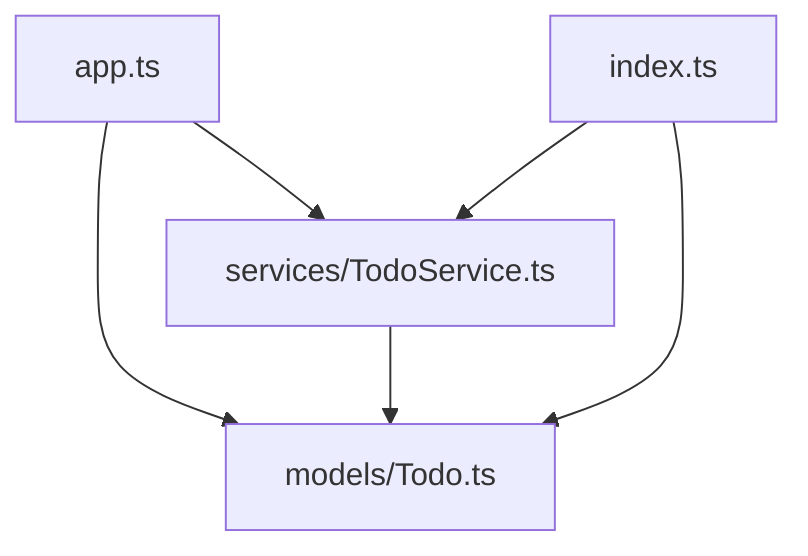

# TypeScript Import/Export

In modern web development, organizing your code into manageable, reusable pieces is essential for maintainability and collaboration. TypeScript's import and export features allow you to split your code into separate files (modules) and control what parts are accessible from other files.

## Introduction to Modules

A module in TypeScript is simply a file that contains TypeScript code. Any file containing a top-level `import` or `export` is considered a module. Modules provide a way to organize code, prevent naming conflicts, and control the visibility of certain parts of your code.

## Export Syntax in TypeScript

### Basic Exports

You can export variables, functions, classes, interfaces, and types from a module using the `export` keyword.

```typescript
// math.ts

// Export individual items
export const PI = 3.14159;
export function add(x: number, y: number): number {
  return x + y;
}
export function subtract(x: number, y: number): number {
  return x - y;
}

// We're keeping this function private to the module
function multiply(x: number, y: number): number {
  return x * y;
}
```

### Named Exports

You can also export items using a separate export statement:

```typescript
// shapes.ts
const CIRCLE = "circle";
const SQUARE = "square";

function calculateCircleArea(radius: number): number {
  return Math.PI * radius * radius;
}

function calculateSquareArea(side: number): number {
  return side * side;
}

// Group exports at the end of the file
export { CIRCLE, SQUARE, calculateCircleArea, calculateSquareArea };
```

### Renamed Exports

You can rename your exports to avoid naming conflicts:

```typescript
// temperature.ts
function convertCelsiusToFahrenheit(celsius: number): number {
  return (celsius * 9/5) + 32;
}

function convertFahrenheitToCelsius(fahrenheit: number): number {
  return (fahrenheit - 32) * 5/9;
}

export { 
  convertCelsiusToFahrenheit as toFahrenheit, 
  convertFahrenheitToCelsius as toCelsius 
};
```

### Default Exports

Each module can have one default export, which is often used when a file exports only one main functionality:

```typescript
// user.ts
export interface UserProps {
  id: number;
  name: string;
  email: string;
}

// Default export (only one per module)
export default class User {
  id: number;
  name: string;
  email: string;
  
  constructor(props: UserProps) {
    this.id = props.id;
    this.name = props.name;
    this.email = props.email;
  }
  
  getDisplayName(): string {
    return this.name;
  }
}

// You can also have additional named exports alongside a default export
export function validateEmail(email: string): boolean {
  return /^[^\s@]+@[^\s@]+\.[^\s@]+$/.test(email);
}
```

### Re-exporting

You can re-export items from other modules to create a public API for your library:

```typescript
// index.ts
export { add, subtract } from './math';
export { CIRCLE, calculateCircleArea } from './shapes';
export { default as User } from './user';

// You can also rename during re-export
export { toFahrenheit as convertToF } from './temperature';
```

## Import Syntax in TypeScript

### Basic Imports

You can import named exports from other modules:

```typescript
// app.ts
import { add, subtract } from './math';

console.log(add(5, 3));      // Output: 8
console.log(subtract(5, 3)); // Output: 2
```

### Renamed Imports

You can rename imports to avoid naming conflicts:

```typescript
// app.ts
import { add as addition, subtract as subtraction } from './math';

console.log(addition(5, 3));      // Output: 8
console.log(subtraction(5, 3));   // Output: 2
```

### Importing Default Exports

Default exports are imported without curly braces, and you can choose any name for them:

```typescript
// profile.ts
import User from './user';

const john = new User({ id: 1, name: 'John Doe', email: 'john@example.com' });
console.log(john.getDisplayName()); // Output: John Doe
```

### Importing Both Default and Named Exports

You can import both default and named exports in one statement:

```typescript
// profile.ts
import User, { validateEmail, UserProps } from './user';

const userProps: UserProps = { 
  id: 1, 
  name: 'John Doe', 
  email: 'john@example.com' 
};

if (validateEmail(userProps.email)) {
  const user = new User(userProps);
  console.log(user.getDisplayName()); // Output: John Doe
}
```

### Importing Everything

You can import all exports from a module as a namespace:

```typescript
// calculator.ts
import * as MathUtils from './math';

console.log(MathUtils.add(5, 3));      // Output: 8
console.log(MathUtils.subtract(5, 3)); // Output: 2
console.log(MathUtils.PI);             // Output: 3.14159
```

### Dynamic Imports

TypeScript also supports dynamic imports using `import()` for code splitting:

```typescript
// dynamicApp.ts
async function loadMathModule() {
  try {
    // This loads the module dynamically only when this function is called
    const mathModule = await import('./math');
    
    console.log(mathModule.add(5, 3));      // Output: 8
    console.log(mathModule.subtract(5, 3)); // Output: 2
  } catch (error) {
    console.error('Failed to load math module', error);
  }
}

// The math module will only be loaded when this function is called
loadMathModule();
```

## TypeScript Module Resolution

TypeScript supports different module resolution strategies:

1. **Classic**: The original TypeScript resolution strategy
2. **Node**: Emulates Node.js module resolution strategy
3. **ESM**: ECMAScript Module resolution

You can configure this in your `tsconfig.json`:

```json
{
  "compilerOptions": {
    "module": "ESNext",
    "moduleResolution": "node"
  }
}
```

## Practical Example: Building a Todo App

Let's see a more complete example of how you might organize a small Todo app using TypeScript modules:

### The Todo Model

```typescript
// models/Todo.ts
export interface TodoProps {
  id?: number;
  title: string;
  completed: boolean;
}

export default class Todo {
  id: number;
  title: string;
  completed: boolean;
  
  constructor(props: TodoProps) {
    this.id = props.id || Date.now();
    this.title = props.title;
    this.completed = props.completed;
  }
  
  toggle(): void {
    this.completed = !this.completed;
  }
}
```

### The Todo Service

```typescript
// services/TodoService.ts
import Todo, { TodoProps } from '../models/Todo';

export class TodoService {
  private todos: Todo[] = [];
  
  addTodo(todoProps: Omit<TodoProps, 'id'>): Todo {
    const todo = new Todo({ ...todoProps });
    this.todos.push(todo);
    return todo;
  }
  
  removeTodo(id: number): boolean {
    const initialLength = this.todos.length;
    this.todos = this.todos.filter(todo => todo.id !== id);
    return initialLength !== this.todos.length;
  }
  
  toggleTodo(id: number): Todo | undefined {
    const todo = this.todos.find(t => t.id === id);
    todo?.toggle();
    return todo;
  }
  
  getAllTodos(): Todo[] {
    return [...this.todos];
  }
}

export default new TodoService();
```

### Main App File

```typescript
// app.ts
import todoService from './services/TodoService';
import Todo from './models/Todo';

// Add some todos
todoService.addTodo({ title: 'Learn TypeScript', completed: false });
todoService.addTodo({ title: 'Master TypeScript Modules', completed: false });
todoService.addTodo({ title: 'Build a project', completed: false });

// Display all todos
function displayTodos(): void {
  const todos = todoService.getAllTodos();
  console.log('Current Todos:');
  todos.forEach(todo => {
    console.log(`- ${todo.title} [${todo.completed ? 'X' : ' '}]`);
  });
}

// Test our app
displayTodos();

// Mark "Learn TypeScript" as completed
const todos = todoService.getAllTodos();
if (todos.length > 0) {
  todoService.toggleTodo(todos[0].id);
}

console.log('\nAfter toggling:');
displayTodos();

/**
 * Output:
 * Current Todos:
 * - Learn TypeScript [ ]
 * - Master TypeScript Modules [ ]
 * - Build a project [ ]
 * 
 * After toggling:
 * Current Todos:
 * - Learn TypeScript [X]
 * - Master TypeScript Modules [ ]
 * - Build a project [ ]
 */
```

### Index File (Barrel File Pattern)

A common pattern is creating "barrel" files to simplify imports:

```typescript
// index.ts
export { default as Todo, TodoProps } from './models/Todo';
export { default as todoService, TodoService } from './services/TodoService';

// Now users can import from the root
// import { Todo, todoService } from './';
```

## Module Visualization

Here's a visual representation of our Todo app module structure:



## TypeScript Module Types

TypeScript supports several module systems:

1. **ES Modules** (ESM): The standard JavaScript module system using `import` and `export`
2. **CommonJS**: The module system used by Node.js using `require()` and `module.exports`
3. **AMD**: Asynchronous Module Definition, used by tools like RequireJS
4. **UMD**: Universal Module Definition, works in multiple environments
5. **System**: Used with SystemJS loader

You can specify which module system to use in your `tsconfig.json`:

```json
{
  "compilerOptions": {
    "module": "ESNext", // or "CommonJS", "AMD", "UMD", "System"
  }
}
```

## CommonJS vs ES Modules

While ES Modules are the modern standard, you might still encounter CommonJS modules, especially in Node.js projects:

### CommonJS Export (Old Style)

```typescript
// mathUtils.js
function add(a, b) {
  return a + b;
}

module.exports = { add };
// or
exports.add = add;
```

### CommonJS Import (Old Style)

```typescript
// app.js
const { add } = require('./mathUtils');

console.log(add(5, 3)); // Output: 8
```

TypeScript can handle both styles, but ES Modules are recommended for new projects.

## Summary

TypeScript's import and export features provide powerful tools for organizing your code into modules:

- **Export** lets you expose functions, classes, and variables from a module
- **Import** allows you to use those exported items in other files
- Default exports are useful when a module primarily provides one main thing
- Named exports are great for modules that provide multiple utilities
- Dynamic imports can help with code splitting and lazy loading

By effectively using TypeScript's module system, you can create more maintainable, scalable, and collaborative codebases.

## Exercises

1. Create a simple calculator module that exports add, subtract, multiply, and divide functions.
2. Create a utility module with functions for string manipulation (capitalize, reverse, etc.).
3. Build a simple library management system with modules for books, users, and lending functionality.
4. Refactor an existing JavaScript project to use TypeScript modules.
5. Create a barrel file (index.ts) that re-exports functionality from multiple modules.

## Additional Resources

- [TypeScript Handbook: Modules](https://www.typescriptlang.org/docs/handbook/modules.html)
- [ES Modules: A Cartoon Deep Dive](https://hacks.mozilla.org/2018/03/es-modules-a-cartoon-deep-dive/)
- [Node.js ECMAScript Modules](https://nodejs.org/api/esm.html)
- [Understanding JavaScript Modules: Import and Export](https://www.digitalocean.com/community/tutorials/understanding-modules-in-javascript)

Happy coding with TypeScript modules!