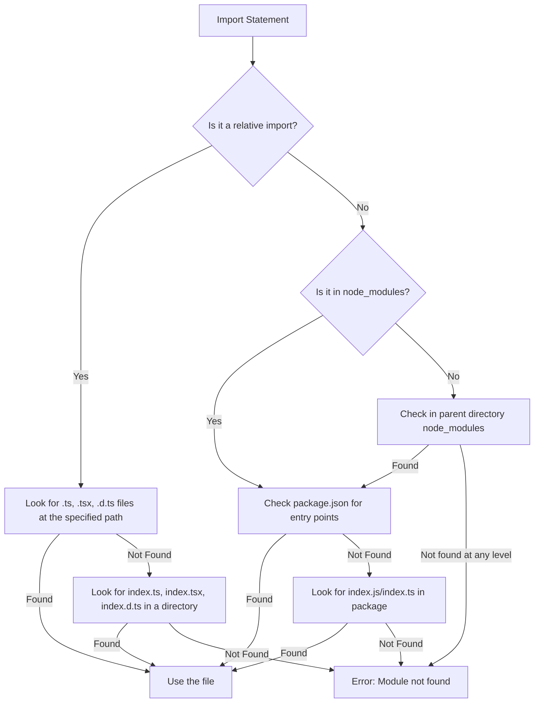

# TypeScript Module Resolution

When you write an import statement in TypeScript, the compiler needs to figure out exactly which file that import refers to. This process is known as **module resolution**. Understanding how TypeScript resolves modules is crucial for organizing your code efficiently and avoiding frustrating import errors.

## Introduction to Module Resolution

Module resolution is the process TypeScript uses to determine what file to import when you use an import statement like:

```typescript
import { SomeClass } from "./some-module";
```

TypeScript needs to know exactly which file the `"./some-module"` refers to. Does it look for `some-module.ts`? What about `some-module.d.ts`? Or maybe it's actually in `node_modules`? Let's explore how TypeScript makes these decisions.

## Types of Module Resolution Strategies

TypeScript provides two main strategies for module resolution:

1. **Classic**: The original resolution strategy (less commonly used now)
2. **Node**: Resolution that mimics Node.js module resolution (default)

### Classic Resolution

The Classic resolution strategy is simpler but less powerful. It's rarely used in modern TypeScript projects but is included for backward compatibility.

For a relative import like `./some-module`, Classic resolution looks for:

```
./some-module.ts
./some-module.d.ts
```

For non-relative imports like `some-module`, it looks for the module in the current directory, then parent directories, moving up:

```
./some-module.ts
./some-module.d.ts
../some-module.ts
../some-module.d.ts
../../some-module.ts
// ...and so on
```

### Node Resolution

Node resolution mimics how Node.js resolves modules, with TypeScript extensions. This is the default and recommended strategy.

For a relative import like `./some-module`, Node resolution looks for:

```
./some-module.ts
./some-module.tsx
./some-module.d.ts
./some-module/index.ts
./some-module/index.tsx
./some-module/index.d.ts
```

For non-relative imports like `some-module`, it checks:

1. For a `node_modules/some-module` package
2. Looks for its entry point defined in `package.json`
3. If not found, checks parent directories' `node_modules`

Let's see this in action:

```typescript
// src/components/Button.tsx
import { useState } from "react";          // Non-relative import (from node_modules)
import { Theme } from "../styles/theme";   // Relative import
import { Icon } from "./icons";            // Relative import (folder with index.ts)

export const Button = () => {
  const [isHovered, setIsHovered] = useState(false);
  // Component implementation
};
```

## Configuring Module Resolution in tsconfig.json

You can configure how TypeScript resolves modules in your `tsconfig.json` file:

```json
{
  "compilerOptions": {
    "moduleResolution": "node", // Use "node" or "classic"
    "baseUrl": "./src",
    "paths": {
      "@components/*": ["components/*"],
      "@utils/*": ["utils/*"]
    }
  }
}
```

The configuration options include:

- **moduleResolution**: Specifies which resolution strategy to use
- **baseUrl**: Sets a base directory to resolve non-relative names
- **paths**: Allows mapping imports to specific locations
- **rootDirs**: List of roots to be combined and treated as one directory

## Using Path Mapping for Clean Imports

The `paths` option is particularly useful for avoiding deeply nested imports. Instead of writing:

```typescript
import { Button } from "../../../components/Button";
```

You can write:

```typescript
import { Button } from "@components/Button";
```

Here's how to set it up:

1. Configure `paths` in your `tsconfig.json`:

```json
{
  "compilerOptions": {
    "baseUrl": "./src",
    "paths": {
      "@components/*": ["components/*"],
      "@utils/*": ["utils/*"],
      "@styles/*": ["styles/*"]
    }
  }
}
```

2. Use these aliases in your imports:

```typescript
// Before path mapping
import { formatDate } from "../../utils/dateUtils";
import { Button } from "../components/Button";

// After path mapping
import { formatDate } from "@utils/dateUtils";
import { Button } from "@components/Button";
```

## Module Resolution with Different File Extensions

TypeScript will look for files with `.ts`, `.tsx`, `.d.ts`, and `.js` extensions. If you use other extensions like `.json`, you may need to add additional configuration.

For JSON imports, enable the `resolveJsonModule` option:

```json
{
  "compilerOptions": {
    "resolveJsonModule": true
  }
}
```

Then you can import JSON files directly:

```typescript
import config from "./config.json";
console.log(config.apiUrl);
```

## Troubleshooting Module Resolution Issues

If you're having issues with module resolution, these debugging techniques can help:

### 1. Use the `--traceResolution` flag

Run the TypeScript compiler with this flag to see detailed information about how modules are being resolved:

```bash
tsc --traceResolution
```

This will produce output showing every step of the resolution process.

### 2. Check for path case sensitivity

Some file systems (like on macOS) are case-insensitive, while others (like Linux) are case-sensitive. This can cause issues when moving code between environments.

### 3. Check your tsconfig.json settings

Make sure your `moduleResolution`, `baseUrl`, and `paths` are properly configured.

## Real-world Application: Monorepo with Path Aliases

Let's look at a practical example of module resolution in a monorepo project:

```
/my-monorepo
  /packages
    /ui-components
      package.json
      /src
        /Button
          index.ts
        /Input
          index.ts
    /utils
      package.json
      /src
        /formatting
          index.ts
    /app
      package.json
      /src
        /pages
          Home.tsx
```

In the `app` package's `tsconfig.json`, we can set up path aliases:

```json
{
  "compilerOptions": {
    "baseUrl": ".",
    "paths": {
      "@ui/*": ["../ui-components/src/*"],
      "@utils/*": ["../utils/src/*"]
    }
  }
}
```

Now in our `Home.tsx` file, we can import cleanly:

```typescript
import { Button } from "@ui/Button";
import { Input } from "@ui/Input";
import { formatCurrency } from "@utils/formatting";

export const Home = () => {
  return (
    <div>
      <h1>Welcome</h1>
      <Button>Click me</Button>
      <Input placeholder="Enter amount" />
      <p>Total: {formatCurrency(100)}</p>
    </div>
  );
};
```

## Module Resolution Flow

Here's a visual representation of how TypeScript resolves a module import:



## Summary

Module resolution is a crucial aspect of working with TypeScript that determines how the compiler finds and links your imported modules. Key points to remember:

- TypeScript supports "node" (default) and "classic" resolution strategies
- You can configure resolution in `tsconfig.json`
- Path mapping allows for cleaner imports
- Troubleshooting tools like `--traceResolution` help with debugging

Understanding module resolution helps you organize your code better and avoid hard-to-debug import errors.

## Exercises

1. Create a simple TypeScript project with a nested folder structure and practice using path mapping to simplify imports.
2. Compare how the Classic and Node resolution strategies would resolve the same import in different scenarios.
3. Try adding the `resolveJsonModule` option and import a JSON file in your TypeScript code.
4. Use the `--traceResolution` flag to see how TypeScript resolves one of your imports.

## Additional Resources

- [TypeScript Handbook: Module Resolution](https://www.typescriptlang.org/docs/handbook/module-resolution.html)
- [tsconfig Reference: moduleResolution](https://www.typescriptlang.org/tsconfig#moduleResolution)
- [TypeScript Path Mapping in Depth](https://www.typescriptlang.org/docs/handbook/module-resolution.html#path-mapping)