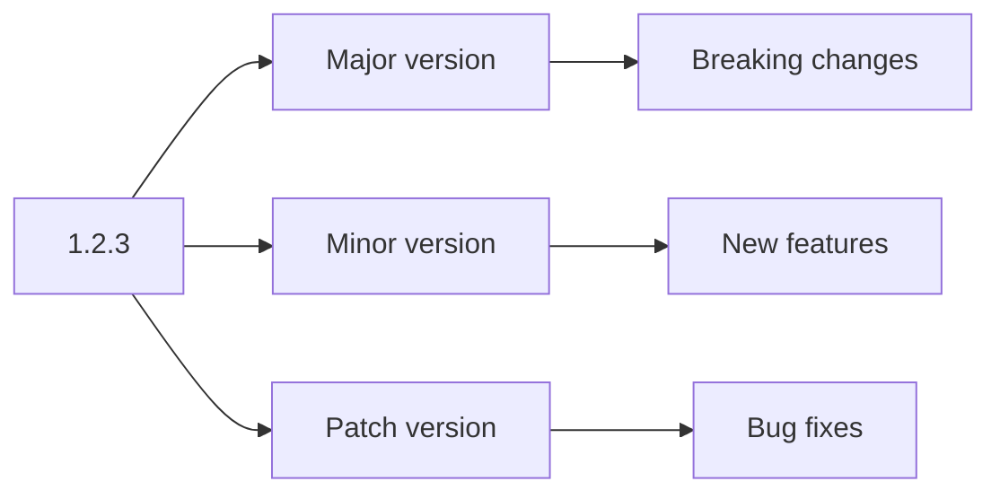

# TypeScript Library Management

In the TypeScript ecosystem, libraries serve as reusable code collections that significantly enhance development efficiency. In this lesson, we'll explore how to create, publish, and consume TypeScript libraries, as well as manage dependencies effectively.

## Introduction to TypeScript Libraries

TypeScript libraries are collections of code published as packages that can be shared across projects. These packages leverage TypeScript's strong typing to provide better developer experiences compared to plain JavaScript libraries.

Key benefits of TypeScript libraries include:

- Type safety across project boundaries
- Better IDE support with autocompletion
- Documentation through type definitions
- Compile-time error checking

## Setting Up a TypeScript Library Project

Let's start by creating a basic TypeScript library from scratch:

### Step 1: Initialize your project

```bash
mkdir my-ts-library
cd my-ts-library
npm init -y
npm install typescript --save-dev
npx tsc --init
```

### Step 2: Configure your TypeScript project

Edit your `tsconfig.json` to target library development:

```json
{
  "compilerOptions": {
    "target": "es2015",
    "module": "commonjs",
    "declaration": true,
    "outDir": "./dist",
    "strict": true,
    "esModuleInterop": true
  },
  "include": ["src"],
  "exclude": ["node_modules", "**/__tests__/*"]
}
```

Key settings for libraries:
- `declaration: true` - Generates `.d.ts` type definition files
- `outDir: "./dist"` - Places compiled output in a separate directory

### Step 3: Create your library source code

Create a src folder with an index.ts file:

```typescript
// src/index.ts
export function greet(name: string): string {
  return `Hello, ${name}!`;
}

export class Calculator {
  add(a: number, b: number): number {
    return a + b;
  }
  
  subtract(a: number, b: number): number {
    return a - b;
  }
}

export interface User {
  id: number;
  name: string;
  email?: string;
}
```

### Step 4: Set up your package.json for library distribution

Update your package.json with library-specific configurations:

```json
{
  "name": "my-ts-library",
  "version": "1.0.0",
  "description": "A simple TypeScript library",
  "main": "dist/index.js",
  "types": "dist/index.d.ts",
  "files": [
    "dist"
  ],
  "scripts": {
    "build": "tsc",
    "prepare": "npm run build"
  },
  "keywords": ["typescript", "library"],
  "author": "Your Name",
  "license": "MIT",
  "devDependencies": {
    "typescript": "^4.5.4"
  }
}
```

Important fields:
- `main`: Entry point to your compiled JavaScript
- `types`: Points to type definitions
- `files`: Files to include when publishing
- `prepare`: Runs before package is packed and published

## Publishing Your Library to npm

Once your library is ready, you can publish it to the npm registry:

### Step 1: Build your library

```bash
npm run build
```

### Step 2: Test your library locally

Before publishing, you can test your library by linking it locally:

```bash
npm link
```

Then in another project:

```bash
npm link my-ts-library
```

### Step 3: Publish to npm

```bash
npm login
npm publish
```

## Consuming TypeScript Libraries

When you use a TypeScript library, you get the benefit of its type definitions:

```typescript
import { greet, Calculator, User } from 'my-ts-library';

// TypeScript knows the parameter types and return types
const message = greet('World');
console.log(message); // Output: Hello, World!

const calc = new Calculator();
console.log(calc.add(5, 3)); // Output: 8

// TypeScript enforces the User interface
const user: User = {
  id: 1,
  name: 'John'
  // email is optional, so we can omit it
};
```

## Working with External Libraries

### Using Libraries with Bundled Type Definitions

Many libraries now include TypeScript definitions out of the box:

```typescript
import axios from 'axios';

// TypeScript understands the types provided by axios
axios.get('https://api.example.com/data')
  .then(response => {
    // TypeScript knows response.data exists
    console.log(response.data);
  });
```

### Using Libraries without Type Definitions

For libraries without type definitions, you have options:

1. Check if definitions exist in DefinitelyTyped:

```bash
npm install --save-dev @types/library-name
```

2. Create your own declaration file:

```typescript
// declarations.d.ts
declare module 'untyped-module' {
  export function doSomething(value: string): boolean;
  export class SomeClass {
    constructor(options: { value: string });
    process(): void;
  }
}
```

## Managing Dependencies in TypeScript Libraries

### Dependency Types

Understanding different dependency types is crucial for TypeScript libraries:

- `dependencies`: Required at runtime
- `devDependencies`: Only needed for development
- `peerDependencies`: Expected to be provided by consumer
- `optionalDependencies`: Optional, won't fail if not present

### Best Practices for Library Dependencies

1. **Keep runtime dependencies minimal**

```json
{
  "dependencies": {
    "lodash-es": "^4.17.21"
  },
  "peerDependencies": {
    "react": "^17.0.0"
  },
  "devDependencies": {
    "typescript": "^4.5.4",
    "jest": "^27.0.0",
    "@types/react": "^17.0.0",
    "react": "^17.0.0"
  }
}
```

2. **Use proper version ranges**

```json
{
  "dependencies": {
    // Accepts minor updates (1.2.3 to 1.3.0)
    "package-a": "^1.2.3",
    // Only accepts patch updates (1.2.3 to 1.2.4)
    "package-b": "~1.2.3",
    // Exact version only
    "package-c": "1.2.3"
  }
}
```

## Advanced Library Management Techniques

### Creating a Monorepo for Multiple Libraries

For complex projects, you might want to maintain multiple related libraries in a single repository.

Using npm workspaces:

```json
// root package.json
{
  "name": "my-ts-libraries",
  "private": true,
  "workspaces": [
    "packages/*"
  ]
}
```

Directory structure:
```
my-ts-libraries/
├── package.json
└── packages/
    ├── library-a/
    │   ├── package.json
    │   └── src/
    └── library-b/
        ├── package.json
        └── src/
```

### Creating Type-Safe APIs with Generic Types

TypeScript libraries can provide powerful APIs with generic types:

```typescript
// src/collection.ts
export class Collection<T> {
  private items: T[] = [];
  
  add(item: T): void {
    this.items.push(item);
  }
  
  getAll(): T[] {
    return [...this.items];
  }
  
  findBy<K extends keyof T>(key: K, value: T[K]): T | undefined {
    return this.items.find(item => item[key] === value);
  }
}
```

Usage:
```typescript
import { Collection } from 'my-ts-library';

interface Product {
  id: number;
  name: string;
  price: number;
}

const products = new Collection<Product>();
products.add({ id: 1, name: 'Laptop', price: 999 });
products.add({ id: 2, name: 'Phone', price: 699 });

// TypeScript knows this returns a Product or undefined
const laptop = products.findBy('name', 'Laptop');
console.log(laptop?.price); // Output: 999
```

## Library Versioning and Documentation

### Semantic Versioning (SemVer)

Always follow semantic versioning for your libraries:



### Generating Documentation with TypeDoc

Document your library with TypeDoc:

```bash
npm install --save-dev typedoc
```

Add a script to package.json:
```json
{
  "scripts": {
    "docs": "typedoc --out docs src/index.ts"
  }
}
```

## Summary

TypeScript library management involves multiple skills:
1. Setting up libraries with proper TypeScript configuration
2. Publishing and versioning your packages
3. Managing dependencies effectively
4. Creating type-safe APIs that are easy to use
5. Documenting your code properly

By following these practices, you'll create high-quality TypeScript libraries that provide excellent developer experience while maintaining type safety.

## Exercises

1. Create a small utility library with at least three functions and publish it locally using `npm link`.
2. Add a generic type to your library that can handle different data types.
3. Write a declaration file for an existing JavaScript library that doesn't have TypeScript definitions.
4. Set up a CI workflow that builds, tests, and generates documentation for your library.

## Additional Resources

- [npm Documentation](https://docs.npmjs.com/)
- [DefinitelyTyped Repository](https://github.com/DefinitelyTyped/DefinitelyTyped)
- [TypeDoc Documentation](https://typedoc.org/)
- [TypeScript Handbook: Declaration Files](https://www.typescriptlang.org/docs/handbook/declaration-files/introduction.html)

Happy library building!