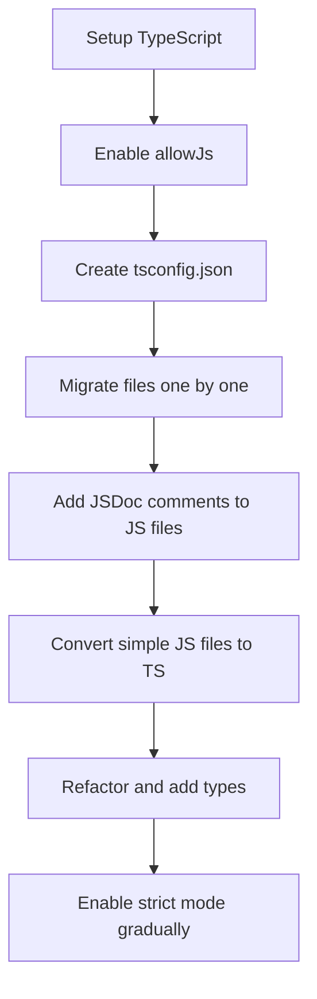

# TypeScript JavaScript Integration

## Introduction

TypeScript is designed as a superset of JavaScript, meaning that it extends JavaScript by adding type annotations and other features while maintaining full compatibility with existing JavaScript code. This design makes TypeScript an excellent choice for gradually migrating existing JavaScript projects or for working in mixed codebases where some files use TypeScript and others use JavaScript.

In this guide, we'll explore how to effectively integrate TypeScript into JavaScript projects, understand how TypeScript and JavaScript files can coexist, and learn best practices for a smooth transition from JavaScript to TypeScript.

## Understanding TypeScript and JavaScript Interoperability

TypeScript was designed from the ground up to work seamlessly with JavaScript. This interoperability is one of TypeScript's most powerful features, allowing developers to:

- Add TypeScript files to existing JavaScript projects
- Import JavaScript modules into TypeScript files
- Import TypeScript modules into JavaScript files
- Gradually migrate code from JavaScript to TypeScript

Let's explore how this interoperability works in practice.

## Adding TypeScript to a JavaScript Project

### Step 1: Install TypeScript

The first step in integrating TypeScript into a JavaScript project is to install the TypeScript compiler:

```bash
npm install --save-dev typescript
```

### Step 2: Create a TypeScript Configuration File

Create a `tsconfig.json` file in your project root:

```json
{
  "compilerOptions": {
    "target": "es2016",
    "module": "commonjs",
    "esModuleInterop": true,
    "forceConsistentCasingInFileNames": true,
    "strict": true,
    "skipLibCheck": true,
    "outDir": "./dist",
    "allowJs": true,
    "checkJs": false
  },
  "include": ["src/**/*"],
  "exclude": ["node_modules", "**/*.spec.ts"]
}
```

The two key options for JavaScript integration are:

- `allowJs`: Allows JavaScript files to be compiled along with TypeScript files
- `checkJs`: When true, TypeScript will report errors in JavaScript files as well

### Step 3: Adding TypeScript Files Alongside JavaScript Files

You can start creating new `.ts` or `.tsx` files in your project while keeping existing `.js` files:

```
project/
├── src/
│   ├── index.js        // Existing JavaScript file
│   ├── user.js         // Existing JavaScript file
│   └── newFeature.ts   // New TypeScript file
├── package.json
└── tsconfig.json
```

## Using JavaScript in TypeScript Files

TypeScript can directly import and use JavaScript modules without any special configuration thanks to the `allowJs` option.

### Example: Importing a JavaScript Module into a TypeScript File

Let's say you have the following JavaScript file (`math.js`):

```javascript
// math.js
function add(a, b) {
  return a + b;
}

function subtract(a, b) {
  return a - b;
}

module.exports = {
  add,
  subtract
};
```

You can import and use this module in a TypeScript file:

```typescript
// calculator.ts
import { add, subtract } from './math';

// TypeScript will infer the types of these functions as best it can
const sum: number = add(5, 3);
const difference: number = subtract(10, 4);

console.log(`Sum: ${sum}`);
console.log(`Difference: ${difference}`);
```

Output:
```
Sum: 8
Difference: 6
```

## Using TypeScript in JavaScript Files

One of TypeScript's most powerful features is that JavaScript code can import and use modules written in TypeScript without any special configuration.

### Example: Importing a TypeScript Module into a JavaScript File

Let's create a TypeScript file with type annotations (`user.ts`):

```typescript
// user.ts
export interface User {
  id: number;
  name: string;
  email: string;
}

export function formatUser(user: User): string {
  return `${user.name} (${user.email})`;
}
```

Now we can import and use this module in a JavaScript file:

```javascript
// app.js
const { formatUser } = require('./user');

const user = {
  id: 1,
  name: 'John Doe',
  email: 'john@example.com'
};

// We can use the TypeScript function directly in JavaScript
console.log(formatUser(user));
```

Output:
```
John Doe (john@example.com)
```

The TypeScript compiler will compile `user.ts` to JavaScript, and the JavaScript code can import and use it without any knowledge of TypeScript.

## Adding Type Information to JavaScript Files

You can add type information to JavaScript files using JSDoc comments, which TypeScript can understand and use for type checking.

### Example: Adding Types to JavaScript with JSDoc

```javascript
// product.js

/**
 * @typedef {Object} Product
 * @property {number} id - The product ID
 * @property {string} name - The product name
 * @property {number} price - The product price
 * @property {string[]} categories - Product categories
 */

/**
 * Format the product price with currency symbol
 * @param {Product} product - The product object
 * @param {string} [currencySymbol='$'] - Currency symbol
 * @returns {string} Formatted price
 */
function formatPrice(product, currencySymbol = '$') {
  return `${currencySymbol}${product.price.toFixed(2)}`;
}

/**
 * Calculate total price with tax
 * @param {Product} product
 * @param {number} taxRate - Tax rate as decimal (e.g., 0.07 for 7%)
 * @returns {number} Total price
 */
function calculateTotalPrice(product, taxRate) {
  return product.price * (1 + taxRate);
}

module.exports = {
  formatPrice,
  calculateTotalPrice
};
```

Now we can import this into a TypeScript file and TypeScript will understand the types:

```typescript
// catalog.ts
import { formatPrice, calculateTotalPrice } from './product';

// TypeScript understands the Product type from JSDoc
const laptop = {
  id: 101,
  name: 'MacBook Pro',
  price: 1299,
  categories: ['electronics', 'computers']
};

const formattedPrice = formatPrice(laptop, '€');
const totalPrice = calculateTotalPrice(laptop, 0.08);

console.log(`Price: ${formattedPrice}`);
console.log(`Total with tax: €${totalPrice.toFixed(2)}`);
```

Output:
```
Price: €1299.00
Total with tax: €1402.92
```

## Gradual Migration Strategy

Here's a recommended approach for gradually migrating a JavaScript project to TypeScript:



### Step-by-Step Migration Process:

1. **Setup TypeScript** in your JavaScript project
2. **Configure `tsconfig.json`** with `allowJs: true` and `checkJs: false`
3. **Add type definitions** for external libraries using DefinitelyTyped:

```bash
npm install --save-dev @types/libraryname
```

4. **Add JSDoc comments** to JavaScript files you don't plan to convert immediately
5. **Rename files** from `.js` to `.ts` one by one, starting with the simplest files
6. **Fix type errors** as they arise during the migration
7. **Gradually enable stricter type checking** by turning on options in `tsconfig.json`

## Real-world Example: Migrating an Express API

Let's look at how to migrate a simple Express.js API from JavaScript to TypeScript:

### Original JavaScript File (server.js):

```javascript
// server.js
const express = require('express');
const bodyParser = require('body-parser');

const app = express();
const PORT = process.env.PORT || 3000;

// Middleware
app.use(bodyParser.json());

// In-memory database
const users = [
  { id: 1, name: 'Alice', email: 'alice@example.com' },
  { id: 2, name: 'Bob', email: 'bob@example.com' }
];

// Routes
app.get('/api/users', (req, res) => {
  res.json(users);
});

app.get('/api/users/:id', (req, res) => {
  const user = users.find(u => u.id === parseInt(req.params.id));
  if (!user) {
    return res.status(404).json({ error: 'User not found' });
  }
  res.json(user);
});

app.post('/api/users', (req, res) => {
  const { name, email } = req.body;
  if (!name || !email) {
    return res.status(400).json({ error: 'Name and email are required' });
  }
  
  const newUser = {
    id: users.length + 1,
    name,
    email
  };
  
  users.push(newUser);
  res.status(201).json(newUser);
});

// Start server
app.listen(PORT, () => {
  console.log(`Server is running on port ${PORT}`);
});
```

### Step 1: Add Type Definitions

```bash
npm install --save-dev @types/express @types/body-parser
```

### Step 2: Create TypeScript Server File (server.ts)

```typescript
// server.ts
import express, { Request, Response } from 'express';
import bodyParser from 'body-parser';

const app = express();
const PORT = process.env.PORT || 3000;

// Define User interface
interface User {
  id: number;
  name: string;
  email: string;
}

// Middleware
app.use(bodyParser.json());

// In-memory database
const users: User[] = [
  { id: 1, name: 'Alice', email: 'alice@example.com' },
  { id: 2, name: 'Bob', email: 'bob@example.com' }
];

// Routes
app.get('/api/users', (req: Request, res: Response) => {
  res.json(users);
});

app.get('/api/users/:id', (req: Request, res: Response) => {
  const user = users.find(u => u.id === parseInt(req.params.id));
  if (!user) {
    return res.status(404).json({ error: 'User not found' });
  }
  res.json(user);
});

app.post('/api/users', (req: Request, res: Response) => {
  const { name, email } = req.body;
  if (!name || !email) {
    return res.status(400).json({ error: 'Name and email are required' });
  }
  
  const newUser: User = {
    id: users.length + 1,
    name,
    email
  };
  
  users.push(newUser);
  res.status(201).json(newUser);
});

// Start server
app.listen(PORT, () => {
  console.log(`Server is running on port ${PORT}`);
});
```

### Step 3: Update package.json scripts

```json
"scripts": {
  "build": "tsc",
  "start": "node dist/server.js",
  "dev": "ts-node src/server.ts"
}
```

## Best Practices for TypeScript-JavaScript Integration

1. **Start with Less Strict Settings**: Begin with minimal type checking and gradually increase strictness
2. **Use Declaration Files**: For third-party JavaScript libraries without TypeScript support, create `.d.ts` declaration files
3. **Isolate Complex JavaScript**: Keep complex JavaScript code that's hard to type in separate files
4. **Use JSDoc for JavaScript Files**: Annotate JavaScript files that won't be migrated soon
5. **Test After Each Migration Step**: Ensure functionality remains intact after each file conversion
6. **Consider Module Boundaries**: Convert related files together to maintain consistency
7. **Use the `// @ts-check` Comment**: Add this at the top of JavaScript files you want TypeScript to check without converting them

## Creating Declaration Files for JavaScript Libraries

If you're using a JavaScript library that doesn't have TypeScript type definitions, you can create your own declaration file:

```typescript
// types/my-js-library/index.d.ts
declare module 'my-js-library' {
  export function doSomething(value: string): number;
  
  export interface LibraryOptions {
    debug?: boolean;
    timeout?: number;
  }
  
  export default class Library {
    constructor(options?: LibraryOptions);
    initialize(): Promise<void>;
    process(data: any): any;
  }
}
```

Then reference it in your `tsconfig.json`:

```json
{
  "compilerOptions": {
    // other options...
    "typeRoots": ["./node_modules/@types", "./types"]
  }
}
```

## Summary

TypeScript and JavaScript integration is one of TypeScript's most powerful features, allowing for gradual migration and mixed codebases. Key takeaways include:

- TypeScript can compile JavaScript files using the `allowJs` option
- JavaScript can import from TypeScript files without any special configuration
- JSDoc comments can add type information to JavaScript files
- Migration from JavaScript to TypeScript can be done incrementally
- TypeScript's type checking can be gradually increased as code is migrated

By understanding these integration points, you can effectively introduce TypeScript into existing JavaScript projects and enjoy the benefits of static typing while maintaining compatibility with your existing codebase.

## Additional Resources

- [TypeScript Handbook: JavaScript File Integration](https://www.typescriptlang.org/docs/handbook/type-checking-javascript-files.html)
- [TypeScript Declaration Files](https://www.typescriptlang.org/docs/handbook/declaration-files/introduction.html)
- [JSDoc Reference](https://jsdoc.app/)

## Exercises

1. Create a small JavaScript project and add TypeScript configuration to it.
2. Convert one JavaScript file to TypeScript and ensure it still works with the rest of the project.
3. Add JSDoc comments to a JavaScript file and import it into a TypeScript file.
4. Create a declaration file (`.d.ts`) for a simple JavaScript library.
5. Practice the gradual migration approach by converting a multi-file JavaScript project to TypeScript one file at a time.