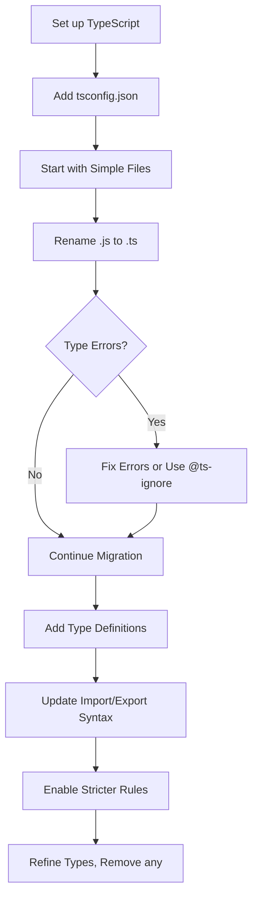

# TypeScript JavaScript Migration

## Introduction

Migrating from JavaScript to TypeScript represents a significant step forward in enhancing your codebase with static type checking and improved developer tooling. This transition doesn't have to happen all at once—TypeScript is designed to integrate seamlessly with existing JavaScript, allowing for incremental adoption. In this guide, we'll explore strategies for migrating your JavaScript projects to TypeScript, benefits gained from the migration, and approaches to handle common challenges.

## Why Migrate to TypeScript?

Before diving into migration techniques, let's understand the benefits that drive developers to migrate:

1. **Type Safety**: Catch errors during development instead of runtime
2. **Better IDE Support**: Enhanced autocompletion, navigation, and refactoring
3. **Improved Documentation**: Types serve as live documentation
4. **Safer Refactoring**: Types help ensure refactoring doesn't break existing functionality
5. **Modern JavaScript Features**: Access to the latest ECMAScript features with backward compatibility

## Incremental Migration Strategy

TypeScript supports an incremental migration approach, which is typically the most practical for existing codebases.

### Step 1: Set Up TypeScript in Your Project

First, you'll need to install TypeScript and create a basic configuration:

```bash
# Install TypeScript
npm install --save-dev typescript

# Generate a tsconfig.json file
npx tsc --init
```

Your generated `tsconfig.json` will contain many options, but here's a simplified version to get started:

```json
{
  "compilerOptions": {
    "target": "es2016",
    "module": "commonjs",
    "esModuleInterop": true,
    "forceConsistentCasingInFileNames": true,
    "strict": false,
    "skipLibCheck": true,
    "allowJs": true,
    "outDir": "./dist"
  },
  "include": ["src/**/*"],
  "exclude": ["node_modules"]
}
```

Notice the `allowJs: true` setting, which is crucial for incremental migration—it allows TypeScript to process JavaScript files.

### Step 2: Rename Files from .js to .ts

Begin by renaming simple JavaScript files to TypeScript. Files with fewer dependencies are good candidates to start:

```bash
# Example of renaming a file
mv src/utils/formatters.js src/utils/formatters.ts
```

If you encounter errors immediately, you have two options:
- Fix the type errors
- Use the `// @ts-nocheck` comment at the top of the file to temporarily disable type checking

### Step 3: Address Initial Type Errors

Let's look at a simple example of migrating a JavaScript function:

**Original JavaScript:**

```javascript
// formatters.js
function formatCurrency(value) {
  return '$' + value.toFixed(2);
}

module.exports = { formatCurrency };
```

**Initial TypeScript Migration:**

```typescript
// formatters.ts
function formatCurrency(value: number): string {
  return '$' + value.toFixed(2);
}

export { formatCurrency };
```

### Step 4: Create Type Definitions

For more complex objects, define interfaces to describe their shape:

```typescript
// Original JS object
const user = {
  name: 'John Doe',
  age: 30,
  roles: ['admin', 'editor'],
  settings: {
    darkMode: true,
    notifications: false
  }
};

// TypeScript version with interfaces
interface UserSettings {
  darkMode: boolean;
  notifications: boolean;
}

interface User {
  name: string;
  age: number;
  roles: string[];
  settings: UserSettings;
}

const user: User = {
  name: 'John Doe',
  age: 30,
  roles: ['admin', 'editor'],
  settings: {
    darkMode: true,
    notifications: false
  }
};
```

## Handling Common Migration Challenges

### Challenge 1: Dynamic Properties and "any" Type

JavaScript often uses objects with dynamic properties. TypeScript provides several ways to handle this:

```typescript
// Using index signatures
interface Dictionary {
  [key: string]: string;
}

const colorCodes: Dictionary = {
  red: '#FF0000',
  green: '#00FF00',
  blue: '#0000FF'
};

// Adding a new property dynamically
colorCodes['yellow'] = '#FFFF00';
```

When you can't immediately type something, you can use `any` as a temporary solution:

```typescript
// Use any as a temporary workaround
let legacyConfig: any = loadLegacyConfiguration();

// But consider adding warning comments for future refactoring
// TODO: Replace 'any' with proper type definition
```

### Challenge 2: Third-party Libraries Without Type Definitions

For libraries without built-in TypeScript definitions, you have a few options:

1. Check if community-provided types are available via DefinitelyTyped:

```bash
npm install --save-dev @types/library-name
```

2. Create your own declaration file:

```typescript
// declarations.d.ts
declare module 'untyped-library' {
  export function someFunction(arg: string): number;
  export class SomeClass {
    constructor(options: { name: string });
    doSomething(): void;
  }
}
```

### Challenge 3: Converting CommonJS to ES Modules

TypeScript works best with ES modules. Here's how to convert:

**CommonJS (Before):**

```javascript
// math.js
const PI = 3.14159;

function square(x) {
  return x * x;
}

module.exports = {
  PI,
  square
};

// usage.js
const math = require('./math');
console.log(math.square(5));
```

**TypeScript with ES modules (After):**

```typescript
// math.ts
export const PI: number = 3.14159;

export function square(x: number): number {
  return x * x;
}

// usage.ts
import { square } from './math';
console.log(square(5));
```

## Real-World Migration Case Study

Let's walk through a small, real-world example of migrating a React component from JavaScript to TypeScript:

**Before (JavaScript):**

```jsx
// UserProfile.jsx
import React, { useState, useEffect } from 'react';
import axios from 'axios';

function UserProfile({ userId, showAvatar }) {
  const [user, setUser] = useState(null);
  const [loading, setLoading] = useState(true);
  const [error, setError] = useState(null);

  useEffect(() => {
    const fetchUser = async () => {
      try {
        setLoading(true);
        const response = await axios.get(`/api/users/${userId}`);
        setUser(response.data);
        setError(null);
      } catch (err) {
        setError('Failed to fetch user data');
        setUser(null);
      } finally {
        setLoading(false);
      }
    };

    fetchUser();
  }, [userId]);

  if (loading) return <div>Loading...</div>;
  if (error) return <div>Error: {error}</div>;
  if (!user) return <div>No user found</div>;

  return (
    <div className="user-profile">
      {showAvatar && user.avatar && (
        
      )}
      <h2>{user.name}</h2>
      <p>Email: {user.email}</p>
      {user.bio && <p>{user.bio}</p>}
    </div>
  );
}

export default UserProfile;
```

**After (TypeScript):**

```tsx
// UserProfile.tsx
import React, { useState, useEffect } from 'react';
import axios from 'axios';

interface User {
  id: string;
  name: string;
  email: string;
  avatar?: string;
  bio?: string;
}

interface UserProfileProps {
  userId: string;
  showAvatar?: boolean;
}

function UserProfile({ userId, showAvatar = false }: UserProfileProps): JSX.Element {
  const [user, setUser] = useState<User | null>(null);
  const [loading, setLoading] = useState<boolean>(true);
  const [error, setError] = useState<string | null>(null);

  useEffect(() => {
    const fetchUser = async (): Promise<void> => {
      try {
        setLoading(true);
        const response = await axios.get<User>(`/api/users/${userId}`);
        setUser(response.data);
        setError(null);
      } catch (err) {
        setError('Failed to fetch user data');
        setUser(null);
      } finally {
        setLoading(false);
      }
    };

    fetchUser();
  }, [userId]);

  if (loading) return <div>Loading...</div>;
  if (error) return <div>Error: {error}</div>;
  if (!user) return <div>No user found</div>;

  return (
    <div className="user-profile">
      {showAvatar && user.avatar && (
        
      )}
      <h2>{user.name}</h2>
      <p>Email: {user.email}</p>
      {user.bio && <p>{user.bio}</p>}
    </div>
  );
}

export default UserProfile;
```

## Using Migration Tools

Several tools can assist in your JavaScript to TypeScript migration:

### 1. TypeScript's automatic .d.ts file generator

You can use TypeScript to generate declaration files for your JavaScript:

```bash
npx tsc --declaration --allowJs --emitDeclarationOnly file.js
```

### 2. ts-migrate

Facebook's ts-migrate tool helps automate parts of the migration process:

```bash
# Install ts-migrate
npm install --save-dev ts-migrate

# Run on a directory
npx ts-migrate-full ./src
```

### 3. Converting JSDoc Comments

If you're already using JSDoc comments, TypeScript can use them for type information:

```javascript
/**
 * Calculates the area of a rectangle.
 * @param {number} width - The width of the rectangle.
 * @param {number} height - The height of the rectangle.
 * @returns {number} The area of the rectangle.
 */
function calculateArea(width, height) {
  return width * height;
}
```

This can be directly used in TypeScript without adding type annotations, if you set `allowJs: true` and `checkJs: true` in your `tsconfig.json`.

## Migration Workflow Visualization

Here's a visualization of the typical migration workflow:



## Best Practices for Migration

1. **Start with `strict: false`** in your `tsconfig.json` and gradually enable strict checks as your codebase gets more typed.

2. **Use the `--noImplicitAny` flag** to identify places where types are missing.

3. **Create a migration plan** with prioritized components/modules.

4. **Write tests before migration** to ensure functionality doesn't break.

5. **Use source control** to track changes and make it easier to resolve issues.

6. **Migrate related files together** to ensure consistency.

7. **Document patterns** that you find useful for the rest of the team.

## Summary

Migrating from JavaScript to TypeScript is a valuable investment in code quality and developer productivity. The incremental approach allows you to:

1. Start with minimal configuration
2. Convert files one by one
3. Gradually introduce types
4. Tighten type checking rules over time

Remember that TypeScript's goal is to enhance your development experience while maintaining compatibility with JavaScript. You don't need perfect types from day one—focus on progress, not perfection.

## Exercises for Practice

1. **Basic Migration:** Take a simple JavaScript utility file with a few functions and convert it to TypeScript.

2. **Interface Creation:** For an existing JavaScript object with nested properties, define appropriate TypeScript interfaces.

3. **React Component Migration:** Convert a React function component from JavaScript to TypeScript, complete with prop type definitions.

4. **API Integration:** Create TypeScript interfaces for API responses in an existing JavaScript application.

5. **Library Types:** For a project using a third-party library without TypeScript definitions, create your own declaration file.

## Additional Resources

- [TypeScript Handbook: Migration from JavaScript](https://www.typescriptlang.org/docs/handbook/migrating-from-javascript.html)
- [Type Declaration Files (.d.ts) Documentation](https://www.typescriptlang.org/docs/handbook/declaration-files/introduction.html)
- [tsconfig Options Reference](https://www.typescriptlang.org/tsconfig)
- [Definitely Typed Repository](https://github.com/DefinitelyTyped/DefinitelyTyped)
- [TypeScript Deep Dive: Migration](https://basarat.gitbook.io/typescript/getting-started/migrating)

By following these guidelines and approaches, you can successfully migrate your JavaScript projects to TypeScript while maintaining functionality and gradually improving type safety.