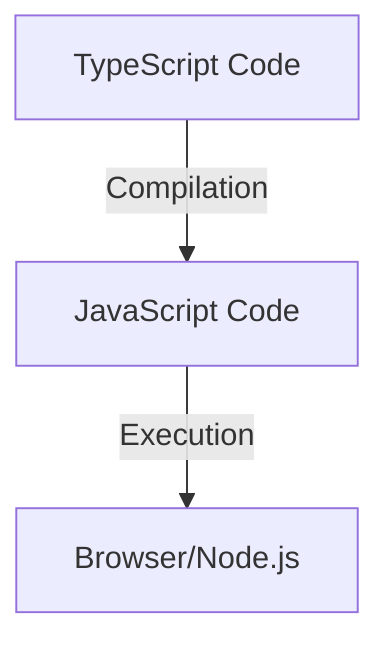

# TypeScript JavaScript Interoperability

## Introduction

TypeScript and JavaScript have a unique relationship - TypeScript is a superset of JavaScript, meaning any valid JavaScript is also valid TypeScript. This interoperability is one of TypeScript's greatest strengths, allowing developers to:

- Gradually migrate existing JavaScript codebases to TypeScript
- Use TypeScript and JavaScript together in the same project
- Leverage existing JavaScript libraries within TypeScript applications

In this guide, we'll explore how these two languages interact, how to manage their relationship in your projects, and best practices for working with both together.

## Understanding TypeScript's Relationship with JavaScript

TypeScript builds on JavaScript by adding static type checking and other features. When you compile TypeScript code, it produces plain JavaScript that can run in any JavaScript environment.



Let's understand this relationship with a simple example:

```typescript
// TypeScript code
function greet(name: string): string {
  return `Hello, ${name}!`;
}

const message = greet("TypeScript");
console.log(message);
```

When compiled to JavaScript, it becomes:

```javascript
// Compiled JavaScript
function greet(name) {
  return `Hello, ${name}!`;
}

const message = greet("TypeScript");
console.log(message);
```

The type annotations are removed, but the logic remains the same. This is a fundamental aspect of TypeScript's design that enables seamless interoperability.

## Gradual Migration from JavaScript to TypeScript

### Step 1: Setting Up for Coexistence

To start migrating a JavaScript project to TypeScript:

1. Install TypeScript in your project:

```bash
npm install --save-dev typescript
```

2. Create a `tsconfig.json` file that allows JavaScript files:

```json
{
  "compilerOptions": {
    "target": "es2016",
    "module": "commonjs",
    "allowJs": true,
    "checkJs": false,
    "outDir": "./dist",
    "strict": false,
    "esModuleInterop": true
  },
  "include": ["src/**/*"]
}
```

The key options here are:
- `allowJs`: Allows JavaScript files to be compiled
- `checkJs`: When set to true, TypeScript will check your JavaScript files for errors (optional initially)

### Step 2: Rename Files and Add Types Gradually

Start by renaming `.js` files to `.tsx` or `.ts` files and add type annotations gradually. Let's see an example:

Original `user.js`:
```javascript
function createUser(name, age, email) {
  return {
    name,
    age,
    email,
    isAdult: age >= 18
  };
}

const user = createUser("John", 25, "john@example.com");
console.log(user.isAdult);
```

Migrated `user.ts`:
```typescript
interface User {
  name: string;
  age: number;
  email: string;
  isAdult: boolean;
}

function createUser(name: string, age: number, email: string): User {
  return {
    name,
    age,
    email,
    isAdult: age >= 18
  };
}

const user = createUser("John", 25, "john@example.com");
console.log(user.isAdult);
```

### Step 3: Enable Stricter Type Checking Incrementally

As your migration progresses, gradually enable stricter TypeScript options in your `tsconfig.json`:

```json
{
  "compilerOptions": {
    // ... other options
    "strict": true,
    "noImplicitAny": true,
    "strictNullChecks": true
  }
}
```

## Using JavaScript Libraries in TypeScript

### Understanding Declaration Files

To use JavaScript libraries in TypeScript, you need type definitions or "declaration files" (`.d.ts` files). These files describe the shape of a JavaScript module without implementing it.

Many popular libraries have declaration files available through the `@types` organization:

```bash
npm install --save-dev @types/lodash
```

### Creating Your Own Declaration Files

When using a library without available type definitions, you can create your own declaration file:

```typescript
// file: types/my-js-library/index.d.ts
declare module 'my-js-library' {
  export function doSomething(value: string): boolean;
  export class Helper {
    constructor(options: { debug: boolean });
    process(data: any): Promise<any>;
  }
}
```

Then reference it in your `tsconfig.json`:

```json
{
  "compilerOptions": {
    // ... other options
    "typeRoots": ["./node_modules/@types", "./types"]
  }
}
```

### Using the Library in Your TypeScript Code

Once the declaration file is in place:

```typescript
import { doSomething, Helper } from 'my-js-library';

const result = doSomething('test');
const helper = new Helper({ debug: true });

// TypeScript now knows the types and provides autocompletion
helper.process({ data: 'example' }).then(result => {
  console.log(result);
});
```

## Working with JavaScript in TypeScript Projects

### Type Checking JavaScript Files

TypeScript can type-check your JavaScript files with the `checkJs` option:

```json
{
  "compilerOptions": {
    "allowJs": true,
    "checkJs": true
  }
}
```

You can then use JSDoc comments to add type information:

```javascript
// user.js

/**
 * Creates a user object
 * @param {string} name - The user's name
 * @param {number} age - The user's age
 * @param {string} email - The user's email
 * @returns {Object} A user object
 */
function createUser(name, age, email) {
  return {
    name,
    age,
    email,
    isAdult: age >= 18
  };
}

const user = createUser("John", 25, "john@example.com");
```

### Using // @ts-check and // @ts-nocheck

You can enable or disable type checking for specific JavaScript files:

```javascript
// @ts-check
// This JavaScript file will be type checked

function add(a, b) {
  return a + b;
}

// This would raise a TypeScript error as parameters don't have specified types
```

Or disable type checking:

```javascript
// @ts-nocheck
// TypeScript will ignore type errors in this file

function add(a, b) {
  // No errors will be reported, even for type issues
  return a + b;
}
```

## Real-world Example: Mixed Project Setup

Let's explore a practical example of a project with both TypeScript and JavaScript:

### Project Structure

```
/src
  /components
    Button.tsx
    Form.tsx
  /utils
    validation.js
    helpers.ts
  /types
    index.d.ts
  index.ts
/dist
tsconfig.json
package.json
```

### TypeScript Component Using JavaScript Utility

```typescript
// src/components/Form.tsx
import React, { useState } from 'react';
import { validateEmail, validatePassword } from '../utils/validation';

interface FormProps {
  onSubmit: (data: { email: string; password: string }) => void;
}

export const Form: React.FC<FormProps> = ({ onSubmit }) => {
  const [email, setEmail] = useState('');
  const [password, setPassword] = useState('');
  const [errors, setErrors] = useState<{email?: string; password?: string}>({});
  
  const handleSubmit = (e: React.FormEvent) => {
    e.preventDefault();
    
    const emailError = validateEmail(email);
    const passwordError = validatePassword(password);
    
    if (emailError || passwordError) {
      setErrors({ email: emailError, password: passwordError });
      return;
    }
    
    onSubmit({ email, password });
  };
  
  return (
    <form onSubmit={handleSubmit}>
      {/* Form fields and error displays */}
    </form>
  );
};
```

### JavaScript Utility with JSDoc Types

```javascript
// src/utils/validation.js

/**
 * Validates an email address
 * @param {string} email - The email to validate
 * @returns {string|undefined} Error message or undefined if valid
 */
export function validateEmail(email) {
  if (!email) return 'Email is required';
  if (!/\S+@\S+\.\S+/.test(email)) return 'Invalid email format';
  return undefined;
}

/**
 * Validates a password
 * @param {string} password - The password to validate
 * @returns {string|undefined} Error message or undefined if valid
 */
export function validatePassword(password) {
  if (!password) return 'Password is required';
  if (password.length < 8) return 'Password must be at least 8 characters';
  return undefined;
}
```

### Declaration File for JavaScript Library

```typescript
// src/types/index.d.ts

// Declare types for a third-party JavaScript library
declare module 'chart-library' {
  export interface ChartOptions {
    width: number;
    height: number;
    title?: string;
    animate?: boolean;
  }
  
  export function createBarChart(
    element: HTMLElement, 
    data: number[], 
    options: ChartOptions
  ): void;
  
  export function createLineChart(
    element: HTMLElement, 
    data: Array<{x: number, y: number}>, 
    options: ChartOptions
  ): void;
}
```

## Best Practices for TypeScript-JavaScript Interoperability

1. **Gradual Migration**: Start with `"strict": false` and enable strict checks incrementally.

2. **Use JSDoc for JavaScript Files**: Add type information using JSDoc comments for better IDE support.

3. **Consistent Module System**: Use the same module system (ESM or CommonJS) across your project.

4. **Quality Declaration Files**: Invest time in creating accurate declaration files for untyped dependencies.

5. **Set Appropriate tsconfig Options**:
   ```json
   {
     "compilerOptions": {
       "allowJs": true,
       "esModuleInterop": true,
       "resolveJsonModule": true
     }
   }
   ```

6. **Isolate Untyped Code**: Keep untyped JavaScript in separate modules when possible, with clear interfaces.

7. **Use Import Type**: When importing types from JavaScript files:
   ```typescript
   import type { UserConfig } from './config.js';
   ```

## Common Challenges and Solutions

### Challenge: Missing Type Definitions

**Solution**: Create declaration files or use `any` as a temporary solution:

```typescript
// Temporary solution
const untyped: any = require('untyped-library');

// Better solution: create declaration file
// untyped-library.d.ts
declare module 'untyped-library' {
  export function process(data: any): Promise<any>;
  // Add more type definitions as needed
}
```

### Challenge: JavaScript Code Breaking with Strict Null Checks

**Solution**: Use non-null assertion operator or type guards:

```typescript
// Using non-null assertion (use carefully)
function processElement(id: string) {
  const element = document.getElementById(id)!; // Non-null assertion
  element.textContent = 'Updated';
}

// Better: use type guard
function processElement(id: string) {
  const element = document.getElementById(id);
  if (element) {
    element.textContent = 'Updated';
  } else {
    console.error(`Element with id ${id} not found`);
  }
}
```

### Challenge: Complex JavaScript Patterns

**Solution**: Use TypeScript's advanced types:

```typescript
// For JavaScript that uses dynamic properties
interface DynamicObject {
  [key: string]: any;
}

// For JavaScript factory functions
type FactoryFunction<T> = (...args: any[]) => T;
```

## Summary

TypeScript-JavaScript interoperability is a powerful feature that allows developers to:
- Gradually migrate existing JavaScript projects to TypeScript
- Use JavaScript libraries within TypeScript applications
- Mix both languages in a single project during transition periods

The key points to remember are:
1. TypeScript is a superset of JavaScript, so all JavaScript is valid TypeScript
2. Declaration files provide type information for JavaScript code
3. JSDoc comments can add type information to JavaScript files
4. TypeScript's compiler options like `allowJs` and `checkJs` help control the integration

By understanding these interoperability features, you can leverage the strengths of both languages and make a smooth transition to TypeScript at your own pace.

## Additional Resources

- [TypeScript Handbook: JS Projects Utilizing TypeScript](https://www.typescriptlang.org/docs/handbook/intro-to-js-ts.html)
- [TypeScript Declaration Files Documentation](https://www.typescriptlang.org/docs/handbook/declaration-files/introduction.html)
- [JSDoc Reference for TypeScript](https://www.typescriptlang.org/docs/handbook/jsdoc-supported-types.html)

## Exercises

1. Create a simple JavaScript utility file and add TypeScript type checking using JSDoc comments.
2. Write a declaration file (`.d.ts`) for a small JavaScript library of your choice.
3. Convert a JavaScript module to TypeScript while maintaining compatibility with other JavaScript files.
4. Configure a mixed project with some files in TypeScript and some in JavaScript, ensuring they can import from each other.
5. Practice migrating a small JavaScript application to TypeScript incrementally, starting with the most critical parts.