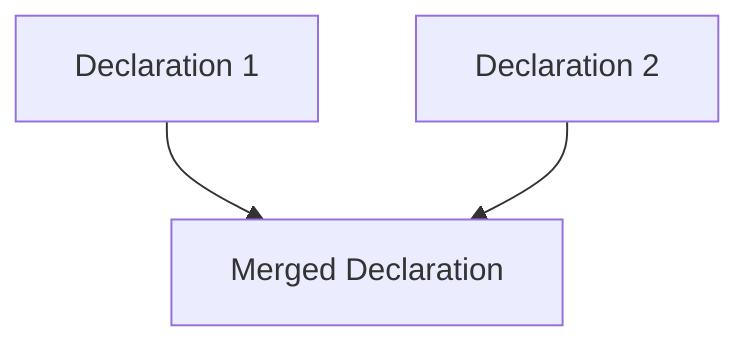

# TypeScript Declaration Merging

## Introduction

TypeScript's declaration merging is a powerful feature that allows you to combine multiple declarations with the same name. This capability enables you to extend existing types, add functionality to objects, and organize your code in more flexible ways than what JavaScript traditionally permits.

Declaration merging happens when the TypeScript compiler merges two or more declarations that have the same name into a single definition. This is particularly useful when working with libraries, extending interfaces, or organizing code across multiple files.

In this tutorial, we'll explore different types of declaration merging and learn how to use this feature effectively in your TypeScript projects.

## Understanding Declaration Merging

Declaration merging allows you to define something (like an interface or namespace) in multiple places, and TypeScript will automatically combine these definitions. This is particularly useful for extending existing types or adding functionality to existing objects.

Here's a simple diagram showing how declaration merging works:



Let's dive into the different types of declaration merging supported by TypeScript.

## Interface Merging

The most common form of declaration merging is interface merging. When you define multiple interfaces with the same name, TypeScript merges them into a single interface.

### Basic Interface Merging

```typescript
interface Person {
  name: string;
}

interface Person {
  age: number;
}

// TypeScript merges the interfaces into:
// interface Person {
//   name: string;
//   age: number;
// }

const person: Person = {
  name: "Alice",
  age: 30 // Both properties are required
};
```

### Handling Conflicts in Interface Merging

When merging interfaces, TypeScript requires that properties with the same name must have compatible types:

```typescript
interface Box {
  height: number;
  width: number;
}

interface Box {
  scale: number;
  // width: string; // Error: Subsequent property declarations must have the same type
}

const box: Box = {
  height: 10,
  width: 20,
  scale: 2
};
```

### Extending Method Signatures

For methods with the same name, TypeScript treats them as function overloads:

```typescript
interface Processor {
  process(a: number): number;
}

interface Processor {
  process(a: string): string;
}

// The merged interface is equivalent to:
// interface Processor {
//   process(a: number): number;
//   process(a: string): string;
// }

function getProcessor(): Processor {
  return {
    process(a: number | string): any {
      return typeof a === "string" ? a.toUpperCase() : a * 2;
    }
  };
}

const processor = getProcessor();
console.log(processor.process(10)); // 20
console.log(processor.process("hello")); // "HELLO"
```

## Namespace Merging

Namespaces can also be merged, allowing you to extend them across multiple files or sections of code.

### Basic Namespace Merging

```typescript
namespace Validation {
  export interface StringValidator {
    isValid(s: string): boolean;
  }
}

namespace Validation {
  export interface NumberValidator {
    isValidNumber(n: number): boolean;
  }
  
  // You can also add functions or classes
  export class RegexValidator implements StringValidator {
    isValid(s: string): boolean {
      return s.length > 0;
    }
  }
}

// Use the merged namespace
const validator: Validation.StringValidator = new Validation.RegexValidator();
console.log(validator.isValid("test")); // true
```

### Merging Namespaces with Classes

You can merge a namespace with a class to add static members:

```typescript
class Album {
  label: string = "";
}

namespace Album {
  export const TopGenres: string[] = ["Rock", "Pop", "Jazz"];
  
  export function isPopular(album: Album): boolean {
    return true; // Some actual implementation
  }
}

// Usage
const album = new Album();
album.label = "Blue Note";

// Access the namespace members
console.log(Album.TopGenres); // ["Rock", "Pop", "Jazz"]
console.log(Album.isPopular(album)); // true
```

### Merging Namespaces with Functions

Similarly, you can merge namespaces with functions:

```typescript
function buildLabel(name: string): string {
  return `Label: ${name}`;
}

namespace buildLabel {
  export let suffix = "";
  export const prefix = "Hello, ";
  
  export function createFullLabel(name: string): string {
    return `${prefix}${name}${suffix}`;
  }
}

// Usage
console.log(buildLabel("Alice")); // "Label: Alice"
buildLabel.suffix = "!";
console.log(buildLabel.createFullLabel("Alice")); // "Hello, Alice!"
```

## Merging Interfaces with Classes

You can also merge interfaces with classes to ensure a class implements certain properties:

```typescript
interface Animal {
  name: string;
}

class Animal {
  constructor(public age: number) {}
}

// Usage
const cat = new Animal(5);
cat.name = "Whiskers"; // The name property is required from the interface

console.log(cat.name); // "Whiskers"
console.log(cat.age); // 5
```

In this example, the `Animal` class must contain all properties defined in the `Animal` interface.

## Enum Merging

TypeScript also allows merging of enum declarations:

```typescript
enum Direction {
  Up = "UP",
  Down = "DOWN"
}

enum Direction {
  Left = "LEFT",
  Right = "RIGHT"
}

// The merged enum includes all values
console.log(Direction.Up); // "UP"
console.log(Direction.Left); // "LEFT"
```

## Practical Examples

### Extending the Window Interface

One common use of declaration merging is to extend global interfaces like the `Window` interface:

```typescript
// In a .d.ts file or regular .ts file with global scope
interface Window {
  analytics: {
    trackEvent(event: string, data?: any): void;
    getUser(): { id: string; name: string };
  };
}

// Now you can use your custom properties on the window object
window.analytics.trackEvent("buttonClick", { buttonId: "submit" });
const user = window.analytics.getUser();
console.log(user.name);
```

### Progressive Enhancement with Declaration Merging

Declaration merging allows for progressive enhancement of types as your application grows:

```typescript
// Initial definition in core.ts
interface UserConfig {
  name: string;
  email: string;
}

// Later in authentication.ts
interface UserConfig {
  authToken?: string;
  refreshToken?: string;
}

// Later in theme.ts
interface UserConfig {
  theme: "light" | "dark" | "system";
  fontSize: number;
}

// The final merged interface would be:
// interface UserConfig {
//   name: string;
//   email: string;
//   authToken?: string;
//   refreshToken?: string;
//   theme: "light" | "dark" | "system";
//   fontSize: number;
// }

const config: UserConfig = {
  name: "John",
  email: "john@example.com",
  theme: "dark",
  fontSize: 14,
  // authToken is optional
};
```

### Module Augmentation

Declaration merging enables module augmentation, which allows you to extend third-party modules:

```typescript
// Original module (e.g., from a library)
// node_modules/some-chart-library/index.d.ts
declare module "some-chart-library" {
  export interface ChartOptions {
    width: number;
    height: number;
  }
  
  export function createChart(options: ChartOptions): void;
}

// Your code, augmenting the module
// my-app.ts
import { createChart } from "some-chart-library";

// Add new properties to an existing interface from the module
declare module "some-chart-library" {
  interface ChartOptions {
    theme: "light" | "dark";
    animate: boolean;
  }
}

// Now you can use your extended options
createChart({
  width: 300,
  height: 200,
  theme: "dark",
  animate: true
});
```

## Best Practices for Declaration Merging

1. **Be consistent**: When merging declarations, keep the types consistent to avoid conflicts.

2. **Use module augmentation carefully**: When extending third-party modules, be aware that updates to the original module might break your augmentations.

3. **Document your merges**: Make it clear when you're using declaration merging, especially for team projects.

4. **Avoid excessive merging**: While declaration merging is powerful, too much merging can make code harder to follow.

5. **Isolate global augmentations**: Keep global augmentations in dedicated declaration files.

## Common Pitfalls

### Private and Protected Members

When merging interfaces, be aware that you can't merge private or protected members:

```typescript
class Car {
  private engine: string = "V8";
}

interface Car {
  // Error: Interface and class with the same name cannot merge because the class has private members
  // wheels: number; 
}
```

### Non-mergeable Declarations

Not all declarations can be merged. For example, you can't merge:

- Classes with other classes
- Variables with other variables
- Variable with class/interface/type

```typescript
class Employee {
  name: string = "";
}

// Error: Duplicate identifier 'Employee'
// class Employee {
//   id: number = 0;
// }

// This is valid - merging an interface with a class
interface Employee {
  department: string;
}
```

## Summary

TypeScript's declaration merging is a powerful feature that allows you to:

- Combine multiple interfaces with the same name into a single interface
- Extend namespaces across multiple declarations
- Merge namespaces with classes and functions
- Augment modules to extend third-party code
- Extend global objects like `Window`

This feature promotes code organization, reusability, and progressive enhancement of types as your application grows. Understanding declaration merging is essential for advanced TypeScript development and creating flexible, maintainable codebases.

## Exercises

1. Create an interface `User` with basic properties, then extend it with additional interfaces to add authentication and preferences information.

2. Augment the `Array` interface to add a new method `firstOrDefault` that returns the first element or a default value.

3. Create a namespace `Validators` with different validation strategies, then extend it across multiple files.

4. Use declaration merging to add custom properties to the `Express.Request` interface from Express.js.

## Additional Resources

- [TypeScript Handbook: Declaration Merging](https://www.typescriptlang.org/docs/handbook/declaration-merging.html)
- [TypeScript Deep Dive: Declaration Merging](https://basarat.gitbook.io/typescript/type-system/declaration-merging)
- [Module Augmentation in TypeScript](https://www.typescriptlang.org/docs/handbook/declaration-merging.html#module-augmentation)

Now that you understand declaration merging, you can create more flexible and maintainable TypeScript code by effectively combining declarations!