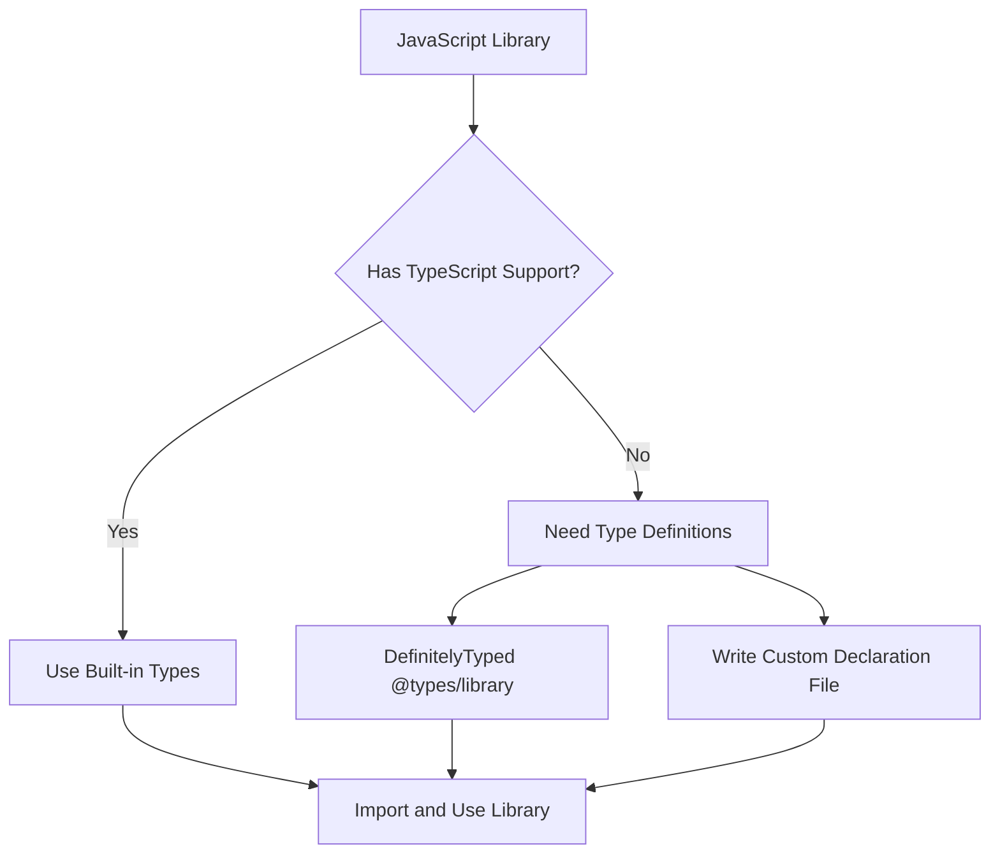

# TypeScript JavaScript Libraries

## Introduction

One of TypeScript's greatest strengths is its ability to work with the vast ecosystem of JavaScript libraries. As a TypeScript developer, you'll frequently need to incorporate existing JavaScript libraries into your projects. This article explains how TypeScript interacts with JavaScript libraries, how to obtain type definitions for those libraries, and best practices for integrating third-party code into your TypeScript projects.

## Understanding TypeScript and JavaScript Libraries Integration

TypeScript needs to understand the shape and behavior of JavaScript code to provide type checking, auto-completion, and other benefits. When using JavaScript libraries, TypeScript needs additional information about the types used in those libraries.



## Using JavaScript Libraries with Built-in TypeScript Support

Many modern JavaScript libraries are written in TypeScript or provide TypeScript definitions out of the box. For these libraries, integration is straightforward.

### Example: Using Axios with TypeScript

```bash
# Install the axios library
npm install axios
```

```typescript
// Import and use axios with full TypeScript support
import axios from 'axios';

interface User {
  id: number;
  name: string;
  email: string;
}

async function fetchUser(id: number): Promise<User> {
  const response = await axios.get<User>(`https://api.example.com/users/${id}`);
  return response.data;
}

// TypeScript knows this is a User object with id, name, and email properties
fetchUser(1).then(user => {
  console.log(user.name); // TypeScript provides autocomplete here
});
```

In this example, TypeScript understands the shapes and types returned by Axios because Axios includes TypeScript definitions.

## Using JavaScript Libraries without TypeScript Support

For libraries that don't include TypeScript definitions, you have two options:

1. Use DefinitelyTyped (@types/library)
2. Create your own declaration files

### Using DefinitelyTyped

[DefinitelyTyped](https://github.com/DefinitelyTyped/DefinitelyTyped) is a repository of TypeScript type definitions for thousands of JavaScript libraries. These are available through the `@types` npm namespace.

```bash
# Install a library and its type definitions
npm install lodash
npm install @types/lodash --save-dev
```

```typescript
// Now you can use lodash with full TypeScript support
import _ from 'lodash';

const users = [
  { name: 'John', age: 30 },
  { name: 'Jane', age: 25 },
  { name: 'Bob', age: 40 }
];

// TypeScript understands what _.sortBy returns
const sortedUsers = _.sortBy(users, ['age']);
console.log(sortedUsers);
// Output: [{ name: 'Jane', age: 25 }, { name: 'John', age: 30 }, { name: 'Bob', age: 40 }]
```

### Creating Declaration Files

If a library doesn't have type definitions available, you can create your own declaration file (`.d.ts`).

```typescript
// Create a file named example-library.d.ts
declare module 'example-library' {
  export function doSomething(value: string): number;
  
  export class Helper {
    constructor(options: { debug: boolean });
    process(data: any[]): string[];
  }
  
  export default function main(config: object): void;
}
```

Then in your TypeScript file:

```typescript
import exampleLib, { doSomething, Helper } from 'example-library';

// TypeScript now provides type checking and auto-completion
const result = doSomething('test'); // TypeScript knows this returns a number
const helper = new Helper({ debug: true });
const processed = helper.process([1, 2, 3]); // TypeScript knows this returns string[]

exampleLib({ verbose: true });
```

## Working with Module Augmentation

Sometimes you need to extend existing types from a library. TypeScript allows this through module augmentation.

```typescript
// Original library
import { User } from 'user-library';

// Extend the User interface from the library
declare module 'user-library' {
  interface User {
    avatarUrl?: string;
    lastLogin?: Date;
  }
}

// Now you can use the additional properties
const user: User = {
  id: 1,
  name: 'John',
  avatarUrl: 'https://example.com/avatar.jpg', // This works now!
  lastLogin: new Date()
};
```

## Best Practices for Using JavaScript Libraries in TypeScript

Here are some best practices to follow when integrating JavaScript libraries into your TypeScript projects:

### 1. Check for TypeScript Support First

Before integrating a library, check if it has built-in TypeScript support or types available from DefinitelyTyped.

```typescript
// Good approach - using typed libraries
import axios from 'axios'; // Built-in TypeScript support
import _ from 'lodash'; // @types/lodash installed
```

### 2. Using Type Assertions Sparingly

Sometimes, you might need to use type assertions when TypeScript can't infer the correct types, but use them sparingly.

```typescript
// Use type assertions when necessary, but prefer proper typing
const result = someLibraryFunction() as SomeType;
```

### 3. Creating Custom Type Guards

For libraries with uncertain return types, create custom type guards:

```typescript
function isUserResponse(obj: any): obj is UserResponse {
  return obj 
    && typeof obj === 'object'
    && 'name' in obj 
    && 'id' in obj 
    && typeof obj.id === 'number';
}

const data = libraryFunction();
if (isUserResponse(data)) {
  // TypeScript now knows data is a UserResponse
  console.log(data.name);
}
```

### 4. Use Package.json Fields for Types

When creating your own libraries, use the "types" or "typings" field in package.json to point to your declaration files:

```json
{
  "name": "my-library",
  "version": "1.0.0",
  "main": "dist/index.js",
  "types": "dist/index.d.ts",
  "dependencies": {
    // ...
  }
}
```

## Practical Example: Creating a Typed Wrapper

Sometimes, you might want to create a typed wrapper around an untyped library for better TypeScript integration:

```typescript
// Original untyped library
const chartLibrary = require('chart-library');

// Create a typed wrapper
interface ChartOptions {
  width: number;
  height: number;
  title?: string;
  animate?: boolean;
}

interface DataPoint {
  x: number;
  y: number;
  label?: string;
}

class TypedChart {
  private chart: any;
  
  constructor(element: HTMLElement, options: ChartOptions) {
    this.chart = chartLibrary.create(element, options);
  }
  
  addData(data: DataPoint[]): void {
    this.chart.setData(data);
  }
  
  render(): void {
    this.chart.draw();
  }
}

// Usage with full TypeScript support
const chart = new TypedChart(document.getElementById('chart')!, {
  width: 500,
  height: 300,
  title: 'Sales Data'
});

chart.addData([
  { x: 1, y: 10, label: 'Jan' },
  { x: 2, y: 15, label: 'Feb' },
  { x: 3, y: 8, label: 'Mar' }
]);

chart.render();
```

## Working with Global Libraries

Some older libraries might add themselves to the global scope rather than using imports. Here's how to type them:

```typescript
// Create a declaration file for a global library (jquery.d.ts)
interface JQuery {
  text(content: string): JQuery;
  on(event: string, handler: (event: any) => void): JQuery;
  // ... other jQuery methods
}

interface JQueryStatic {
  (selector: string): JQuery;
  ajax(options: object): Promise<any>;
  // ... other static methods
}

declare const $: JQueryStatic;
declare const jQuery: JQueryStatic;
```

Now you can use jQuery in your TypeScript files with type checking:

```typescript
// TypeScript will understand this code
$(document).ready(() => {
  const element = $('#my-element');
  element.text('Hello, TypeScript!');
  
  element.on('click', (e) => {
    console.log('Element clicked!');
  });
});
```

## Summary

Working with JavaScript libraries in TypeScript projects requires understanding how to obtain and use type definitions. Whether a library has built-in TypeScript support, available types from DefinitelyTyped, or needs custom declaration files, TypeScript provides mechanisms to integrate these libraries while maintaining type safety.

The key points to remember:

1. Check if the library has built-in TypeScript support
2. Look for types in DefinitelyTyped (@types/library)
3. Create custom declaration files when needed
4. Use module augmentation to extend existing types
5. Consider creating typed wrappers for better integration

By following these best practices, you can leverage the vast JavaScript ecosystem while enjoying the benefits of TypeScript's type system.

## Additional Resources and Exercises

### Resources
- [TypeScript Handbook: Declaration Files](https://www.typescriptlang.org/docs/handbook/declaration-files/introduction.html)
- [DefinitelyTyped Repository](https://github.com/DefinitelyTyped/DefinitelyTyped)
- [TypeScript Deep Dive: Ambient Declarations](https://basarat.gitbook.io/typescript/type-system/ambient)

### Exercises

1. **Basic Library Integration**  
   Install and integrate the `moment` library into a TypeScript project, using appropriate type definitions.

2. **Custom Declaration File**  
   Create a custom declaration file for a simple JavaScript utility library that has no TypeScript support.

3. **Typed Wrapper**  
   Take an untyped charting library and create a strongly-typed wrapper around its core functionality.

4. **Module Augmentation**  
   Extend the types of an existing library to add new properties or methods to its interfaces.

5. **Global Library Typing**  
   Create type definitions for a legacy library that attaches itself to the window object.

By completing these exercises, you'll gain practical experience with integrating different kinds of JavaScript libraries into TypeScript projects, enhancing your ability to work with the broader JavaScript ecosystem while maintaining TypeScript's type safety.