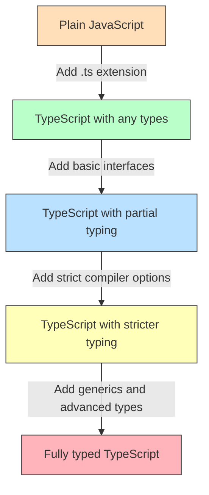

# TypeScript Gradual Typing

## Introduction

One of TypeScript's most powerful features is its support for **gradual typing**. Unlike some other statically typed languages that require all code to be fully typed from the start, TypeScript allows you to add types incrementally to your codebase. This approach makes TypeScript particularly appealing for JavaScript developers who want to adopt type safety without rewriting their entire codebase at once.

In this lesson, we'll explore how gradual typing works in TypeScript, why it's beneficial, and how you can leverage it to improve your JavaScript projects incrementally.

## What is Gradual Typing?

Gradual typing refers to a typing system that allows developers to mix statically typed and dynamically typed code in the same codebase. TypeScript implements gradual typing by:

1. Making all type annotations optional
2. Providing the `any` type for dynamic behavior
3. Allowing incremental adoption of the type system
4. Supporting type inference to reduce the need for explicit annotations

This approach bridges the gap between the dynamic nature of JavaScript and the safety of static typing.

## The Building Blocks of Gradual Typing

### The `any` Type

The `any` type is a key component of TypeScript's gradual typing system. It essentially tells the TypeScript compiler to skip type checking for a particular variable or expression.

```typescript
// Variable with 'any' type
let userData: any = fetchUserFromAPI();

// TypeScript doesn't complain about any of these operations
userData.name = "John";
userData = 42;
userData = true;
```

While `any` can be useful during migration, it effectively removes the benefits of type checking for that variable. It's often better to use more specific types when possible.

### Type Inference

TypeScript can often infer types automatically, which reduces the need for explicit type annotations:

```typescript
// TypeScript infers that 'name' is a string
let name = "Alice";

// This would cause an error because TypeScript knows 'name' is a string
// name = 42; // Type 'number' is not assignable to type 'string'
```

### Optional Type Annotations

You can add type annotations to some parts of your code while leaving others as plain JavaScript:

```typescript
// Untyped function (works like regular JavaScript)
function double(x) {
  return x * 2;
}

// Partially typed function
function greet(name: string) {
  return `Hello, ${name}!`;
}

// Fully typed function
function add(a: number, b: number): number {
  return a + b;
}
```

## Benefits of Gradual Typing

1. **Incremental adoption**: You can migrate JavaScript code to TypeScript at your own pace.
2. **Immediate value**: Even partial typing provides benefits in terms of tooling and error detection.
3. **Low barrier to entry**: Team members can learn TypeScript gradually while remaining productive.
4. **Compatibility**: You can easily integrate with untyped JavaScript libraries.
5. **Risk reduction**: Incremental migration reduces the risk of breaking changes.

## Practical Migration Strategy

Let's look at how you might gradually introduce TypeScript into an existing JavaScript project:

### Step 1: Set Up TypeScript with Permissive Configuration

Start with a `tsconfig.json` file that allows for a smooth transition:

```json
{
  "compilerOptions": {
    "target": "es2016",
    "module": "commonjs",
    "allowJs": true,
    "checkJs": false,
    "noImplicitAny": false,
    "strictNullChecks": false,
    "strict": false,
    "outDir": "./dist"
  },
  "include": ["src/**/*"]
}
```

This configuration:
- Allows JavaScript files alongside TypeScript (`allowJs`)
- Doesn't check JavaScript files for type errors (`checkJs`)
- Doesn't require explicit types for variables (`noImplicitAny`)
- Starts with less strict null checking (`strictNullChecks`)

### Step 2: Rename Files and Add Basic Types

Start by renaming `.js` files to `.ts` or `.tsx` and add some basic type annotations:

Before (user.js):

```javascript
function getUser(id) {
  // Fetch user from API
  return {
    id,
    name: "User " + id,
    isPremium: Math.random() > 0.5
  };
}

function displayUser(user) {
  console.log(`User ${user.name} (${user.id}): Premium - ${user.isPremium}`);
}

const user = getUser(123);
displayUser(user);
```

After (user.ts):

```typescript
interface User {
  id: number;
  name: string;
  isPremium: boolean;
}

function getUser(id: number): User {
  // Fetch user from API
  return {
    id,
    name: "User " + id,
    isPremium: Math.random() > 0.5
  };
}

function displayUser(user: User): void {
  console.log(`User ${user.name} (${user.id}): Premium - ${user.isPremium}`);
}

const user = getUser(123);
displayUser(user);
```

### Step 3: Gradually Increase Type Strictness

As your team becomes comfortable with TypeScript, you can tighten the type-checking rules in your `tsconfig.json`:

```json
{
  "compilerOptions": {
    "target": "es2016",
    "module": "commonjs",
    "allowJs": true,
    "checkJs": true,
    "noImplicitAny": true,
    "strictNullChecks": true,
    "strict": false,
    "outDir": "./dist"
  },
  "include": ["src/**/*"]
}
```

Now TypeScript will:
- Check JavaScript files for type errors (`checkJs`)
- Require type annotations for variables (`noImplicitAny`)
- Enable strict null checking (`strictNullChecks`)

### Step 4: Use `@ts-check` for JavaScript Files

For JavaScript files that you're not ready to convert, you can use `// @ts-check` at the top of the file to enable type checking with JSDoc comments:

```javascript
// @ts-check

/**
 * Calculates the area of a rectangle
 * @param {number} width - The width of the rectangle
 * @param {number} height - The height of the rectangle
 * @returns {number} The area of the rectangle
 */
function calculateArea(width, height) {
  return width * height;
}

// TypeScript will catch this error even though it's a .js file
// calculateArea("10", 20);
```

## Real-World Example: Adding Types to an Event System

Let's see how we can gradually type a simple event system:

### Stage 1: Untyped JavaScript

```javascript
// eventSystem.js
const eventBus = {
  events: {},
  
  subscribe(event, callback) {
    if (!this.events[event]) {
      this.events[event] = [];
    }
    this.events[event].push(callback);
    
    return () => this.unsubscribe(event, callback);
  },
  
  unsubscribe(event, callback) {
    if (this.events[event]) {
      this.events[event] = this.events[event].filter(cb => cb !== callback);
    }
  },
  
  publish(event, data) {
    if (this.events[event]) {
      this.events[event].forEach(callback => callback(data));
    }
  }
};

// Usage
const unsubscribe = eventBus.subscribe('userLoggedIn', userData => {
  console.log(`User logged in: ${userData.name}`);
});

eventBus.publish('userLoggedIn', { name: 'John', id: 123 });
unsubscribe();
```

### Stage 2: Partial TypeScript Conversion

```typescript
// eventSystem.ts with minimal typing
interface EventCallback {
  (data: any): void;
}

interface Events {
  [eventName: string]: EventCallback[];
}

const eventBus = {
  events: {} as Events,
  
  subscribe(event: string, callback: EventCallback) {
    if (!this.events[event]) {
      this.events[event] = [];
    }
    this.events[event].push(callback);
    
    return () => this.unsubscribe(event, callback);
  },
  
  unsubscribe(event: string, callback: EventCallback) {
    if (this.events[event]) {
      this.events[event] = this.events[event].filter(cb => cb !== callback);
    }
  },
  
  publish(event: string, data: any) {
    if (this.events[event]) {
      this.events[event].forEach(callback => callback(data));
    }
  }
};

// Usage still uses 'any' internally
const unsubscribe = eventBus.subscribe('userLoggedIn', userData => {
  console.log(`User logged in: ${userData.name}`);
});

eventBus.publish('userLoggedIn', { name: 'John', id: 123 });
unsubscribe();
```

### Stage 3: Fully Typed Solution

```typescript
// eventSystem.ts with generic typing
interface EventCallback<T> {
  (data: T): void;
}

interface Events {
  [eventName: string]: EventCallback<any>[];
}

// Define type-safe event map
interface EventMap {
  userLoggedIn: { name: string; id: number };
  userLoggedOut: { id: number };
  itemPurchased: { itemId: string; price: number; userId: number };
}

const eventBus = {
  events: {} as Events,
  
  subscribe<K extends keyof EventMap>(
    event: K,
    callback: EventCallback<EventMap[K]>
  ) {
    if (!this.events[event]) {
      this.events[event] = [];
    }
    this.events[event].push(callback as EventCallback<any>);
    
    return () => this.unsubscribe(event, callback);
  },
  
  unsubscribe<K extends keyof EventMap>(
    event: K,
    callback: EventCallback<EventMap[K]>
  ) {
    if (this.events[event]) {
      this.events[event] = this.events[event].filter(cb => cb !== callback);
    }
  },
  
  publish<K extends keyof EventMap>(event: K, data: EventMap[K]) {
    if (this.events[event]) {
      this.events[event].forEach(callback => callback(data));
    }
  }
};

// Usage with full type safety
const unsubscribe = eventBus.subscribe('userLoggedIn', userData => {
  console.log(`User logged in: ${userData.name}`);
  // TypeScript knows userData has name and id properties
});

// Type-safe - compiler ensures correct data structure
eventBus.publish('userLoggedIn', { name: 'John', id: 123 });

// Would cause compile error: missing 'price' property
// eventBus.publish('itemPurchased', { itemId: 'book-123', userId: 456 });
unsubscribe();
```

This example demonstrates how you can start with plain JavaScript and incrementally add more type safety, gaining benefits at each step along the way.

## Visual Representation of the Gradual Typing Process



## Common Challenges in Gradual Typing

### Dealing with External Libraries

For libraries without TypeScript definitions:

1. **Check DefinitelyTyped**: Install type definitions if available:

```bash
npm install --save-dev @types/library-name
```

2. **Create custom declarations**:

```typescript
// declarations.d.ts
declare module 'untyped-library' {
  export function someFunction(arg: string): number;
  export class SomeClass {
    constructor(options: { name: string });
    doSomething(): void;
  }
}
```

### Handling Dynamic JavaScript Patterns

For patterns that are difficult to type:

```typescript
// Use type assertions when needed
const element = document.getElementById('app') as HTMLDivElement;

// Use type guards for runtime checking
function isString(value: any): value is string {
  return typeof value === 'string';
}

// Use union types for flexibility
function process(input: string | number) {
  if (typeof input === 'string') {
    return input.toUpperCase();
  } else {
    return input * 2;
  }
}
```

## Summary

TypeScript's gradual typing is a powerful feature that allows you to adopt type safety at your own pace. By making all type annotations optional and providing features like the `any` type and type inference, TypeScript creates a smooth path from dynamic JavaScript to statically typed code.

Key takeaways:
- Add types incrementally to gain benefits without rewriting everything at once
- Start with permissive compiler options and tighten them over time
- Use interfaces to define the shape of your data
- Leverage TypeScript's type inference to reduce the need for annotations
- Use JSDoc comments with `@ts-check` to add types to JavaScript files

As you add more type annotations to your code, you'll experience fewer runtime errors, better tooling support, and improved code documentation—all while maintaining compatibility with the JavaScript ecosystem.

## Exercises

1. Take a small JavaScript function from one of your projects and convert it to TypeScript with basic type annotations.
2. Create a `tsconfig.json` file with permissive settings for a JavaScript project.
3. Add JSDoc comments with type information to a JavaScript file and use `// @ts-check` to enable type checking.
4. Define an interface for a common data structure in your application, such as a user object or product item.
5. Practice using type assertions and type guards to work with dynamically typed data in a type-safe way.

## Further Reading

- [TypeScript Handbook: Type Checking JavaScript Files](https://www.typescriptlang.org/docs/handbook/type-checking-javascript-files.html)
- [TypeScript Handbook: Migrating from JavaScript](https://www.typescriptlang.org/docs/handbook/migrating-from-javascript.html)
- [TypeScript Compiler Options](https://www.typescriptlang.org/tsconfig)
- [Definitely Typed Repository](https://github.com/DefinitelyTyped/DefinitelyTyped)

Happy coding with TypeScript's gradual typing system!