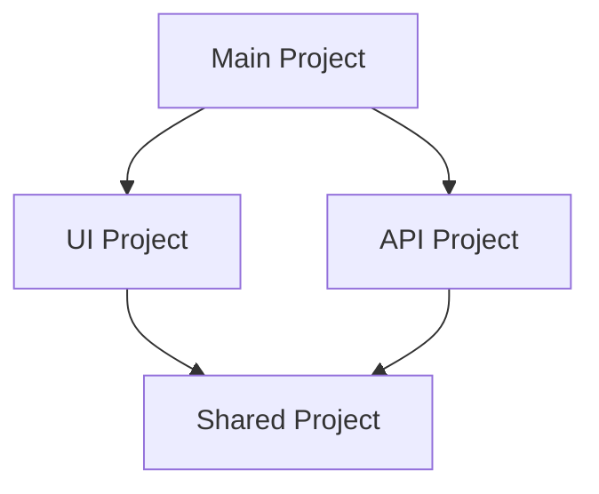

# TypeScript Project References

## Introduction

As your TypeScript projects grow in size and complexity, you may start facing challenges like slow compilation times, difficulty in managing dependencies between components, and code organization issues. TypeScript Project References provide a solution to these problems by allowing you to divide your codebase into smaller, more manageable pieces.

Project references enable you to structure your TypeScript project as a set of smaller projects that reference each other, creating a graph of dependencies. This approach brings several benefits:

- **Faster builds**: TypeScript can build projects in the correct order and avoid rebuilding unchanged projects
- **Better code organization**: Clear boundaries between components of your application
- **Improved developer experience**: Better editor support and more precise error reporting

In this guide, we'll explore how to set up and use TypeScript project references in your development workflow.

## Understanding Project References

Project references allow you to break down your codebase into multiple TypeScript projects that can depend on each other. Each project has its own `tsconfig.json` file and can be built independently or as part of the larger project.

When one project references another, TypeScript understands the relationship between them:



## Setting Up Project References

Let's walk through setting up a simple project with references. We'll create a structure with a shared library and two applications that depend on it.

### Step 1: Create Project Structure

Start by organizing your folders:

```
my-project/
├── packages/
│   ├── shared/
│   │   ├── src/
│   │   └── tsconfig.json
│   ├── app1/
│   │   ├── src/
│   │   └── tsconfig.json
│   └── app2/
│       ├── src/
│       └── tsconfig.json
└── tsconfig.json
```

### Step 2: Configure the Shared Project

The shared project will be referenced by other projects. Create a `tsconfig.json` file in the shared directory:

```json
// packages/shared/tsconfig.json
{
  "compilerOptions": {
    "composite": true,
    "declaration": true,
    "declarationMap": true,
    "sourceMap": true,
    "outDir": "./dist",
    "rootDir": "./src",
    "strict": true
  },
  "include": ["src/**/*"]
}
```

The `composite` flag is crucial here - it's required for projects that are referenced by other projects.

### Step 3: Add Some Code to the Shared Project

Let's create a utility function in our shared project:

```typescript
// packages/shared/src/utils.ts
export function formatDate(date: Date): string {
  return date.toISOString().split('T')[0];
}
```

### Step 4: Configure Dependent Projects

Now set up one of the apps that will use the shared code:

```json
// packages/app1/tsconfig.json
{
  "compilerOptions": {
    "composite": true,
    "declaration": true,
    "declarationMap": true,
    "sourceMap": true,
    "outDir": "./dist",
    "rootDir": "./src",
    "strict": true
  },
  "references": [
    { "path": "../shared" }
  ],
  "include": ["src/**/*"]
}
```

The `references` array is where we define the dependencies to other projects.

### Step 5: Use the Shared Code

Now use the shared utility in our app:

```typescript
// packages/app1/src/index.ts
import { formatDate } from '../../shared/src/utils';

console.log(`Today is: ${formatDate(new Date())}`);
```

### Step 6: Create a Root Configuration

Finally, create a root `tsconfig.json` that ties everything together:

```json
// tsconfig.json
{
  "files": [],
  "references": [
    { "path": "./packages/shared" },
    { "path": "./packages/app1" },
    { "path": "./packages/app2" }
  ]
}
```

## Building with Project References

There are two main ways to build a project that uses project references:

### Using --build Mode

TypeScript's compiler has a special build mode for working with project references:

```bash
tsc --build
```

This command will:
1. Find referenced projects
2. Check if they're up to date
3. Build out-of-date projects in the correct order

If you want to rebuild everything, you can use:

```bash
tsc --build --clean
tsc --build
```

### Building Individual Projects

You can still build individual projects:

```bash
cd packages/app1
tsc
```

This will automatically build any referenced projects that are out of date.

## Real-World Example: Creating a Monorepo

Let's look at a more realistic example of using project references in a monorepo setup with a backend, frontend, and shared types.

### Project Structure

```
monorepo/
├── packages/
│   ├── types/
│   │   ├── src/
│   │   │   └── models.ts
│   │   └── tsconfig.json
│   ├── backend/
│   │   ├── src/
│   │   │   └── index.ts
│   │   └── tsconfig.json
│   └── frontend/
│       ├── src/
│       │   └── App.tsx
│       └── tsconfig.json
└── tsconfig.json
```

### Shared Types

```typescript
// packages/types/src/models.ts
export interface User {
  id: string;
  name: string;
  email: string;
  role: 'admin' | 'user';
}

export interface ApiResponse<T> {
  data: T;
  success: boolean;
  message?: string;
}
```

### Types Project Config

```json
// packages/types/tsconfig.json
{
  "compilerOptions": {
    "composite": true,
    "declaration": true,
    "declarationMap": true,
    "sourceMap": true,
    "outDir": "./dist",
    "rootDir": "./src",
    "strict": true,
    "esModuleInterop": true
  },
  "include": ["src/**/*"]
}
```

### Backend Project

```typescript
// packages/backend/src/index.ts
import { User, ApiResponse } from '../../types/src/models';

const users: User[] = [
  {
    id: '1',
    name: 'Jane Doe',
    email: 'jane@example.com',
    role: 'admin'
  },
  {
    id: '2',
    name: 'John Smith',
    email: 'john@example.com',
    role: 'user'
  }
];

function getUsers(): ApiResponse<User[]> {
  return {
    data: users,
    success: true
  };
}

console.log(getUsers());
```

### Backend Config

```json
// packages/backend/tsconfig.json
{
  "compilerOptions": {
    "composite": true,
    "declaration": true,
    "declarationMap": true,
    "sourceMap": true,
    "outDir": "./dist",
    "rootDir": "./src",
    "strict": true,
    "esModuleInterop": true,
    "target": "es2018",
    "module": "commonjs"
  },
  "references": [
    { "path": "../types" }
  ],
  "include": ["src/**/*"]
}
```

### Frontend Project

```tsx
// packages/frontend/src/App.tsx
import React, { useState, useEffect } from 'react';
import { User } from '../../types/src/models';

const App: React.FC = () => {
  const [users, setUsers] = useState<User[]>([]);
  
  useEffect(() => {
    // In a real app, this would be an API call
    setUsers([
      {
        id: '1',
        name: 'Jane Doe',
        email: 'jane@example.com',
        role: 'admin'
      }
    ]);
  }, []);
  
  return (
    <div>
      <h1>User List</h1>
      <ul>
        {users.map(user => (
          <li key={user.id}>
            {user.name} ({user.role})
          </li>
        ))}
      </ul>
    </div>
  );
};

export default App;
```

### Frontend Config

```json
// packages/frontend/tsconfig.json
{
  "compilerOptions": {
    "composite": true,
    "declaration": true,
    "declarationMap": true,
    "sourceMap": true,
    "outDir": "./dist",
    "rootDir": "./src",
    "strict": true,
    "esModuleInterop": true,
    "jsx": "react",
    "lib": ["dom", "dom.iterable", "esnext"],
    "target": "es5",
    "module": "esnext",
    "moduleResolution": "node"
  },
  "references": [
    { "path": "../types" }
  ],
  "include": ["src/**/*"]
}
```

### Root Config

```json
// tsconfig.json
{
  "files": [],
  "references": [
    { "path": "./packages/types" },
    { "path": "./packages/backend" },
    { "path": "./packages/frontend" }
  ]
}
```

## Advanced Project Reference Features

### Using Path Mapping

TypeScript's path mapping can make imports cleaner in a project references setup:

```json
// packages/app1/tsconfig.json
{
  "compilerOptions": {
    // ... other options
    "baseUrl": ".",
    "paths": {
      "@shared/*": ["../shared/src/*"]
    }
  },
  "references": [
    { "path": "../shared" }
  ]
}
```

This allows you to import from the shared project more cleanly:

```typescript
// Before
import { formatDate } from '../../shared/src/utils';

// After
import { formatDate } from '@shared/utils';
```

### Using the `prepend` Option

When bundling output JavaScript, you can use the `prepend` option to include the output from dependencies:

```json
{
  "references": [
    { "path": "../shared", "prepend": true }
  ]
}
```

### Incremental Compilation

Project references work well with the incremental compilation feature:

```json
{
  "compilerOptions": {
    "incremental": true,
    // other options
  }
}
```

This creates a `.tsbuildinfo` file that helps TypeScript track dependencies and only rebuild what's necessary.

## Common Issues and Solutions

### Path Resolution Issues

**Problem**: "Cannot find module" errors, even though the referenced project is built.

**Solution**: Make sure your module resolution settings are consistent across projects, and consider using path mapping.

### Out-of-Date Declaration Files

**Problem**: Changes in referenced projects are not reflected in dependent projects.

**Solution**: Use `tsc --build` to ensure all projects are built in the correct order, and use `declarationMap: true` to improve editor navigation.

### Build Order Issues

**Problem**: TypeScript isn't building projects in the correct dependency order.

**Solution**: Ensure your `references` array correctly reflects all dependencies, and use the `--build` mode which handles build order automatically.

## Best Practices

1. **Keep a flat project structure**: While nesting is possible, a flat structure of projects makes paths and references more manageable.

2. **Use consistent compiler options**: Ensure compatible options across projects to avoid subtle bugs.

3. **Leverage `paths` mapping**: Use TypeScript's path mapping for cleaner imports.

4. **Enable source maps and declaration maps**: These improve developer experience with better navigation.

5. **Use incremental builds**: The `incremental` flag can significantly speed up builds.

6. **Include build scripts in package.json**: Add scripts for common operations:

```json
{
  "scripts": {
    "build": "tsc --build",
    "clean": "tsc --build --clean"
  }
}
```

## Summary

TypeScript Project References provide a powerful way to organize large codebases into smaller, more manageable pieces. They offer significant benefits:

- Faster build times through incremental compilation
- Improved code organization with clear project boundaries
- Better developer experience with accurate dependency tracking
- Ability to build specific parts of your application

By setting up a proper project reference structure, you can scale your TypeScript projects efficiently while maintaining a good developer experience.

## Additional Resources

- [Official TypeScript Handbook on Project References](https://www.typescriptlang.org/docs/handbook/project-references.html)
- [TSConfig Reference: composite](https://www.typescriptlang.org/tsconfig#composite)
- [TypeScript Build Mode Documentation](https://www.typescriptlang.org/docs/handbook/project-references.html#build-mode)

## Exercises

1. Convert an existing multi-file TypeScript project to use project references.
2. Create a monorepo structure with three projects: a shared utilities package and two applications that depend on it.
3. Add path mapping to your project references setup to simplify imports.
4. Set up a CI workflow that leverages project references to optimize build times.
5. Compare build times for a project with and without project references to measure the performance improvement.