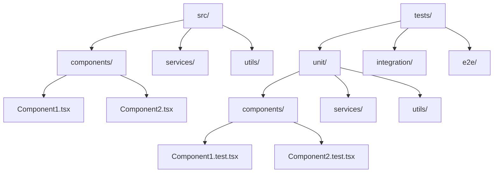

# TypeScript Testing

Testing is a crucial part of any software development process. When working with TypeScript, you have access to a rich ecosystem of testing tools that can help ensure your code works correctly. In this guide, we'll explore how to test TypeScript applications effectively, covering various testing frameworks and approaches.

## Why Test TypeScript Code?

TypeScript's static type checking already catches many errors at compile time, but testing goes beyond type-checking to verify that your code behaves as expected at runtime. Testing helps:

- Validate business logic works correctly
- Prevent regressions when code changes
- Document how code should behave
- Improve code quality and design

## Setting Up Your Testing Environment

Before writing tests, you need to set up a testing environment. We'll focus on Jest, one of the most popular testing frameworks in the JavaScript ecosystem, but the concepts apply to other frameworks like Mocha or Vitest as well.

### Setting Up Jest for TypeScript

1. First, install the necessary packages:

```bash
npm install --save-dev jest ts-jest @types/jest typescript
```

2. Create a Jest configuration file (`jest.config.js`):

```javascript
module.exports = {
  preset: 'ts-jest',
  testEnvironment: 'node',
  moduleFileExtensions: ['ts', 'tsx', 'js', 'jsx', 'json'],
  transform: {
    '^.+\\.(ts|tsx)$': 'ts-jest',
  },
  testMatch: ['**/__tests__/**/*.[jt]s?(x)', '**/?(*.)+(spec|test).[jt]s?(x)'],
};
```

3. Add testing scripts to your `package.json`:

```json
{
  "scripts": {
    "test": "jest",
    "test:watch": "jest --watch",
    "test:coverage": "jest --coverage"
  }
}
```

## Writing Your First TypeScript Test

Let's start by creating a simple function and writing tests for it.

### Example: Math Utility Function

Create a file called `math.ts`:

```typescript
// math.ts
export function add(a: number, b: number): number {
  return a + b;
}

export function subtract(a: number, b: number): number {
  return a - b;
}

export function multiply(a: number, b: number): number {
  return a * b;
}

export function divide(a: number, b: number): number {
  if (b === 0) {
    throw new Error('Division by zero is not allowed');
  }
  return a / b;
}
```

Now let's create a test file called `math.test.ts`:

```typescript
// math.test.ts
import { add, subtract, multiply, divide } from './math';

describe('Math utilities', () => {
  describe('add function', () => {
    it('should add two positive numbers correctly', () => {
      expect(add(1, 2)).toBe(3);
    });

    it('should handle negative numbers', () => {
      expect(add(-1, -2)).toBe(-3);
      expect(add(-1, 2)).toBe(1);
    });
  });

  describe('subtract function', () => {
    it('should subtract correctly', () => {
      expect(subtract(5, 2)).toBe(3);
    });

    it('should handle negative results', () => {
      expect(subtract(2, 5)).toBe(-3);
    });
  });

  describe('multiply function', () => {
    it('should multiply two numbers correctly', () => {
      expect(multiply(3, 4)).toBe(12);
    });

    it('should return zero when multiplying by zero', () => {
      expect(multiply(5, 0)).toBe(0);
    });
  });

  describe('divide function', () => {
    it('should divide two numbers correctly', () => {
      expect(divide(10, 2)).toBe(5);
    });

    it('should throw an error when dividing by zero', () => {
      expect(() => divide(10, 0)).toThrow('Division by zero is not allowed');
    });
  });
});
```

To run the tests:

```bash
npm test
```

Output:
```
PASS  ./math.test.ts
  Math utilities
    add function
      ✓ should add two positive numbers correctly (2 ms)
      ✓ should handle negative numbers (1 ms)
    subtract function
      ✓ should subtract correctly
      ✓ should handle negative results
    multiply function
      ✓ should multiply two numbers correctly (1 ms)
      ✓ should return zero when multiplying by zero
    divide function
      ✓ should divide two numbers correctly
      ✓ should throw an error when dividing by zero (4 ms)

Test Suites: 1 passed, 1 total
Tests:       8 passed, 8 total
Snapshots:   0 total
Time:        1.421 s
```

## Types of Tests in TypeScript

### Unit Testing

Unit tests focus on testing individual components in isolation. They are typically fast to run and help identify issues in specific functions or classes.

Here's an example of unit testing a class:

```typescript
// user.ts
export class User {
  constructor(public name: string, public email: string, private age: number) {}

  isAdult(): boolean {
    return this.age >= 18;
  }

  getDisplayName(): string {
    return `${this.name} <${this.email}>`;
  }
}
```

```typescript
// user.test.ts
import { User } from './user';

describe('User class', () => {
  it('should create a user with the correct properties', () => {
    const user = new User('John Doe', 'john@example.com', 25);
    expect(user.name).toBe('John Doe');
    expect(user.email).toBe('john@example.com');
    // age is private, so we test it through behavior
  });

  describe('isAdult method', () => {
    it('should return true for users 18 and over', () => {
      const adult = new User('John', 'john@example.com', 18);
      expect(adult.isAdult()).toBe(true);
      
      const olderAdult = new User('Jane', 'jane@example.com', 30);
      expect(olderAdult.isAdult()).toBe(true);
    });

    it('should return false for users under 18', () => {
      const minor = new User('Kid', 'kid@example.com', 17);
      expect(minor.isAdult()).toBe(false);
    });
  });

  describe('getDisplayName method', () => {
    it('should format the display name correctly', () => {
      const user = new User('John Doe', 'john@example.com', 25);
      expect(user.getDisplayName()).toBe('John Doe <john@example.com>');
    });
  });
});
```

### Integration Testing

Integration tests check that multiple components work together correctly.

Here's an example of a simple integration test for a user service that uses a database:

```typescript
// userService.ts
import { Database } from './database';

export interface UserData {
  id?: number;
  name: string;
  email: string;
  age: number;
}

export class UserService {
  constructor(private db: Database) {}

  async createUser(userData: UserData): Promise<UserData> {
    const id = await this.db.insert('users', userData);
    return { ...userData, id };
  }

  async getUserById(id: number): Promise<UserData | null> {
    return this.db.findById('users', id);
  }
}
```

```typescript
// userService.test.ts
import { UserService, UserData } from './userService';
import { Database } from './database';

// Create a mock for the Database dependency
jest.mock('./database');

describe('UserService integration', () => {
  let userService: UserService;
  let mockDb: jest.Mocked<Database>;

  beforeEach(() => {
    // Clear all mocks before each test
    jest.clearAllMocks();
    
    // Create a fresh instance of the mocked Database
    mockDb = new Database() as jest.Mocked<Database>;
    userService = new UserService(mockDb);
  });

  describe('createUser', () => {
    it('should insert user data and return the user with an ID', async () => {
      // Arrange
      const userData: UserData = {
        name: 'Alice Smith',
        email: 'alice@example.com',
        age: 30
      };
      
      mockDb.insert.mockResolvedValue(123);

      // Act
      const result = await userService.createUser(userData);

      // Assert
      expect(mockDb.insert).toHaveBeenCalledWith('users', userData);
      expect(result).toEqual({
        id: 123,
        name: 'Alice Smith',
        email: 'alice@example.com',
        age: 30
      });
    });
  });

  describe('getUserById', () => {
    it('should retrieve a user by ID', async () => {
      // Arrange
      const mockUser = {
        id: 123,
        name: 'Bob Johnson',
        email: 'bob@example.com',
        age: 25
      };
      
      mockDb.findById.mockResolvedValue(mockUser);

      // Act
      const result = await userService.getUserById(123);

      // Assert
      expect(mockDb.findById).toHaveBeenCalledWith('users', 123);
      expect(result).toEqual(mockUser);
    });

    it('should return null when user is not found', async () => {
      // Arrange
      mockDb.findById.mockResolvedValue(null);

      // Act
      const result = await userService.getUserById(999);

      // Assert
      expect(mockDb.findById).toHaveBeenCalledWith('users', 999);
      expect(result).toBeNull();
    });
  });
});
```

## Testing with TypeScript's Type System

One of TypeScript's strengths is its type system. You can leverage it in your tests to ensure your code behaves correctly at the type level.

### Using Type Assertions in Tests

```typescript
// calculator.ts
export type Operation = 'add' | 'subtract' | 'multiply' | 'divide';

export interface CalculatorInput {
  operation: Operation;
  a: number;
  b: number;
}

export interface CalculatorResult {
  operation: Operation;
  result: number;
}

export function calculate(input: CalculatorInput): CalculatorResult {
  let result: number;

  switch (input.operation) {
    case 'add':
      result = input.a + input.b;
      break;
    case 'subtract':
      result = input.a - input.b;
      break;
    case 'multiply':
      result = input.a * input.b;
      break;
    case 'divide':
      if (input.b === 0) {
        throw new Error('Division by zero is not allowed');
      }
      result = input.a / input.b;
      break;
  }

  return {
    operation: input.operation,
    result
  };
}
```

```typescript
// calculator.test.ts
import { calculate, CalculatorInput, CalculatorResult, Operation } from './calculator';

describe('Calculator function', () => {
  // Type test: verify our function works with TypeScript's type system
  it('should accept valid input types', () => {
    // These shouldn't cause TypeScript errors
    const input1: CalculatorInput = { operation: 'add', a: 1, b: 2 };
    const input2: CalculatorInput = { operation: 'subtract', a: 5, b: 3 };
    const input3: CalculatorInput = { operation: 'multiply', a: 2, b: 4 };
    const input4: CalculatorInput = { operation: 'divide', a: 10, b: 2 };
    
    // Test if the return type matches CalculatorResult
    const result = calculate(input1);
    const typeCheck: CalculatorResult = result; // This will fail if types don't match
    
    // Actual assertion
    expect(result).toEqual({ operation: 'add', result: 3 });
  });

  it('should add two numbers correctly', () => {
    const input: CalculatorInput = { operation: 'add', a: 5, b: 3 };
    expect(calculate(input)).toEqual({ operation: 'add', result: 8 });
  });

  it('should subtract two numbers correctly', () => {
    const input: CalculatorInput = { operation: 'subtract', a: 5, b: 3 };
    expect(calculate(input)).toEqual({ operation: 'subtract', result: 2 });
  });

  it('should multiply two numbers correctly', () => {
    const input: CalculatorInput = { operation: 'multiply', a: 5, b: 3 };
    expect(calculate(input)).toEqual({ operation: 'multiply', result: 15 });
  });

  it('should divide two numbers correctly', () => {
    const input: CalculatorInput = { operation: 'divide', a: 6, b: 3 };
    expect(calculate(input)).toEqual({ operation: 'divide', result: 2 });
  });

  it('should throw an error when dividing by zero', () => {
    const input: CalculatorInput = { operation: 'divide', a: 6, b: 0 };
    expect(() => calculate(input)).toThrow('Division by zero is not allowed');
  });
});
```

## Advanced Testing Techniques

### Testing Asynchronous Code

TypeScript applications often include asynchronous code. Here's how to test promises and async/await:

```typescript
// api.ts
export async function fetchUser(id: number): Promise<{ id: number, name: string }> {
  const response = await fetch(`https://api.example.com/users/${id}`);
  
  if (!response.ok) {
    throw new Error(`Failed to fetch user: ${response.statusText}`);
  }
  
  return response.json();
}
```

```typescript
// api.test.ts
import { fetchUser } from './api';

// Mock the global fetch function
global.fetch = jest.fn();

describe('API functions', () => {
  beforeEach(() => {
    jest.resetAllMocks();
  });

  describe('fetchUser', () => {
    it('should fetch a user successfully', async () => {
      // Arrange
      const mockUser = { id: 1, name: 'John Doe' };
      const mockResponse = {
        ok: true,
        json: jest.fn().mockResolvedValue(mockUser)
      };
      
      (global.fetch as jest.Mock).mockResolvedValue(mockResponse);

      // Act
      const result = await fetchUser(1);

      // Assert
      expect(global.fetch).toHaveBeenCalledWith('https://api.example.com/users/1');
      expect(result).toEqual(mockUser);
    });

    it('should throw an error when the fetch fails', async () => {
      // Arrange
      const mockResponse = {
        ok: false,
        statusText: 'Not Found'
      };
      
      (global.fetch as jest.Mock).mockResolvedValue(mockResponse);

      // Act & Assert
      await expect(fetchUser(999)).rejects.toThrow('Failed to fetch user: Not Found');
      expect(global.fetch).toHaveBeenCalledWith('https://api.example.com/users/999');
    });
  });
});
```

### Testing React Components with TypeScript

If you're using TypeScript with React, you can use tools like React Testing Library or Enzyme to test your components:

```typescript
// Counter.tsx
import React, { useState } from 'react';

interface CounterProps {
  initialValue?: number;
  step?: number;
}

export const Counter: React.FC<CounterProps> = ({ 
  initialValue = 0, 
  step = 1 
}) => {
  const [count, setCount] = useState(initialValue);

  const increment = () => setCount(prev => prev + step);
  const decrement = () => setCount(prev => prev - step);

  return (
    <div>
      <h2>Counter: {count}</h2>
      <button onClick={increment}>Increment</button>
      <button onClick={decrement}>Decrement</button>
    </div>
  );
};
```

```typescript
// Counter.test.tsx
import React from 'react';
import { render, screen, fireEvent } from '@testing-library/react';
import { Counter } from './Counter';

describe('Counter component', () => {
  it('should render with default values', () => {
    render(<Counter />);
    
    expect(screen.getByText('Counter: 0')).toBeInTheDocument();
  });

  it('should render with custom initial value', () => {
    render(<Counter initialValue={10} />);
    
    expect(screen.getByText('Counter: 10')).toBeInTheDocument();
  });

  it('should increment by default step (1)', () => {
    render(<Counter initialValue={5} />);
    
    fireEvent.click(screen.getByText('Increment'));
    
    expect(screen.getByText('Counter: 6')).toBeInTheDocument();
  });

  it('should increment by custom step', () => {
    render(<Counter initialValue={5} step={5} />);
    
    fireEvent.click(screen.getByText('Increment'));
    
    expect(screen.getByText('Counter: 10')).toBeInTheDocument();
  });

  it('should decrement by custom step', () => {
    render(<Counter initialValue={10} step={3} />);
    
    fireEvent.click(screen.getByText('Decrement'));
    
    expect(screen.getByText('Counter: 7')).toBeInTheDocument();
  });
});
```

## Testing Best Practices for TypeScript

1. **Test Behavior, Not Implementation**: Focus on what your code does, not how it does it.

2. **Leverage TypeScript's Type System**: Use TypeScript interfaces and types in your tests to catch type-related errors.

3. **Use Test-Driven Development (TDD)**: Write tests before implementing features to ensure better code design.

4. **Keep Tests Simple and Focused**: Each test should verify one specific behavior.

5. **Use Descriptive Test Names**: Test names should clearly describe what is being tested and what the expected outcome is.

6. **Mock External Dependencies**: Use Jest's mocking capabilities to isolate your code from external dependencies.

7. **Run Tests Automatically**: Set up continuous integration to run tests on every code change.

8. **Maintain Test Coverage**: Aim for high test coverage, especially for critical business logic.

## Test Organization Patterns

Here's a recommended structure for organizing your tests in a TypeScript project:



## Summary

Testing TypeScript applications involves leveraging both the TypeScript type system and traditional testing techniques. By using frameworks like Jest with TypeScript, you can:

- Write unit tests for individual functions and classes
- Create integration tests for multiple components
- Test asynchronous code effectively
- Verify React components with tools like React Testing Library
- Ensure your code is both type-safe and functionally correct

Remember that good tests are readable, maintainable, and focused on verifying the correct behavior of your code. Testing is an investment that pays dividends through improved code quality, easier maintenance, and fewer bugs in production.

## Exercises

1. Create a simple calculator class with add, subtract, multiply and divide methods, then write comprehensive tests for it.

2. Write tests for an async function that fetches data from an API using TypeScript interfaces.

3. Create a React component with TypeScript props and test it using React Testing Library.

4. Write a test that verifies generic functions work with different types.

5. Implement a test suite for a simple e-commerce cart class that includes adding items, removing items, and calculating totals.

## Additional Resources

- [Jest Documentation](https://jestjs.io/docs/getting-started)
- [TypeScript Handbook](https://www.typescriptlang.org/docs/handbook/intro.html)
- [React Testing Library](https://testing-library.com/docs/react-testing-library/intro/)
- [Testing Library Cheatsheet](https://testing-library.com/docs/react-testing-library/cheatsheet/)
- [ts-jest Documentation](https://kulshekhar.github.io/ts-jest/)