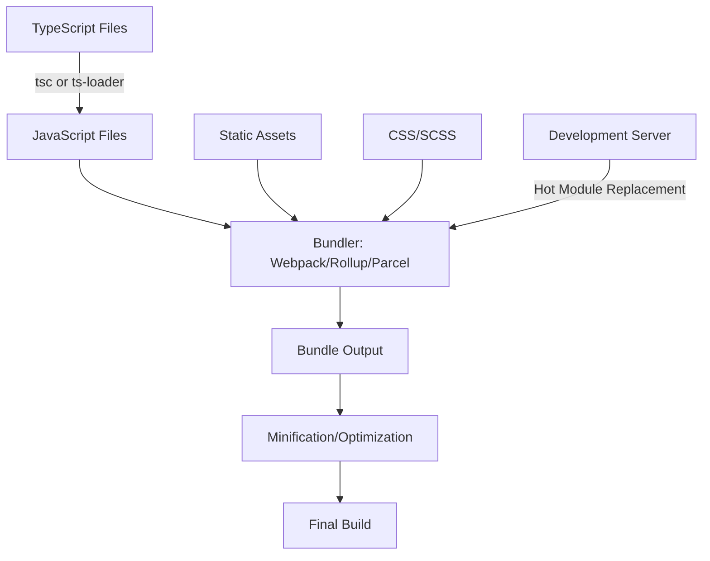

# TypeScript Build Tools

## Introduction

When working with TypeScript, you need more than just the TypeScript compiler to create production-ready applications. Build tools help automate repetitive tasks, optimize your code, and prepare your application for deployment. In this guide, we'll explore the various build tools available for TypeScript projects and how they can enhance your development workflow.

## The TypeScript Compiler (tsc)

At the core of TypeScript's build process is the TypeScript compiler (`tsc`), which transforms your TypeScript code into JavaScript that browsers or Node.js can execute.

### Basic Compilation

To compile a TypeScript file using the command line:

```bash
# Compile a single file
tsc app.ts

# Compile using tsconfig.json settings
tsc
```

The compiler generates JavaScript files based on your TypeScript source files.

### TypeScript Configuration (tsconfig.json)

The `tsconfig.json` file controls the compiler options:

```json
{
  "compilerOptions": {
    "target": "es5",
    "module": "commonjs",
    "outDir": "./dist",
    "rootDir": "./src",
    "strict": true,
    "esModuleInterop": true
  },
  "include": ["src/**/*"],
  "exclude": ["node_modules", "**/*.test.ts"]
}
```

This configuration:
- Compiles to ES5 JavaScript
- Uses CommonJS modules
- Places output in the `dist` directory
- Takes source code from the `src` directory
- Enables strict type checking

### Watch Mode

For development, watch mode automatically recompiles files when they change:

```bash
tsc --watch
```

## Module Bundlers

TypeScript projects often use module bundlers to package code for production.

### Webpack

Webpack is a powerful and flexible bundler that can handle TypeScript with the help of loaders.

#### Setup

First, install necessary packages:

```bash
npm install --save-dev webpack webpack-cli typescript ts-loader
```

Then create a `webpack.config.js` file:

```js
const path = require('path');

module.exports = {
  entry: './src/index.ts',
  module: {
    rules: [
      {
        test: /\.tsx?$/,
        use: 'ts-loader',
        exclude: /node_modules/
      }
    ]
  },
  resolve: {
    extensions: ['.tsx', '.ts', '.js']
  },
  output: {
    filename: 'bundle.js',
    path: path.resolve(__dirname, 'dist')
  }
};
```

#### Using Webpack

Run webpack with:

```bash
npx webpack
```

Or add scripts to your `package.json`:

```json
{
  "scripts": {
    "build": "webpack",
    "start": "webpack --watch"
  }
}
```

### Rollup

Rollup is great for libraries because it creates smaller bundles through tree-shaking.

#### Setup

Install Rollup and TypeScript plugin:

```bash
npm install --save-dev rollup rollup-plugin-typescript2
```

Create a `rollup.config.js`:

```js
import typescript from 'rollup-plugin-typescript2';

export default {
  input: 'src/index.ts',
  output: {
    file: 'dist/bundle.js',
    format: 'iife',
    name: 'myLibrary'
  },
  plugins: [
    typescript({
      typescript: require('typescript')
    })
  ]
};
```

#### Using Rollup

Run with:

```bash
npx rollup -c
```

### Parcel

Parcel is a zero-configuration bundler that works with TypeScript out of the box.

#### Setup

Install Parcel:

```bash
npm install --save-dev parcel-bundler
```

#### Using Parcel

Point Parcel to your entry HTML file:

```bash
npx parcel index.html
```

Parcel automatically detects TypeScript files and compiles them.

## Task Runners

Task runners automate various development tasks beyond compilation.

### NPM Scripts

NPM scripts are the simplest way to define tasks in `package.json`:

```json
{
  "scripts": {
    "build": "tsc",
    "start": "node dist/index.js",
    "dev": "tsc --watch",
    "test": "jest",
    "lint": "eslint src --ext .ts"
  }
}
```

Run scripts with:

```bash
npm run build
npm run dev
npm run lint
```

### Gulp

Gulp is a toolkit for automating painful or time-consuming tasks.

#### Setup

Install Gulp and TypeScript support:

```bash
npm install --save-dev gulp gulp-typescript typescript
```

Create a `gulpfile.js`:

```js
const gulp = require('gulp');
const ts = require('gulp-typescript');
const tsProject = ts.createProject('tsconfig.json');

gulp.task('compile', function() {
  return tsProject.src()
    .pipe(tsProject())
    .js.pipe(gulp.dest('dist'));
});

gulp.task('watch', function() {
  gulp.watch('src/**/*.ts', gulp.series('compile'));
});

gulp.task('default', gulp.series('compile', 'watch'));
```

#### Using Gulp

Run gulp with:

```bash
npx gulp
npx gulp compile
```

## Advanced Build Configurations

### Source Maps

Source maps help debug TypeScript code in browsers by mapping compiled JavaScript back to its TypeScript source.

In `tsconfig.json`:

```json
{
  "compilerOptions": {
    "sourceMap": true
  }
}
```

In webpack:

```js
module.exports = {
  // ...other config
  devtool: 'source-map'
};
```

### Environment-Specific Builds

Create different configurations for development and production:

```js
// webpack.config.js
const isProduction = process.env.NODE_ENV === 'production';

module.exports = {
  mode: isProduction ? 'production' : 'development',
  // Additional options based on environment
  optimization: {
    minimize: isProduction
  }
};
```

Run with:

```bash
# For development
NODE_ENV=development npx webpack

# For production
NODE_ENV=production npx webpack
```

## Practical Example: Setting up a React TypeScript Project

Let's set up a complete React TypeScript project with webpack:

### 1. Install Dependencies

```bash
npm init -y
npm install react react-dom
npm install --save-dev typescript webpack webpack-cli webpack-dev-server ts-loader html-webpack-plugin @types/react @types/react-dom
```

### 2. Create TypeScript Configuration

```json
// tsconfig.json
{
  "compilerOptions": {
    "outDir": "./dist/",
    "sourceMap": true,
    "noImplicitAny": true,
    "module": "esnext",
    "target": "es5",
    "jsx": "react",
    "allowJs": true,
    "moduleResolution": "node",
    "esModuleInterop": true
  }
}
```

### 3. Create Webpack Configuration

```js
// webpack.config.js
const path = require('path');
const HtmlWebpackPlugin = require('html-webpack-plugin');

module.exports = {
  entry: './src/index.tsx',
  output: {
    path: path.resolve(__dirname, 'dist'),
    filename: 'bundle.js'
  },
  resolve: {
    extensions: ['.tsx', '.ts', '.js']
  },
  module: {
    rules: [
      {
        test: /\.tsx?$/,
        use: 'ts-loader',
        exclude: /node_modules/
      }
    ]
  },
  plugins: [
    new HtmlWebpackPlugin({
      template: './public/index.html'
    })
  ],
  devServer: {
    static: {
      directory: path.join(__dirname, 'dist')
    },
    compress: true,
    port: 3000
  }
};
```

### 4. Create Source Files

```html
<!-- public/index.html -->
<!DOCTYPE html>
<html>
<head>
  <meta charset="UTF-8">
  <title>React TypeScript App</title>
</head>
<body>
  <div id="root"></div>
</body>
</html>
```

```tsx
// src/index.tsx
import React from 'react';
import ReactDOM from 'react-dom';
import App from './App';

ReactDOM.render(<App />, document.getElementById('root'));
```

```tsx
// src/App.tsx
import React from 'react';

const App: React.FC = () => {
  return (
    <div>
      <h1>Hello, TypeScript with React!</h1>
      <p>Your app is working!</p>
    </div>
  );
};

export default App;
```

### 5. Add npm Scripts

```json
// package.json
{
  "scripts": {
    "start": "webpack serve --mode development",
    "build": "webpack --mode production",
    "typecheck": "tsc --noEmit"
  }
}
```

### 6. Run the App

```bash
npm start
```

This basic setup demonstrates how TypeScript, webpack, and React work together.

## Build Process Visualization

Here's a visualization of a typical TypeScript build process:



## Summary

Build tools are essential for modern TypeScript development. While the TypeScript compiler (`tsc`) is the core tool for transforming your TypeScript code to JavaScript, you'll likely need additional tools like bundlers, task runners, and specialized plugins to create a complete build system.

The right build setup depends on your project's needs:
- For simple projects, the TypeScript compiler and NPM scripts might be sufficient
- For web applications, a bundler like Webpack or Parcel is usually necessary
- For libraries, Rollup often produces more optimized output

As your projects grow in complexity, investing time in setting up an efficient build system pays dividends in developer productivity and application performance.

## Additional Resources

- [TypeScript Documentation: Compiler Options](https://www.typescriptlang.org/docs/handbook/compiler-options.html)
- [Webpack Documentation](https://webpack.js.org/concepts/)
- [Rollup Guide](https://rollupjs.org/guide/en/)
- [Parcel Documentation](https://parceljs.org/docs/)
- [Gulp for TypeScript](https://gulpjs.com/docs/en/getting-started/quick-start)

## Exercises

1. Create a simple TypeScript application and set it up with the TypeScript compiler using a custom `tsconfig.json` file.
2. Modify the application to use Webpack for bundling and set up source map support for debugging.
3. Add Sass/SCSS support to your Webpack configuration and import styles into your TypeScript files.
4. Create a multi-environment setup with different configuration for development and production builds.
5. Set up a task runner (Gulp or npm scripts) that handles linting, testing, and building your TypeScript application.