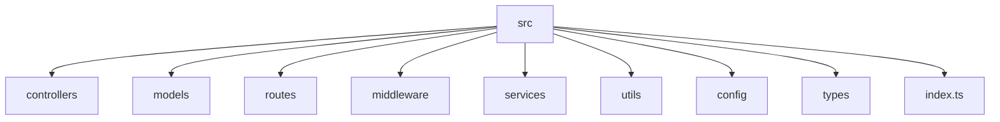

# TypeScript with Node.js

## Introduction

Node.js is a JavaScript runtime built on Chrome's V8 JavaScript engine that allows developers to run JavaScript on the server-side. TypeScript brings static typing to JavaScript, making it an excellent choice for building robust Node.js applications.

In this guide, you'll learn how to integrate TypeScript with Node.js to create type-safe, scalable server-side applications. We'll cover everything from setting up a new project to implementing practical examples and following best practices.

## Why Use TypeScript with Node.js?

Before diving into the technical aspects, let's understand the benefits of using TypeScript with Node.js:

1. **Type Safety**: Catch errors during development rather than at runtime
2. **Better IDE Support**: Enhanced autocompletion, navigation, and refactoring
3. **Improved Maintainability**: Easier to understand code, especially in large projects
4. **Modern JavaScript Features**: Access to the latest ECMAScript features with backward compatibility
5. **Enhanced Developer Experience**: Better documentation through type definitions

## Setting Up a TypeScript Node.js Project

Let's start by setting up a new TypeScript Node.js project from scratch.

### Prerequisites

- Node.js installed on your system (v12 or later recommended)
- npm or yarn package manager

### Step 1: Initialize a New Project

Create a new directory for your project and initialize it:

```bash
mkdir ts-node-project
cd ts-node-project
npm init -y
```

### Step 2: Install TypeScript and Node.js Type Definitions

```bash
npm install typescript ts-node @types/node --save-dev
```

- `typescript`: The TypeScript compiler
- `ts-node`: Allows running TypeScript files directly without compiling
- `@types/node`: Type definitions for Node.js APIs

### Step 3: Create a TypeScript Configuration File

Create a `tsconfig.json` file in your project root:

```bash
npx tsc --init
```

Modify the generated `tsconfig.json` to suit Node.js development:

```json
{
  "compilerOptions": {
    "target": "es2016",
    "module": "commonjs",
    "outDir": "./dist",
    "rootDir": "./src",
    "strict": true,
    "esModuleInterop": true,
    "skipLibCheck": true,
    "forceConsistentCasingInFileNames": true
  },
  "include": ["src/**/*"],
  "exclude": ["node_modules"]
}
```

### Step 4: Create a Project Structure

Create a basic project structure:

```bash
mkdir src
touch src/index.ts
```

### Step 5: Add Scripts to package.json

Update your `package.json` file with these scripts:

```json
{
  "scripts": {
    "start": "node dist/index.js",
    "dev": "ts-node src/index.js",
    "build": "tsc",
    "watch": "tsc --watch"
  }
}
```

## Your First TypeScript Node.js Application

Let's create a simple HTTP server with TypeScript and Node.js.

First, add a basic "Hello World" to `src/index.ts`:

```typescript
// src/index.ts
console.log("Hello from TypeScript Node.js!");

// Define a typed function
function add(a: number, b: number): number {
  return a + b;
}

const result = add(5, 3);
console.log(`5 + 3 = ${result}`);
```

Run this with:

```bash
npm run dev
```

**Output:**
```
Hello from TypeScript Node.js!
5 + 3 = 8
```

### Creating an HTTP Server

Let's expand our example by creating an HTTP server:

```typescript
// src/index.ts
import * as http from 'http';

// Define interfaces for our application
interface User {
  id: number;
  name: string;
  email: string;
}

// Sample data
const users: User[] = [
  { id: 1, name: "John Doe", email: "john@example.com" },
  { id: 2, name: "Jane Smith", email: "jane@example.com" }
];

// Create HTTP server
const server = http.createServer((req, res) => {
  // Set CORS headers
  res.setHeader('Access-Control-Allow-Origin', '*');
  res.setHeader('Content-Type', 'application/json');
  
  // Handle routes
  if (req.url === '/api/users' && req.method === 'GET') {
    res.writeHead(200);
    res.end(JSON.stringify(users));
  } else {
    res.writeHead(404);
    res.end(JSON.stringify({ error: 'Resource not found' }));
  }
});

const PORT = 3000;
server.listen(PORT, () => {
  console.log(`Server running at http://localhost:${PORT}/`);
});
```

## Working with External Modules

One of the strengths of Node.js is its vast ecosystem of modules. Let's see how to use them with TypeScript.

### Installing and Using Express

Express is a popular web framework for Node.js. Let's see how to use it with TypeScript:

```bash
npm install express
npm install --save-dev @types/express
```

Now update your `src/index.ts` file:

```typescript
// src/index.ts
import express, { Request, Response } from 'express';

// Define interfaces
interface User {
  id: number;
  name: string;
  email: string;
}

// Sample data
const users: User[] = [
  { id: 1, name: "John Doe", email: "john@example.com" },
  { id: 2, name: "Jane Smith", email: "jane@example.com" }
];

// Create Express application
const app = express();
app.use(express.json());

// Routes
app.get('/', (req: Request, res: Response) => {
  res.send('Hello from TypeScript Express!');
});

// Get all users
app.get('/api/users', (req: Request, res: Response) => {
  res.json(users);
});

// Get user by ID
app.get('/api/users/:id', (req: Request, res: Response) => {
  const id = parseInt(req.params.id);
  const user = users.find(u => u.id === id);
  
  if (user) {
    res.json(user);
  } else {
    res.status(404).json({ error: 'User not found' });
  }
});

// Start server
const PORT = 3000;
app.listen(PORT, () => {
  console.log(`Server running at http://localhost:${PORT}/`);
});
```

## Advanced TypeScript Features in Node.js

Let's explore some advanced TypeScript features that are particularly useful in Node.js applications.

### Custom Type Definitions

Create a `types` directory in your project and define custom types:

```typescript
// src/types/index.ts
export interface User {
  id: number;
  name: string;
  email: string;
  role: 'admin' | 'user';
  active: boolean;
  createdAt: Date;
}

export interface AppConfig {
  port: number;
  environment: 'development' | 'production' | 'testing';
  database: {
    host: string;
    port: number;
    username: string;
    password: string;
  };
}
```

### Environment Variables with Type Safety

Install the `dotenv` package:

```bash
npm install dotenv
```

Create a `.env` file:

```
PORT=3000
NODE_ENV=development
DB_HOST=localhost
DB_PORT=5432
DB_USER=postgres
DB_PASS=secret
```

Now create a config file that uses these environment variables with type safety:

```typescript
// src/config.ts
import dotenv from 'dotenv';
import { AppConfig } from './types';

dotenv.config();

function requiredEnv(name: string): string {
  const value = process.env[name];
  if (!value) {
    throw new Error(`Missing required environment variable ${name}`);
  }
  return value;
}

export const config: AppConfig = {
  port: parseInt(process.env.PORT || '3000', 10),
  environment: (process.env.NODE_ENV as 'development' | 'production' | 'testing') || 'development',
  database: {
    host: process.env.DB_HOST || 'localhost',
    port: parseInt(process.env.DB_PORT || '5432', 10),
    username: requiredEnv('DB_USER'),
    password: requiredEnv('DB_PASS')
  }
};
```

### Class-based Controllers

Organize your code with class-based controllers:

```typescript
// src/controllers/UserController.ts
import { Request, Response } from 'express';
import { User } from '../types';

// Sample data
const users: User[] = [
  { 
    id: 1, 
    name: "John Doe", 
    email: "john@example.com", 
    role: "admin", 
    active: true, 
    createdAt: new Date() 
  },
  { 
    id: 2, 
    name: "Jane Smith", 
    email: "jane@example.com", 
    role: "user", 
    active: true, 
    createdAt: new Date() 
  }
];

export class UserController {
  public getAllUsers(req: Request, res: Response): void {
    res.json(users);
  }

  public getUserById(req: Request, res: Response): void {
    const id = parseInt(req.params.id);
    const user = users.find(u => u.id === id);
    
    if (user) {
      res.json(user);
    } else {
      res.status(404).json({ error: 'User not found' });
    }
  }

  public createUser(req: Request, res: Response): void {
    const { name, email, role } = req.body;
    
    // Validate input
    if (!name || !email || !role) {
      res.status(400).json({ error: 'Missing required fields' });
      return;
    }
    
    const newUser: User = {
      id: users.length + 1,
      name,
      email,
      role: role as 'admin' | 'user',
      active: true,
      createdAt: new Date()
    };
    
    users.push(newUser);
    res.status(201).json(newUser);
  }
}
```

### Middleware with TypeScript

Create typed middleware:

```typescript
// src/middleware/logger.ts
import { Request, Response, NextFunction } from 'express';

export function loggerMiddleware(req: Request, res: Response, next: NextFunction): void {
  const start = Date.now();
  
  res.on('finish', () => {
    const duration = Date.now() - start;
    console.log(`${req.method} ${req.originalUrl} ${res.statusCode} - ${duration}ms`);
  });
  
  next();
}

// src/middleware/auth.ts
import { Request, Response, NextFunction } from 'express';

// Extend the Express Request interface to include user information
declare global {
  namespace Express {
    interface Request {
      user?: {
        id: number;
        role: string;
      }
    }
  }
}

export function authMiddleware(req: Request, res: Response, next: NextFunction): void {
  // In a real app, you would validate a token here
  const authHeader = req.headers.authorization;
  
  if (!authHeader) {
    res.status(401).json({ error: 'Authorization header missing' });
    return;
  }
  
  // Simulated validation
  if (authHeader === 'Bearer valid-token') {
    req.user = {
      id: 1,
      role: 'admin'
    };
    next();
  } else {
    res.status(401).json({ error: 'Invalid token' });
  }
}
```

## Structuring a Larger Application

For larger applications, you'll want to structure your code properly. Here's a common pattern:



Let's see how to implement this structure with a more complete example:

```typescript
// src/routes/user.routes.ts
import { Router } from 'express';
import { UserController } from '../controllers/UserController';
import { authMiddleware } from '../middleware/auth';

const router = Router();
const userController = new UserController();

router.get('/', userController.getAllUsers);
router.get('/:id', userController.getUserById);
router.post('/', authMiddleware, userController.createUser);

export default router;

// src/routes/index.ts
import { Router } from 'express';
import userRoutes from './user.routes';

const router = Router();

router.use('/users', userRoutes);

export default router;

// src/index.ts
import express from 'express';
import { config } from './config';
import { loggerMiddleware } from './middleware/logger';
import routes from './routes';

const app = express();

// Middleware
app.use(express.json());
app.use(loggerMiddleware);

// Routes
app.use('/api', routes);

// Error handling
app.use((err: Error, req: express.Request, res: express.Response, next: express.NextFunction) => {
  console.error(err.stack);
  res.status(500).json({ error: 'Something went wrong' });
});

// Start server
app.listen(config.port, () => {
  console.log(`Server running in ${config.environment} mode on port ${config.port}`);
});
```

## Testing TypeScript Node.js Applications

Testing is crucial for any production application. Here's how to set up testing with Jest:

```bash
npm install --save-dev jest ts-jest @types/jest
```

Create a `jest.config.js` file:

```javascript
module.exports = {
  preset: 'ts-jest',
  testEnvironment: 'node',
  roots: ['<rootDir>/src'],
  testMatch: ['**/__tests__/**/*.ts', '**/?(*.)+(spec|test).ts']
};
```

Add a test script to your `package.json`:

```json
{
  "scripts": {
    "test": "jest"
  }
}
```

Create a test file:

```typescript
// src/__tests__/user.test.ts
import { UserController } from '../controllers/UserController';
import { Request, Response } from 'express';

describe('UserController', () => {
  let userController: UserController;
  let mockRequest: Partial<Request>;
  let mockResponse: Partial<Response>;
  let responseJson: jest.Mock;
  let responseStatus: jest.Mock;
  
  beforeEach(() => {
    userController = new UserController();
    
    responseJson = jest.fn();
    responseStatus = jest.fn().mockReturnValue({ json: responseJson });
    
    mockResponse = {
      json: responseJson,
      status: responseStatus
    };
    
    mockRequest = {};
  });
  
  it('should get all users', () => {
    userController.getAllUsers(mockRequest as Request, mockResponse as Response);
    expect(responseJson).toHaveBeenCalled();
    // More detailed assertions would depend on implementation details
  });
  
  it('should return 404 when user is not found', () => {
    mockRequest = {
      params: {
        id: '999'
      }
    };
    
    userController.getUserById(mockRequest as Request, mockResponse as Response);
    expect(responseStatus).toHaveBeenCalledWith(404);
  });
});
```

## Debugging TypeScript Node.js Applications

Debugging is essential for development. Here's how to configure debugging for VS Code:

1. Create a `.vscode/launch.json` file:

```json
{
  "version": "0.2.0",
  "configurations": [
    {
      "type": "node",
      "request": "launch",
      "name": "Debug Program",
      "skipFiles": ["<node_internals>/**"],
      "program": "${workspaceFolder}/src/index.ts",
      "preLaunchTask": "tsc: build - tsconfig.json",
      "outFiles": ["${workspaceFolder}/dist/**/*.js"]
    },
    {
      "type": "node",
      "request": "launch",
      "name": "Debug Current File",
      "skipFiles": ["<node_internals>/**"],
      "program": "${file}",
      "runtimeArgs": ["-r", "ts-node/register"]
    }
  ]
}
```

You can now add breakpoints in your code and press F5 to start debugging.

## Production Best Practices

When deploying TypeScript Node.js applications to production, consider these best practices:

1. **Always compile to JavaScript**: Use the compiled JavaScript in production, not ts-node
2. **Optimize tsconfig.json**: Set appropriate options for production builds
3. **Use proper error handling**: Implement global error handlers
4. **Implement logging**: Use a logging library like Winston or Pino
5. **Set up proper environment variables**: Use different configurations for development and production
6. **Security headers**: Implement security headers using Helmet
7. **Rate limiting**: Protect your APIs with rate limiting
8. **API documentation**: Generate documentation from your TypeScript types

Example of production-ready code:

```typescript
// src/index.ts
import express from 'express';
import helmet from 'helmet';
import rateLimit from 'express-rate-limit';
import { config } from './config';
import { errorHandler } from './middleware/errorHandler';
import routes from './routes';
import { setupLogger } from './utils/logger';

const app = express();
const logger = setupLogger();

// Security middleware
app.use(helmet());
app.use(express.json({ limit: '10kb' })); // Limit request size

// Rate limiting
const limiter = rateLimit({
  windowMs: 15 * 60 * 1000, // 15 minutes
  max: 100, // limit each IP to 100 requests per windowMs
  standardHeaders: true,
  legacyHeaders: false
});
app.use('/api', limiter);

// Routes
app.use('/api', routes);

// Error handling
app.use(errorHandler);

// Start server
app.listen(config.port, () => {
  logger.info(`Server running in ${config.environment} mode on port ${config.port}`);
});

// Handle unhandled rejections
process.on('unhandledRejection', (err: Error) => {
  logger.error('UNHANDLED REJECTION! Shutting down...');
  logger.error(err.name, err.message);
  process.exit(1);
});
```

## Summary

In this guide, we've explored how to use TypeScript with Node.js to build robust server-side applications. We've covered:

- Setting up a TypeScript Node.js project
- Creating basic HTTP servers and Express applications
- Working with advanced TypeScript features
- Structuring larger applications
- Testing and debugging
- Production best practices

TypeScript adds tremendous value to Node.js development by providing type safety, improved tooling, and better documentation. By adopting TypeScript in your Node.js projects, you'll catch errors earlier in the development process and build more maintainable applications.

## Additional Resources

To deepen your understanding of TypeScript with Node.js, consider exploring these resources:

- [Node.js Official Documentation](https://nodejs.org/en/docs/)
- [TypeScript Handbook](https://www.typescriptlang.org/docs/handbook/intro.html)
- [Express.js Documentation](https://expressjs.com/)
- [TypeScript Node Starter](https://github.com/microsoft/TypeScript-Node-Starter)

## Exercises

1. Create a RESTful API with TypeScript, Express, and a database of your choice (MongoDB, PostgreSQL, etc.)
2. Add authentication with JWT to your Node.js application
3. Implement file uploads with proper TypeScript typing
4. Create a WebSocket server using TypeScript
5. Build a GraphQL API with TypeScript and Apollo Server

By completing these exercises, you'll gain hands-on experience with TypeScript in Node.js applications and be well-equipped to build production-ready server-side applications.