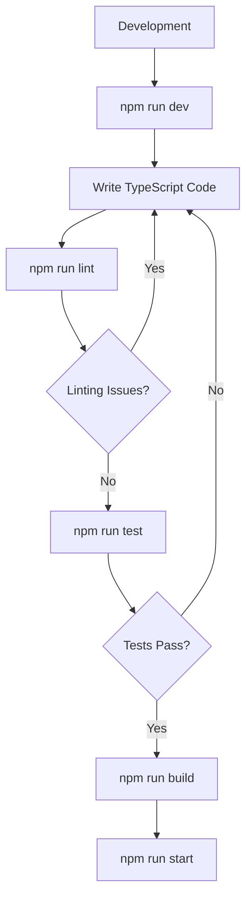

# TypeScript NPM Scripts

NPM scripts provide a powerful way to automate your TypeScript development workflow. Instead of typing complex terminal commands repeatedly, you can define custom scripts in your `package.json` file that handle tasks like compilation, testing, linting, and deployment.

## Introduction to NPM Scripts

NPM scripts are defined in the `"scripts"` section of your `package.json` file. They allow you to create shortcuts for common tasks in your TypeScript projects, making your development process more efficient and consistent.

Think of NPM scripts as aliases for the commands you frequently use in your terminal. When you run `npm run <script-name>`, NPM executes the corresponding command defined in your `package.json`.

## Basic TypeScript Scripts

Let's start with some essential scripts for TypeScript development:

### Compilation Script

The most basic script you'll need compiles your TypeScript code to JavaScript:

```json
{
  "scripts": {
    "build": "tsc"
  }
}
```

Running `npm run build` will execute the TypeScript compiler (`tsc`) using your `tsconfig.json` configuration.

### Watch Mode

During development, you'll want the compiler to recompile whenever files change:

```json
{
  "scripts": {
    "build": "tsc",
    "watch": "tsc --watch"
  }
}
```

With this script, running `npm run watch` starts the TypeScript compiler in watch mode, automatically recompiling when you make changes.

## Advanced NPM Scripts for TypeScript

Let's explore more sophisticated ways to use NPM scripts in your TypeScript projects.

### Using Multiple Commands in a Single Script

You can run multiple commands in a single script using `&&` (runs sequentially) or `&` (runs in parallel):

```json
{
  "scripts": {
    "clean-build": "rimraf ./dist && tsc",
    "start-dev": "tsc --watch & node ./dist/server.js"
  }
}
```

The `clean-build` script first removes the existing `dist` directory (using rimraf, which you'd need to install) and then compiles your TypeScript code.

### Pre and Post Hooks

NPM automatically recognizes scripts named `pre<script>` and `post<script>` and runs them before and after the main script:

```json
{
  "scripts": {
    "prebuild": "npm run clean",
    "build": "tsc",
    "postbuild": "echo 'Build completed successfully!'",
    "clean": "rimraf ./dist"
  }
}
```

When you run `npm run build`:
1. `prebuild` runs first, which executes the `clean` script to delete the `dist` directory
2. `build` runs next, compiling the TypeScript code
3. `postbuild` runs last, displaying a success message

### Cross-platform Compatibility

To ensure your scripts work across different operating systems (Windows, macOS, Linux), you can use cross-platform tools:

```json
{
  "scripts": {
    "clean": "rimraf ./dist",
    "copy-assets": "copyfiles -u 1 src/**/*.html src/**/*.css dist/",
    "start": "cross-env NODE_ENV=production node dist/index.js"
  },
  "devDependencies": {
    "rimraf": "^3.0.2",
    "copyfiles": "^2.4.1",
    "cross-env": "^7.0.3"
  }
}
```

In this example:
- `rimraf` is a cross-platform tool for deleting directories
- `copyfiles` helps copy files from source to destination
- `cross-env` sets environment variables in a cross-platform way

## Practical Examples

Let's look at some real-world examples of NPM scripts for TypeScript projects.

### Basic Web Application

```json
{
  "scripts": {
    "clean": "rimraf ./dist",
    "build": "tsc",
    "lint": "eslint . --ext .ts",
    "test": "jest",
    "dev": "ts-node-dev --respawn src/index.ts",
    "start": "node dist/index.js"
  }
}
```

This setup provides scripts for:
- Cleaning the output directory
- Building the TypeScript code
- Linting the code with ESLint
- Running tests with Jest
- Development with automatic restarts using ts-node-dev
- Starting the production build

### Full-Stack TypeScript Application

```json
{
  "scripts": {
    "build:client": "cd client && npm run build",
    "build:server": "cd server && npm run build",
    "build": "npm run build:client && npm run build:server",
    "dev:client": "cd client && npm run dev",
    "dev:server": "cd server && npm run dev",
    "dev": "concurrently \"npm run dev:server\" \"npm run dev:client\"",
    "test:client": "cd client && npm test",
    "test:server": "cd server && npm test",
    "test": "npm run test:client && npm run test:server"
  },
  "devDependencies": {
    "concurrently": "^7.0.0"
  }
}
```

This example shows how to manage a project with separate client and server directories, using the `concurrently` package to run both in development mode simultaneously.

### TypeScript Library with Build Process

```json
{
  "scripts": {
    "clean": "rimraf ./dist",
    "build:types": "tsc --emitDeclarationOnly",
    "build:js": "babel src --out-dir dist --extensions \".ts,.tsx\" --source-maps inline",
    "build": "npm run clean && npm run build:types && npm run build:js",
    "prepublishOnly": "npm run build",
    "test": "jest",
    "docs": "typedoc --out docs src"
  }
}
```

This setup is ideal for a TypeScript library that:
- Generates declaration files separately from compiled JavaScript
- Uses Babel for transpilation
- Automatically builds before publishing
- Generates documentation with TypeDoc

## Optimizing Your TypeScript Build Process

Let's look at how to optimize the build process using NPM scripts:

### Parallel Builds

For large projects, running processes in parallel can save time:

```json
{
  "scripts": {
    "build:client": "tsc -p tsconfig.client.json",
    "build:server": "tsc -p tsconfig.server.json",
    "build": "concurrently \"npm run build:client\" \"npm run build:server\""
  }
}
```

This example uses different TypeScript configurations for client and server code and builds them concurrently.

### Incremental Builds

TypeScript's incremental compilation can significantly speed up rebuild times:

```json
{
  "scripts": {
    "build": "tsc --incremental"
  }
}
```

This generates a `.tsbuildinfo` file that helps TypeScript track which files need recompilation.

### Project References

For complex projects, TypeScript's project references can organize and optimize compilation:

```json
{
  "scripts": {
    "build": "tsc --build",
    "clean": "tsc --build --clean"
  }
}
```

This works with a `tsconfig.json` that defines project references:

```json
{
  "references": [
    { "path": "./packages/common" },
    { "path": "./packages/server" },
    { "path": "./packages/client" }
  ],
  "files": []
}
```

## NPM Scripts Workflow Diagram

Here's a visualization of a typical TypeScript development workflow using NPM scripts:



## Tips and Best Practices

1. **Document your scripts**: Add comments in your `package.json` or create a separate documentation file explaining what each script does.

2. **Use meaningful script names**: Choose names that clearly indicate the purpose, like `build:prod` instead of just `b`.

3. **Keep scripts focused**: Each script should do one thing well; use script composition for complex operations.

4. **Provide shorthand aliases**: For frequently used complex scripts, create shorter aliases:

```json
{
  "scripts": {
    "dev:full": "concurrently \"npm run watch:ts\" \"npm run watch:assets\" \"npm run serve\"",
    "dev": "npm run dev:full"
  }
}
```

5. **Leverage third-party tools**: Tools like `npm-run-all` can simplify running multiple scripts:

```json
{
  "scripts": {
    "clean": "rimraf dist",
    "build:css": "sass src/styles:dist/styles",
    "build:ts": "tsc",
    "build": "npm-run-all clean --parallel build:*"
  },
  "devDependencies": {
    "npm-run-all": "^4.1.5"
  }
}
```

## Summary

NPM scripts provide a powerful way to automate and standardize your TypeScript development workflow. They help you:

- Simplify complex command sequences
- Create consistent development processes
- Automate repetitive tasks
- Document your project's build and development procedures
- Support cross-platform development

By learning to leverage NPM scripts effectively, you can significantly improve your productivity and make your TypeScript projects more maintainable.

## Additional Resources

- [NPM Scripts Documentation](https://docs.npmjs.com/cli/v8/using-npm/scripts)
- [TypeScript Compiler Options](https://www.typescriptlang.org/tsconfig)
- [NPM Run All](https://github.com/mysticatea/npm-run-all)
- [Concurrently](https://github.com/open-cli-tools/concurrently)

## Exercises

1. Create a TypeScript project with NPM scripts for building, testing, and linting.
2. Set up pre and post hooks to display timing information for your build process.
3. Create an optimized build script that cleans the output directory, compiles TypeScript, and minifies the resulting JavaScript.
4. Implement a development script that watches for changes and automatically restarts your application.
5. Set up NPM scripts for a full-stack TypeScript application with separate client and server builds.