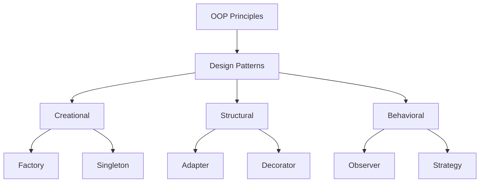

# TypeScript OOP Principles

Object-Oriented Programming (OOP) is a programming paradigm based on the concept of "objects" that contain data and code. TypeScript, as a superset of JavaScript, brings strong typing and other features that make implementing OOP principles more robust and straightforward.

## Introduction to OOP in TypeScript

TypeScript enhances JavaScript's existing OOP features with additional type safety and language constructs that make it easier to implement classic OOP principles. Before diving into specific principles, let's understand what OOP brings to your TypeScript code:

- **Organization**: Structure your code in a logical manner
- **Reusability**: Create components that can be reused across your application
- **Maintainability**: Make your code easier to update and debug
- **Scalability**: Allow your applications to grow in complexity while remaining manageable

## The Four Core OOP Principles

Let's explore the four fundamental principles of OOP and how to implement them in TypeScript:

### 1. Encapsulation

Encapsulation refers to bundling data and methods that operate on that data within a single unit (class), and restricting access to some of the object's components.

#### Access Modifiers in TypeScript

TypeScript provides three access modifiers:

- `public`: (default) Accessible from anywhere
- `private`: Only accessible within the class
- `protected`: Accessible within the class and its subclasses

```typescript
class BankAccount {
  // Private property - cannot be accessed directly from outside
  private balance: number;
  // Protected property - accessible by subclasses
  protected accountNumber: string;
  // Public property - accessible from anywhere
  public owner: string;

  constructor(owner: string, initialBalance: number, accountNumber: string) {
    this.owner = owner;
    this.balance = initialBalance;
    this.accountNumber = accountNumber;
  }

  // Public method to interact with private data
  public deposit(amount: number): void {
    if (amount <= 0) {
      throw new Error("Deposit amount must be positive");
    }
    this.balance += amount;
    console.log(`Deposited ${amount}. New balance: ${this.balance}`);
  }

  public getBalance(): number {
    return this.balance;
  }
}

// Usage:
const account = new BankAccount("Alice Smith", 1000, "12345");
account.deposit(500);
console.log(`${account.owner}'s balance: ${account.getBalance()}`);
// account.balance = 0; // Error: Property 'balance' is private
```

**Output:**
```
Deposited 500. New balance: 1500
Alice Smith's balance: 1500
```

#### TypeScript Shorthand for Properties

TypeScript provides a shorthand for declaring and initializing class properties in the constructor:

```typescript
class BankAccount {
  constructor(
    public owner: string,
    private balance: number,
    protected accountNumber: string
  ) {}

  // Methods as before...
}
```

### 2. Inheritance

Inheritance allows a class (child/subclass) to inherit properties and methods from another class (parent/superclass).

```typescript
class SavingsAccount extends BankAccount {
  private interestRate: number;

  constructor(owner: string, initialBalance: number, accountNumber: string, interestRate: number) {
    // Call parent constructor
    super(owner, initialBalance, accountNumber);
    this.interestRate = interestRate;
  }

  public addInterest(): void {
    const interest = this.getBalance() * this.interestRate;
    this.deposit(interest);
    console.log(`Added interest: ${interest.toFixed(2)}`);
  }
}

// Usage:
const savings = new SavingsAccount("Bob Johnson", 2000, "S-789", 0.05);
savings.addInterest();
console.log(`New balance after interest: ${savings.getBalance()}`);
```

**Output:**
```
Deposited 100. New balance: 2100
Added interest: 100.00
New balance after interest: 2100
```

### 3. Polymorphism

Polymorphism allows objects of different classes to be treated as objects of a common superclass. The most common form of polymorphism in TypeScript is through method overriding.

```typescript
class CheckingAccount extends BankAccount {
  private overdraftLimit: number;

  constructor(owner: string, initialBalance: number, accountNumber: string, overdraftLimit: number) {
    super(owner, initialBalance, accountNumber);
    this.overdraftLimit = overdraftLimit;
  }

  // Override withdraw method to include overdraft functionality
  public withdraw(amount: number): void {
    const balance = this.getBalance();
    
    if (amount <= 0) {
      throw new Error("Withdrawal amount must be positive");
    }
    
    if (amount > balance + this.overdraftLimit) {
      throw new Error("Insufficient funds (exceeds overdraft limit)");
    }
    
    // We'll use a protected method assumed to exist in the parent class
    this.updateBalance(-amount);
    console.log(`Withdrawn ${amount}. New balance: ${this.getBalance()}`);
  }
}

// We need to add this protected method to the BankAccount class
class BankAccount {
  // Other parts as before...
  
  protected updateBalance(amount: number): void {
    // Assumes balance is a private property
    this.balance += amount;
  }
  
  public withdraw(amount: number): void {
    if (amount <= 0) {
      throw new Error("Withdrawal amount must be positive");
    }
    
    if (amount > this.balance) {
      throw new Error("Insufficient funds");
    }
    
    this.updateBalance(-amount);
    console.log(`Withdrawn ${amount}. New balance: ${this.balance}`);
  }
}
```

#### Using Polymorphism

```typescript
function processAccount(account: BankAccount, transactionAmount: number) {
  console.log(`Processing transaction for ${account.owner}`);
  
  try {
    account.withdraw(transactionAmount);
  } catch (error) {
    console.error(`Transaction failed: ${error.message}`);
  }
}

// Usage with different account types
const checking = new CheckingAccount("Charlie Brown", 500, "C-123", 100);
const regular = new BankAccount("Diana Prince", 300, "R-456");

processAccount(checking, 550); // Will use overdraft
processAccount(regular, 350);  // Will fail - insufficient funds
```

**Output:**
```
Processing transaction for Charlie Brown
Withdrawn 550. New balance: -50
Processing transaction for Diana Prince
Transaction failed: Insufficient funds
```

### 4. Abstraction

Abstraction is the concept of hiding complex implementation details and showing only the necessary features of an object. TypeScript supports abstraction through interfaces and abstract classes.

#### Using Interfaces

```typescript
interface Account {
  owner: string;
  deposit(amount: number): void;
  withdraw(amount: number): void;
  getBalance(): number;
}

class CreditAccount implements Account {
  public owner: string;
  private balance: number;
  private creditLimit: number;

  constructor(owner: string, creditLimit: number) {
    this.owner = owner;
    this.balance = 0;
    this.creditLimit = creditLimit;
  }

  public deposit(amount: number): void {
    if (amount <= 0) {
      throw new Error("Amount must be positive");
    }
    this.balance -= amount; // Credit accounts reduce when you deposit
    console.log(`Paid ${amount}. New balance: ${this.balance}`);
  }

  public withdraw(amount: number): void {
    if (amount <= 0) {
      throw new Error("Amount must be positive");
    }
    
    if (Math.abs(this.balance) + amount > this.creditLimit) {
      throw new Error("Cannot exceed credit limit");
    }
    
    this.balance += amount; // Credit accounts increase when you withdraw
    console.log(`Charged ${amount}. New balance: ${this.balance}`);
  }

  public getBalance(): number {
    return this.balance;
  }
}
```

#### Using Abstract Classes

```typescript
abstract class FinancialInstrument {
  constructor(public owner: string) {}
  
  abstract calculateValue(): number;
  
  generateReport(): string {
    return `Instrument owned by ${this.owner} valued at ${this.calculateValue()}`;
  }
}

class StockOption extends FinancialInstrument {
  constructor(
    owner: string,
    private stockPrice: number,
    private quantity: number,
    private strikePrice: number
  ) {
    super(owner);
  }
  
  calculateValue(): number {
    return Math.max(0, this.stockPrice - this.strikePrice) * this.quantity;
  }
}

// Usage:
const option = new StockOption("Eve Adams", 150, 100, 120);
console.log(option.generateReport());
```

**Output:**
```
Instrument owned by Eve Adams valued at 3000
```

## Real-World Example: Building a Task Management System

Let's apply all four OOP principles in a more complex example:

```typescript
// Interfaces (Abstraction)
interface Assignable {
  assign(userId: string): void;
}

interface Trackable {
  updateProgress(percent: number): void;
  getStatus(): string;
}

// Base class
abstract class Task implements Assignable, Trackable {
  protected completed: boolean = false;
  protected progress: number = 0;
  protected assignedTo: string | null = null;

  constructor(
    protected id: string,
    protected title: string,
    protected description: string,
    protected dueDate: Date
  ) {}

  // Assignable implementation
  public assign(userId: string): void {
    this.assignedTo = userId;
    console.log(`Task ${this.id} assigned to user ${userId}`);
  }

  // Trackable implementation
  public updateProgress(percent: number): void {
    if (percent < 0 || percent > 100) {
      throw new Error("Progress must be between 0 and 100");
    }
    
    this.progress = percent;
    
    if (percent === 100) {
      this.completed = true;
      console.log(`Task ${this.id} marked as completed`);
    } else {
      console.log(`Task ${this.id} progress updated to ${percent}%`);
    }
  }

  public getStatus(): string {
    return this.completed ? "Completed" : `In Progress (${this.progress}%)`;
  }

  // Abstract method to be implemented by subclasses
  abstract estimateEffort(): number;

  // Common method for all tasks
  public getDetails(): string {
    return `
      ID: ${this.id}
      Title: ${this.title}
      Assigned To: ${this.assignedTo || "Unassigned"}
      Due Date: ${this.dueDate.toDateString()}
      Status: ${this.getStatus()}
      Estimated Effort: ${this.estimateEffort()} hours
    `;
  }
}

// Subclasses (Inheritance)
class DevelopmentTask extends Task {
  constructor(
    id: string,
    title: string,
    description: string,
    dueDate: Date,
    private complexity: number, // 1-5
    private hasTechnicalDocumentation: boolean
  ) {
    super(id, title, description, dueDate);
  }

  // Polymorphism - implementing abstract method
  public estimateEffort(): number {
    // Base estimate based on complexity
    let estimate = this.complexity * 4;
    
    // Reduce estimate if documentation exists
    if (this.hasTechnicalDocumentation) {
      estimate *= 0.8;
    }
    
    return Math.round(estimate);
  }

  // Special method for development tasks
  public addCodeReview(): void {
    console.log(`Code review scheduled for task ${this.id}`);
  }
}

class DesignTask extends Task {
  constructor(
    id: string,
    title: string,
    description: string,
    dueDate: Date,
    private screens: number,
    private hasWireframes: boolean
  ) {
    super(id, title, description, dueDate);
  }

  // Polymorphism - implementing abstract method
  public estimateEffort(): number {
    // Base estimate based on screens
    let estimate = this.screens * 2.5;
    
    // Reduce estimate if wireframes exist
    if (this.hasWireframes) {
      estimate *= 0.7;
    }
    
    return Math.round(estimate);
  }

  // Special method for design tasks
  public requestFeedback(): void {
    console.log(`Feedback requested for design task ${this.id}`);
  }
}

// Task manager class (using encapsulation)
class TaskManager {
  private tasks: Map<string, Task> = new Map();

  public addTask(task: Task): void {
    this.tasks.set(task.getDetails().split('\n')[1].trim().split(': ')[1], task);
    console.log(`Task added to the system`);
  }

  public getTask(id: string): Task | undefined {
    return this.tasks.get(id);
  }

  public assignTask(taskId: string, userId: string): void {
    const task = this.getTask(taskId);
    if (task) {
      task.assign(userId);
    } else {
      throw new Error(`Task with ID ${taskId} not found`);
    }
  }

  public getTotalEffort(): number {
    let total = 0;
    this.tasks.forEach(task => {
      total += task.estimateEffort();
    });
    return total;
  }

  public generateTasksReport(): string {
    let report = "TASK MANAGEMENT REPORT\n";
    report += "=====================\n\n";
    
    this.tasks.forEach(task => {
      report += task.getDetails() + "\n";
    });
    
    report += `\nTotal Estimated Effort: ${this.getTotalEffort()} hours`;
    
    return report;
  }
}

// Usage of the task management system
const taskManager = new TaskManager();

// Create tasks
const frontendTask = new DevelopmentTask(
  "DEV-1",
  "Implement User Authentication",
  "Create login/signup forms with validation", 
  new Date(2023, 11, 15),
  3, // complexity
  true // has documentation
);

const designTask = new DesignTask(
  "DES-1",
  "Design Dashboard UI", 
  "Create modern dashboard design with charts",
  new Date(2023, 11, 10),
  4, // screens
  true // has wireframes
);

// Add tasks to manager
taskManager.addTask(frontendTask);
taskManager.addTask(designTask);

// Assign tasks
taskManager.assignTask("DEV-1", "dev.john");
taskManager.assignTask("DES-1", "designer.sarah");

// Update progress
frontendTask.updateProgress(75);
designTask.updateProgress(100);

// Special methods
frontendTask.addCodeReview();
designTask.requestFeedback();

// Generate report
console.log(taskManager.generateTasksReport());
```

**Output:**
```
Task added to the system
Task added to the system
Task DEV-1 assigned to user dev.john
Task DES-1 assigned to user designer.sarah
Task DEV-1 progress updated to 75%
Task DES-1 marked as completed
Code review scheduled for task DEV-1
Feedback requested for design task DES-1
TASK MANAGEMENT REPORT
=====================

      ID: DEV-1
      Title: Implement User Authentication
      Assigned To: dev.john
      Due Date: Fri Dec 15 2023
      Status: In Progress (75%)
      Estimated Effort: 10 hours
    

      ID: DES-1
      Title: Design Dashboard UI
      Assigned To: designer.sarah
      Due Date: Sun Dec 10 2023
      Status: Completed
      Estimated Effort: 7 hours
    

Total Estimated Effort: 17 hours
```

## Design Patterns with OOP

TypeScript's OOP features enable implementation of common design patterns:



### Example: Singleton Pattern

```typescript
class DatabaseConnection {
  private static instance: DatabaseConnection;
  private connectionString: string;
  
  private constructor(connectionString: string) {
    this.connectionString = connectionString;
    console.log("Database connection initialized");
  }
  
  public static getInstance(connectionString: string): DatabaseConnection {
    if (!DatabaseConnection.instance) {
      DatabaseConnection.instance = new DatabaseConnection(connectionString);
    }
    return DatabaseConnection.instance;
  }
  
  public query(sql: string): void {
    console.log(`Executing query on ${this.connectionString}: ${sql}`);
    // Actual query logic would go here
  }
}

// Usage
const db1 = DatabaseConnection.getInstance("mysql://localhost:3306/mydb");
const db2 = DatabaseConnection.getInstance("mysql://localhost:3306/mydb");

console.log(db1 === db2); // true - they are the same instance

db1.query("SELECT * FROM users");
db2.query("INSERT INTO logs VALUES ('test')");
```

**Output:**
```
Database connection initialized
true
Executing query on mysql://localhost:3306/mydb: SELECT * FROM users
Executing query on mysql://localhost:3306/mydb: INSERT INTO logs VALUES ('test')
```

## Summary

TypeScript provides rich support for implementing OOP principles:

1. **Encapsulation**: Use access modifiers (`private`, `protected`, `public`) to control access to class members.
2. **Inheritance**: Extend classes to create hierarchies and share functionality.
3. **Polymorphism**: Override methods to provide specific implementations in derived classes.
4. **Abstraction**: Use interfaces and abstract classes to define contracts without implementation details.

By understanding and applying these principles, you can create TypeScript applications that are:

- Easier to maintain and extend
- More modular and reusable
- Well-structured and organized
- Less prone to bugs

## Additional Resources

To deepen your understanding of OOP in TypeScript, consider exploring these topics:

- Generic classes and methods
- Mixins and composition
- Design patterns (Factory, Observer, Strategy, etc.)
- SOLID principles

## Exercises

1. Create a class hierarchy for a library management system with `LibraryItem` as the base class and `Book`, `DVD`, and `Magazine` as derived classes.

2. Implement an abstract `Shape` class with concrete implementations for `Circle`, `Rectangle`, and `Triangle` that all implement an `area()` method.

3. Design a simple banking system that demonstrates all four OOP principles with classes for different account types, transactions, and customers.

4. Create a logging system with different output strategies (console, file, database) using interfaces and polymorphism.

5. Implement the Observer pattern with TypeScript to create a simple event notification system.