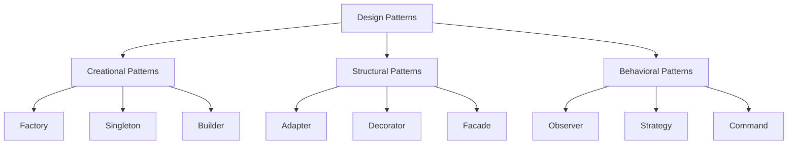

# TypeScript Design Patterns

## Introduction

Design patterns are proven solutions to recurring problems in software design. They represent best practices evolved over time by experienced software developers. When implemented correctly, design patterns can make your code more maintainable, flexible, and easier to understand.

TypeScript, with its strong typing system and object-oriented features, provides an excellent environment for implementing these design patterns. In this guide, we'll explore how to implement common design patterns in TypeScript and understand when and why to use them.

## Why Use Design Patterns in TypeScript?

Before diving into specific patterns, let's understand why design patterns are particularly valuable in TypeScript:

1. **Code Reusability**: Design patterns provide templates for solving common problems, reducing the need to reinvent the wheel.
2. **Maintainability**: Well-implemented patterns make code easier to understand and maintain.
3. **Scalability**: Patterns help structure applications in ways that accommodate future growth.
4. **Communication**: Knowledge of patterns gives developers a common language to discuss code architecture.

## Categories of Design Patterns

Design patterns are typically categorized into three main groups:



Let's explore patterns from each category:

## Creational Patterns

Creational patterns focus on object creation mechanisms, trying to create objects in a manner suitable for the situation.

### Factory Pattern

The Factory pattern provides an interface for creating objects without specifying their concrete classes.

```typescript
// Product interface
interface Product {
  operation(): string;
}

// Concrete Products
class ConcreteProduct1 implements Product {
  operation(): string {
    return "Result of ConcreteProduct1";
  }
}

class ConcreteProduct2 implements Product {
  operation(): string {
    return "Result of ConcreteProduct2";
  }
}

// Factory
class Factory {
  public createProduct(type: string): Product {
    if (type === "1") {
      return new ConcreteProduct1();
    } else if (type === "2") {
      return new ConcreteProduct2();
    }
    throw new Error("Invalid product type");
  }
}

// Client code
const factory = new Factory();
const product1 = factory.createProduct("1");
console.log(product1.operation()); // Output: Result of ConcreteProduct1

const product2 = factory.createProduct("2");
console.log(product2.operation()); // Output: Result of ConcreteProduct2
```

**Real-world Example**:
Imagine a UI component library where you need to create different types of buttons (primary, secondary, danger). A ButtonFactory could create the appropriate button based on the requested type.

### Singleton Pattern

The Singleton pattern ensures a class has only one instance and provides a global point to access it.

```typescript
class Singleton {
  private static instance: Singleton;

  // Private constructor prevents direct construction calls with `new`
  private constructor() {}

  // Static method to access the singleton instance
  public static getInstance(): Singleton {
    if (!Singleton.instance) {
      Singleton.instance = new Singleton();
    }

    return Singleton.instance;
  }

  public someBusinessLogic() {
    // Business logic here
    return "I am a singleton!";
  }
}

// Usage
const instance1 = Singleton.getInstance();
const instance2 = Singleton.getInstance();

console.log(instance1 === instance2); // Output: true
console.log(instance1.someBusinessLogic()); // Output: I am a singleton!
```

**Real-world Example**:
A configuration manager that loads settings from a file. You want to load it once and have all parts of the application access the same configuration.

### Builder Pattern

The Builder pattern separates the construction of a complex object from its representation, allowing the same construction process to create different representations.

```typescript
// Product
class House {
  private parts: string[] = [];

  public addPart(part: string): void {
    this.parts.push(part);
  }

  public listParts(): void {
    console.log(`House parts: ${this.parts.join(', ')}`);
  }
}

// Builder interface
interface HouseBuilder {
  buildWalls(): void;
  buildRoof(): void;
  buildWindows(): void;
  buildDoors(): void;
  getResult(): House;
}

// Concrete Builder
class ModernHouseBuilder implements HouseBuilder {
  private house: House;

  constructor() {
    this.reset();
  }

  public reset(): void {
    this.house = new House();
  }

  public buildWalls(): void {
    this.house.addPart("Modern Walls");
  }

  public buildRoof(): void {
    this.house.addPart("Modern Flat Roof");
  }

  public buildWindows(): void {
    this.house.addPart("Modern Large Windows");
  }

  public buildDoors(): void {
    this.house.addPart("Modern Sliding Doors");
  }

  public getResult(): House {
    const result = this.house;
    this.reset();
    return result;
  }
}

// Director
class Director {
  private builder: HouseBuilder;

  public setBuilder(builder: HouseBuilder): void {
    this.builder = builder;
  }

  public buildMinimalHouse(): void {
    this.builder.buildWalls();
    this.builder.buildRoof();
  }

  public buildFullHouse(): void {
    this.builder.buildWalls();
    this.builder.buildRoof();
    this.builder.buildWindows();
    this.builder.buildDoors();
  }
}

// Client code
const director = new Director();
const builder = new ModernHouseBuilder();
director.setBuilder(builder);

console.log("Minimal house:");
director.buildMinimalHouse();
const minimalHouse = builder.getResult();
minimalHouse.listParts(); // Output: House parts: Modern Walls, Modern Flat Roof

console.log("Full house:");
director.buildFullHouse();
const fullHouse = builder.getResult();
fullHouse.listParts(); // Output: House parts: Modern Walls, Modern Flat Roof, Modern Large Windows, Modern Sliding Doors
```

**Real-world Example**:
Creating complex API requests or database queries where you need to build objects with many optional parameters.

## Structural Patterns

Structural patterns deal with object composition, creating relationships between objects to form larger structures.

### Adapter Pattern

The Adapter pattern allows objects with incompatible interfaces to collaborate.

```typescript
// Target interface
interface Target {
  request(): string;
}

// Adaptee (the class that needs adapting)
class Adaptee {
  public specificRequest(): string {
    return "Specific behavior of the Adaptee";
  }
}

// Adapter
class Adapter implements Target {
  private adaptee: Adaptee;

  constructor(adaptee: Adaptee) {
    this.adaptee = adaptee;
  }

  public request(): string {
    const result = this.adaptee.specificRequest();
    return `Adapter: (TRANSLATED) ${result}`;
  }
}

// Client code
function clientCode(target: Target) {
  console.log(target.request());
}

const adaptee = new Adaptee();
console.log("Client: The Adaptee class has a different interface:");
console.log(`Adaptee: ${adaptee.specificRequest()}`);

console.log("Client: But I can work with it via the Adapter:");
const adapter = new Adapter(adaptee);
clientCode(adapter);
```

**Output:**
```
Client: The Adaptee class has a different interface:
Adaptee: Specific behavior of the Adaptee
Client: But I can work with it via the Adapter:
Adapter: (TRANSLATED) Specific behavior of the Adaptee
```

**Real-world Example**:
Integrating a third-party library that has a different interface than what your application expects.

### Decorator Pattern

The Decorator pattern lets you attach new behaviors to objects by placing them inside wrapper objects.

```typescript
// Component interface
interface Component {
  operation(): string;
}

// Concrete Component
class ConcreteComponent implements Component {
  public operation(): string {
    return "ConcreteComponent";
  }
}

// Base Decorator
abstract class Decorator implements Component {
  protected component: Component;

  constructor(component: Component) {
    this.component = component;
  }

  public operation(): string {
    return this.component.operation();
  }
}

// Concrete Decorators
class ConcreteDecoratorA extends Decorator {
  public operation(): string {
    return `ConcreteDecoratorA(${super.operation()})`;
  }
}

class ConcreteDecoratorB extends Decorator {
  public operation(): string {
    return `ConcreteDecoratorB(${super.operation()})`;
  }
}

// Client code
function clientCode(component: Component) {
  console.log(`RESULT: ${component.operation()}`);
}

// Using the decorators
const simple = new ConcreteComponent();
console.log("Client: I've got a simple component:");
clientCode(simple);

const decoratorA = new ConcreteDecoratorA(simple);
const decoratorB = new ConcreteDecoratorB(decoratorA);
console.log("Client: Now I've got a decorated component:");
clientCode(decoratorB);
```

**Output:**
```
Client: I've got a simple component:
RESULT: ConcreteComponent
Client: Now I've got a decorated component:
RESULT: ConcreteDecoratorB(ConcreteDecoratorA(ConcreteComponent))
```

**Real-world Example**:
Adding logging, validation, or caching capabilities to existing functionality without modifying the original code.

## Behavioral Patterns

Behavioral patterns focus on algorithms and the assignment of responsibilities between objects.

### Observer Pattern

The Observer pattern defines a one-to-many dependency where when one object changes state, all its dependents are notified.

```typescript
// Observer interface
interface Observer {
  update(subject: Subject): void;
}

// Subject
class Subject {
  private observers: Observer[] = [];
  private state: number = 0;

  public getState(): number {
    return this.state;
  }

  public setState(state: number): void {
    this.state = state;
    this.notifyObservers();
  }

  public attach(observer: Observer): void {
    const isExist = this.observers.includes(observer);
    if (isExist) {
      return console.log('Subject: Observer has been attached already.');
    }
    
    this.observers.push(observer);
    console.log('Subject: Observer attached.');
  }

  public detach(observer: Observer): void {
    const observerIndex = this.observers.indexOf(observer);
    if (observerIndex === -1) {
      return console.log('Subject: Non-existent observer.');
    }
    
    this.observers.splice(observerIndex, 1);
    console.log('Subject: Observer detached.');
  }
  
  public notifyObservers(): void {
    console.log('Subject: Notifying observers...');
    for (const observer of this.observers) {
      observer.update(this);
    }
  }
}

// Concrete Observers
class ConcreteObserverA implements Observer {
  public update(subject: Subject): void {
    if (subject.getState() < 3) {
      console.log('ConcreteObserverA: Reacted to the event.');
    }
  }
}

class ConcreteObserverB implements Observer {
  public update(subject: Subject): void {
    if (subject.getState() >= 3) {
      console.log('ConcreteObserverB: Reacted to the event.');
    }
  }
}

// Client code
const subject = new Subject();

const observerA = new ConcreteObserverA();
subject.attach(observerA);

const observerB = new ConcreteObserverB();
subject.attach(observerB);

subject.setState(2);
subject.setState(5);

subject.detach(observerB);
subject.setState(1);
```

**Output:**
```
Subject: Observer attached.
Subject: Observer attached.
Subject: Notifying observers...
ConcreteObserverA: Reacted to the event.
Subject: Notifying observers...
ConcreteObserverB: Reacted to the event.
Subject: Observer detached.
Subject: Notifying observers...
ConcreteObserverA: Reacted to the event.
```

**Real-world Example**:
Event-handling systems, like when a user interacts with a UI element and multiple parts of the application need to respond.

### Strategy Pattern

The Strategy pattern lets you define a family of algorithms, encapsulate each one, and make them interchangeable.

```typescript
// Strategy Interface
interface Strategy {
  execute(a: number, b: number): number;
}

// Concrete Strategies
class ConcreteStrategyAdd implements Strategy {
  public execute(a: number, b: number): number {
    return a + b;
  }
}

class ConcreteStrategySubtract implements Strategy {
  public execute(a: number, b: number): number {
    return a - b;
  }
}

class ConcreteStrategyMultiply implements Strategy {
  public execute(a: number, b: number): number {
    return a * b;
  }
}

// Context
class Context {
  private strategy: Strategy;

  constructor(strategy: Strategy) {
    this.strategy = strategy;
  }

  public setStrategy(strategy: Strategy) {
    this.strategy = strategy;
  }

  public executeStrategy(a: number, b: number): number {
    return this.strategy.execute(a, b);
  }
}

// Client code
const context = new Context(new ConcreteStrategyAdd());
console.log('Result with add strategy: ' + context.executeStrategy(5, 3));

context.setStrategy(new ConcreteStrategySubtract());
console.log('Result with subtract strategy: ' + context.executeStrategy(5, 3));

context.setStrategy(new ConcreteStrategyMultiply());
console.log('Result with multiply strategy: ' + context.executeStrategy(5, 3));
```

**Output:**
```
Result with add strategy: 8
Result with subtract strategy: 2
Result with multiply strategy: 15
```

**Real-world Example**:
Different payment methods in a shopping cart, or different sorting algorithms that can be selected based on the situation.

## Best Practices for Implementing Design Patterns in TypeScript

1. **Keep it simple**: Don't over-engineer your solution. Use patterns only when the benefits outweigh the complexity.
2. **Understand the problem first**: Make sure you understand the problem before applying a pattern.
3. **Leverage TypeScript features**: Use interfaces, generics, and type safety to make patterns more robust.
4. **Document your patterns**: Add comments to explain why a pattern was chosen and how it works.
5. **Test pattern implementations**: Ensure your implementation works as expected with unit tests.

## Common Mistakes to Avoid

1. **Pattern overuse**: Not every problem needs a design pattern. Sometimes a simple solution is better.
2. **Premature abstraction**: Wait until you have a clear need before implementing complex patterns.
3. **Ignoring trade-offs**: Every pattern comes with trade-offs. Be aware of them before implementing.
4. **Pattern purism**: It's okay to adapt patterns to fit your specific needs rather than following them rigidly.
5. **Ignoring context**: A pattern that works well in one context might not be suitable in another.

## Summary

Design patterns are powerful tools in a TypeScript developer's toolkit. They provide tested solutions to common problems, helping you write more maintainable and scalable code. In this guide, we've covered:

- The three main categories of design patterns: creational, structural, and behavioral
- Several key patterns from each category with TypeScript implementations
- Best practices and common mistakes when implementing design patterns
- Real-world applications of each pattern

By understanding and applying these patterns appropriately, you can significantly improve the quality of your TypeScript code and become a more effective developer.

## Additional Resources

To deepen your understanding of design patterns in TypeScript:

1. **Books**:
   - "Design Patterns: Elements of Reusable Object-Oriented Software" by the Gang of Four
   - "Head First Design Patterns" for a more approachable introduction

2. **Online resources**:
   - [TypeScript Documentation](https://www.typescriptlang.org/docs/)
   - [Refactoring Guru](https://refactoring.guru/design-patterns) - A comprehensive resource on design patterns with examples

3. **Practice exercises**:
   - Identify a pattern in a project you're working on
   - Refactor an existing piece of code to use a design pattern
   - Implement each pattern in a small project to solidify your understanding

Remember that mastering design patterns takes practice. Start by recognizing situations where these patterns might be useful, and gradually incorporate them into your code where appropriate.