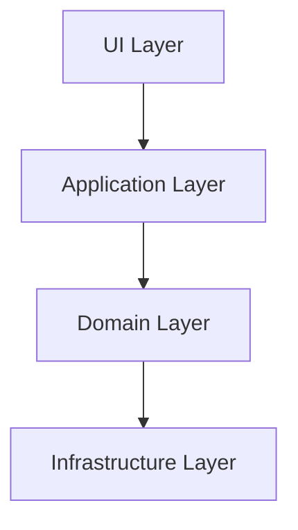

# TypeScript Code Organization

When working with TypeScript projects, especially as they grow in size and complexity, organizing your code becomes crucial for maintainability, readability, and team collaboration. This guide will walk you through proven patterns and best practices for structuring your TypeScript projects.

## Introduction to Code Organization

Good code organization helps you and your team to:

- Find files quickly
- Understand the project structure intuitively
- Scale the codebase efficiently
- Onboard new developers more easily
- Avoid circular dependencies
- Maintain separation of concerns

Let's explore how to achieve these benefits with TypeScript.

## Project Structure Fundamentals

### Basic Project Layout

A well-organized TypeScript project typically follows this structure:

```
project-root/
├── src/               # Source code
│   ├── index.ts       # Main entry point
│   ├── components/    # UI components (if applicable)
│   ├── models/        # Data models/interfaces
│   ├── services/      # Business logic services
│   └── utils/         # Helper functions
├── tests/             # Test files
├── dist/              # Compiled output (generated)
├── package.json       # Dependencies and scripts
├── tsconfig.json      # TypeScript configuration
└── README.md          # Project documentation
```

This structure separates concerns and makes it easy to locate specific code.

### Real-world Example

Let's examine a more detailed structure for a medium-sized web application:

```
my-app/
├── src/
│   ├── index.ts                 # Application entry point
│   ├── components/              # UI components
│   │   ├── common/              # Shared components
│   │   │   ├── Button.tsx
│   │   │   └── Input.tsx
│   │   └── features/            # Feature-specific components
│   │       ├── auth/
│   │       └── dashboard/
│   ├── config/                  # Configuration files
│   │   └── appConfig.ts
│   ├── hooks/                   # Custom hooks
│   │   └── useLocalStorage.ts
│   ├── models/                  # Type definitions
│   │   ├── user.interface.ts
│   │   └── api.types.ts
│   ├── services/                # API and business logic
│   │   ├── api.service.ts
│   │   └── auth.service.ts
│   └── utils/                   # Helper functions
│       ├── date.utils.ts
│       └── validation.utils.ts
├── tests/
│   └── ...
└── ...
```

## Naming Conventions

Consistent naming makes your codebase easier to navigate:

### Files and Folders

```typescript
// For services
user.service.ts
authentication.service.ts

// For components
UserProfile.tsx
LoginForm.tsx

// For utilities
string.utils.ts
array.utils.ts

// For models/interfaces
user.interface.ts
product.model.ts
```

### Export Patterns

There are several approaches to exports in TypeScript:

#### Direct exports

```typescript
// math.utils.ts
export function add(a: number, b: number): number {
  return a + b;
}

export function subtract(a: number, b: number): number {
  return a - b;
}
```

#### Barrel exports (index files)

Barrels help consolidate exports from multiple files:

```typescript
// utils/index.ts
export * from './string.utils';
export * from './array.utils';
export * from './date.utils';
```

This allows importing multiple utilities in one line:

```typescript
import { formatDate, sortArray, capitalizeString } from './utils';
```

## Module Organization Patterns

### Feature-Based Organization

Group code by feature rather than by function type for better cohesion:

```
src/
├── auth/
│   ├── components/
│   ├── services/
│   ├── hooks/
│   ├── types/
│   └── index.ts      # Exports the public API
├── dashboard/
│   ├── components/
│   ├── services/
│   └── index.ts
└── shared/           # Shared across features
    ├── components/
    ├── utils/
    └── index.ts
```

### The Layer Pattern

Organize code by technical responsibility:



Implementation example:

```
src/
├── ui/              # Components, pages, layouts
├── application/     # Use cases, coordination logic
├── domain/          # Business entities, rules
└── infrastructure/  # External services, databases
```

## Dependency Management

### Managing Imports

Avoid circular dependencies by using a clear dependency direction:

```typescript
// ❌ Bad: Circular dependency
// user.service.ts
import { AuthService } from './auth.service';

// auth.service.ts
import { UserService } from './user.service';

// ✅ Good: Clear dependency direction
// user.service.ts
import { AuthService } from './auth.service';

// auth.service.ts
// No import from user.service, perhaps use interfaces instead
```

### Path Aliases

Configure path aliases in `tsconfig.json` for cleaner imports:

```json
{
  "compilerOptions": {
    "baseUrl": "src",
    "paths": {
      "@components/*": ["components/*"],
      "@services/*": ["services/*"],
      "@utils/*": ["utils/*"],
      "@models/*": ["models/*"]
    }
  }
}
```

This allows for imports like:

```typescript
// Instead of
import { Button } from '../../../../components/common/Button';

// You can write
import { Button } from '@components/common/Button';
```

## Code Splitting and Lazy Loading

For larger applications, consider code splitting:

```typescript
// React example with lazy loading
import React, { lazy, Suspense } from 'react';

const Dashboard = lazy(() => import('./components/Dashboard'));

function App() {
  return (
    <Suspense fallback={<div>Loading...</div>}>
      <Dashboard />
    </Suspense>
  );
}
```

## Interfaces and Type Organization

### Centralized vs. Co-located Types

#### Centralized Types (when types are shared across components)

```typescript
// models/user.interface.ts
export interface User {
  id: string;
  name: string;
  email: string;
  role: 'admin' | 'user';
}
```

#### Co-located Types (when types are specific to a component)

```typescript
// components/UserProfile.tsx
interface UserProfileProps {
  user: User;
  isEditable: boolean;
  onSave: (user: User) => void;
}

export function UserProfile({ user, isEditable, onSave }: UserProfileProps) {
  // Component implementation
}
```

## Configuration Management

Keep environment-specific configuration separate:

```typescript
// config/index.ts
export const config = {
  apiUrl: process.env.API_URL || 'http://localhost:3000/api',
  debug: process.env.NODE_ENV !== 'production',
  version: process.env.VERSION || '0.1.0'
};
```

## Practical Example: Todo Application

Let's look at a practical example of organizing a simple Todo application:

### Project Structure

```
todo-app/
├── src/
│   ├── components/
│   │   ├── todos/
│   │   │   ├── TodoList.tsx
│   │   │   ├── TodoItem.tsx
│   │   │   └── AddTodoForm.tsx
│   │   └── common/
│   │       ├── Button.tsx
│   │       └── Input.tsx
│   ├── hooks/
│   │   └── useTodos.ts
│   ├── models/
│   │   └── todo.interface.ts
│   ├── services/
│   │   └── todo.service.ts
│   ├── utils/
│   │   └── storage.utils.ts
│   └── index.tsx
└── ...
```

### Models

```typescript
// models/todo.interface.ts
export interface Todo {
  id: string;
  title: string;
  completed: boolean;
  createdAt: Date;
}

export type NewTodo = Omit<Todo, 'id' | 'createdAt'>;
```

### Services

```typescript
// services/todo.service.ts
import { Todo, NewTodo } from '../models/todo.interface';
import { saveToStorage, getFromStorage } from '../utils/storage.utils';

const STORAGE_KEY = 'todos';

export const TodoService = {
  getAll: (): Todo[] => {
    return getFromStorage<Todo[]>(STORAGE_KEY) || [];
  },
  
  add: (newTodo: NewTodo): Todo => {
    const todos = TodoService.getAll();
    const todo: Todo = {
      ...newTodo,
      id: Date.now().toString(),
      createdAt: new Date()
    };
    
    const updatedTodos = [todo, ...todos];
    saveToStorage(STORAGE_KEY, updatedTodos);
    return todo;
  },
  
  toggle: (id: string): Todo | undefined => {
    const todos = TodoService.getAll();
    const todoIndex = todos.findIndex(todo => todo.id === id);
    
    if (todoIndex === -1) return undefined;
    
    const updatedTodo = {
      ...todos[todoIndex],
      completed: !todos[todoIndex].completed
    };
    
    todos[todoIndex] = updatedTodo;
    saveToStorage(STORAGE_KEY, todos);
    return updatedTodo;
  },
  
  delete: (id: string): boolean => {
    const todos = TodoService.getAll();
    const filteredTodos = todos.filter(todo => todo.id !== id);
    
    if (filteredTodos.length === todos.length) return false;
    
    saveToStorage(STORAGE_KEY, filteredTodos);
    return true;
  }
};
```

### Custom Hook

```typescript
// hooks/useTodos.ts
import { useState, useEffect } from 'react';
import { Todo, NewTodo } from '../models/todo.interface';
import { TodoService } from '../services/todo.service';

export function useTodos() {
  const [todos, setTodos] = useState<Todo[]>([]);
  
  useEffect(() => {
    setTodos(TodoService.getAll());
  }, []);
  
  const addTodo = (newTodo: NewTodo) => {
    const todo = TodoService.add(newTodo);
    setTodos(prev => [todo, ...prev]);
    return todo;
  };
  
  const toggleTodo = (id: string) => {
    const updatedTodo = TodoService.toggle(id);
    if (updatedTodo) {
      setTodos(prev => prev.map(todo => 
        todo.id === id ? updatedTodo : todo
      ));
    }
  };
  
  const deleteTodo = (id: string) => {
    const success = TodoService.delete(id);
    if (success) {
      setTodos(prev => prev.filter(todo => todo.id !== id));
    }
    return success;
  };
  
  return { todos, addTodo, toggleTodo, deleteTodo };
}
```

### Component Usage

```typescript
// components/todos/TodoList.tsx
import React from 'react';
import { useTodos } from '../../hooks/useTodos';
import { TodoItem } from './TodoItem';
import { AddTodoForm } from './AddTodoForm';

export const TodoList: React.FC = () => {
  const { todos, addTodo, toggleTodo, deleteTodo } = useTodos();
  
  return (
    <div className="todo-list">
      <h1>My Todos</h1>
      <AddTodoForm onAdd={addTodo} />
      
      {todos.length === 0 ? (
        <p>No todos yet. Add one above!</p>
      ) : (
        todos.map(todo => (
          <TodoItem
            key={todo.id}
            todo={todo}
            onToggle={toggleTodo}
            onDelete={deleteTodo}
          />
        ))
      )}
    </div>
  );
};
```

## Advanced Patterns

### Module Augmentation

TypeScript allows you to extend existing modules:

```typescript
// original library
declare module 'some-library' {
  export function doSomething(): void;
}

// your augmentation
declare module 'some-library' {
  export function newFunction(): void;
}
```

### Separation by Domain

For larger applications, consider Domain-Driven Design (DDD) principles:

```
src/
├── domains/
│   ├── user/
│   │   ├── entities/
│   │   ├── repositories/
│   │   ├── services/
│   │   └── index.ts
│   ├── product/
│   │   ├── entities/
│   │   ├── repositories/
│   │   ├── services/
│   │   └── index.ts
│   └── order/
│       ├── entities/
│       ├── repositories/
│       ├── services/
│       └── index.ts
└── shared/
    ├── infrastructure/
    └── utils/
```

## Summary

Effective TypeScript code organization is essential for maintaining and scaling your projects. Key takeaways include:

1. **Establish a clear folder structure** that matches your application's domain and technical requirements
2. **Use consistent naming conventions** for files, folders, and exports
3. **Group code** by feature or technical responsibility
4. **Manage dependencies carefully** to avoid circular dependencies
5. **Use path aliases** for cleaner imports
6. **Organize types and interfaces** where they make the most sense
7. **Consider code splitting** for larger applications

By following these patterns and best practices, you'll create TypeScript projects that are easier to understand, maintain, and extend over time.

## Additional Resources and Exercises

### Further Reading

- [TypeScript Official Documentation](https://www.typescriptlang.org/docs/)
- [Clean Code in TypeScript](https://github.com/labs42io/clean-code-typescript)
- [Domain-Driven Design with TypeScript](https://khalilstemmler.com/articles/domain-driven-design-intro/)

### Exercises

1. **Refactor Exercise**: Take an existing JavaScript project and refactor it using TypeScript with a well-organized structure.
2. **Migration Plan**: Create a plan to migrate a monolithic TypeScript app to a feature-based organization.
3. **Module Design**: Design a module structure for a theoretical e-commerce application with user authentication, product catalog, and order processing.
4. **Type Organization**: Practice organizing types for a complex domain with many interrelated entities.

Remember that good organization evolves with your project. Be ready to refactor as your understanding of the domain and requirements changes over time.