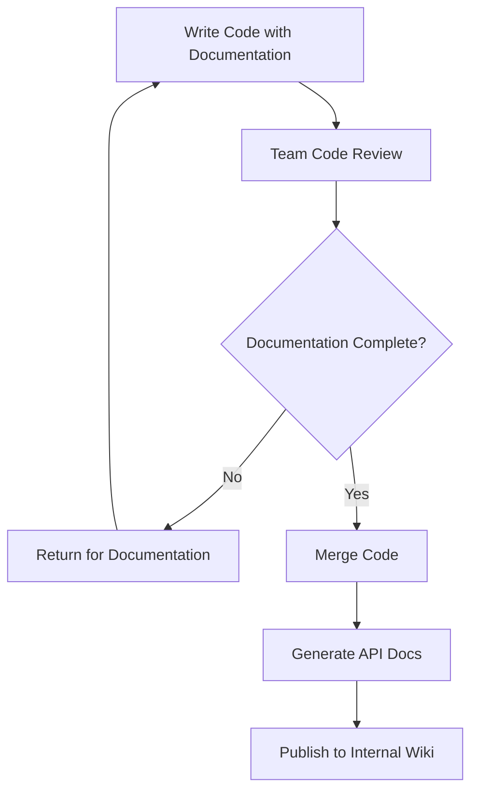

# TypeScript Documentation

Documentation is one of the most crucial yet often overlooked aspects of software development. Well-documented TypeScript code makes your project easier to understand, maintain, and collaborate on. This guide will teach you how to effectively document your TypeScript code using industry best practices.

## Introduction to TypeScript Documentation

TypeScript is a statically typed superset of JavaScript, which already provides benefits for code readability through its type system. However, adding proper documentation takes your code's readability and maintainability to the next level. Good documentation serves multiple purposes:

- It helps other developers understand your code's purpose and usage
- It assists IDE tooling in providing better code completion and inline help
- It preserves knowledge about complex logic or business rules
- It makes refactoring and debugging easier

Let's explore various documentation techniques for TypeScript projects, from simple comments to comprehensive documentation generation.

## Basic Comment Styles in TypeScript

### Single-line Comments

Single-line comments start with `//` and are useful for brief explanations:

```typescript
// This function calculates the total price including tax
function calculateTotalPrice(price: number, taxRate: number): number {
  return price * (1 + taxRate);
}
```

### Multi-line Comments

For longer explanations, use multi-line comments with `/*` and `*/`:

```typescript
/* 
  This utility function handles the formatting of currency values
  based on the user's locale settings. It accounts for different
  decimal separators and currency symbols.
*/
function formatCurrency(amount: number, locale: string): string {
  return new Intl.NumberFormat(locale, { 
    style: 'currency', 
    currency: 'USD' 
  }).format(amount);
}
```

## JSDoc for TypeScript Documentation

TypeScript has excellent integration with JSDoc comments, which provide structured documentation that IDEs can understand and display as tooltips.

### Basic JSDoc Comments

A basic JSDoc comment starts with `/**` and ends with `*/`:

```typescript
/**
 * Calculates the area of a rectangle.
 * @param width The width of the rectangle
 * @param height The height of the rectangle
 * @returns The area of the rectangle
 */
function calculateRectangleArea(width: number, height: number): number {
  return width * height;
}
```

When you hover over this function in VS Code or other TypeScript-aware IDEs, you'll see this documentation displayed as a tooltip.

### JSDoc with Type Information

Even though TypeScript has its own type system, you can enhance documentation with JSDoc type annotations:

```typescript
/**
 * Represents a User in the system
 * @typedef {Object} User
 * @property {string} id - Unique identifier
 * @property {string} name - User's full name
 * @property {string} email - User's email address
 * @property {Date} registeredDate - When the user registered
 */
interface User {
  id: string;
  name: string;
  email: string;
  registeredDate: Date;
}
```

### Documenting TypeScript-specific Features

When documenting TypeScript-specific features like generics, use proper JSDoc annotations:

```typescript
/**
 * Creates a new array containing pairs of elements from two input arrays
 * @template T Type of elements in the first array
 * @template U Type of elements in the second array
 * @param {T[]} array1 - The first array
 * @param {U[]} array2 - The second array
 * @returns {Array<[T, U]>} Array of tuples containing paired elements
 * @throws {Error} If arrays have different lengths
 */
function zipArrays<T, U>(array1: T[], array2: U[]): Array<[T, U]> {
  if (array1.length !== array2.length) {
    throw new Error("Arrays must have the same length");
  }
  
  return array1.map((item, index) => [item, array2[index]]);
}
```

## TypeScript-Specific Documentation

### Documenting Interface Properties

When documenting interfaces, document each property:

```typescript
/**
 * Configuration options for the application
 */
interface AppConfig {
  /** Base URL for the API endpoints */
  apiBaseUrl: string;
  
  /** Maximum number of concurrent requests */
  maxConcurrentRequests: number;
  
  /** Whether to enable debug logging */
  debugMode: boolean;
  
  /** Timeout for API requests in milliseconds */
  requestTimeoutMs: number;
}
```

### Documenting Function Overloads

TypeScript supports function overloads, which should be documented individually:

```typescript
/**
 * Formats a date as a string
 * @param date The date to format
 * @returns The formatted date string in ISO format
 */
function formatDate(date: Date): string;

/**
 * Formats a date as a string using the specified format
 * @param date The date to format
 * @param format The format to use (e.g., 'yyyy-MM-dd')
 * @returns The formatted date string
 */
function formatDate(date: Date, format: string): string;

/**
 * Implementation of the formatDate function
 */
function formatDate(date: Date, format?: string): string {
  if (format) {
    // Implementation for custom format
    return customFormat(date, format);
  } else {
    // Default to ISO string
    return date.toISOString();
  }
}

// Helper function for custom date formatting (implementation not shown)
function customFormat(date: Date, format: string): string {
  // Implementation here
  return ""; // Placeholder
}
```

### Documenting Generics

Document generic type parameters to make them clear:

```typescript
/**
 * A generic storage class that can hold any type of value
 * @template T The type of value being stored
 */
class Storage<T> {
  private value: T | undefined;
  
  /**
   * Sets the stored value
   * @param value The value to store
   */
  setValue(value: T): void {
    this.value = value;
  }
  
  /**
   * Gets the stored value
   * @returns The stored value or undefined if no value has been set
   */
  getValue(): T | undefined {
    return this.value;
  }
}
```

## Documentation Best Practices

### Be Consistent

Use a consistent documentation style throughout your project. This makes it easier for team members to follow the same conventions.

### Document "Why", Not Just "What"

The TypeScript code itself often explains "what" is happening. Good documentation explains "why" a certain approach was taken:

```typescript
/**
 * Retrieves user data from the API
 * 
 * Note: We're using a double-request pattern here because the initial
 * request only returns basic user info, and we need to fetch preferences
 * in a separate call. This approach was chosen over a combined endpoint
 * due to caching considerations.
 */
async function getUserWithPreferences(userId: string): Promise<UserWithPreferences> {
  const basicUser = await api.getUser(userId);
  const preferences = await api.getUserPreferences(userId);
  
  return {
    ...basicUser,
    preferences
  };
}
```

### Document Assumptions and Edge Cases

Make sure to document any assumptions or edge cases that aren't immediately obvious:

```typescript
/**
 * Splits a string into an array of words
 * 
 * @param text The input text to split
 * @returns Array of words
 * 
 * @remarks
 * This function assumes that words are separated by spaces.
 * It will not correctly handle hyphenated words as single words.
 * For example: "state-of-the-art" will become ["state", "of", "the", "art"]
 */
function splitIntoWords(text: string): string[] {
  return text.split(' ').filter(word => word.length > 0);
}
```

## Generating Documentation from TypeScript

### TypeDoc

[TypeDoc](https://typedoc.org/) is a documentation generator for TypeScript projects. It converts comments in your code into HTML documentation or other formats.

To use TypeDoc in your project:

1. Install TypeDoc:

```bash
npm install --save-dev typedoc
```

2. Add a script to your `package.json`:

```json
{
  "scripts": {
    "docs": "typedoc --out docs src/index.ts"
  }
}
```

3. Run the script to generate documentation:

```bash
npm run docs
```

This creates a `/docs` folder with HTML documentation generated from your TypeScript code.

### Sample TypeDoc Configuration

Create a `typedoc.json` file in your project root for more configuration options:

```typescript
{
  "entryPoints": ["src/index.ts"],
  "out": "docs",
  "includeVersion": true,
  "excludePrivate": true,
  "excludeProtected": true,
  "excludeExternals": true,
  "theme": "default"
}
```

## Real-world Example: Documented API Client

Here's a comprehensive example of a well-documented TypeScript API client:

```typescript
/**
 * Client for interacting with the User Management API
 * 
 * @example
 * ```typescript
 * const client = new UserApiClient('https://api.example.com', apiKey);
 * 
 * // Get a user
 * const user = await client.getUser('123');
 * console.log(user.name); // 'John Doe'
 * ```
 */
export class UserApiClient {
  private baseUrl: string;
  private apiKey: string;
  
  /**
   * Creates a new instance of the UserApiClient
   * 
   * @param baseUrl - The base URL of the API (e.g., 'https://api.example.com')
   * @param apiKey - API key for authentication
   * @throws Will throw an error if baseUrl is not a valid URL
   */
  constructor(baseUrl: string, apiKey: string) {
    // Validate the URL format
    try {
      new URL(baseUrl);
    } catch (e) {
      throw new Error('Invalid baseUrl format');
    }
    
    this.baseUrl = baseUrl;
    this.apiKey = apiKey;
  }
  
  /**
   * Retrieves a user by their ID
   * 
   * @param userId - The unique identifier of the user
   * @returns A promise resolving to the User object
   * @throws {ApiError} When the API returns an error status
   * @throws {NetworkError} When a network error occurs
   * 
   * @example
   * ```typescript
   * try {
   *   const user = await client.getUser('123');
   *   console.log(user.email);
   * } catch (error) {
   *   console.error('Failed to fetch user:', error);
   * }
   * ```
   */
  async getUser(userId: string): Promise<User> {
    const response = await this.request<User>(`/users/${userId}`);
    return response;
  }
  
  /**
   * Creates a new user
   * 
   * @param userData - User data for creating a new user
   * @returns A promise resolving to the created User object with ID
   */
  async createUser(userData: CreateUserData): Promise<User> {
    const response = await this.request<User>('/users', {
      method: 'POST',
      body: JSON.stringify(userData)
    });
    return response;
  }
  
  /**
   * Makes an HTTP request to the API
   * 
   * @internal This is an internal method not meant for direct use
   * @param endpoint - The API endpoint to call
   * @param options - Request options
   * @returns Promise resolving to the response data
   */
  private async request<T>(endpoint: string, options: RequestInit = {}): Promise<T> {
    const url = `${this.baseUrl}${endpoint}`;
    
    const headers = {
      'Content-Type': 'application/json',
      'Authorization': `Bearer ${this.apiKey}`,
      ...(options.headers || {})
    };
    
    try {
      const response = await fetch(url, {
        ...options,
        headers
      });
      
      if (!response.ok) {
        throw new ApiError(
          `API returned status ${response.status}`,
          response.status,
          await response.text()
        );
      }
      
      return await response.json();
    } catch (error) {
      if (error instanceof ApiError) {
        throw error;
      }
      throw new NetworkError(`Network error while calling ${endpoint}`, error);
    }
  }
}

/**
 * Represents a user in the system
 */
export interface User {
  /** Unique identifier of the user */
  id: string;
  /** User's full name */
  name: string;
  /** User's email address */
  email: string;
  /** When the user was created */
  createdAt: string;
}

/**
 * Data required to create a new user
 */
export interface CreateUserData {
  /** User's full name */
  name: string;
  /** User's email address */
  email: string;
  /** User's password (will be securely hashed on the server) */
  password: string;
}

/**
 * Error thrown when the API returns an error status
 */
export class ApiError extends Error {
  /**
   * @param message - Error message
   * @param status - HTTP status code
   * @param responseText - Raw response text
   */
  constructor(
    message: string,
    public status: number,
    public responseText: string
  ) {
    super(message);
    this.name = 'ApiError';
  }
}

/**
 * Error thrown when a network issue occurs
 */
export class NetworkError extends Error {
  /**
   * @param message - Error message
   * @param cause - The underlying cause of the error
   */
  constructor(
    message: string,
    public cause: unknown
  ) {
    super(message);
    this.name = 'NetworkError';
  }
}
```

## Documentation Process in a Team Environment

For team projects, consider documenting your documentation standards:



## Summary

Effective documentation is essential for TypeScript projects, especially as they grow in size and complexity. By following these best practices, you can create documentation that:

- Makes your code more maintainable
- Helps onboard new team members faster
- Reduces the time spent answering questions about the codebase
- Leverages TypeScript's rich type system to provide better IDE support
- Creates institutional knowledge that persists even as team members come and go

Remember that good documentation is living documentation—it should be updated as your code evolves. Make documentation a core part of your development process, not an afterthought.

## Additional Resources

- [TypeScript JSDoc Reference](https://www.typescriptlang.org/docs/handbook/jsdoc-supported-types.html)
- [TypeDoc Documentation](https://typedoc.org/guides/overview/)
- [Clean Documentation in TypeScript Projects](https://blog.bitsrc.io/writing-clean-documentation-in-typescript-projects-95ff7e342e10)

## Exercises

1. Take an existing function or class from your codebase and add comprehensive JSDoc comments.
2. Set up TypeDoc for a small TypeScript project and generate documentation.
3. Document an interface with complex generic parameters, including examples.
4. Create a documentation template for your team that includes sections for:
   - Purpose
   - Usage examples
   - Parameters
   - Return values
   - Exceptions/errors
   - Notes/caveats