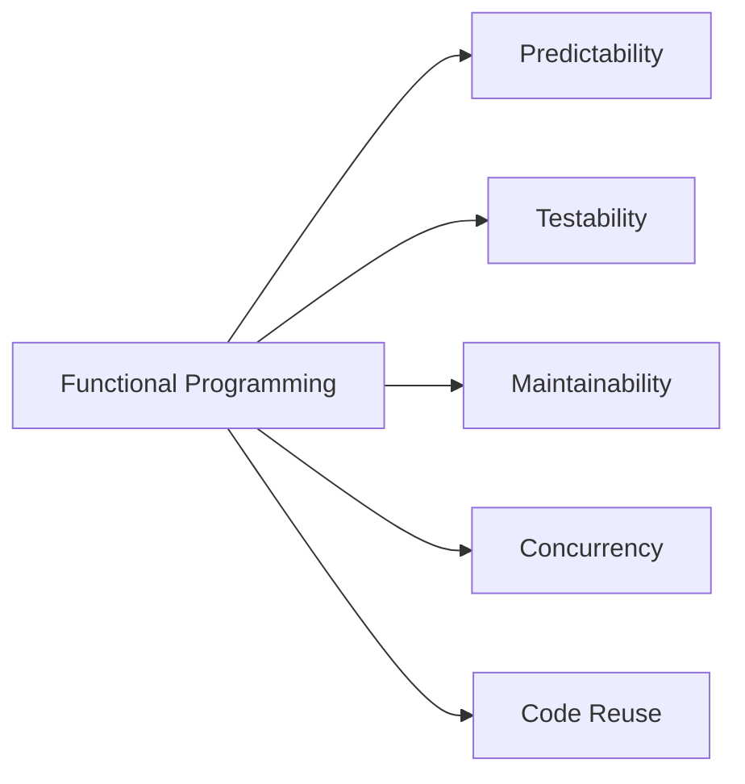

# TypeScript Functional Programming

## Introduction

Functional programming is a paradigm that treats computation as the evaluation of mathematical functions while avoiding changing state and mutable data. TypeScript, with its strong type system, provides excellent support for functional programming techniques, allowing developers to write more predictable, testable, and maintainable code.

In this guide, we'll explore how to apply functional programming principles in TypeScript, demonstrating how these concepts can lead to cleaner and more robust applications.

## Core Principles of Functional Programming

### 1. Pure Functions

Pure functions are the foundation of functional programming. A function is pure when:
- Given the same input, it always returns the same output
- It produces no side effects (doesn't modify external state)

#### Example of a Pure Function

```typescript
// Pure function
function add(a: number, b: number): number {
  return a + b;
}

// Usage
console.log(add(5, 3)); // Output: 8
```

#### Example of an Impure Function

```typescript
let total = 0;

// Impure function - modifies external state
function addToTotal(value: number): number {
  total += value;
  return total;
}

console.log(addToTotal(5)); // Output: 5
console.log(addToTotal(5)); // Output: 10 (different result for same input)
```

### 2. Immutability

Immutability means that once a data structure is created, it cannot be changed. Instead of modifying existing data, you create new data structures with the desired changes.

#### Working with Immutable Data

```typescript
// Bad approach (mutating data)
const mutableArray = [1, 2, 3];
mutableArray.push(4); // Modifies original array
console.log(mutableArray); // Output: [1, 2, 3, 4]

// Good approach (immutable)
const originalArray = [1, 2, 3];
const newArray = [...originalArray, 4]; // Creates a new array
console.log(originalArray); // Output: [1, 2, 3]
console.log(newArray); // Output: [1, 2, 3, 4]
```

For objects:

```typescript
interface User {
  name: string;
  age: number;
}

// Immutable update
function updateAge(user: User, newAge: number): User {
  return { ...user, age: newAge };
}

const john: User = { name: "John", age: 30 };
const olderJohn = updateAge(john, 31);

console.log(john); // Output: { name: "John", age: 30 }
console.log(olderJohn); // Output: { name: "John", age: 31 }
```

### 3. Function Composition

Function composition is the process of combining two or more functions to produce a new function.

```typescript
// Two simple functions
const double = (x: number): number => x * 2;
const increment = (x: number): number => x + 1;

// Compose them manually
const doubleAndIncrement = (x: number): number => increment(double(x));

console.log(doubleAndIncrement(3)); // Output: 7 (3 * 2 + 1)

// A more generic compose function
function compose<T>(...functions: Array<(arg: T) => T>) {
  return (arg: T): T => {
    return functions.reduceRight((result, fn) => fn(result), arg);
  };
}

// Now create composed function
const incrementThenDouble = compose(double, increment);
console.log(incrementThenDouble(3)); // Output: 8 ((3 + 1) * 2)
```

## Advanced Functional Programming Concepts in TypeScript

### Higher-Order Functions

Higher-order functions either take functions as arguments or return functions (or both).

```typescript
// Higher-order function that returns a function
function multiply(factor: number): (value: number) => number {
  return (value: number): number => value * factor;
}

const double = multiply(2);
const triple = multiply(3);

console.log(double(5)); // Output: 10
console.log(triple(5)); // Output: 15
```

### Map, Filter, and Reduce

These array methods are fundamental functional programming operations.

```typescript
const numbers = [1, 2, 3, 4, 5];

// Map: Transform each element
const doubled = numbers.map(n => n * 2);
console.log(doubled); // Output: [2, 4, 6, 8, 10]

// Filter: Keep elements that match a predicate
const evens = numbers.filter(n => n % 2 === 0);
console.log(evens); // Output: [2, 4]

// Reduce: Combine elements into a single value
const sum = numbers.reduce((total, current) => total + current, 0);
console.log(sum); // Output: 15
```

### Option/Maybe Types

TypeScript doesn't have built-in Option or Maybe types, but we can create them:

```typescript
type None = { kind: "None" };
type Some<T> = { kind: "Some", value: T };
type Option<T> = None | Some<T>;

// Helper functions
const none: None = { kind: "None" };
const some = <T>(value: T): Some<T> => ({ kind: "Some", value });

// Example of use
function findUserById(id: number): Option<string> {
  const users = {
    1: "Alice",
    2: "Bob"
  };
  
  return id in users ? some(users[id as keyof typeof users]) : none;
}

function printUser(option: Option<string>): void {
  switch(option.kind) {
    case "Some":
      console.log(`User found: ${option.value}`);
      break;
    case "None":
      console.log("User not found");
      break;
  }
}

printUser(findUserById(1)); // Output: "User found: Alice"
printUser(findUserById(3)); // Output: "User not found"
```

### Currying

Currying transforms a function with multiple arguments into a sequence of functions, each with a single argument.

```typescript
// Without currying
function addRegular(a: number, b: number): number {
  return a + b;
}

// With currying
function addCurried(a: number): (b: number) => number {
  return (b: number): number => a + b;
}

// Usage
console.log(addRegular(2, 3)); // Output: 5
console.log(addCurried(2)(3)); // Output: 5

// Currying is useful for partial application
const add5 = addCurried(5);
console.log(add5(10)); // Output: 15
```

## Real-World Applications

### Building a Simple Data Processing Pipeline

Let's build a simple data processing pipeline for user records:

```typescript
interface User {
  id: number;
  name: string;
  age: number;
  active: boolean;
}

// Sample data
const users: User[] = [
  { id: 1, name: "Alice", age: 25, active: true },
  { id: 2, name: "Bob", age: 30, active: false },
  { id: 3, name: "Charlie", age: 35, active: true },
  { id: 4, name: "Diana", age: 40, active: true },
];

// Function to filter active users
const getActiveUsers = (users: User[]): User[] =>
  users.filter(user => user.active);

// Function to increase age by 1
const incrementAge = (user: User): User => ({
  ...user,
  age: user.age + 1
});

// Function to format user names
const formatUserName = (user: User): User => ({
  ...user,
  name: user.name.toUpperCase()
});

// Compose our pipeline
const processUsers = (users: User[]): User[] =>
  getActiveUsers(users)
    .map(incrementAge)
    .map(formatUserName);

// Execute the pipeline
const processedUsers = processUsers(users);
console.log(processedUsers);
/* Output:
[
  { id: 1, name: "ALICE", age: 26, active: true },
  { id: 3, name: "CHARLIE", age: 36, active: true },
  { id: 4, name: "DIANA", age: 41, active: true }
]
*/
```

### Functionally Managing Application State

Here's a simple example of how functional programming can help manage application state:

```typescript
interface AppState {
  user: {
    name: string;
    preferences: {
      theme: 'light' | 'dark';
      fontSize: number;
    };
  };
  isLoading: boolean;
}

// Initial state
const initialState: AppState = {
  user: {
    name: "Guest",
    preferences: {
      theme: 'light',
      fontSize: 14
    }
  },
  isLoading: false
};

// Pure functions to update state
function setTheme(state: AppState, theme: 'light' | 'dark'): AppState {
  return {
    ...state,
    user: {
      ...state.user,
      preferences: {
        ...state.user.preferences,
        theme
      }
    }
  };
}

function setUserName(state: AppState, name: string): AppState {
  return {
    ...state,
    user: {
      ...state.user,
      name
    }
  };
}

// Usage
let currentState = initialState;
console.log("Initial state:", currentState);

// Update theme
currentState = setTheme(currentState, 'dark');
console.log("After theme change:", currentState);

// Update user name
currentState = setUserName(currentState, "John");
console.log("After name change:", currentState);
```

## Benefits of Functional Programming in TypeScript

Functional programming offers several key benefits:



1. **Predictability**: Pure functions always produce the same output for the same input, making behavior predictable.
2. **Testability**: Pure functions are easier to test since they don't have side effects.
3. **Maintainability**: Immutable data and pure functions make code easier to reason about.
4. **Concurrency**: Without shared mutable state, concurrent operations are safer.
5. **Code Reuse**: Higher-order functions and composition encourage reusable code.

## Best Practices for Functional Programming in TypeScript

1. **Prefer `const` over `let`**: Use `const` whenever possible to enforce immutability.
2. **Use readonly modifiers**: Make properties and arrays readonly when you don't want them to be modified.

```typescript
interface Point {
  readonly x: number;
  readonly y: number;
}

const point: Point = { x: 10, y: 20 };
// point.x = 5; // Error: Cannot assign to 'x' because it is a read-only property
```

3. **Use immutable data structures**: Consider libraries like Immutable.js for complex applications.
4. **Keep functions small and focused**: Each function should do one thing well.
5. **Handle errors functionally**: Use Either/Result types or Options instead of throwing exceptions.

## Summary

Functional programming in TypeScript offers a powerful approach to writing clean, maintainable, and predictable code. By embracing concepts like pure functions, immutability, and function composition, you can create applications that are easier to test, reason about, and extend.

Key takeaways:
- Pure functions have no side effects and always return the same output for the same input
- Immutability means creating new data instead of modifying existing data
- Higher-order functions and function composition enable powerful abstractions
- TypeScript's type system enhances functional programming by providing compile-time safety

## Additional Resources and Exercises

### Resources

- [Functional Programming in TypeScript](https://www.typescriptlang.org/docs/handbook/typescript-in-5-minutes-func.html) - Official TypeScript documentation
- [fp-ts](https://github.com/gcanti/fp-ts) - Functional programming library for TypeScript

### Exercises

1. **Exercise 1**: Implement a `pipe` function that works like `compose` but applies functions from left to right instead of right to left.

2. **Exercise 2**: Create a simple task management system using immutable state updates:
   - Add a task
   - Complete a task
   - Filter tasks by status

3. **Exercise 3**: Implement the `Either` monad for handling errors functionally:
   - Create `Left` and `Right` types
   - Implement `map`, `flatMap`, and other useful operations

4. **Exercise 4**: Rewrite an existing imperative piece of code using functional programming principles.

5. **Exercise 5**: Create a data validation library using functional composition.

By applying these functional programming principles in TypeScript, you'll be able to write more robust, maintainable, and testable code for your applications.