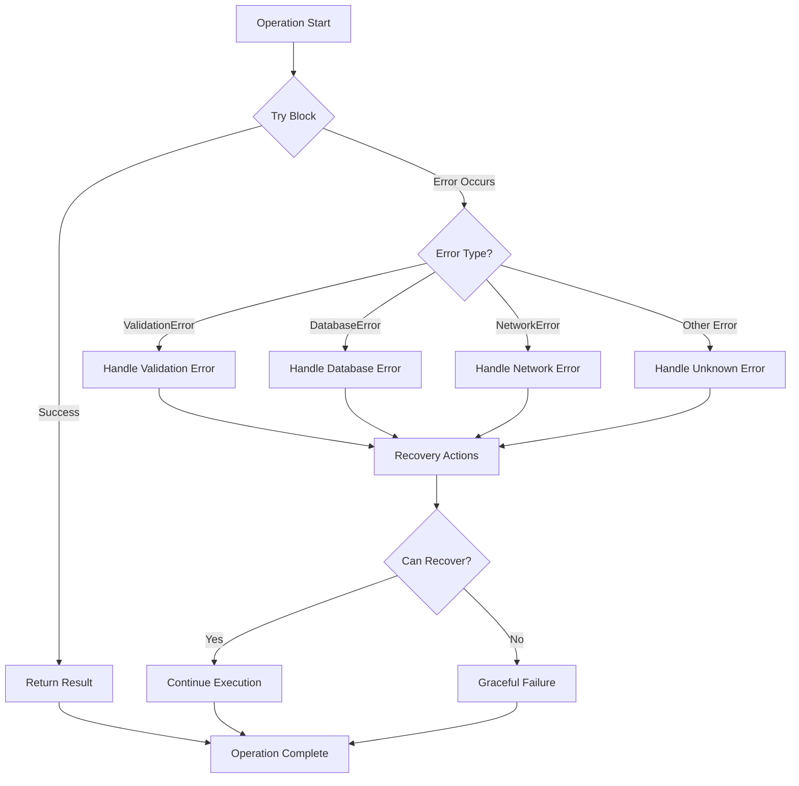

# TypeScript Error Handling

In any application, errors are inevitable. What separates robust applications from fragile ones is how they handle these errors. TypeScript provides powerful tools to catch errors at compile-time and handle runtime errors gracefully. This guide will walk you through effective error handling strategies in TypeScript.

## Introduction to Error Handling in TypeScript

Error handling is a critical aspect of writing reliable and maintainable code. When an error occurs, your application should gracefully manage the situation instead of crashing. TypeScript enhances JavaScript's error handling capabilities by adding static type checking and enabling you to define more precise error types.

### Why Error Handling Matters

- Prevents application crashes
- Improves user experience
- Makes debugging easier
- Increases code robustness
- Helps identify issues during development

## Basic Error Handling Techniques

### The try-catch Block

The most fundamental error handling mechanism is the `try-catch` block, which allows you to capture and handle exceptions.

```typescript
try {
  // Code that might throw an error
  const result = riskyOperation();
  console.log("Operation successful:", result);
} catch (error) {
  // Handle the error
  console.error("An error occurred:", error);
} finally {
  // This code runs regardless of whether an error occurred
  console.log("Operation complete");
}
```

### Narrowing Error Types

TypeScript 4.0+ allows you to narrow down the type of caught errors:

```typescript
try {
  // Some code that might throw
  JSON.parse('{"bad json"');
} catch (error) {
  // In TypeScript 4.0+, error is of type 'unknown'
  if (error instanceof SyntaxError) {
    console.error('Invalid JSON:', error.message);
  } else if (error instanceof Error) {
    console.error('General error:', error.message);
  } else {
    console.error('Unknown error:', error);
  }
}
```

## Creating Custom Error Types

TypeScript allows you to create custom error classes that extend the built-in `Error` object:

```typescript
class ValidationError extends Error {
  constructor(message: string) {
    super(message);
    this.name = 'ValidationError';
    
    // This is necessary for proper prototype chain in TypeScript
    Object.setPrototypeOf(this, ValidationError.prototype);
  }
}

class DatabaseError extends Error {
  constructor(message: string, public readonly code: number) {
    super(message);
    this.name = 'DatabaseError';
    
    Object.setPrototypeOf(this, DatabaseError.prototype);
  }
}

// Usage
try {
  const userInput = '';
  if (!userInput) {
    throw new ValidationError('User input cannot be empty');
  }
  
  // Simulate a database error
  throw new DatabaseError('Connection failed', 500);
} catch (error) {
  if (error instanceof ValidationError) {
    console.error(`Validation issue: ${error.message}`);
  } else if (error instanceof DatabaseError) {
    console.error(`Database error (${error.code}): ${error.message}`);
  } else {
    console.error('Unknown error occurred');
  }
}
```

## Error Handling Patterns in TypeScript

### 1. Result Type Pattern

Instead of throwing exceptions, you can return a result object that indicates success or failure:

```typescript
type Result<T, E = Error> = {
  ok: true;
  value: T;
} | {
  ok: false;
  error: E;
};

function divide(a: number, b: number): Result<number> {
  if (b === 0) {
    return {
      ok: false,
      error: new Error('Division by zero')
    };
  }
  
  return {
    ok: true,
    value: a / b
  };
}

// Usage
const result = divide(10, 2);
if (result.ok) {
  console.log('Result:', result.value);  // Output: Result: 5
} else {
  console.error('Error:', result.error.message);
}

const errorResult = divide(10, 0);
if (errorResult.ok) {
  console.log('Result:', errorResult.value);
} else {
  console.error('Error:', errorResult.error.message);  // Output: Error: Division by zero
}
```

### 2. Option Type Pattern

For cases where a function might not return a value:

```typescript
type Option<T> = Some<T> | None;

interface Some<T> {
  kind: 'some';
  value: T;
}

interface None {
  kind: 'none';
}

function findUser(id: string): Option<User> {
  const user = database.lookup(id);
  if (user) {
    return { kind: 'some', value: user };
  } else {
    return { kind: 'none' };
  }
}

// Usage
const userResult = findUser('123');
if (userResult.kind === 'some') {
  console.log('Found user:', userResult.value.name);
} else {
  console.log('User not found');
}
```

### 3. Async Error Handling

Handling errors in asynchronous code requires special attention:

```typescript
async function fetchUserData(userId: string): Promise<User> {
  try {
    const response = await fetch(`/api/users/${userId}`);
    
    if (!response.ok) {
      throw new Error(`HTTP error! Status: ${response.status}`);
    }
    
    return await response.json();
  } catch (error) {
    if (error instanceof TypeError) {
      throw new Error('Network error. Please check your connection.');
    } else if (error instanceof Error) {
      throw error;
    } else {
      throw new Error('Unknown error occurred');
    }
  }
}

// Usage
async function displayUserProfile(userId: string) {
  try {
    const user = await fetchUserData(userId);
    renderProfile(user);
  } catch (error) {
    if (error instanceof Error) {
      displayError(error.message);
    } else {
      displayError('An unexpected error occurred');
    }
  }
}
```

## Error Handling with TypeScript's Type System

TypeScript's type system can help prevent errors before they occur:

### Union Types for Error Handling

```typescript
type NetworkError = {
  type: 'network';
  code: number;
  message: string;
};

type ValidationError = {
  type: 'validation';
  field: string;
  message: string;
};

type AppError = NetworkError | ValidationError;

function handleError(error: AppError): void {
  switch (error.type) {
    case 'network':
      console.error(`Network error ${error.code}: ${error.message}`);
      break;
    case 'validation':
      console.error(`Validation error in ${error.field}: ${error.message}`);
      break;
  }
}

// Usage
handleError({ type: 'network', code: 404, message: 'Resource not found' });
// Output: Network error 404: Resource not found

handleError({ type: 'validation', field: 'email', message: 'Invalid format' });
// Output: Validation error in email: Invalid format
```

### Using Type Assertions to Handle Errors

```typescript
function processResponse(response: unknown): { data: unknown } {
  if (typeof response !== 'object' || response === null) {
    throw new Error('Invalid response format');
  }
  
  // Type assertion to check if response has a data property
  if (!('data' in response)) {
    throw new Error('Response missing data field');
  }
  
  return { data: (response as { data: unknown }).data };
}
```

## Real-World Example: API Client with Error Handling

Let's build a simple API client with comprehensive error handling:

```typescript
interface ApiResponse<T> {
  data?: T;
  error?: {
    code: string;
    message: string;
  };
}

class ApiError extends Error {
  constructor(
    public readonly code: string,
    message: string,
    public readonly statusCode?: number
  ) {
    super(message);
    this.name = 'ApiError';
    Object.setPrototypeOf(this, ApiError.prototype);
  }
}

class NetworkError extends Error {
  constructor(message: string) {
    super(message);
    this.name = 'NetworkError';
    Object.setPrototypeOf(this, NetworkError.prototype);
  }
}

class ApiClient {
  private baseUrl: string;
  
  constructor(baseUrl: string) {
    this.baseUrl = baseUrl;
  }
  
  async get<T>(endpoint: string): Promise<T> {
    try {
      const response = await fetch(`${this.baseUrl}${endpoint}`);
      
      if (!response.ok) {
        throw new ApiError(
          'HTTP_ERROR',
          `Request failed with status ${response.status}`,
          response.status
        );
      }
      
      const result: ApiResponse<T> = await response.json();
      
      if (result.error) {
        throw new ApiError(result.error.code, result.error.message);
      }
      
      if (result.data === undefined) {
        throw new ApiError('MISSING_DATA', 'Response is missing data');
      }
      
      return result.data;
    } catch (error) {
      if (error instanceof ApiError) {
        throw error;
      } else if (error instanceof TypeError) {
        throw new NetworkError('Network request failed');
      } else if (error instanceof Error) {
        throw new ApiError('UNKNOWN', error.message);
      } else {
        throw new ApiError('UNKNOWN', 'An unknown error occurred');
      }
    }
  }
}

// Usage
const api = new ApiClient('https://api.example.com');

async function fetchUserProfile(userId: string) {
  try {
    interface UserProfile {
      id: string;
      name: string;
      email: string;
    }
    
    const user = await api.get<UserProfile>(`/users/${userId}`);
    console.log('User profile:', user);
    return user;
  } catch (error) {
    if (error instanceof ApiError) {
      console.error(`API Error (${error.code}): ${error.message}`);
      
      if (error.statusCode === 404) {
        console.error('User not found');
      } else if (error.statusCode === 401) {
        console.error('Authentication required');
      }
    } else if (error instanceof NetworkError) {
      console.error('Network issue:', error.message);
    } else {
      console.error('Unknown error:', error);
    }
    
    throw error; // Re-throw to let the caller handle it
  }
}
```

## Visualizing Error Handling Flow



## Best Practices for Error Handling in TypeScript

1. **Be specific with error types**: Create custom error classes for different error scenarios.

2. **Don't catch what you can't handle**: Only catch errors you know how to recover from.

3. **Maintain the stack trace**: When re-throwing errors, preserve the original stack trace.

   ```typescript
   try {
     // risky operation
   } catch (error) {
     // Add context but preserve stack trace
     if (error instanceof Error) {
       throw new Error(`Failed during processing: ${error.message}`, { cause: error });
     }
     throw error;
   }
   ```

4. **Centralize error handling logic**: Create utility functions for common error handling patterns.

5. **Log errors properly**: Include enough context in error logs.

6. **Use type guards for better error handling**:

   ```typescript
   function isApiError(error: unknown): error is ApiError {
     return error instanceof Error && error.name === 'ApiError';
   }
   
   try {
     // risky operation
   } catch (error) {
     if (isApiError(error)) {
       // Handle API error
     } else {
       // Handle other errors
     }
   }
   ```

7. **Avoid silent failures**: Never catch errors without handling them properly.

8. **Handle async errors properly**: Use try/catch with async/await or .catch() with promises.

## Summary

Effective error handling is a cornerstone of robust TypeScript applications. We've covered:

- Basic error handling with try-catch blocks
- Creating custom error types for specific error scenarios
- Advanced error handling patterns (Result type, Option type)
- Leveraging TypeScript's type system for safer error handling
- Real-world error handling in an API client
- Best practices for error handling

By implementing these strategies, you can build more resilient applications that gracefully handle errors rather than crashing unexpectedly.

## Additional Resources

- [TypeScript Handbook on Error Handling](https://www.typescriptlang.org/docs/handbook/error-handling.html)
- [Mozilla Developer Network: Error Handling](https://developer.mozilla.org/en-US/docs/Web/JavaScript/Guide/Control_flow_and_error_handling)

## Exercises

1. Create a custom error hierarchy for a e-commerce application with at least three specific error types.
2. Implement the Result type pattern for a function that parses a configuration file.
3. Build a simple fetch wrapper that handles network errors, parsing errors, and API errors.
4. Refactor a callback-based API to use promises with proper error handling.
5. Implement a logging system that categorizes and formats different types of errors.