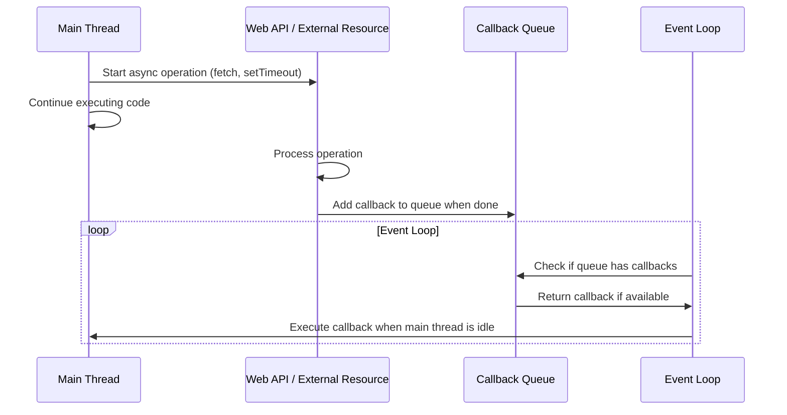

# TypeScript Asynchronous Programming

Modern JavaScript and TypeScript applications frequently deal with operations that don't complete immediately. From network requests to file operations, working with asynchronous code is essential. TypeScript provides excellent tools for managing asynchronous operations with type safety.

## Introduction to Asynchronous Programming

Asynchronous programming is a technique that enables your program to start a potentially long-running task while still being able to be responsive to other events rather than having to wait until that task has finished. Once that task has finished, your program is presented with the result.

In a web application context, asynchronous operations include:

- Network requests (API calls, fetching resources)
- File system operations (in Node.js)
- Database operations
- Timers and intervals

## Callbacks: The Traditional Approach

Before ES6, JavaScript predominantly used callbacks for asynchronous operations:

```typescript
function fetchUserData(userId: string, callback: (data: UserData | null, error?: Error) => void) {
  // Simulate an API call
  setTimeout(() => {
    try {
      // Simulate successful data fetch
      const userData = {
        id: userId,
        name: 'John Doe',
        email: 'john@example.com'
      };
      callback(userData);
    } catch (error) {
      callback(null, error as Error);
    }
  }, 1000);
}

// Usage
fetchUserData('123', (data, error) => {
  if (error) {
    console.error('Failed to fetch user data:', error);
    return;
  }
  console.log('User data:', data);
});
```

**Output:**
```
User data: { id: '123', name: 'John Doe', email: 'john@example.com' }
```

However, callbacks can lead to deeply nested code known as "callback hell" or "pyramid of doom":

```typescript
fetchUserData('123', (userData, error1) => {
  if (error1) return console.error(error1);
  
  fetchUserPosts(userData.id, (posts, error2) => {
    if (error2) return console.error(error2);
    
    fetchPostComments(posts[0].id, (comments, error3) => {
      if (error3) return console.error(error3);
      
      // Continue with more nested callbacks...
    });
  });
});
```

## Promises in TypeScript

Promises provide a more structured way to handle asynchronous operations:

```typescript
interface UserData {
  id: string;
  name: string;
  email: string;
}

function fetchUserData(userId: string): Promise<UserData> {
  return new Promise((resolve, reject) => {
    // Simulate API call
    setTimeout(() => {
      try {
        const userData = {
          id: userId,
          name: 'John Doe',
          email: 'john@example.com'
        };
        resolve(userData);
      } catch (error) {
        reject(new Error(`Failed to fetch user data: ${error}`));
      }
    }, 1000);
  });
}

// Usage with promise chains
fetchUserData('123')
  .then(userData => {
    console.log('User data:', userData);
    return fetchUserPosts(userData.id);
  })
  .then(posts => {
    console.log('User posts:', posts);
    return fetchPostComments(posts[0].id);
  })
  .then(comments => {
    console.log('Post comments:', comments);
  })
  .catch(error => {
    console.error('Error in promise chain:', error);
  });
```

### Generic Promise Types

TypeScript provides excellent type support for Promises with generics:

```typescript
// Define return type of async functions
function fetchNumbers(): Promise<number[]> {
  return Promise.resolve([1, 2, 3, 4, 5]);
}

// Generic async function
function fetchData<T>(url: string): Promise<T> {
  return fetch(url).then(response => {
    if (!response.ok) {
      throw new Error(`HTTP error! Status: ${response.status}`);
    }
    return response.json() as Promise<T>;
  });
}

// Usage with type inference
interface Product {
  id: number;
  title: string;
  price: number;
}

fetchData<Product[]>('https://api.example.com/products')
  .then(products => {
    products.forEach(product => {
      console.log(`${product.title}: $${product.price}`);
    });
  });
```

## Async/Await in TypeScript

Async/await is syntactic sugar built on top of Promises, making asynchronous code look and behave more like synchronous code:

```typescript
async function getUserDataAndPosts(userId: string) {
  try {
    // Each await expression unwraps the Promise
    const userData = await fetchUserData(userId);
    console.log('User:', userData);
    
    const posts = await fetchUserPosts(userData.id);
    console.log('Posts:', posts);
    
    return { user: userData, posts };
  } catch (error) {
    console.error('Error fetching user data and posts:', error);
    throw error; // Re-throw the error to be caught by caller
  }
}

// You still need to handle the promise returned by an async function
getUserDataAndPosts('123')
  .then(result => {
    console.log('Operation completed successfully', result);
  })
  .catch(error => {
    console.error('Operation failed:', error);
  });

// Or using async/await
async function main() {
  try {
    const result = await getUserDataAndPosts('123');
    console.log('Operation completed successfully', result);
  } catch (error) {
    console.error('Operation failed:', error);
  }
}

main();
```

### Error Handling with Async/Await

Proper error handling is crucial in asynchronous code:

```typescript
async function fetchWithErrorHandling() {
  try {
    const response = await fetch('https://api.example.com/data');
    
    if (!response.ok) {
      throw new Error(`HTTP error! Status: ${response.status}`);
    }
    
    const data = await response.json();
    return data;
  } catch (error) {
    // Handle specific types of errors
    if (error instanceof TypeError) {
      console.error('Network error or CORS issue:', error);
    } else if (error instanceof Error) {
      console.error('Generic error:', error.message);
    } else {
      console.error('Unknown error:', error);
    }
    
    // You might want to return a default value or re-throw
    throw error;
  }
}
```

## Parallel vs Sequential Execution

### Sequential Execution

```typescript
async function sequentialFetch() {
  console.time('sequential');
  
  // These run one after another
  const users = await fetchData<User[]>('/users');
  const products = await fetchData<Product[]>('/products');
  const orders = await fetchData<Order[]>('/orders');
  
  console.timeEnd('sequential');
  return { users, products, orders };
}
```

### Parallel Execution with Promise.all

```typescript
async function parallelFetch() {
  console.time('parallel');
  
  // These run concurrently
  const [users, products, orders] = await Promise.all([
    fetchData<User[]>('/users'),
    fetchData<Product[]>('/products'),
    fetchData<Order[]>('/orders')
  ]);
  
  console.timeEnd('parallel');
  return { users, products, orders };
}
```

### Using Promise.allSettled for Reliability

```typescript
async function reliableFetch() {
  const results = await Promise.allSettled([
    fetchData<User[]>('/users'),
    fetchData<Product[]>('/products'),
    fetchData<Order[]>('/orders')
  ]);
  
  // Process results individually
  results.forEach((result, index) => {
    if (result.status === 'fulfilled') {
      console.log(`Request ${index} succeeded:`, result.value);
    } else {
      console.error(`Request ${index} failed:`, result.reason);
    }
  });
}
```

## Real-world Pattern: Asynchronous Data Loading

Here's a practical example of loading data in a React component with TypeScript:

```tsx
import React, { useState, useEffect } from 'react';

interface User {
  id: number;
  name: string;
  email: string;
}

// Create a reusable hook for data fetching
function useDataFetching<T>(url: string) {
  const [data, setData] = useState<T | null>(null);
  const [loading, setLoading] = useState<boolean>(true);
  const [error, setError] = useState<Error | null>(null);

  useEffect(() => {
    let isMounted = true;
    
    async function fetchData() {
      try {
        setLoading(true);
        const response = await fetch(url);
        
        if (!response.ok) {
          throw new Error(`HTTP error! Status: ${response.status}`);
        }
        
        const result = await response.json();
        
        if (isMounted) {
          setData(result);
          setError(null);
        }
      } catch (err) {
        if (isMounted) {
          setError(err instanceof Error ? err : new Error('An unknown error occurred'));
          setData(null);
        }
      } finally {
        if (isMounted) {
          setLoading(false);
        }
      }
    }
    
    fetchData();
    
    return () => {
      isMounted = false;
    };
  }, [url]);

  return { data, loading, error };
}

// Usage in a component
function UserProfile({ userId }: { userId: number }) {
  const { data: user, loading, error } = useDataFetching<User>(`/api/users/${userId}`);

  if (loading) return <div>Loading user profile...</div>;
  if (error) return <div>Error loading profile: {error.message}</div>;
  if (!user) return <div>No user data found</div>;

  return (
    <div>
      <h1>{user.name}</h1>
      <p>Email: {user.email}</p>
    </div>
  );
}
```

## Best Practices for Asynchronous Programming in TypeScript

### 1. Always specify return types for async functions

```typescript
// ❌ Implicit return type
async function fetchUsers() {
  const response = await fetch('/api/users');
  return response.json();
}

// ✅ Explicit return type
async function fetchUsers(): Promise<User[]> {
  const response = await fetch('/api/users');
  return response.json();
}
```

### 2. Handle errors properly

```typescript
// ❌ Missing error handling
async function fetchData() {
  const response = await fetch('/api/data');
  const data = await response.json();
  return data;
}

// ✅ Proper error handling
async function fetchData(): Promise<Data> {
  try {
    const response = await fetch('/api/data');
    
    if (!response.ok) {
      throw new Error(`HTTP error! Status: ${response.status}`);
    }
    
    return await response.json();
  } catch (error) {
    console.error('Failed to fetch data:', error);
    throw error; // Re-throw or handle appropriately
  }
}
```

### 3. Avoid mixing async/await with .then()/.catch()

Choose one style and stick with it for consistency:

```typescript
// ❌ Mixing styles
async function processData() {
  const data = await fetchData();
  return processResult(data).then(result => {
    return formatResult(result);
  });
}

// ✅ Consistent style with async/await
async function processData() {
  const data = await fetchData();
  const result = await processResult(data);
  return formatResult(result);
}
```

### 4. Use Promise utilities for concurrent operations

```typescript
// ✅ Using Promise.all for concurrent operations
async function loadDashboard() {
  const [users, products, analytics] = await Promise.all([
    fetchUsers(),
    fetchProducts(),
    fetchAnalytics()
  ]);
  
  return { users, products, analytics };
}
```

### 5. Create cancellable async operations

Using AbortController to cancel fetch requests:

```typescript
async function fetchWithTimeout(url: string, timeoutMs: number): Promise<Response> {
  const controller = new AbortController();
  const { signal } = controller;
  
  // Create a timeout that aborts the fetch
  const timeoutId = setTimeout(() => controller.abort(), timeoutMs);
  
  try {
    const response = await fetch(url, { signal });
    clearTimeout(timeoutId);
    return response;
  } catch (error) {
    clearTimeout(timeoutId);
    if ((error as Error).name === 'AbortError') {
      throw new Error(`Request timed out after ${timeoutMs}ms`);
    }
    throw error;
  }
}

// Usage
try {
  const response = await fetchWithTimeout('https://api.example.com/data', 5000);
  const data = await response.json();
  console.log(data);
} catch (error) {
  console.error('Fetch failed:', error);
}
```

## Asynchronous Flow Visualization

Here's a visualization of how asynchronous operations work in JavaScript/TypeScript:



## Summary

Asynchronous programming in TypeScript involves:

- Using Promises for handling asynchronous operations with proper typing
- Leveraging async/await for more readable asynchronous code
- Proper error handling with try/catch blocks
- Understanding parallel vs sequential execution patterns
- Implementing best practices for maintainable asynchronous code

TypeScript enhances JavaScript's asynchronous programming model by adding:

- Type checking for Promise results and error handling
- Better IDE support with autocompletion and error detection
- Improved refactoring capabilities
- More explicit and self-documenting code

## Exercises

1. Convert a callback-based function to use Promises:
   ```typescript
   function readFile(path: string, callback: (error: Error | null, data: string | null) => void) {
     // Implementation that calls callback(error, data)
   }
   
   // Convert to:
   function readFilePromise(path: string): Promise<string> {
     // Your implementation here
   }
   ```

2. Create a function that fetches data from multiple endpoints in parallel and combines the results.

3. Implement a retry mechanism for failed network requests with exponential backoff.

4. Create a custom hook in React that handles loading, error states, and pagination for a list of items from an API.

5. Build a cancellable asynchronous operation that includes timeout handling and cleanup logic.

## Additional Resources

- [TypeScript Handbook: Functions](https://www.typescriptlang.org/docs/handbook/2/functions.html)
- [JavaScript Promise API](https://developer.mozilla.org/en-US/docs/Web/JavaScript/Reference/Global_Objects/Promise)
- [Async functions](https://developer.mozilla.org/en-US/docs/Web/JavaScript/Reference/Statements/async_function)
- [JavaScript Event Loop explained](https://developer.mozilla.org/en-US/docs/Web/JavaScript/EventLoop)
- [RxJS for more advanced asynchronous operations](https://rxjs.dev/)

By mastering asynchronous programming patterns in TypeScript, you'll be able to build responsive, efficient applications that can handle complex operations without blocking the main thread.