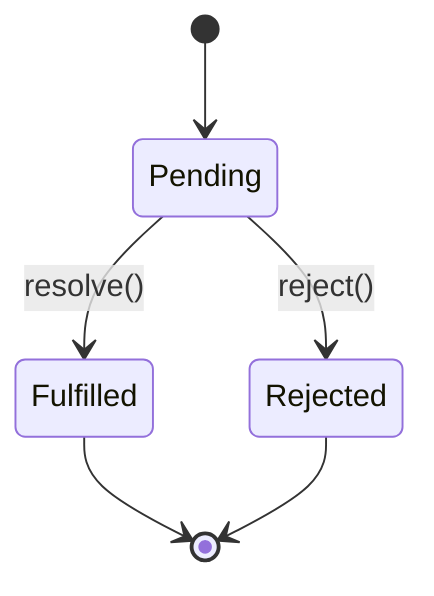

# TypeScript Promises

## Introduction

In modern web development, handling asynchronous operations efficiently is crucial. Whether you're fetching data from an API, reading files, or executing time-consuming operations, you need a reliable pattern to manage these tasks without blocking the main thread. This is where **Promises** come into play.

TypeScript, with its strong typing system, enhances the JavaScript Promise API by providing type safety and better developer experience when working with asynchronous code.

In this guide, we'll explore how Promises work in TypeScript, how to create and use them effectively, and best practices for handling asynchronous operations in your TypeScript applications.

## What are Promises?

A Promise is an object representing the eventual completion or failure of an asynchronous operation. It serves as a placeholder for a value that may not be available yet.

A Promise exists in one of three states:
- **Pending**: Initial state, neither fulfilled nor rejected
- **Fulfilled**: The operation completed successfully
- **Rejected**: The operation failed



## Creating Promises in TypeScript

In TypeScript, we can create a Promise with proper type annotations to specify the type of value the Promise will resolve to.

### Basic Promise Creation

```typescript
// Creating a Promise that resolves to a string
const myPromise: Promise<string> = new Promise((resolve, reject) => {
  // Simulating an asynchronous operation
  setTimeout(() => {
    const success = true; // This could be the result of some operation
    
    if (success) {
      resolve('Operation completed successfully');
    } else {
      reject(new Error('Operation failed'));
    }
  }, 1000);
});

// Using the Promise
myPromise
  .then((result) => {
    console.log(result); // Output: "Operation completed successfully"
  })
  .catch((error) => {
    console.error(error);
  });
```

In this example:
1. We create a Promise that resolves to a string (`Promise<string>`)
2. The Promise simulates an asynchronous operation using `setTimeout`
3. After 1 second, it either resolves with a success message or rejects with an error
4. We handle the Promise result using `.then()` and `.catch()` methods

## Promise Methods

### then()

The `then()` method is used to handle the successful completion of a Promise. It takes up to two callback functions: one for success and one for failure.

```typescript
function fetchUserData(userId: number): Promise<User> {
  return new Promise((resolve, reject) => {
    // Simulating API call
    setTimeout(() => {
      if (userId > 0) {
        resolve({ id: userId, name: 'John Doe', email: 'john@example.com' });
      } else {
        reject(new Error('Invalid user ID'));
      }
    }, 500);
  });
}

interface User {
  id: number;
  name: string;
  email: string;
}

// Using then() with success and failure callbacks
fetchUserData(123)
  .then(
    (user) => console.log('User data:', user),
    (error) => console.error('Error in then:', error)
  );

// Output: User data: { id: 123, name: 'John Doe', email: 'john@example.com' }
```

### catch()

The `catch()` method handles any errors that occur in the Promise chain.

```typescript
fetchUserData(-1)
  .then((user) => console.log('User data:', user))
  .catch((error) => console.error('Error caught:', error.message));

// Output: Error caught: Invalid user ID
```

### finally()

The `finally()` method executes code regardless of whether the Promise is fulfilled or rejected.

```typescript
let isLoading = true;

fetchUserData(123)
  .then((user) => console.log('User data:', user))
  .catch((error) => console.error('Error caught:', error.message))
  .finally(() => {
    isLoading = false;
    console.log('Loading state:', isLoading);
  });

// Output:
// User data: { id: 123, name: 'John Doe', email: 'john@example.com' }
// Loading state: false
```

## Promise Chaining

One of the powerful features of Promises is the ability to chain them together, which helps avoid callback hell.

```typescript
interface Post {
  id: number;
  title: string;
  userId: number;
}

function fetchUserById(userId: number): Promise<User> {
  return new Promise((resolve) => {
    setTimeout(() => resolve({ id: userId, name: 'John Doe', email: 'john@example.com' }), 500);
  });
}

function fetchPostsByUser(user: User): Promise<Post[]> {
  return new Promise((resolve) => {
    setTimeout(() => {
      resolve([
        { id: 1, title: 'TypeScript Basics', userId: user.id },
        { id: 2, title: 'Advanced TypeScript', userId: user.id }
      ]);
    }, 500);
  });
}

// Promise chain
fetchUserById(1)
  .then((user) => {
    console.log('User:', user);
    return fetchPostsByUser(user);
  })
  .then((posts) => {
    console.log('Posts:', posts);
  })
  .catch((error) => {
    console.error('Error in chain:', error);
  });

// Output:
// User: { id: 1, name: 'John Doe', email: 'john@example.com' }
// Posts: [{ id: 1, title: 'TypeScript Basics', userId: 1 }, { id: 2, title: 'Advanced TypeScript', userId: 1 }]
```

## Static Methods

### Promise.resolve() and Promise.reject()

TypeScript provides proper typing for `Promise.resolve()` and `Promise.reject()`:

```typescript
// Creating resolved promises
const resolvedPromise: Promise<number> = Promise.resolve(42);
resolvedPromise.then(value => console.log(value)); // Output: 42

// Creating rejected promises
const rejectedPromise: Promise<never> = Promise.reject(new Error('Something went wrong'));
rejectedPromise.catch(error => console.error(error.message)); // Output: Something went wrong
```

### Promise.all()

`Promise.all()` takes an array of Promises and returns a new Promise that resolves when all of the Promises in the array have resolved, or rejects if any Promise in the array rejects.

```typescript
interface Product {
  id: number;
  name: string;
  price: number;
}

function fetchUser(userId: number): Promise<User> {
  return new Promise(resolve => {
    setTimeout(() => resolve({ id: userId, name: 'Alice', email: 'alice@example.com' }), 300);
  });
}

function fetchProducts(): Promise<Product[]> {
  return new Promise(resolve => {
    setTimeout(() => {
      resolve([
        { id: 101, name: 'Laptop', price: 999 },
        { id: 102, name: 'Phone', price: 699 }
      ]);
    }, 500);
  });
}

function fetchOrders(userId: number): Promise<string[]> {
  return new Promise(resolve => {
    setTimeout(() => resolve(['ORD-1234', 'ORD-5678']), 400);
  });
}

// Using Promise.all to fetch data in parallel
Promise.all([
  fetchUser(1),
  fetchProducts(),
  fetchOrders(1)
])
.then(([user, products, orders]) => {
  console.log('User:', user);
  console.log('Products:', products);
  console.log('Orders:', orders);
})
.catch(error => {
  console.error('Error in Promise.all:', error);
});

// Output:
// User: { id: 1, name: 'Alice', email: 'alice@example.com' }
// Products: [{ id: 101, name: 'Laptop', price: 999 }, { id: 102, name: 'Phone', price: 699 }]
// Orders: ['ORD-1234', 'ORD-5678']
```

### Promise.race()

`Promise.race()` resolves or rejects as soon as one of the Promises in the array resolves or rejects.

```typescript
// Create two promises with different delays
const promise1 = new Promise<string>((resolve) => setTimeout(() => resolve('Promise 1 resolved'), 500));
const promise2 = new Promise<string>((resolve) => setTimeout(() => resolve('Promise 2 resolved'), 300));

// Use Promise.race to get the first resolved promise
Promise.race([promise1, promise2])
  .then(result => console.log(result))
  .catch(error => console.error(error));

// Output: Promise 2 resolved (because it completes faster)
```

### Promise.allSettled()

`Promise.allSettled()` returns a Promise that resolves after all of the given Promises have either resolved or rejected, with an array of objects describing the outcome of each Promise.

```typescript
const promises = [
  Promise.resolve('Success'),
  Promise.reject('Failed'),
  new Promise<string>(resolve => setTimeout(() => resolve('Delayed success'), 300))
];

Promise.allSettled(promises)
  .then(results => {
    results.forEach((result, index) => {
      if (result.status === 'fulfilled') {
        console.log(`Promise ${index + 1} fulfilled with value:`, result.value);
      } else {
        console.log(`Promise ${index + 1} rejected with reason:`, result.reason);
      }
    });
  });

// Output:
// Promise 1 fulfilled with value: Success
// Promise 2 rejected with reason: Failed
// Promise 3 fulfilled with value: Delayed success
```

## Error Handling in TypeScript Promises

Proper error handling is essential when working with Promises. TypeScript helps us catch potential type errors at compile time.

```typescript
interface ApiResponse<T> {
  data: T;
  status: number;
}

function fetchData<T>(url: string): Promise<ApiResponse<T>> {
  return new Promise((resolve, reject) => {
    // Simulating fetch API
    setTimeout(() => {
      if (url.includes('success')) {
        resolve({ data: { success: true } as unknown as T, status: 200 });
      } else {
        reject(new Error(`Failed to fetch from ${url}`));
      }
    }, 300);
  });
}

// Error handling with catch
fetchData<{ success: boolean }>('https://api.example.com/error')
  .then(response => {
    console.log('Data:', response.data);
  })
  .catch(error => {
    console.error('Error occurred:', error.message);
    // Provide fallback or recovery logic
    return { data: { success: false }, status: 500 } as ApiResponse<{ success: boolean }>;
  })
  .then(fallbackResponse => {
    console.log('Using fallback data:', fallbackResponse.data);
  });

// Output:
// Error occurred: Failed to fetch from https://api.example.com/error
// Using fallback data: { success: false }
```

## Real-World Example: Data Fetching Service

Let's create a more comprehensive, real-world example of a data fetching service using TypeScript Promises:

```typescript
// Define our types
interface User {
  id: number;
  name: string;
  email: string;
}

interface ApiError {
  message: string;
  code: number;
}

// Generic API service
class ApiService {
  private baseUrl: string;
  private defaultHeaders: HeadersInit;

  constructor(baseUrl: string) {
    this.baseUrl = baseUrl;
    this.defaultHeaders = {
      'Content-Type': 'application/json',
      'Accept': 'application/json'
    };
  }

  async get<T>(endpoint: string): Promise<T> {
    try {
      const response = await fetch(`${this.baseUrl}${endpoint}`, {
        method: 'GET',
        headers: this.defaultHeaders
      });
      
      if (!response.ok) {
        const errorData: ApiError = await response.json();
        throw new Error(`API Error ${errorData.code}: ${errorData.message}`);
      }
      
      return await response.json() as T;
    } catch (error) {
      if (error instanceof Error) {
        throw new Error(`Failed to fetch data: ${error.message}`);
      }
      throw new Error('Unknown error occurred');
    }
  }

  async post<T, R>(endpoint: string, data: T): Promise<R> {
    try {
      const response = await fetch(`${this.baseUrl}${endpoint}`, {
        method: 'POST',
        headers: this.defaultHeaders,
        body: JSON.stringify(data)
      });
      
      if (!response.ok) {
        const errorData: ApiError = await response.json();
        throw new Error(`API Error ${errorData.code}: ${errorData.message}`);
      }
      
      return await response.json() as R;
    } catch (error) {
      if (error instanceof Error) {
        throw new Error(`Failed to post data: ${error.message}`);
      }
      throw new Error('Unknown error occurred');
    }
  }
}

// User service that uses our API service
class UserService {
  private api: ApiService;
  
  constructor(apiService: ApiService) {
    this.api = apiService;
  }
  
  async getUserById(id: number): Promise<User> {
    return this.api.get<User>(`/users/${id}`);
  }
  
  async createUser(userData: Omit<User, 'id'>): Promise<User> {
    return this.api.post<Omit<User, 'id'>, User>('/users', userData);
  }
  
  async getUsersWithPosts(): Promise<Array<User & { posts: string[] }>> {
    try {
      // Get all users
      const users = await this.api.get<User[]>('/users');
      
      // For each user, fetch their posts
      const usersWithPosts = await Promise.all(
        users.map(async (user) => {
          const posts = await this.api.get<string[]>(`/users/${user.id}/posts`);
          return { ...user, posts };
        })
      );
      
      return usersWithPosts;
    } catch (error) {
      console.error('Failed to fetch users with posts:', error);
      throw error;
    }
  }
}

// Usage example (in a real environment)
const apiService = new ApiService('https://api.example.com');
const userService = new UserService(apiService);

// Function to display user profile
async function displayUserProfile(userId: number): Promise<void> {
  try {
    console.log('Fetching user data...');
    const user = await userService.getUserById(userId);
    
    console.log(`User Profile: ${user.name} (${user.email})`);
  } catch (error) {
    console.error('Error displaying user profile:', error);
    // Show error message to user
  }
}

// This would be called from a UI event
// displayUserProfile(123);
```

This example demonstrates a well-structured API service that uses TypeScript Promises, proper error handling, and type safety.

## Best Practices for Working with Promises in TypeScript

1. **Always specify return types**: Be explicit about what type of Promise you're returning.

```typescript
// Good
function fetchData(): Promise<User[]> {
  // implementation
}

// Avoid
function fetchData() {
  return new Promise((resolve) => {
    // TypeScript has to infer the type
  });
}
```

2. **Use async/await for cleaner code**: While Promise chains are powerful, async/await often leads to more readable code.

```typescript
// Promise chains
function getUserWithPosts(userId: number): Promise<UserWithPosts> {
  return fetchUser(userId)
    .then(user => {
      return fetchPosts(userId)
        .then(posts => {
          return { ...user, posts };
        });
    });
}

// Same function with async/await
async function getUserWithPosts(userId: number): Promise<UserWithPosts> {
  const user = await fetchUser(userId);
  const posts = await fetchPosts(userId);
  return { ...user, posts };
}
```

3. **Always handle errors**: Never leave Promises unhandled.

```typescript
// Good
myPromise
  .then(handleSuccess)
  .catch(handleError);

// With async/await
async function doSomething() {
  try {
    const result = await myPromise;
    handleSuccess(result);
  } catch (error) {
    handleError(error);
  }
}
```

4. **Use Promise.all() for concurrent operations**: When operations can run in parallel, use `Promise.all()`.

5. **Make use of TypeScript's type narrowing for error handling**:

```typescript
async function handleApiRequest(): Promise<void> {
  try {
    const data = await fetchSomeData();
    processData(data);
  } catch (error) {
    if (error instanceof NetworkError) {
      // Handle network errors
      retryConnection();
    } else if (error instanceof ValidationError) {
      // Handle validation errors
      showValidationMessage(error.fields);
    } else if (error instanceof Error) {
      // Handle general errors
      logError(error.message);
    } else {
      // Handle unknown errors
      logError('Unknown error');
    }
  }
}
```

## Summary

TypeScript Promises provide a powerful way to handle asynchronous operations with added type safety. Key takeaways include:

- Promises represent the eventual completion or failure of an asynchronous operation
- TypeScript adds strong typing to Promises via generics (`Promise<T>`)
- The Promise API includes methods like `then()`, `catch()`, and `finally()`
- Static methods like `Promise.all()`, `Promise.race()`, and `Promise.allSettled()` help manage multiple Promises
- Proper error handling is essential when working with Promises
- Async/await syntax provides a cleaner way to work with Promises

By following the best practices and patterns demonstrated in this guide, you'll be well-equipped to handle asynchronous operations effectively in your TypeScript applications.

## Additional Resources

- Practice creating a simple data fetching library with error handling
- Implement a Promise-based caching mechanism for API responses
- Build a retry mechanism for failed API calls using Promises
- Explore how to use TypeScript's utility types with Promises
- Learn about more advanced patterns like Promise queues and batching

## Exercises

1. Create a function that fetches data from multiple API endpoints concurrently and combines the results
2. Implement a timeout wrapper for Promises that rejects if the Promise doesn't resolve within a specified time
3. Build a simple retry mechanism that attempts to execute a Promise-returning function up to N times before giving up
4. Create a function that converts a callback-based API to a Promise-based one (promisify)
5. Implement a sequential Promise executor that runs an array of Promise-returning functions one after another

Happy coding with TypeScript Promises!