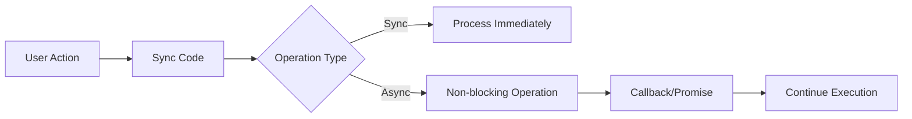

# TypeScript Async/Await

## Introduction

Asynchronous programming is essential in modern web development, as it allows applications to perform operations without blocking the main thread. JavaScript has evolved from callback-based patterns to Promises and finally to the elegant `async/await` syntax. TypeScript enhances this with static typing, providing better tooling support and error checking for asynchronous code.

In this guide, we'll explore how to use `async/await` in TypeScript to write cleaner, more maintainable asynchronous code.

## Understanding Asynchronous Programming

Before diving into `async/await`, let's understand why asynchronous programming is necessary:



JavaScript runs on a single thread in the browser, so long-running operations would block the UI if executed synchronously. Asynchronous programming allows tasks like API calls, file operations, or timers to execute without freezing the application.

## Promises Refresher

`async/await` is built on top of Promises, so a quick refresher:

```typescript
// A Promise represents an asynchronous operation
const fetchData = (): Promise<string> => {
  return new Promise((resolve, reject) => {
    setTimeout(() => {
      // Simulating API call
      const success = true;
      if (success) {
        resolve("Data fetched successfully");
      } else {
        reject(new Error("Failed to fetch data"));
      }
    }, 1000);
  });
};

// Using the Promise
fetchData()
  .then(data => console.log(data))
  .catch(error => console.error(error));
```

Output:
```
Data fetched successfully
```

## The Async/Await Syntax

`async/await` allows you to write asynchronous code that looks and behaves more like synchronous code, making it easier to understand and maintain.

### The `async` Keyword

The `async` keyword is used to declare an asynchronous function that implicitly returns a Promise:

```typescript
async function getData(): Promise<string> {
  return "Hello, World!";
}

// Equivalent to:
function getDataWithPromise(): Promise<string> {
  return Promise.resolve("Hello, World!");
}
```

### The `await` Keyword

The `await` keyword can only be used inside an `async` function and pauses execution until a Promise is resolved:

```typescript
async function processData(): Promise<void> {
  console.log("Starting...");
  const data = await fetchData(); // Wait for fetchData to complete
  console.log(data); // Only runs after fetchData completes
  console.log("Finished!");
}

processData();
```

Output:
```
Starting...
Data fetched successfully
Finished!
```

## Error Handling with Async/Await

There are two main approaches to error handling with async/await:

### Using Try/Catch

```typescript
async function fetchWithErrorHandling(): Promise<void> {
  try {
    const data = await fetchData();
    console.log(data);
  } catch (error) {
    console.error("Error caught:", error.message);
  }
}
```

### Mixing with Promise Methods

You can still use Promise methods like `.catch()` with async functions:

```typescript
async function fetchWithMixedHandling(): Promise<string> {
  const data = await fetchData();
  return `Processed: ${data}`;
}

fetchWithMixedHandling()
  .then(result => console.log(result))
  .catch(error => console.error("Error:", error.message));
```

## Sequential vs. Parallel Execution

### Sequential Execution

When you use `await` sequentially, each operation waits for the previous one to complete:

```typescript
async function sequentialFetch(): Promise<void> {
  console.time("sequential");
  
  const first = await fetchFromAPI("/users");
  console.log("First request complete");
  
  const second = await fetchFromAPI("/posts");
  console.log("Second request complete");
  
  console.timeEnd("sequential");
}

// Simulated API function
function fetchFromAPI(endpoint: string): Promise<any> {
  return new Promise(resolve => {
    setTimeout(() => {
      resolve({ endpoint, data: "Sample data" });
    }, 1000); // Each takes 1 second
  });
}
```

Output (takes ~2 seconds):
```
First request complete
Second request complete
sequential: 2005.236ms
```

### Parallel Execution

For independent operations, you can run them in parallel using `Promise.all`:

```typescript
async function parallelFetch(): Promise<void> {
  console.time("parallel");
  
  const [first, second] = await Promise.all([
    fetchFromAPI("/users"),
    fetchFromAPI("/posts")
  ]);
  
  console.log("All requests complete");
  console.log("First result:", first.endpoint);
  console.log("Second result:", second.endpoint);
  
  console.timeEnd("parallel");
}
```

Output (takes ~1 second):
```
All requests complete
First result: /users
Second result: /posts
parallel: 1002.518ms
```

## TypeScript Specifics for Async/Await

TypeScript adds powerful type-checking to async operations:

### Return Type Inference

TypeScript automatically infers the return type of an async function:

```typescript
// Return type is inferred as Promise<string>
async function greet(name: string) {
  return `Hello, ${name}!`;
}

// Explicitly typed
async function greetExplicit(name: string): Promise<string> {
  return `Hello, ${name}!`;
}
```

### Typing Awaited Values

TypeScript's `Awaited<T>` utility type (introduced in TS 4.5) helps extract the type inside a Promise:

```typescript
type Response = { data: string };
type AwaitedResponse = Awaited<Promise<Response>>;  // Resolves to { data: string }

async function fetchResponse(): Promise<Response> {
  return { data: "Some data" };
}

async function processResponse(): Promise<string> {
  const response: AwaitedResponse = await fetchResponse();
  return response.data;  // TypeScript knows this is a string
}
```

## Real-World Examples

### Example 1: API Data Fetching

```typescript
interface User {
  id: number;
  name: string;
  email: string;
}

async function fetchUser(id: number): Promise<User> {
  try {
    const response = await fetch(`https://api.example.com/users/${id}`);
    
    if (!response.ok) {
      throw new Error(`HTTP error! Status: ${response.status}`);
    }
    
    const user: User = await response.json();
    return user;
  } catch (error) {
    console.error(`Failed to fetch user: ${error.message}`);
    throw error;  // Re-throw for upstream handling
  }
}

async function displayUserInfo(): Promise<void> {
  try {
    const user = await fetchUser(1);
    console.log(`User: ${user.name} (${user.email})`);
  } catch (error) {
    console.error("Could not display user info:", error.message);
  }
}
```

### Example 2: Data Processing Pipeline

```typescript
interface DataItem {
  id: string;
  value: number;
}

async function fetchData(): Promise<DataItem[]> {
  // Simulate API call
  return new Promise(resolve => {
    setTimeout(() => {
      resolve([
        { id: "a", value: 10 },
        { id: "b", value: 20 },
        { id: "c", value: 30 }
      ]);
    }, 1000);
  });
}

async function processData(data: DataItem[]): Promise<number> {
  // Simulate heavy computation
  return new Promise(resolve => {
    setTimeout(() => {
      const sum = data.reduce((acc, item) => acc + item.value, 0);
      resolve(sum);
    }, 500);
  });
}

async function saveResult(result: number): Promise<void> {
  // Simulate saving to database
  return new Promise(resolve => {
    setTimeout(() => {
      console.log(`Result ${result} saved to database`);
      resolve();
    }, 500);
  });
}

async function dataPipeline(): Promise<void> {
  console.log("Starting data pipeline...");
  
  try {
    const data = await fetchData();
    console.log(`Fetched ${data.length} items`);
    
    const result = await processData(data);
    console.log(`Processed result: ${result}`);
    
    await saveResult(result);
    console.log("Pipeline completed successfully");
  } catch (error) {
    console.error("Pipeline failed:", error.message);
  }
}

dataPipeline();
```

Output:
```
Starting data pipeline...
Fetched 3 items
Processed result: 60
Result 60 saved to database
Pipeline completed successfully
```

## Async/Await Best Practices

1. **Always add proper error handling**:
   ```typescript
   async function safeOperation(): Promise<void> {
     try {
       await riskyOperation();
     } catch (error) {
       // Proper error handling
       console.error("Operation failed:", error);
     }
   }
   ```

2. **Remember that `async` functions always return Promises**:
   ```typescript
   // This will NOT work as expected
   const result = await asyncFunction(); // Error if not in an async function
   
   // Do this instead
   async function wrapper() {
     const result = await asyncFunction();
     return result;
   }
   
   // Or use as Promise
   asyncFunction().then(result => console.log(result));
   ```

3. **Use Promise.all for concurrent operations**:
   ```typescript
   async function fetchMultipleUsers(ids: number[]): Promise<User[]> {
     const promises = ids.map(id => fetchUser(id));
     return Promise.all(promises); // Wait for all to complete
   }
   ```

4. **Avoid unnecessary async/await**:
   ```typescript
   // Unnecessary - creates a Promise just to immediately await it
   async function badExample() {
     return await otherAsyncFunction();
   }
   
   // Better
   async function goodExample() {
     return otherAsyncFunction();
   }
   ```

5. **Use Promise.allSettled for operations that might fail independently**:
   ```typescript
   async function fetchAllUsers(ids: number[]): Promise<PromiseSettledResult<User>[]> {
     const promises = ids.map(id => fetchUser(id));
     return Promise.allSettled(promises); // Get results of all promises, even if some fail
   }
   ```

## Summary

In this guide, we've covered:

- The basics of `async/await` in TypeScript
- How `async/await` builds on Promises
- Error handling approaches
- Sequential vs. parallel execution
- TypeScript-specific features for async operations
- Real-world examples
- Best practices for working with async code

Asynchronous programming is a cornerstone of modern web development, and TypeScript's strong typing combined with the clean `async/await` syntax gives you powerful tools to write robust, maintainable code.

## Exercises

1. Create a function that fetches data from multiple endpoints in parallel and combines the results.
2. Implement a retry mechanism for a function that may occasionally fail.
3. Write a function that processes items from an array sequentially, with each step being asynchronous.
4. Create a timeout wrapper that cancels a Promise if it doesn't resolve within a specified time.
5. Implement an async generator function that yields items from a paginated API.

## Additional Resources

- [TypeScript Handbook: Async Functions](https://www.typescriptlang.org/docs/handbook/release-notes/typescript-2-3.html#async-functions)
- [MDN: Async functions](https://developer.mozilla.org/en-US/docs/Web/JavaScript/Reference/Statements/async_function)
- [JavaScript Promises: An Introduction](https://developers.google.com/web/fundamentals/primers/promises)
- [Async functions - making promises friendly](https://developers.google.com/web/fundamentals/primers/async-functions)